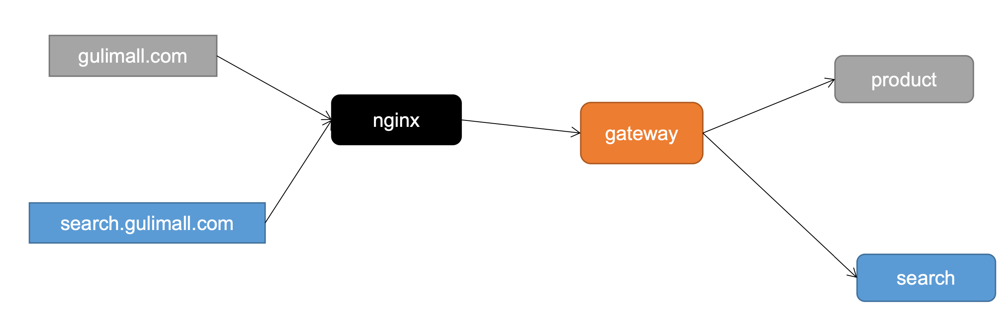
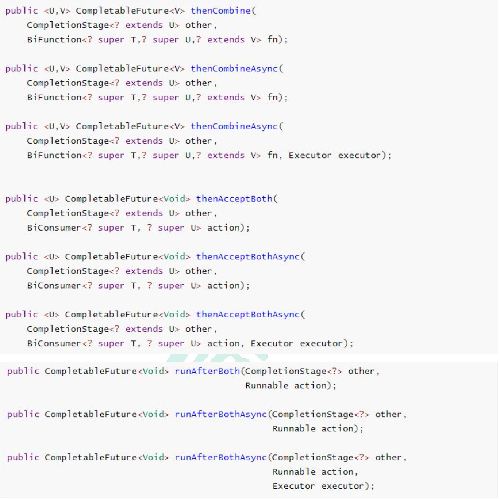
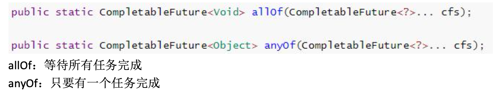

# 商城业务概览


- nginx

  反向代理、前端静态资源部署（动静分离）

  动：服务器需要处理的请求

  静：图片，js、css等静态资源(以实际文件存在的方式)

  只有动态请求会来到微服务，这样可以分担微服务的压力

- 网关

  鉴权、限流、认证

# 商城首页

商品微服务

### 导入依赖

前端使用了thymeleaf开发，因此要导入该依赖,并且为了改动页面实时生效导入devtools

```xml
<!--页面修改不重启服务器实时更新-->
<dependency>
    <groupId>org.springframework.boot</groupId>
    <artifactId>spring-boot-devtools</artifactId>
	  <optional>true</optional>
</dependency>

<dependency>
    <groupId>org.springframework.boot</groupId>
    <artifactId>spring-boot-starter-thymeleaf</artifactId>
</dependency>
```

springboot static目录下放置静态资源，templates里存放html页面文件

开发期间加上配置来禁止thymeleaf缓存

```yaml
spring:  
  thymeleaf:
    cache: false
```

### 新增【接口】首页初始请求

目标：获得三级分类，用来首页渲染三级分类菜单，鼠标移动到某一级分类则展示其子分类菜单

返回的数据模型

```json
{
  catelog1Id: {
    catelog1Id: xxx,
    catelog1Name: xxx,
    catelog2List: [
      {
        catelog2Id: xxx,
        catelog2Name: xxx,
        catelog3List: [
          {
            catelog3Id: xxx,
		        catelog3Name: xxx,
          },
          ...
        ],
      },
      ...
    ],
  },
  ...
}
```

### Nginx搭建域名访问环境

#### 目标

将有具体域名的请求转发到指定微服务

#### 反向代理

对外界屏蔽了内网服务集群的信息


#### Nginx配置


```json
user  nginx;
worker_processes  1;

error_log  /var/log/nginx/error.log warn;
pid        /var/run/nginx.pid;

#event块
events {
    worker_connections  1024;
}

#http块
http {
    include       /etc/nginx/mime.types;
    default_type  application/octet-stream;

    log_format  main  '$remote_addr - $remote_user [$time_local] "$request" '
                      '$status $body_bytes_sent "$http_referer" '
                      '"$http_user_agent" "$http_x_forwarded_for"';

    access_log  /var/log/nginx/access.log  main;

    sendfile        on;
    #tcp_nopush     on;

    keepalive_timeout  65;

    #gzip  on;
    
    upstream gulimall{
				server 192.168.43.201:88;
    }    

    include /etc/nginx/conf.d/*.conf;
    ############################################################################
    #/etc/nginx/conf.d/default.conf 的server块
    server {
        listen       80;
        server_name  localhost;

        #charset koi8-r;
        #access_log  /var/log/nginx/log/host.access.log  main;

        location / {
            root   /usr/share/nginx/html;
            index  index.html index.htm;
        }

        #error_page  404              /404.html;

        # redirect server error pages to the static page /50x.html
        #
        error_page   500 502 503 504  /50x.html;
        location = /50x.html {
            root   /usr/share/nginx/html;
        }

        # proxy the PHP scripts to Apache listening on 127.0.0.1:80
        #
        #location ~ \.php$ {
        #    proxy_pass   http://127.0.0.1;
        #}

        # pass the PHP scripts to FastCGI server listening on 127.0.0.1:9000
        #
        #location ~ \.php$ {
        #    root           html;
        #    fastcgi_pass   127.0.0.1:9000;
        #    fastcgi_index  index.php;
        #    fastcgi_param  SCRIPT_FILENAME  /scripts$fastcgi_script_name;
        #    include        fastcgi_params;
        #}

        # deny access to .htaccess files, if Apache's document root
        # concurs with nginx's one
        #
        #location ~ /\.ht {
        #    deny  all;
        #}
    }
}
```

#### 搭建域名访问环境


浏览器请求eshopblvd.com，mac映射了eshopblvd.com为服务器ip地址，请求来到服务器，nginx监听80端口，如果请求是80端口，且域名为eshopblvd.com，那就将请求代理到网关，这时候需要配置上游服务器地址为网关地址，转发的地址就配置转发到上游服务器的地址，且由于nginx转发请求时请求头的host信息会丢失，需要被重新设置为eshopblvd.com，同时需要设置网关， 网关根据匹配域名来路由转发到指定服务

1. 改变Mac本地域名映射，将`gulimall.com`映射到服务器ip

   ```shell
   sudo vim /etc/hosts
   添加一行
   xxx.xxx.xxx.xxx eshopblvd.com
   保存后退出，ping下验证下
   ping eshopblvd.com
   ```

2. 修改nginx server块的配置：/nginx/conf/conf.d/default.conf

   将以`/`开头的请求转发至我们配好的`gulimall`的`upstream`,由于nginx的转发会丢失`host`头，所以我们添加头信息

   ```json
   server {
       listen       80;
       # 监听80端口的请求，通过请求头的host来匹配域名
       server_name  eshopblvd.com;
   
       #charset koi8-r;
       #access_log  /var/log/nginx/log/host.access.log  main;
   
       location / {
           # root   /usr/share/nginx/html;
           # index  index.html index.htm;
           # 代理到上游服务器（网关）
           proxy_pass http://eshopblvd;
     			# 设置丢失的请求头host
     			proxy_set_header Host $host;
       }
   
       #error_page  404              /404.html;
   
       # redirect server error pages to the static page /50x.html
       #
       error_page   500 502 503 504  /50x.html;
       location = /50x.html {
           root   /usr/share/nginx/html;
       }
   
       # proxy the PHP scripts to Apache listening on 127.0.0.1:80
       #
       #location ~ \.php$ {
       #    proxy_pass   http://127.0.0.1;
       #}
   
       # pass the PHP scripts to FastCGI server listening on 127.0.0.1:9000
       #
       #location ~ \.php$ {
       #    root           html;
       #    fastcgi_pass   127.0.0.1:9000;
       #    fastcgi_index  index.php;
       #    fastcgi_param  SCRIPT_FILENAME  /scripts$fastcgi_script_name;
       #    include        fastcgi_params;
       #}
   
       # deny access to .htaccess files, if Apache's document root
       # concurs with nginx's one
       #
       #location ~ /\.ht {
       #    deny  all;
       #}
   }
   ```

3. 修改nginx的总配置http块：/nginx/conf/nginx.conf

   将`upstream`映射到我们的网关服务

   ```json
   user  nginx;
   worker_processes  1;
   
   error_log  /var/log/nginx/error.log warn;
   pid        /var/run/nginx.pid;
   
   
   events {
       worker_connections  1024;
   }
   
   
   http {
       include       /etc/nginx/mime.types;
       default_type  application/octet-stream;
   
       log_format  main  '$remote_addr - $remote_user [$time_local] "$request" '
                         '$status $body_bytes_sent "$http_referer" '
                         '"$http_user_agent" "$http_x_forwarded_for"';
   
       access_log  /var/log/nginx/access.log  main;
   
       sendfile        on;
       #tcp_nopush     on;
   
       keepalive_timeout  65;
   
       #gzip  on;
   
       # 设置上游服务器为网关地址（如果网关有集群，可以配置多个地址）
       upstream eshopblvd {
           server xxx.xxx.xxx.xxx:88
       }
   
       include /etc/nginx/conf.d/*.conf;
   }
   ```

4. 配置网关服务，这两个域名转发给商品服务

   ```json
   - id: eshopblvd_host_route
   		uri: lb://eshopblvd-product
   		predicates:
   			- Host=eshopblvd.com,item.gulimall.com
   ```

#### 域名映射效果

下面这个效果是页面请求和接口请求都走微服务的情况，如果是前后分离的项目，那么只有api请求走的微服务，可以忽略下面的内容

请求接口 gulimall.com

请求页面 gulimall.com

nginx直接代理给网关，网关判断
 • 如果/api/****，转交给对应的服务器
 • 如果是 满足域名，转交给对应的服务

# 压力测试

压力测试考察当前软硬件环境下系统所能承受的最大负荷并帮助找出系统瓶颈所在。压测都 是为了系统在线上的处理能力和稳定性维持在一个标准范围内，做到心中有数。

平常单元测试只能测出功能性上的问题。使用压力测试，我们有希望找到很多种用其他测试方法更难发现的错误。有两种错误类型是: 内存泄漏，并发与同步。

内存泄漏：大并发下循环中对象没有复用

并发与同步：大并发下线程不安全的问题

## 性能指标

- 响应时间(Response Time: RT) 响应时间指用户从客户端发起一个请求开始，到客户端接收到从服务器端返回的响 应结束，整个过程所耗费的时间。

- HPS(Hits Per Second) :每秒点击次数，单位是次/秒。

- TPS(Transaction per Second):系统每秒处理交易数，单位是笔/秒。

- QPS(Query per Second):系统每秒处理查询次数，单位是次/秒。

  对于互联网业务中，如果某些业务有且仅有一个请求连接，那么 TPS=QPS=HPS，一 般情况下用 TPS 来衡量整个业务流程，用 QPS 来衡量接口查询次数，用 HPS 来表 示对服务器单击请求

- 无论TPS、QPS、HPS,此指标是衡量系统处理能力非常重要的指标，越大越好，根据经 验，一般情况下:

  金融行业:1000TPS~50000TPS，不包括互联网化的活动

  保险行业:100TPS~100000TPS，不包括互联网化的活动

  制造行业:10TPS~5000TPS

  互联网电子商务:10000TPS~1000000TPS

  互联网中型网站:1000TPS~50000TPS

  互联网小型网站:500TPS~10000TPS

- 最大响应时间(Max Response Time) 指用户发出请求或者指令到系统做出反应(响应) 的最大时间。

- 最少响应时间(Mininum ResponseTime)指用户发出请求或者指令到系统做出反应(响 应)的最少时间。

- 90%响应时间(90% Response Time) 是指所有用户的响应时间进行排序，第 90%的响应时间

- 从外部看，性能测试主要关注如下三个指标

  - **吞吐量:每秒钟系统能够处理的请求数、任务数**
  - **响应时间:服务处理一个请求或一个任务的耗时**
  - **错误率:一批请求中结果出错的请求所占比例**

## JMeter

https://jmeter.apache.org/download_jmeter.cgi

### 开始上手

下载jmeter，运行/bin/jmeter.sh

### 测试计划下添加线程组


### 线程组参数配置


线程组参数详解:

- 线程数:虚拟用户数。一个虚拟用户占用一个进程或线程。设置多少虚拟用户数在这里，也就是设置多少个线程数。
- Ramp-Up Period(in seconds)准备时长:设置的虚拟用户数需要多长时间全部启动。如果线程数为 10，准备时长为 2，那么需要 2 秒钟启动 10 个线程，也就是每秒钟启动 5 个线程。
- 循环次数:每个线程发送请求的次数。如果线程数为10，循环次数为100，那么每个线程发送 100 次请求。总请求数为 10*100=1000 。如果勾选了“永远”，那么所有线程会一直发送请求，一到选择停止运行脚本。
- Delay Thread creation until needed:直到需要时延迟线程的创建。
- 调度器:设置线程组启动的开始时间和结束时间(配置调度器时，需要勾选循环次数为永远)
- 持续时间(秒):测试持续时间，会覆盖结束时间
- 启动延迟(秒):测试延迟启动时间，会覆盖启动时间
- 启动时间:测试启动时间，启动延迟会覆盖它。当启动时间已过，手动只需测试时当前时间也会覆盖它。
- 结束时间:测试结束时间，持续时间会覆盖它。

### 添加 HTTP 请求


### 添加监听器


### 启动压测&查看分析结果


### 结果分析

- 有错误率同开发确认，确定是否允许错误的发生或者错误率允许在多大的范围内;

- Throughput吞吐量每秒请求的数大于并发数，则可以慢慢的往上面增加;若在压测的机 器性能很好的情况下，出现吞吐量小于并发数，说明并发数不能再增加了，可以慢慢的往下减，找到最佳的并发数;  

- 压测结束，登陆相应的web服务器查看CPU等性能指标，进行数据的分析;

- 最大的tps，不断的增加并发数，加到tps达到一定值开始出现下降，那么那个值就是最大的 tps。

- 最大的并发数:最大的并发数和最大的tps是不同的概率，一般不断增加并发数，达到一个值后，服务器出现请求超时，则可认为该值为最大的并发数。

- 压测过程出现性能瓶颈，若压力机任务管理器查看到的cpu、网络和cpu都正常，未达到 90%以上，则可以说明服务器有问题，压力机没有问题。

- 影响性能考虑点包括:

  数据库（sql语句性能高不高）、应用程序、中间件(tomact、Nginx)、网络（带宽）和操作系统等方面

  首先考虑自己的应用属于**CPU**密集型还是**IO**密集型（网络/磁盘）

### 首页请求压测


标注偏差大：接口不稳定、吞吐量小、异常小

### 吞吐量小的提升手段

1. 增大jvm内存参数小
2. ...

# 性能监控

监控JVM的工作：内存+线程

## JVM内存模型


### 概述

Java 文件编译成class文件，然后被类装载器装载到jvm的运行时数据区里，这个区域也是优化的发生的地方，接着就由jvm执行引擎来执行，在虚拟机栈依次调用方法（入栈出栈），还可以调用本地接口的方法（操作系统暴露的）「本地方法栈」，记录程序走到哪一行了有程序计数器来完成工作

虚拟机栈、本地方法栈、程序计数器为线程隔离的

方法区、堆是线程共享的

优化更多的是在堆这里

### 概念解释

- 程序计数器 Program Counter Register
  - 记录的是正在执行的虚拟机字节码指令的地址，
  - 此内存区域是唯一一个在JAVA虚拟机规范中没有规定任何OutOfMemoryError的区域
- 虚拟机:VM Stack
  - 描述的是JAVA方法执行的内存模型，每个方法在执行的时候都会创建一个栈帧， 用于存储局部变量表，操作数栈，动态链接，方法接口等信息
  - 局部变量表存储了编译期可知的各种基本数据类型、对象引用
  - 线程请求的栈深度不够会报StackOverflowError异常
  - 栈动态扩展的容量不够会报OutOfMemoryError异常
  - 虚拟机栈是线程隔离的，即每个线程都有自己独立的虚拟机栈
- 本地方法:Native Stack
  - 本地方法栈类似于虚拟机栈，只不过本地方法栈使用的是本地方法
- 堆:Heap
  - 几乎所有的对象实例都在堆上分配内存

### 堆

JVM由c语言编写的，c语言需要手动回收内存，基于c语言封装写了一个执行引擎，来翻译java代码

java里内存的创建和释放都是由jvm来管理的，


所有的对象实例以及数组都要在堆上分配。堆是垃圾收集器管理的主要区域，也被称为“GC 堆”;也是我们优化最多考虑的地方。

永久代/元空间

- java8 以前永久代，受 jvm 管理，java8 以后元空间，直接使用物理内存。因此， 默认情况下，元空间的大小仅受本地内存限制。

CodeCache JIT编译产物

- 编译期间的代码缓存 (优化调节有，但不多)

堆可以细分为:

- 新生代

  - Eden空间

  - FromSurvivor空间

  - ToSurvivor空间

- 老年代

### 垃圾回收


1. 从 Java8 开始，HotSpot 已经完全将永久代(Permanent Generation)移除，取而代之的是一 个新的区域—元空间(MetaSpace)
2. 垃圾回收存在于新生代和老年代

流程：新创建了对象要分配内存，先去新生代里分配，先看伊甸园区，判断伊甸园区内存空间够不够，如果够就直接分配内存，如果不够就进行一次young GC/minor GC（比较快），就是清理新生代的空间，没有被引用的对象会被释放内存，伊甸园区内没被释放内存的对象会被放到幸存者区里。这时伊甸园区能放得下就放，如果放不下的话就认为这是个大对象，就把它放在老年代，老年代就是新生代没法处理的时候放在老年代的。如果放得下就直接分配内存，如果放不下就进行一次full GC（非常慢），这是老年代和新生代都清理一遍。这时候再看，老年代能放下就放，放不下就报溢出异常了

Full GC比Young GC慢得多，所以优化的时候，要监控避免应用经常fullGC，时刻关注新生代和老年代的变化

young GC时伊甸园区内没被释放内存的对象会被放到幸存者from区里，如果能放就放幸存者区，幸存者区有from和to两个区，下次young gc就是伊甸园区和from区所有存活对象复制到to区了，这两个区来回交换，目的是总要腾出大白片的空间。如果放不下的话，那么就把这些存活对象搬家到老年代里

如果幸存者区的对象存活超过阈值，也就是young gc了好几次都还存活着(每存活一次young gc，age就+1)，那就把这个对象放到老年区

所以老年代存放的都是生命力持久的对象，以及大的对象


## 指标监控

### jconsole 与 jvisualvm

Jdk 的两个小工具 jconsole、jvisualvm(升级版的 jconsole);通过命令行启动，可监控本地和 远程应用。远程应用需要配置

#### jconsole

直接命令行输入

```shell
jconsole
```

启动jconsole


选择你本地想要连接并监控的进程


#### jvisualvm

直接命令行输入

```shell
jvisualvm
```

启动jvisualvm

jvisualvm的功能：监控内存泄露，跟踪垃圾回收，执行时内存、cpu 分析，线程分析...


运行:正在运行的

休眠:sleep

等待:wait 

驻留:线程池里面的空闲线程 

监视:阻塞的线程，正在等待锁

下载插件：visual GC


安装完重启jvisualvm


full gc耗时太长，要避免频繁full gc
下面这个是健康的曲线，eden区一满就清空，没有太多释放不掉的对象


老年代内存也是慢慢往上涨


metaspace直接操作物理内存，不太关心

##### 中间件指标


##### 数据库指标


- SQL耗时越小越好，一般情况下微秒级别。

- 命中率越高越好，一般情况下不能低于95%。
- 锁等待次数越低越好，等待时间越短越好。

# JVM 分析&调优

jvm 调优，调的是稳定，并不能带给你性能的大幅提升。服务稳定的重要性就不用多说了， 保证服务的稳定，gc 永远会是 Java 程序员需要考虑的不稳定因素之一。复杂和高并发下的 服务，必须保证每次 gc 不会出现性能下降，各种性能指标不会出现波动，gc 回收规律而且 干净，找到合适的 jvm 设置。Full gc 最会影响性能，根据代码问题，避免 full gc 频率。可以 适当调大年轻代容量，让大对象可以在年轻代触发 yong gc，调整大对象在年轻代的回收频 次，尽可能保证大对象在年轻代回收，减小老年代缩短回收时间;

## 几个常用工具


## 命令示例

### jstat


### jinfo


### jmap


### jstack


### 调优项

https://docs.oracle.com/javase/8/docs/technotes/tools/unix/java.html#BGBCIEFC

# 压测实战

压测期间监听jvm性能指标：Cpu、内存、gc次数等，分析并作优化

## 压测首页初始化请求

请求是先来到nginx，再到网关，再到商品服务，响应的时候再根据这个链路原路返回，所以nginx和网关这两个中间件对性能的影响也需要关注

所以先压测这两个中间件

### 单压nginx

首先nginx，比较消耗cpu资源，属于计算型的


### 单压网关

cpu使用情况偏高


由于本身初始分配的内存就比较小，eden区只有32m，所有young gc次数较多，所以调大eden区的内存，减少young gc，提高吞吐


### 简单服务（直接访问服务）

仅返回一个字符串

不处理复杂业务逻辑 -> 高吞吐量 10000左右

### Gateway+简单服务

吞吐量3000，原本网关和简单服务单测试都是10000，过了一个中间件性能就损失了很多

### 全链路（Nginx+Gateway+简单服务）

吞吐下降到800

### 三级分类数据获取（无中间件）

吞吐量只有4

数据库优化，按照索引查（根据哪个字段查找数据，就在数据库中为那个字段加上索引）

关日志，设置日志级别为error，仅error打印日志

优化逻辑， 把数据库里所有的数据都查出来先，剩下的数据通过遍历得到并封装

这样就省去每次遍历某个层级分类时候还要遍历去数据库查询子分类，这样消耗太大，所以提前将所有分类的数据查询出来再处理封装

### 首页全量数据获取(动静分类)

动静分类可参考[Nginx动静分离](#Nginx动静分离)

压测时候查看gc发现内存大小了，eden区和老年代都是频繁gc，容易爆满


调整内存大小

```
-Xmx1024m -Xms1024m -Xmn512m
```

-Xmx1024m 为最大内存

-Xms1024m 为最小内存

-Xmn512m 为新生代的内存，包括eden区和survivor区

调整后不频繁gc了，吞吐量也上去了

### 结果汇总

Gateway、tomcat这些中间件单测的吞吐量还不错

请求链路中中间件越多，性能损失越大,  大多都损失在中间件之间IO网络交互了

比起中间件，业务逻辑才是需要优化的地方

| 压测内容                                                   | 压测线程数 | 吞吐量/s | 90%响应时间 | 99%响应时间 |
| ---------------------------------------------------------- | ---------- | -------- | ----------- | ----------- |
| Nginx                                                      | 50         | 2120     | 10          | 1204        |
| Gateway                                                    | 50         | 9200     | 9           | 21          |
| 简单服务(仅返回一个字符串，直接访问服务)                   | 50         | 9850     | 8           | 48          |
| 首页一级菜单渲染                                           | 50         | 350      | 260         | 491         |
| 首页菜单渲染(模版引擎thymleaf开缓存，有一定的提升，但不大) | 50         | 465      | 119         | 306         |
| 首页菜单渲染(开缓存、优化数据库、关日志)                   | 50         | 465      | 127         | 304         |
| 三级分类数据获取（无中间件）                               | 50         | 4        | 13275       | 13756       |
| 三级分类（无中间件）(优化业务)                             | 50         | 15       | 4092        | 5891        |
| 首页全量数据获取(包括了获取静态资源js, css)                | 50         | 2.7      | 24014       | 26556       |
| 首页全量数据获取(动静分类)                                 | 50         | 4.9      | 14913       | 16421       |
| Nginx+GateWay                                              | 50         |          |             |             |
| Gateway+简单服务                                           | 50         | 3000     | 28          | 67          |
| 全链路(Nginx+GateWay+简单服务)                             | 50         | 650      | 84          | 537         |

### 优化手段

1. 优化中间件，提高吞吐
2. 提升网络传输效率，使用高效的传输协议
3. 业务逻辑优化，减少数据库查询的次数，仅查询一次数据库，剩下的数据通过遍历得到并封装
4. Db(MySQL优化) 
   1. 按照索引查（根据哪个字段查找，就在数据库中为那个字段加上索引）
5. 静态资源(动静分离)
6. 关日志，设置日志级别为error，仅error打印日志
7. 调整jvm参数调整内存大小 `-Xmx1024m -Xms1024m -Xmn512m`
8. 引入缓存redis

# Nginx动静分离

静态资源放在nginx，如果前端用vue写的，那么nginx部署vue+动静分离可参考

https://zhuanlan.zhihu.com/p/345622879


## 静态资源搬家

nginx docker容器在外部挂载了三个文件夹，日志logs、配置conf、静态资源html

由于之后会部署vue，将vue编译打包的静态资源放到外部挂载目录下/mydata/nginx/html/static

## 设置静态资源访问根路径

/mydata/nginx/conf/nginx.conf是总配置

每个server的配置都在conf.d目录下，里面有个default.conf，可以复制用来自定义自己server的配置

修改/mydata/nginx/conf/eshopblvd.conf，加上location配置，以后/static/路径开头的请求就以/usr/share/nginx/html为访问跟路径映射了，去这个目录下找静态资源

```yaml
location /static/ {
		root /usr/share/nginx/html;
}
```

其余的请求还是转给http://eshopblvd

```yaml
location / {
	# 代理到上游服务器（网关）
	proxy_pass http://eshopblvd;
	# 设置丢失的请求头host
	proxy_set_header Host $host;
}
```

重启nginx容器

```shell
docker restart nginx
```

这样配置就生效了，静态资源nginx返回，动态请求数据由tomcat返回

# 缓存

## 缓存使用

为了系统性能的提升，我们一般都会将部分数据放入缓存中，加速访问。而 db 承担数据落盘工作

就比如商城首页的菜单查询，这是一个复杂查询，其访问量大，而且不经常修改，所以我们需要引入缓存的概念，第一次查询后放入缓存，之后就不要一直查数据库了

### 哪些数据适合放入缓存

1. 即时性、数据一致性要求不高的
2. 访问量大且更新频率不高的数据(读多，写少)

举例:电商类应用，商品分类，商品列表等适合缓存并加一个失效时间(根据数据更新频率 来定)，后台如果发布一个商品，买家需要 5 分钟才能看到新的商品一般还是可以接受的。


缓存逻辑的伪代码

```java
data = cache.load(id);//从缓存加载数据 If(data == null){
data = db.load(id);//从数据库加载数据
cache.put(id,data);//保存到 cache 中 }
return data;
```

### 本地缓存

本地缓存是指在同一进程下本地的缓存，一般用`Map<String, Object>`


本地缓存在分布式环境是有问题的

分布式有多个server，每个server的本地缓存都不同，当修改一台机器上的本地缓存时，其他机器的缓存就不一致了


### 分布式缓存

所以分布式缓存诞生了，一台机器要修改数据，那么缓存中间件的数据也会被修改，这里用到了集中式的缓存中间件redis

一台redis不够的话，redis可以搭建集群，还可以分片式存储，这样打破了本地缓存的容量限制，体现了redis的高可用、高性能


## 整合Redis

1. 导入依赖

   ```xml
          <dependency>
               <groupId>org.springframework.boot</groupId>
               <artifactId>spring-boot-starter-data-redis</artifactId>
           </dependency>
   ```

2. 配置redis主机地址

   ```yaml
   spring:
     redis:
       host: #
       port: 6379
   ```

3. 使用springboot自动配置的RedisTemplate

   

4. 使用 RedisTemplate 操作 redis，为了跨语言，跨平台兼容，缓存中存的数据是json字符串

   ```java
   @Autowired
   StringRedisTemplate stringRedisTemplate; @Test
   public void testStringRedisTemplate(){
     ValueOperations<String, String> ops = stringRedisTemplate.opsForValue();
     ops.set("hello","world_"+ UUID.randomUUID().toString());
     String hello = ops.get("hello");
     System.out.println(hello);
   }
   ```

5. redis命令行工具

   ```shell
    docker exec -it redis redis-cli
   ```

6. 优化菜单获取逻辑

   ```java
       /**
        * 从redis分布式缓存中查询菜单信息
        * @return
        */
       private Map<Long, CatalogVO> getHomepageCatalogFromRedis() {
           long beginTime = System.currentTimeMillis();
           // 先从缓存中找有没有数据，没有的话再查数据库
           String catalogJSON = redisTemplate.opsForValue().get("catalogJSON");
           if (!StringUtils.isEmpty(catalogJSON)) {
               log.info("获取三级菜单命中redis缓存!");
               Map<Long, CatalogVO> result = JSON.parseObject(catalogJSON, new TypeReference<Map<Long, CatalogVO>>() {
               });
               long time = System.currentTimeMillis() - beginTime;
               log.info("获取三级菜单耗时：{}ms", time);
               return result;
           }
           log.info("获取三级菜单未命中redis缓存，获取数据库数据并存入redis中...");
           Map<Long, CatalogVO> catalogFromDB = getHomepageCatalogFromDB();
           String toJSONString = JSON.toJSONString(catalogFromDB);
           redisTemplate.opsForValue().set("catalogJSON", toJSONString, 1, TimeUnit.DAYS);
           long time = System.currentTimeMillis() - beginTime;
           log.info("获取三级菜单耗时：{}ms", time);
           return catalogFromDB;
       }
   ```

7. 压力测试

   当进行压力测试时后期后出现堆外内存溢出OutOfDirectMemoryError

   产生原因：

   1)、springboot2.0以后默认使用lettuce操作redis的客户端，它使用通信

   2)、lettuce的bug导致netty堆外内存溢出 -Xmx300m；netty如果没有指定堆外内存，默认使用-Xmx300m

   可以通过-Dio.netty.maxDirectMemory进行设置

   解决方案：不能使用-Dio.netty.maxDirectMemory只去调大堆外内存。因为没有及时得到内存释放，所以很久之后也会出现这个问题

   解决方案：由于是lettuce的bug造成，不能直接使用-Dio.netty.maxDirectMemory去调大虚拟机堆外内存

   切换使用jedis

   ```xml
       <dependency>
           <groupId>org.springframework.boot</groupId>
           <artifactId>spring-boot-starter-data-redis</artifactId>
           <exclusions>
               <exclusion>
                   <groupId>io.lettuce</groupId>
                   <artifactId>lettuce-core</artifactId>
               </exclusion>
           </exclusions>
       </dependency>
       <dependency>
           <groupId>redis.clients</groupId>
           <artifactId>jedis</artifactId>
       </dependency>
   ```

   获取缓存后接口耗时大幅减少

   

## 高并发下缓存失效

用缓存减少接口耗时后，在高并发下依旧存在一些问题

缓存失效：缓存没有命中、没有查到数据

### 缓存穿透


未来如果这个查询在数据库里有数据了，那缓存也还是空结果，那么就需要给缓存的结果设定过期时间，那么下一次查缓存没有，那么就需要去数据库中查

### 缓存雪崩


### 缓存击穿


### 优化接口

- 空结果缓存：解决缓存穿透
- 设置过期时间（加随机值）：解决缓存雪崩
- 加锁：解决缓存击穿

#### 加锁解决缓存击穿问题

将查询db的方法加锁，这样在同一时间只有一个方法能查询数据库，就能解决缓存击穿的问题了

SpringBoot所有的组件在容器中都是单例的。

```java
public Map<String, List<Catalog2Vo>> getCategoryMap() {
        ValueOperations<String, String> ops = stringRedisTemplate.opsForValue();
        String catalogJson = ops.get("catalogJson");
        if (StringUtils.isEmpty(catalogJson)) {
            System.out.println("缓存不命中，准备查询数据库。。。");
            Map<String, List<Catalog2Vo>> categoriesDb = getCategoriesDb();
            String toJSONString = JSON.toJSONString(categoriesDb);
            ops.set("catalogJson",toJSONString);
            return categoriesDb;
        }
        System.out.println("缓存命中。。。。");
        Map<String, List<Catalog2Vo>> listMap = JSON.parseObject(catalogJson, new TypeReference<Map<String, List<Catalog2Vo>>>() {});
        return listMap;
    }

 private synchronized Map<String, List<Catalog2Vo>> getCategoriesDb() {
        String catalogJson = stringRedisTemplate.opsForValue().get("catalogJson");
        if (StringUtils.isEmpty(catalogJson)) {
            System.out.println("查询了数据库");
      		。。。。。
            return listMap;
        }else {
            Map<String, List<Catalog2Vo>> listMap = JSON.parseObject(catalogJson, new TypeReference<Map<String, List<Catalog2Vo>>>() {});
            return listMap;
        }
    }
```

#### 锁时序问题

目标是只要缓存不命中，查数据库只能查一次

我们将业务逻辑中的`确认缓存没有`和`查数据库`放到了锁里，但是最终控制台却打印了两次查询了数据库。这是因为在将结果放入缓存的这段时间里，有其他线程确认缓存没有，又再次查询了数据库，因此我们要将`结果放入缓存`也进行加锁


## 分布式锁


synchronized加锁只用this锁了本地service这个实例

本地锁锁不住分布式服务多个实例

分布式锁比本地锁慢

本地锁包括了synchronized，juc下lock接口，只锁得住当前进程，一个服务对应一个进程

在分布式情况下，想要锁住所有，必须使用分布式锁

启动一个新的服务，模拟分布式情况


### 基本原理


我们可以同时去一个地方“占坑”，如果占到，就执行逻辑。否则就必须等待，直到释放锁。“占坑”可以去redis，可以去数据库，可以去任何大家都能访问的地方。等待可以自旋的方式。


```java
	public Map<String, List<Catalog2Vo>> getCatalogJsonDbWithRedisLock() {
        //阶段一
        Boolean lock = stringRedisTemplate.opsForValue().setIfAbsent("lock", "111");
        //获取到锁，执行业务
        if (lock) {
            Map<String, List<Catalog2Vo>> categoriesDb = getCategoryMap();
            //删除锁，如果在此之前报错或宕机会造成死锁
            stringRedisTemplate.delete("lock");
            return categoriesDb;
        }else {
            //没获取到锁，等待100ms重试
            try {
                Thread.sleep(100);
            } catch (InterruptedException e) {
                e.printStackTrace();
            }
            return getCatalogJsonDbWithRedisLock();
        }
    }

public Map<String, List<Catalog2Vo>> getCategoryMap() {
        ValueOperations<String, String> ops = stringRedisTemplate.opsForValue();
        String catalogJson = ops.get("catalogJson");
        if (StringUtils.isEmpty(catalogJson)) {
            System.out.println("缓存不命中，准备查询数据库。。。");
            Map<String, List<Catalog2Vo>> categoriesDb= getCategoriesDb();
            String toJSONString = JSON.toJSONString(categoriesDb);
            ops.set("catalogJson", toJSONString);
            return categoriesDb;
        }
        System.out.println("缓存命中。。。。");
        Map<String, List<Catalog2Vo>> listMap = JSON.parseObject(catalogJson, new TypeReference<Map<String, List<Catalog2Vo>>>() {});
        return listMap;
    }
```

问题： 1、setnx占好了位，业务代码异常或者程序在页面过程中宕机。没有执行删除锁逻辑，这就造成了死锁

解决：设置锁的自动过期，即使没有删除，会自动删除


问题： 1、setnx设置好，正要去设置过期时间，宕机。又死锁了。 

解决： 设置过期时间和占位必须是原子的。redis支持使用setnx ex命令


```java
public Map<String, List<Catalog2Vo>> getCatalogJsonDbWithRedisLock() {
    //加锁的同时设置过期时间，二者是原子性操作
    Boolean lock = stringRedisTemplate.opsForValue().setIfAbsent("lock", "1111",5, TimeUnit.SECONDS);
    if (lock) {
        Map<String, List<Catalog2Vo>> categoriesDb = getCategoryMap();
        //模拟超长的业务执行时间
        try {
            Thread.sleep(6000);
        } catch (InterruptedException e) {
            e.printStackTrace();
        }
        stringRedisTemplate.delete("lock");
        return categoriesDb;
    }else {
        try {
            Thread.sleep(100);
        } catch (InterruptedException e) {
            e.printStackTrace();
        }
        return getCatalogJsonDbWithRedisLock();
    }
}
```

问题： 1、删除锁直接删除？？？ 如果由于业务时间很长，锁自己过期了，我们直接删除，有可能把别人正在持有的锁删除了。

 解决： 占锁的时候，值指定为uuid，每个人匹配是自己的锁才删除。


```java
 public Map<String, List<Catalog2Vo>> getCatalogJsonDbWithRedisLock() {
        String uuid = UUID.randomUUID().toString();
        ValueOperations<String, String> ops = stringRedisTemplate.opsForValue();
     	//为当前锁设置唯一的uuid，只有当uuid相同时才会进行删除锁的操作
        Boolean lock = ops.setIfAbsent("lock", uuid,5, TimeUnit.SECONDS);
        if (lock) {
            Map<String, List<Catalog2Vo>> categoriesDb = getCategoryMap();
            String lockValue = ops.get("lock");
            if (lockValue.equals(uuid)) {
                try {
                    Thread.sleep(6000);
                } catch (InterruptedException e) {
                    e.printStackTrace();
                }
                stringRedisTemplate.delete("lock");
            }
            return categoriesDb;
        }else {
            try {
                Thread.sleep(100);
            } catch (InterruptedException e) {
                e.printStackTrace();
            }
            return getCatalogJsonDbWithRedisLock();
        }
    }
```

问题： 1、如果正好判断是当前值，正要删除锁的时候，锁已经过期，别人已经设置到了新的值。那么我们删除的是别人的锁 

解决： 删除锁必须保证原子性。使用redis+Lua脚本完成


```java
 public Map<String, List<Catalog2Vo>> getCatalogJsonDbWithRedisLock() {
        String uuid = UUID.randomUUID().toString();
        ValueOperations<String, String> ops = stringRedisTemplate.opsForValue();
        Boolean lock = ops.setIfAbsent("lock", uuid,5, TimeUnit.SECONDS);
        if (lock) {
            Map<String, List<Catalog2Vo>> categoriesDb = getCategoryMap();
            String lockValue = ops.get("lock");
            String script = "if redis.call(\"get\",KEYS[1]) == ARGV[1] then\n" +
                    "    return redis.call(\"del\",KEYS[1])\n" +
                    "else\n" +
                    "    return 0\n" +
                    "end";
            stringRedisTemplate.execute(new DefaultRedisScript<Long>(script, Long.class), Arrays.asList("lock"), lockValue);
            return categoriesDb;
        }else {
            try {
                Thread.sleep(100);
            } catch (InterruptedException e) {
                e.printStackTrace();
            }
            return getCatalogJsonDbWithRedisLock();
        }
    }
```

保证加锁【占位+过期时间】和删除锁【判断+删除】的原子性。更难的事情，锁的自动续期：锁放长点300s

## 最终优化逻辑


```java
    /**
     * 从redis分布式缓存中查询菜单信息
     * @return
     */
    private Map<Long, CatalogVO> getHomepageCatalogFromRedis() {
        long beginTime = System.currentTimeMillis();
        // 先从缓存中找有没有数据，没有的话再查数据库
        String catalogJSON = redisTemplate.opsForValue().get("catalogJSON");
        if (StringUtils.isEmpty(catalogJSON)) {
            log.info("获取三级菜单未命中redis缓存");
            Map<Long, CatalogVO> catalogFromDB = getHomepageCatalogFromDBWithLock();
            String toJSONString = JSON.toJSONString(catalogFromDB);
            redisTemplate.opsForValue().set("catalogJSON", toJSONString, 1, TimeUnit.DAYS);
            long time = System.currentTimeMillis() - beginTime;
            log.info("获取三级菜单耗时：{}ms", time);
            return catalogFromDB;
        }
        log.info("获取三级菜单命中redis缓存!");
        Map<Long, CatalogVO> result = JSON.parseObject(catalogJSON, new TypeReference<Map<Long, CatalogVO>>() {
        });
        long time = System.currentTimeMillis() - beginTime;
        log.info("获取三级菜单耗时：{}ms", time);
        return result;

    }

    /**
     * 加个分布式锁从数据库查数据
     * @return
     */
    private Map<Long, CatalogVO> getHomepageCatalogFromDBWithLock() {
        // 锁的标识
        String uuid = UUID.randomUUID().toString();
        // 原子操作获取锁
        Boolean lock = redisTemplate.opsForValue().setIfAbsent("lock", uuid, 30, TimeUnit.SECONDS);
        if (lock) {
            log.info("获取分布式锁成功");
            Map<Long, CatalogVO> homepageCatalog = null;
            try {
                String catalogJSON = redisTemplate.opsForValue().get("catalogJSON");
                if (!StringUtils.isEmpty(catalogJSON)) {
                    log.info("缓存命中! 数据返回");
                    homepageCatalog = JSON.parseObject(catalogJSON, new TypeReference<Map<Long, CatalogVO>>() {});
                } else {
                    log.info("开始查询数据库...");
                    homepageCatalog = getHomepageCatalogFromDB();
                    // 查到的数据再放入缓存，将对象转为json放在缓存中
                    String toJSONString = JSON.toJSONString(homepageCatalog);
                    redisTemplate.opsForValue().set("catalogJSON", toJSONString, 1, TimeUnit.DAYS);
                }
            } catch (Exception e) {
                log.error(e.toString());
            } finally {
                // 释放锁
                String script = "if redis.call('get', KEYS[1]) == ARGV[1] then return redis.call('del', KEYS[1]) else return 0 end";
                redisTemplate.execute(new DefaultRedisScript<Long>(script, Long.class), Arrays.asList("lock"), uuid);
                log.info("分布式锁释放成功");
            }
            return homepageCatalog;
        } else {
            // 获取不到分布式锁就休眠200ms后自旋重试获取锁
            log.info("获取分布式锁失败，重试中...");
            try {
                Thread.sleep(200);
            } catch (Exception e) {
                log.error(e.toString());
            }
            return getHomepageCatalogFromDBWithLock();
        }
    }
```

## Redisson

Redisson是一个在Redis的基础上实现的Java驻内存数据网格（In-Memory Data Grid）。它不仅提供了一系列的分布式的Java常用对象，还提供了许多分布式服务。其中包括(`BitSet`, `Set`, `Multimap`, `SortedSet`, `Map`, `List`, `Queue`, `BlockingQueue`, `Deque`, `BlockingDeque`, `Semaphore`, `Lock`, `AtomicLong`, `CountDownLatch`, `Publish / Subscribe`, `Bloom filter`, `Remote service`, `Spring cache`, `Executor service`, `Live Object service`, `Scheduler service`) Redisson提供了使用Redis的最简单和最便捷的方法。Redisson的宗旨是促进使用者对Redis的关注分离（Separation of Concern），从而让使用者能够将精力更集中地放在处理业务逻辑上。

本文我们仅关注分布式锁的实现，更多请参考[官方文档](https://github.com/redisson/redisson/wiki/8.-分布式锁和同步器)

### 导入依赖

以后使用redisson作为所有分布式锁，分布式对象等功能框架

```xml
<dependency>
    <groupId>org.redisson</groupId>
    <artifactId>redisson</artifactId>
    <version>3.13.4</version>
</dependency>
```

### 程序化开启配置

```java
@Configuration
public class MyRedissonConfig {
    /**
     * 所有对Redisson的使用都是通过RedissonClient对象，引入到容器中
     * @return
     * @throws IOException
     */
    @Bean(destroyMethod="shutdown")
    public RedissonClient redisson(@Value("${spring.redis.host}") String url) throws IOException {
        //1、创建配置
        //Redis url should start with redis:// or rediss://
        Config config = new Config();
        config.useSingleServer().setAddress("redis://"+url+":6379");
        //2、根据Config创建出RedissonClient示例
        RedissonClient redissonClient = Redisson.create(config);
        return redissonClient;
    }
}
```

### 可重入锁（Reentrant Lock）

定义：可重入锁，也叫做递归锁，是指在一个线程中可以多次获取同一把锁，比如：一个线程在执行一个带锁的方法，该方法中又调用了另一个需要相同锁的方法，则该线程可以直接执行调用的方法【即可重入】，而无需重新获得锁

举例：有一个方法a，方法内部调用了方法b，两个方法要加同一把锁，方法b看方法a已经加了这把锁，那就直接拿来这把锁直接用了，方法b将会直接执行，执行到最后方法a会释放这把锁

所有锁都应该被设计成可重入锁，避免死锁的问题

```java
 public Map<String, List<Catalog2Vo>> getCatalogJsonDbWithRedisson() {
        Map<String, List<Catalog2Vo>> categoryMap=null;
        RLock lock = redissonClient.getLock("CatalogJson-Lock");
        lock.lock(); // 阻塞锁
        try {
            Thread.sleep(30000);
            categoryMap = getCategoryMap();
        } catch (InterruptedException e) {
            e.printStackTrace();
        }finally {
            lock.unlock();
            return categoryMap;
        }
    }
```

如果负责储存这个分布式锁的Redisson节点宕机以后，而且这个锁正好处于锁住的状态时，这个锁会出现锁死的状态。为了避免这种情况的发生，所以就设置了过期时间，但是如果业务执行时间过长，业务还未执行完锁就已经过期，那么就会出现解锁时解了其他线程的锁的情况。

所以Redisson内部提供了一个监控锁的看门狗，它的作用是在Redisson实例被关闭前，不断的延长锁的有效期。默认情况下，看门狗的检查锁的超时时间是30秒钟，也可以通过修改[Config.lockWatchdogTimeout](https://github.com/redisson/redisson/wiki/2.-配置方法#lockwatchdogtimeout监控锁的看门狗超时单位毫秒)来另行指定。

`lock.lock();`阻塞式等待。默认加的锁都是30s时间。

锁的自动续期，如果业务超长，运行期间自动给锁续上新的30s。不用担心业务时间长，锁自动过期被删掉
加锁的业务只要运行完成，就不会给当前锁续期，即使不手动解锁，锁默认在30s以后自动删除。

在本次测试中`CatalogJson-Lock`的初始过期时间TTL为30s，但是每到20s就会自动续借成30s

[](https://github.com/NiceSeason/gulimall-learning/blob/master/docs/images/Snipaste_2020-09-08_23-16-35.png)

另外Redisson还通过加锁的方法提供了`leaseTime`的参数来指定加锁的时间。超过这个时间后锁便自动解开了。不会自动续期！

问题：lock.lock(10,TimeUnit.SECONDS); 在锁时间到了以后，不会自动续期。
1、如果我们传递了锁的超时时间，就发送给redis执行脚本，进行占锁，默认超时就是我们指定的时间
2、如果我们未指定锁的超时时间，就使用30 * 1000【LockWatchdogTimeout看门狗的默认时间】;
      只要占锁成功，就会启动一个定时任务【重新给锁设置过期时间，新的过期时间就是看门狗的默认时间】,每隔10s都会自动再次续期，续成30s
internalLockLeaseTime【看门狗时间】 / 3,10s

```java
// 加锁以后10秒钟自动解锁
// 无需调用unlock方法手动解锁,如果要手动解锁一定要确保业务执行时间小于锁的失效时间
lock.lock(10, TimeUnit.SECONDS);

// 尝试加锁，最多等待100秒，上锁以后10秒自动解锁
boolean res = lock.tryLock(100, 10, TimeUnit.SECONDS);
if (res) {
   try {
     ...
   } finally {
       lock.unlock();
   }
}
```

### 读写锁（ReadWriteLock）

```java
    @GetMapping("/read")
    @ResponseBody
    public String read() {
        RReadWriteLock lock = redissonClient.getReadWriteLock("ReadWrite-Lock");
        RLock rLock = lock.readLock();
        String s = "";
        try {
            rLock.lock();
            System.out.println("读锁加锁"+Thread.currentThread().getId());
            Thread.sleep(5000);
            s= redisTemplate.opsForValue().get("lock-value");
        }finally {
            rLock.unlock();
            return "读取完成:"+s;
        }
    }

    @GetMapping("/write")
    @ResponseBody
    public String write() {
        RReadWriteLock lock = redissonClient.getReadWriteLock("ReadWrite-Lock");
        RLock wLock = lock.writeLock();
        String s = UUID.randomUUID().toString();
        try {
            wLock.lock();
            System.out.println("写锁加锁"+Thread.currentThread().getId());
            Thread.sleep(10000);
            redisTemplate.opsForValue().set("lock-value",s);
        } catch (InterruptedException e) {
            e.printStackTrace();
        }finally {
            wLock.unlock();
            return "写入完成:"+s;
        }
    }
```

写锁会阻塞读锁，但是读锁不会阻塞读锁，但读锁会阻塞写锁

总之含有写的过程都会被阻塞，只有读读不会被阻塞

```
保证一定能读到最新数据,修改期间，写锁是一个排他锁（互斥锁、独享锁）。读锁是一个共享锁
//写锁没释放读就必须等待
// 读 + 读： 相当于无锁，并发读，只会在redis中记录好，所有当前的读锁。他们都会同时加锁成功
// 写 + 读： 等待写锁释放
// 写 + 写： 阻塞方式
// 读 + 写： 有读锁。写也需要等待。
// 只要有写的存在，都必须等待
```

上锁时在redis的状态

[](https://github.com/NiceSeason/gulimall-learning/blob/master/docs/images/Snipaste_2020-09-09_12-53-21.png)

### 信号量（Semaphore）

信号量为存储在redis中的一个数字，当这个数字大于0时，即可以调用`acquire()`方法增加数量，也可以调用`release()`方法减少数量，但是当调用`release()`之后小于0的话方法就会阻塞，直到数字大于0

```java
@GetMapping("/park")
@ResponseBody
public String park() {
    RSemaphore park = redissonClient.getSemaphore("park");
    try {
        park.acquire(2);
    } catch (InterruptedException e) {
        e.printStackTrace();
    }
    return "停进2";
}

@GetMapping("/go")
@ResponseBody
public String go() {
    RSemaphore park = redissonClient.getSemaphore("park");
    park.release(2);
    return "开走2";
}
```

### 闭锁（CountDownLatch）

可以理解为门栓，使用若干个门栓将当前方法阻塞，只有当全部门栓都被放开时，当前方法才能继续执行。

以下代码只有`offLatch()`被调用5次后 `setLatch()`才能继续执行

```java
 	@GetMapping("/setLatch")
    @ResponseBody
    public String setLatch() {
        RCountDownLatch latch = redissonClient.getCountDownLatch("CountDownLatch");
        try {
            latch.trySetCount(5);
            latch.await();
        } catch (InterruptedException e) {
            e.printStackTrace();
        }
        return "门栓被放开";
    }

    @GetMapping("/offLatch")
    @ResponseBody
    public String offLatch() {
        RCountDownLatch latch = redissonClient.getCountDownLatch("CountDownLatch");
        latch.countDown();
        return "门栓被放开1";
    }
```

闭锁在redis的存储状态

[](https://github.com/NiceSeason/gulimall-learning/blob/master/docs/images/Snipaste_2020-09-09_13-11-45.png)

## 缓存数据的一致性

### 1. 双写模式


当数据更新时，更新数据库时同时更新缓存

**存在问题**

由于卡顿等原因，导致写缓存2在最前，写缓存1在后面就出现了不一致

这是暂时性的脏数据问题，但是在数据稳定，缓存过期以后，又能得到最新的正确数据

### 2. 失效模式


数据库更新时将缓存删除

**存在问题**

当两个请求同时修改数据库，一个请求已经更新成功并删除缓存时又有读数据的请求进来，这时候发现缓存中无数据就去数据库中查询并放入缓存，在放入缓存前第二个更新数据库的请求成功，这时候留在缓存中的数据依然是第一次数据更新的数据

**解决方法**

1、缓存的所有数据都有过期时间，数据过期下一次查询触发主动更新 2、读写数据的时候(并且写的不频繁)，加上分布式的读写锁。

## 缓存数据一致性-解决方案


我们系统的一致性**解决方案**: 

1、缓存的所有数据都有过期时间，数据过期下一次查询触发主动更新

2、读写数据的时候，加上分布式的**读写锁**。

3、失效模式

偶尔写，经常读

## Spring Cache

- Spring从3.1开始定义了org.springframework.cache.Cache 和 org.springframework.cache.CacheManager 接口来统一不同的缓存技术; 并支持使用 JCache(JSR-107)注解简化我们开发;

- Cache接口为缓存的组件规范定义，包含缓存的各种操作集合;
   Cache 接口下 Spring 提供了各种 xxxCache 的实现;如 RedisCache，EhCacheCache , ConcurrentMapCache 等;

- 每次调用需要缓存功能的方法时，Spring会检查检查指定参数的指定的目标方法是否已 经被调用过;如果有就直接从缓存中获取方法调用后的结果，如果没有就调用方法并缓 存结果后返回给用户。下次调用直接从缓存中获取。

- 使用Spring缓存抽象时我们需要关注以下两点; 
  - 1、确定方法需要被缓存以及他们的缓存策略
  - 2、从缓存中读取之前缓存存储的数据


### 整合springCache

简化缓存开发，对于想要缓存读写的请求，就不用写一大堆加锁、写入缓存等代码

1) 引入依赖

```xml
<dependency>
    <groupId>org.springframework.boot</groupId>
    <artifactId>spring-boot-starter-cache</artifactId>
</dependency>
```

2. 自定义配置

```
					（1）、自动配置了哪些
*              CacheAuroConfiguration会导入 RedisCacheConfiguration；
*              自动配好了缓存管理器RedisCacheManager
*          （2）、配置使用redis作为缓存
*              spring.cache.type=redis
3）、测试使用缓存
 *          @Cacheable: Triggers cache population.：触发将数据保存到缓存的操作
 *          @CacheEvict: Triggers cache eviction.：触发将数据从缓存删除的操作
 *          @CachePut: Updates the cache without interfering with the method execution.：不影响方法执行更新缓存
 *          @Caching: Regroups multiple cache operations to be applied on a method.：组合以上多个操作
 *          @CacheConfig: Shares some common cache-related settings at class-level.：在类级别共享缓存的相同配置
 *          1）、开启缓存功能 @EnableCaching
 *          2）、只需要使用注解就能完成缓存操作
 *
 *      4）、原理：
 *          CacheAutoConfiguration ->  RedisCacheConfiguration ->
 *          自动配置了RedisCacheManager->初始化所有的缓存->每个缓存决定使用什么配置
 *          ->如果redisCacheConfiguration有就用已有的，没有就用默认配置
 *          ->想改缓存的配置，只需要给容器中放一个RedisCacheConfiguration即可
 *          ->就会应用到当前RedisCacheManager管理的所有缓存分区中
```

指定缓存类型并在主配置类上加上注解`@EnableCaching`

```yaml
spring:
  cache:
  	#指定缓存类型为redis
    type: redis
    redis:
      ///指定redis中的过期时间为1h
      time-to-live: 3600000
```

默认使用jdk进行序列化，自定义序列化方式需要编写配置类

```java
@Configuration
public class MyCacheConfig {
    @Bean
    public org.springframework.data.redis.cache.RedisCacheConfiguration redisCacheConfiguration(
            CacheProperties cacheProperties) {
        CacheProperties.Redis redisProperties = cacheProperties.getRedis();
        org.springframework.data.redis.cache.RedisCacheConfiguration config = org.springframework.data.redis.cache.RedisCacheConfiguration
                .defaultCacheConfig();
        //指定缓存序列化方式为json
        config = config.serializeValuesWith(
                RedisSerializationContext.SerializationPair.fromSerializer(new GenericJackson2JsonRedisSerializer()));
        //设置配置文件中的各项配置，如过期时间
        if (redisProperties.getTimeToLive() != null) {
            config = config.entryTtl(redisProperties.getTimeToLive());
        }
        if (redisProperties.getKeyPrefix() != null) {
            config = config.prefixKeysWith(redisProperties.getKeyPrefix());
        }
        if (!redisProperties.isCacheNullValues()) {
            config = config.disableCachingNullValues();
        }
        if (!redisProperties.isUseKeyPrefix()) {
            config = config.disableKeyPrefix();
        }
        return config;
    }
}
```

自定义序列化原理

[](https://github.com/NiceSeason/gulimall-learning/blob/master/docs/images/Snipaste_2020-09-10_19-40-20.png)

缓存使用

```java
 /**
     * 1、每一个需要缓存的数据我们都来指定要放到那个名字的缓存。【缓存的分区(按照业务类型分)】
     * 2、 @Cacheable({"category"})
     *      代表当前方法的结果需要缓存，如果缓存中有，方法不用调用。
     *      如果缓存中没有，会调用方法，最后将方法的结果放入缓存
     * 3、默认行为
     *      1）、如果缓存中有，方法不用调用。
     *      2）、key默认自动生成；缓存的名字::SimpleKey [](自主生成的key值)
     *      3）、缓存的value的值。默认使用jdk序列化机制，将序列化后的数据存到redis
     *      4）、默认ttl时间 -1；
     *
     *    自定义：
     *      1）、指定生成的缓存使用的key：  key属性指定，接受一个SpEL
     *             SpEL的详细https://docs.spring.io/spring/docs/5.1.12.RELEASE/spring-framework-reference/integration.html#cache-spel-context
     *      2）、指定缓存的数据的存活时间： 配置文件中修改ttl
     *      3）、将数据保存为json格式:
     *              自定义RedisCacheConfiguration即可
     * 4、Spring-Cache的不足；
     *      1）、读模式：
     *          缓存穿透：查询一个null数据。解决：缓存空数据；ache-null-values=true
     *          缓存击穿：大量并发进来同时查询一个正好过期的数据。解决：加锁；？默认是无加锁的;sync = true（加锁，解决击穿）
     *          缓存雪崩：大量的key同时过期。解决：加随机时间。加上过期时间。：spring.cache.redis.time-to-live=3600000
     *      2）、写模式：（缓存与数据库一致）
     *          1）、读写加锁。
     *          2）、引入Canal，感知到MySQL的更新去更新数据库
     *          3）、读多写多，直接去数据库查询就行
     *    总结：
     *      常规数据（读多写少，即时性，一致性要求不高的数据）；完全可以使用Spring-Cache；写模式（只要缓存的数据有过期时间就足够了）
     *      特殊数据：特殊设计
     *
     *   原理：
     *      CacheManager(RedisCacheManager)->Cache(RedisCache)->Cache负责缓存的读写
     *
     *
     * @return
     */
    @Cacheable(value = {"category"},key = "#root.method.name",sync = true)
    @Override
    public List<CategoryEntity> getLevel1Categorys() {
        System.out.println("getLevel1Categorys.....");
        long l = System.currentTimeMillis();
        List<CategoryEntity> categoryEntities = baseMapper.selectList(new QueryWrapper<CategoryEntity>().eq("parent_cid", 0));
        return categoryEntities;
    }
```

```java
  	//调用该方法时会将结果缓存，缓存名为category，key为方法名
	//表示该方法的缓存被读取时会加锁
	@Cacheable(value = {"category"},key = "#root.methodName",sync = true)
    public Map<String, List<Catalog2Vo>> getCatalogJsonDbWithSpringCache() {
        return getCategoriesDb();
    }

	//调用该方法会删除缓存category下的所有cache
    @Override
    @CacheEvict(value = {"category"},allEntries = true)
    public void updateCascade(CategoryEntity category) {
        this.updateById(category);
        if (!StringUtils.isEmpty(category.getName())) {
            categoryBrandRelationService.updateCategory(category);
        }
    }
```

第一个方法缓存结果后

[](https://github.com/NiceSeason/gulimall-learning/blob/master/docs/images/Snipaste_2020-09-10_20-03-46.png)

第二个方法调用清除缓存后

[](https://github.com/NiceSeason/gulimall-learning/blob/master/docs/images/Snipaste_2020-09-10_20-05-15.png)

### Spring-Cache的不足之处

1）、读模式

缓存穿透：查询一个null数据。解决方案：缓存空数据，可通过`spring.cache.redis.cache-null-values=true`

缓存击穿：大量并发进来同时查询一个正好过期的数据。解决方案：加锁 ? 默认是无加锁的;

使用sync = true来解决击穿问题 

缓存雪崩：大量的key同时过期。解决：加随机时间。加上过期时间

2)、写模式：（缓存与数据库一致）

a、读写加锁。

b、引入Canal,感知到MySQL的更新去更新Redis

c 、读多写多，直接去数据库查询就行

3）、总结：

常规数据（读多写少，即时性，一致性要求不高的数据，完全可以使用Spring-Cache）：

写模式(只要缓存的数据有过期时间就足够了)

特殊数据：特殊设计

# 首页请求数据的读写策略


# 商城检索

## 业务逻辑


检索微服务

~~检索页的静态资源放在`/mydata/nginx/html/static/search`~~我们的前端用vue写

## 域名解析映射

```shell
nginx服务器ip地址 search.gulimall.com
```

## 添加nginx、网关路由规则

```shell
cd /mydata/nginx/conf/conf.d && vi eshopblvd.conf

添加：
listen      80;
server_name eshopblvd.com  *.eshopblvd.com; # 任何eshopblvd.com为根域名的域名都可以转发到网关

docker restart nginx
```

将search.eshopblvd.com的请求都转发到search服务

 ```yaml
        - id: eshopblvd_search_route
             uri: lb://eshopblvd-search
             predicates:
               - Host=search.eshopblvd.com
 ```

实现类似转发效果



## 新增【接口】商品检索

### 检索条件分析


### 请求参数的封装

```java
@Data
public class SearchParam {
    //页面传递过来的全文匹配关键字
    private String keyword;

    //品牌id,可以多选
    private List<Long> brandId;

    //三级分类id
    private Long catalog3Id;

    //排序条件：sort=price/salecount/hotscore_desc/asc
    private String sort;

    //是否显示有货
    private Integer hasStock;

    //价格区间查询
    private String skuPrice;

    //按照属性进行筛选
    private List<String> attrs;

    //页码
    private Integer pageNum = 1;

    //原生的所有查询条件
    private String _queryString;

}
```

### 检索返回结果模型

```java
@Data
public class SearchResult {
    //查询到的所有商品信息
    private List<SkuEsModel> product;

    //当前页码
    private Integer pageNum;

    //总记录数
    private Long total;

    //总页码
    private Integer totalPages;
	//页码遍历结果集(分页)
    private List<Integer> pageNavs;

    //当前查询到的结果，所有涉及到的品牌
    private List<BrandVo> brands;

    //当前查询到的结果，所有涉及到的所有属性
    private List<AttrVo> attrs;

    //当前查询到的结果，所有涉及到的所有分类
    private List<CatalogVo> catalogs;


    //===========================以上是返回给页面的所有信息============================//


    /* 面包屑导航数据 */
    private List<NavVo> navs;

    @Data
    public static class NavVo {
        private String navName;
        private String navValue;
        private String link;
    }


    @Data
    @AllArgsConstructor
    public static class BrandVo {

        private Long brandId;

        private String brandName;

        private String brandImg;
    }


    @Data
    @AllArgsConstructor
    public static class AttrVo {

        private Long attrId;

        private String attrName;

        private List<String> attrValue;
    }


    @Data
    @AllArgsConstructor
    public static class CatalogVo {

        private Long catalogId;

        private String catalogName;
    }
}
```

### es DSL分析

模糊匹配、过滤（属性、分类、品牌、价格区间、库存）、排序、分页、高亮

聚合分析：查出来的这些sku有哪些品牌、有哪些分类、有哪些属性（如果是嵌入式的属性，查询、聚合、分析都应该用嵌入式的方式）

```json
GET eshopblvd_product/_search
{
  "query": {
    "bool": {
      "must": [
        {
          "match": {
            "skuTitle": "华为"
          }
        }
      ],
      "filter": [
        {
            "term": {
              "catalogId": "225"
            }
        },
        {
            "terms": {
            "brandId": [
              "1",
              "2"
            ]
          }
        },
        {
          "term": {
            "hasStock": "false"
          }
        },
        {
          "range": {
            "skuPrice": {
              "gte": 1000,
              "lte": 7000
            }
          }
        },
        {
          "nested": {
            "path": "attrs",
            "query": {
              "bool": {
                "must": [
                  {
                    "term": {
                      "attrs.attrId": {
                        "value": "6"
                      }
                    }
                  },
                  {
                    "term": {
                      "attrs.attrValue": [
                        "xxx1",
                        "xxx2"
                      ]
                    }
                  }
                ]
              }
            }
          }
        }
      ]
    }
  },
  "sort": [
    {
      "skuPrice": {
        "order": "desc"
      }
    }
  ],
  "from": 0,
  "size": 5,
  "highlight": {
    "fields": {"skuTitle": {}},
    "pre_tags": "<b style='color:red'>", 
    "post_tags": "</b>"
  },
  "aggs": {
    "brandAgg": {
      "terms": {
        "field": "brandId",
        "size": 10
      },
      "aggs": { #子聚合，获取这个品牌id对应的品牌名字和图片
        "brandNameAgg": {
          "terms": {
            "field": "brandName",
            "size": 10
          }
        },
      
        "brandImgAgg": {
          "terms": {
            "field": "brandImg",
            "size": 10
          }
        }
        
      }
    },
    "catalogAgg":{
      "terms": {
        "field": "catalogId",
        "size": 10
      },
      "aggs": { # 子聚合看每个分类id对应的分类名是什么
        "catalogNameAgg": {
          "terms": {
            "field": "catalogName",
            "size": 10
          }
        }
      }
    },
    "attrs":{
      "nested": {
        "path": "attrs"
      },
      "aggs": {
        "attrIdAgg": {
          "terms": {
            "field": "attrs.attrId",
            "size": 10
          },
          "aggs": {
            "attrNameAgg": { # 子聚合看属性名
              "terms": {
                "field": "attrs.attrName",
                "size": 10
              }
            },
            "attrValueAgg": { # 子聚合看属性值们
              "terms": {
                "field": "attrs.attrValue",
                "size": 10
              }
            }
          }
        }
      }
    }
  }
}
```

### 主体逻辑

主要逻辑在service层进行，service层将封装好的`SearchParam`组建查询条件，再将返回后的结果封装成`SearchResult`

```java
 	@GetMapping(value = {"/search.html","/"})
    public String getSearchPage(SearchParam searchParam, Model model, HttpServletRequest request) {
        searchParam.set_queryString(request.getQueryString());
        SearchResult result=searchService.getSearchResult(searchParam);
        model.addAttribute("result", result);
        return "search";
    }


	public SearchResult getSearchResult(SearchParam searchParam) {
        SearchResult searchResult= null;
        //通过请求参数构建查询请求
        SearchRequest request = bulidSearchRequest(searchParam);
        try {
            SearchResponse searchResponse = restHighLevelClient.search(request, GulimallElasticSearchConfig.COMMON_OPTIONS);
            //将es响应数据封装成结果
            searchResult = bulidSearchResult(searchParam,searchResponse);
        } catch (IOException e) {
            e.printStackTrace();
        }
        return searchResult;
    }
```

### 构建查询条件

这一部分就是对着前面分析的DSL，将每个条件封装进请求中

```java
private SearchRequest bulidSearchRequest(SearchParam searchParam) {
        SearchSourceBuilder searchSourceBuilder = new SearchSourceBuilder();
        //1. 构建bool query
        BoolQueryBuilder boolQueryBuilder = new BoolQueryBuilder();
        //1.1 bool must
        if (!StringUtils.isEmpty(searchParam.getKeyword())) {
            boolQueryBuilder.must(QueryBuilders.matchQuery("skuTitle", searchParam.getKeyword()));
        }

        //1.2 bool filter
        //1.2.1 catalog
        if (searchParam.getCatalog3Id()!=null){
            boolQueryBuilder.filter(QueryBuilders.termQuery("catalogId", searchParam.getCatalog3Id()));
        }
        //1.2.2 brand
        if (searchParam.getBrandId()!=null&&searchParam.getBrandId().size()>0) {
            boolQueryBuilder.filter(QueryBuilders.termsQuery("brandId",searchParam.getBrandId()));
        }
        //1.2.3 hasStock
        if (searchParam.getHasStock() != null) {
            boolQueryBuilder.filter(QueryBuilders.termQuery("hasStock", searchParam.getHasStock() == 1));
        }
        //1.2.4 priceRange
        RangeQueryBuilder rangeQueryBuilder = QueryBuilders.rangeQuery("skuPrice");
        if (!StringUtils.isEmpty(searchParam.getSkuPrice())) {
            String[] prices = searchParam.getSkuPrice().split("_");
            if (prices.length == 1) {
                if (searchParam.getSkuPrice().startsWith("_")) {
                    rangeQueryBuilder.lte(Integer.parseInt(prices[0]));
                }else {
                    rangeQueryBuilder.gte(Integer.parseInt(prices[0]));
                }
            } else if (prices.length == 2) {
                //_6000会截取成["","6000"]
                if (!prices[0].isEmpty()) {
                    rangeQueryBuilder.gte(Integer.parseInt(prices[0]));
                }
                rangeQueryBuilder.lte(Integer.parseInt(prices[1]));
            }
            boolQueryBuilder.filter(rangeQueryBuilder);
        }
        //1.2.5 attrs-nested
        //attrs=1_5寸:8寸&2_16G:8G
        List<String> attrs = searchParam.getAttrs();
        BoolQueryBuilder queryBuilder = new BoolQueryBuilder();
        if (attrs!=null&&attrs.size() > 0) {
            attrs.forEach(attr->{
                String[] attrSplit = attr.split("_");
                queryBuilder.must(QueryBuilders.termQuery("attrs.attrId", attrSplit[0]));
                String[] attrValues = attrSplit[1].split(":");
                queryBuilder.must(QueryBuilders.termsQuery("attrs.attrValue", attrValues));
            });
        }
        NestedQueryBuilder nestedQueryBuilder = QueryBuilders.nestedQuery("attrs", queryBuilder, ScoreMode.None);
        boolQueryBuilder.filter(nestedQueryBuilder);
        //1. bool query构建完成
        searchSourceBuilder.query(boolQueryBuilder);

        //2. sort  eg:sort=saleCount_desc/asc
        if (!StringUtils.isEmpty(searchParam.getSort())) {
            String[] sortSplit = searchParam.getSort().split("_");
            searchSourceBuilder.sort(sortSplit[0], sortSplit[1].equalsIgnoreCase("asc") ? SortOrder.ASC : SortOrder.DESC);
        }

        //3. 分页
        searchSourceBuilder.from((searchParam.getPageNum() - 1) * EsConstant.PRODUCT_PAGESIZE);
        searchSourceBuilder.size(EsConstant.PRODUCT_PAGESIZE);

        //4. 高亮highlight
        if (!StringUtils.isEmpty(searchParam.getKeyword())) {
            HighlightBuilder highlightBuilder = new HighlightBuilder();
            highlightBuilder.field("skuTitle");
            highlightBuilder.preTags("<b style='color:red'>");
            highlightBuilder.postTags("</b>");
            searchSourceBuilder.highlighter(highlightBuilder);
        }

        //5. 聚合
        //5.1 按照brand聚合
        TermsAggregationBuilder brandAgg = AggregationBuilders.terms("brandAgg").field("brandId");
        TermsAggregationBuilder brandNameAgg = AggregationBuilders.terms("brandNameAgg").field("brandName");
        TermsAggregationBuilder brandImgAgg = AggregationBuilders.terms("brandImgAgg").field("brandImg");
        brandAgg.subAggregation(brandNameAgg);
        brandAgg.subAggregation(brandImgAgg);
        searchSourceBuilder.aggregation(brandAgg);

        //5.2 按照catalog聚合
        TermsAggregationBuilder catalogAgg = AggregationBuilders.terms("catalogAgg").field("catalogId");
        TermsAggregationBuilder catalogNameAgg = AggregationBuilders.terms("catalogNameAgg").field("catalogName");
        catalogAgg.subAggregation(catalogNameAgg);
        searchSourceBuilder.aggregation(catalogAgg);

        //5.3 按照attrs聚合
        NestedAggregationBuilder nestedAggregationBuilder = new NestedAggregationBuilder("attrs", "attrs");
        //按照attrId聚合
        TermsAggregationBuilder attrIdAgg = AggregationBuilders.terms("attrIdAgg").field("attrs.attrId");
        //按照attrId聚合之后再按照attrName和attrValue聚合
        TermsAggregationBuilder attrNameAgg = AggregationBuilders.terms("attrNameAgg").field("attrs.attrName");
        TermsAggregationBuilder attrValueAgg = AggregationBuilders.terms("attrValueAgg").field("attrs.attrValue");
        attrIdAgg.subAggregation(attrNameAgg);
        attrIdAgg.subAggregation(attrValueAgg);

        nestedAggregationBuilder.subAggregation(attrIdAgg);
        searchSourceBuilder.aggregation(nestedAggregationBuilder);

        log.debug("构建的DSL语句 {}",searchSourceBuilder.toString());

        SearchRequest request = new SearchRequest(new String[]{EsConstant.PRODUCT_INDEX}, searchSourceBuilder);
        return request;
    }
```

### 封装响应结果

```java
private SearchResult bulidSearchResult(SearchParam searchParam, SearchResponse searchResponse) {
    SearchResult result = new SearchResult();
    SearchHits hits = searchResponse.getHits();
    //1. 封装查询到的商品信息
    if (hits.getHits()!=null&&hits.getHits().length>0){
        List<SkuEsModel> skuEsModels = new ArrayList<>();
        for (SearchHit hit : hits) {
            String sourceAsString = hit.getSourceAsString();
            SkuEsModel skuEsModel = JSON.parseObject(sourceAsString, SkuEsModel.class);
            //设置高亮属性
            if (!StringUtils.isEmpty(searchParam.getKeyword())) {
                HighlightField skuTitle = hit.getHighlightFields().get("skuTitle");
                String highLight = skuTitle.getFragments()[0].string();
                skuEsModel.setSkuTitle(highLight);
            }
            skuEsModels.add(skuEsModel);
        }
        result.setProduct(skuEsModels);
    }

    //2. 封装分页信息
    //2.1 当前页码
    result.setPageNum(searchParam.getPageNum());
    //2.2 总记录数
    long total = hits.getTotalHits().value;
    result.setTotal(total);
    //2.3 总页码
    Integer totalPages = (int)total % EsConstant.PRODUCT_PAGESIZE == 0 ?
            (int)total / EsConstant.PRODUCT_PAGESIZE : (int)total / EsConstant.PRODUCT_PAGESIZE + 1;
    result.setTotalPages(totalPages);
    List<Integer> pageNavs = new ArrayList<>();
    for (int i = 1; i <= totalPages; i++) {
        pageNavs.add(i);
    }
    result.setPageNavs(pageNavs);

    //3. 查询结果涉及到的品牌
    List<SearchResult.BrandVo> brandVos = new ArrayList<>();
    Aggregations aggregations = searchResponse.getAggregations();
    //ParsedLongTerms用于接收terms聚合的结果，并且可以把key转化为Long类型的数据
    ParsedLongTerms brandAgg = aggregations.get("brandAgg");
    for (Terms.Bucket bucket : brandAgg.getBuckets()) {
        //3.1 得到品牌id
        Long brandId = bucket.getKeyAsNumber().longValue();

        Aggregations subBrandAggs = bucket.getAggregations();
        //3.2 得到品牌图片
        ParsedStringTerms brandImgAgg=subBrandAggs.get("brandImgAgg");
        String brandImg = brandImgAgg.getBuckets().get(0).getKeyAsString();
        //3.3 得到品牌名字
        Terms brandNameAgg=subBrandAggs.get("brandNameAgg");
        String brandName = brandNameAgg.getBuckets().get(0).getKeyAsString();
        SearchResult.BrandVo brandVo = new SearchResult.BrandVo(brandId, brandName, brandImg);
        brandVos.add(brandVo);
    }
    result.setBrands(brandVos);

    //4. 查询涉及到的所有分类
    List<SearchResult.CatalogVo> catalogVos = new ArrayList<>();
    ParsedLongTerms catalogAgg = aggregations.get("catalogAgg");
    for (Terms.Bucket bucket : catalogAgg.getBuckets()) {
        //4.1 获取分类id
        Long catalogId = bucket.getKeyAsNumber().longValue();
        Aggregations subcatalogAggs = bucket.getAggregations();
        //4.2 获取分类名
        ParsedStringTerms catalogNameAgg=subcatalogAggs.get("catalogNameAgg");
        String catalogName = catalogNameAgg.getBuckets().get(0).getKeyAsString();
        SearchResult.CatalogVo catalogVo = new SearchResult.CatalogVo(catalogId, catalogName);
        catalogVos.add(catalogVo);
    }
    result.setCatalogs(catalogVos);

    //5 查询涉及到的所有属性
    List<SearchResult.AttrVo> attrVos = new ArrayList<>();
    //ParsedNested用于接收内置属性的聚合
    ParsedNested parsedNested=aggregations.get("attrs");
    ParsedLongTerms attrIdAgg=parsedNested.getAggregations().get("attrIdAgg");
    for (Terms.Bucket bucket : attrIdAgg.getBuckets()) {
        //5.1 查询属性id
        Long attrId = bucket.getKeyAsNumber().longValue();

        Aggregations subAttrAgg = bucket.getAggregations();
        //5.2 查询属性名
        ParsedStringTerms attrNameAgg=subAttrAgg.get("attrNameAgg");
        String attrName = attrNameAgg.getBuckets().get(0).getKeyAsString();
        //5.3 查询属性值
        ParsedStringTerms attrValueAgg = subAttrAgg.get("attrValueAgg");
        List<String> attrValues = new ArrayList<>();
        for (Terms.Bucket attrValueAggBucket : attrValueAgg.getBuckets()) {
            String attrValue = attrValueAggBucket.getKeyAsString();
            attrValues.add(attrValue);
            List<SearchResult.NavVo> navVos = new ArrayList<>();
        }
        SearchResult.AttrVo attrVo = new SearchResult.AttrVo(attrId, attrName, attrValues);
        attrVos.add(attrVo);
    }
    result.setAttrs(attrVos);

    // 6. 构建面包屑导航
    List<String> attrs = searchParam.getAttrs();
    if (attrs != null && attrs.size() > 0) {
        List<SearchResult.NavVo> navVos = attrs.stream().map(attr -> {
            String[] split = attr.split("_");
            SearchResult.NavVo navVo = new SearchResult.NavVo();
            //6.1 设置属性值
            navVo.setNavValue(split[1]);
            //6.2 查询并设置属性名
            try {
                R r = productFeignService.info(Long.parseLong(split[0]));
                if (r.getCode() == 0) {
                    AttrResponseVo attrResponseVo = JSON.parseObject(JSON.toJSONString(r.get("attr")), new TypeReference<AttrResponseVo>() {
                    });
                    navVo.setNavName(attrResponseVo.getAttrName());
                }
            } catch (Exception e) {
                log.error("远程调用商品服务查询属性失败", e);
            }
            //6.3 设置面包屑跳转链接
            String queryString = searchParam.get_queryString();
            String replace = queryString.replace("&attrs=" + attr, "").replace("attrs=" + attr+"&", "").replace("attrs=" + attr, "");
            navVo.setLink("http://search.gulimall.com/search.html" + (replace.isEmpty()?"":"?"+replace));
            return navVo;
        }).collect(Collectors.toList());
        result.setNavs(navVos);
    }
    return result;
}
```

## 页面效果(Vue)

#### 1) 基本数据渲染

将商品的基本属性渲染出来

```
<div class="rig_tab">
    <!-- 遍历各个商品-->
    <div th:each="product : ${result.getProduct()}">
        <div class="ico">
            <i class="iconfont icon-weiguanzhu"></i>
            <a href="/static/search/#">关注</a>
        </div>
        <p class="da">
            <a th:href="|http://item.gulimall.com/${product.skuId}.html|" >
                <!--图片 -->
                
            </a>
        </p>
        <ul class="tab_im">
            <li><a href="/static/search/#" title="黑色">
                </a></li>
        </ul>
        <p class="tab_R">
              <!-- 价格 -->
            <span th:text="'￥' + ${product.skuPrice}">¥5199.00</span>
        </p>
        <p class="tab_JE">
            <!-- 标题 -->
            <!-- 使用utext标签,使检索时高亮不会被转义-->
            <a href="/static/search/#" th:utext="${product.skuTitle}">
                Apple iPhone 7 Plus (A1661) 32G 黑色 移动联通电信4G手机
            </a>
        </p>
        <p class="tab_PI">已有<span>11万+</span>热门评价
            <a href="/static/search/#">二手有售</a>
        </p>
        <p class="tab_CP"><a href="/static/search/#" title="谷粒商城Apple产品专营店">谷粒商城Apple产品...</a>
            <a href='#' title="联系供应商进行咨询">
                
            </a>
        </p>
        <div class="tab_FO">
            <div class="FO_one">
                <p>自营
                    <span>谷粒商城自营,品质保证</span>
                </p>
                <p>满赠
                    <span>该商品参加满赠活动</span>
                </p>
            </div>
        </div>
    </div>
</div>
```

#### 2) 筛选条件渲染

将结果的品牌、分类、商品属性进行遍历显示，并且点击某个属性值时可以通过拼接url进行跳转

```
<div class="JD_nav_logo">
    <!--品牌-->
    <div class="JD_nav_wrap">
        <div class="sl_key">
            <span>品牌：</span>
        </div>
        <div class="sl_value">
            <div class="sl_value_logo">
                <ul>
                    <li th:each="brand: ${result.getBrands()}">
                        <!--替换url-->
                        <a href="#"  th:href="${'javascript:searchProducts(&quot;brandId&quot;,'+brand.brandId+')'}">
                            
                            <div th:text="${brand.brandName}">
                                华为(HUAWEI)
                            </div>
                        </a>
                    </li>
                </ul>
            </div>
        </div>
        <div class="sl_ext">
            <a href="#">
                更多
                <i style='background: url("image/search.ele.png")no-repeat 3px 7px'></i>
                <b style='background: url("image/search.ele.png")no-repeat 3px -44px'></b>
            </a>
            <a href="#">
                多选
                <i>+</i>
                <span>+</span>
            </a>
        </div>
    </div>
    <!--分类-->
    <div class="JD_pre" th:each="catalog: ${result.getCatalogs()}">
        <div class="sl_key">
            <span>分类：</span>
        </div>
        <div class="sl_value">
            <ul>
                <li><a href="#" th:text="${catalog.getCatalogName()}" th:href="${'javascript:searchProducts(&quot;catalogId&quot;,'+catalog.catalogId+')'}">0-安卓（Android）</a></li>
            </ul>
        </div>
    </div>
    <!--价格-->
    <div class="JD_pre">
        <div class="sl_key">
            <span>价格：</span>
        </div>
        <div class="sl_value">
            <ul>
                <li><a href="#">0-499</a></li>
                <li><a href="#">500-999</a></li>
                <li><a href="#">1000-1699</a></li>
                <li><a href="#">1700-2799</a></li>
                <li><a href="#">2800-4499</a></li>
                <li><a href="#">4500-11999</a></li>
                <li><a href="#">12000以上</a></li>
                <li class="sl_value_li">
                    <input type="text">
                    <p>-</p>
                    <input type="text">
                    <a href="#">确定</a>
                </li>
            </ul>
        </div>
    </div>
    <!--商品属性-->
    <div class="JD_pre" th:each="attr: ${result.getAttrs()}" >
        <div class="sl_key">
            <span th:text="${attr.getAttrName()}">系统：</span>
        </div>
        <div class="sl_value">
            <ul>
                <li th:each="val: ${attr.getAttrValue()}">
                    <a href="#"
                       th:text="${val}"
                       th:href="${'javascript:searchProducts(&quot;attrs&quot;,&quot;'+attr.attrId+'_'+val+'&quot;)'}">0-安卓（Android）</a></li>
            </ul>
        </div>
    </div>
</div>
function searchProducts(name, value) {
    //原來的页面
    location.href = replaceParamVal(location.href,name,value,true)
};

   /**
     * @param url 目前的url
     * @param paramName 需要替换的参数属性名
     * @param replaceVal 需要替换的参数的新属性值
     * @param forceAdd 该参数是否可以重复查询(attrs=1_3G:4G:5G&attrs=2_骁龙845&attrs=4_高清屏)
     * @returns {string} 替换或添加后的url
     */
function replaceParamVal(url, paramName, replaceVal,forceAdd) {
    var oUrl = url.toString();
    var nUrl;
    if (oUrl.indexOf(paramName) != -1) {
        if( forceAdd && oUrl.indexOf(paramName+"="+replaceVal)==-1) {
            if (oUrl.indexOf("?") != -1) {
                nUrl = oUrl + "&" + paramName + "=" + replaceVal;
            } else {
                nUrl = oUrl + "?" + paramName + "=" + replaceVal;
            }
        } else {
            var re = eval('/(' + paramName + '=)([^&]*)/gi');
            nUrl = oUrl.replace(re, paramName + '=' + replaceVal);
        }
    } else {
        if (oUrl.indexOf("?") != -1) {
            nUrl = oUrl + "&" + paramName + "=" + replaceVal;
        } else {
            nUrl = oUrl + "?" + paramName + "=" + replaceVal;
        }
    }
    return nUrl;
};
```

#### 3) 分页数据渲染

将页码绑定至属性pn，当点击某页码时，通过获取pn值进行url拼接跳转页面

```
<div class="filter_page">
    <div class="page_wrap">
        <span class="page_span1">
               <!-- 不是第一页时显示上一页 -->
            <a class="page_a" href="#" th:if="${result.pageNum>1}" th:attr="pn=${result.getPageNum()-1}">
                < 上一页
            </a>
             <!-- 将各个页码遍历显示，并将当前页码绑定至属性pn -->
            <a href="#" class="page_a"
               th:each="page: ${result.pageNavs}"
               th:text="${page}"
               th:style="${page==result.pageNum?'border: 0;color:#ee2222;background: #fff':''}"
               th:attr="pn=${page}"
            >1</a>
              <!-- 不是最后一页时显示下一页 -->
            <a href="#" class="page_a" th:if="${result.pageNum<result.totalPages}" th:attr="pn=${result.getPageNum()+1}">
                下一页 >
            </a>
        </span>
        <span class="page_span2">
            <em>共<b th:text="${result.totalPages}">169</b>页&nbsp;&nbsp;到第</em>
            <input type="number" value="1" class="page_input">
            <em>页</em>
            <a href="#">确定</a>
        </span>
    </div>
</div>
$(".page_a").click(function () {
    var pn=$(this).attr("pn");
    location.href=replaceParamVal(location.href,"pageNum",pn,false);
    console.log(replaceParamVal(location.href,"pageNum",pn,false))
})
```

#### 4) 页面排序和价格区间

[](https://github.com/NiceSeason/gulimall-learning/blob/master/docs/images/Snipaste_2020-09-18_12-47-55.png)

页面排序功能需要保证，点击某个按钮时，样式会变红，并且其他的样式保持最初的样子；

点击某个排序时首先按升序显示，再次点击再变为降序，并且还会显示上升或下降箭头

页面排序跳转的思路是通过点击某个按钮时会向其`class`属性添加/去除`desc`，并根据属性值进行url拼接

```
<div class="filter_top">
    <div class="filter_top_left" th:with="p = ${param.sort}, priceRange = ${param.skuPrice}">
        <!-- 通过判断当前class是否有desc来进行样式的渲染和箭头的显示-->
        <a sort="hotScore"
           th:class="${(!#strings.isEmpty(p) && #strings.startsWith(p,'hotScore') && #strings.endsWith(p,'desc')) ? 'sort_a desc' : 'sort_a'}"
           th:attr="style=${(#strings.isEmpty(p) || #strings.startsWith(p,'hotScore')) ?
               'color: #fff; border-color: #e4393c; background: #e4393c;':'color: #333; border-color: #ccc; background: #fff;' }">
            综合排序[[${(!#strings.isEmpty(p) && #strings.startsWith(p,'hotScore') &&
            #strings.endsWith(p,'desc')) ?'↓':'↑' }]]</a>
        <a sort="saleCount"
           th:class="${(!#strings.isEmpty(p) && #strings.startsWith(p,'saleCount') && #strings.endsWith(p,'desc')) ? 'sort_a desc' : 'sort_a'}"
           th:attr="style=${(!#strings.isEmpty(p) && #strings.startsWith(p,'saleCount')) ?
               'color: #fff; border-color: #e4393c; background: #e4393c;':'color: #333; border-color: #ccc; background: #fff;' }">
            销量[[${(!#strings.isEmpty(p) && #strings.startsWith(p,'saleCount') &&
            #strings.endsWith(p,'desc'))?'↓':'↑'  }]]</a>
        <a sort="skuPrice"
           th:class="${(!#strings.isEmpty(p) && #strings.startsWith(p,'skuPrice') && #strings.endsWith(p,'desc')) ? 'sort_a desc' : 'sort_a'}"
           th:attr="style=${(!#strings.isEmpty(p) && #strings.startsWith(p,'skuPrice')) ?
               'color: #fff; border-color: #e4393c; background: #e4393c;':'color: #333; border-color: #ccc; background: #fff;' }">
            价格[[${(!#strings.isEmpty(p) && #strings.startsWith(p,'skuPrice') &&
            #strings.endsWith(p,'desc'))?'↓':'↑'  }]]</a>
        <a sort="hotScore" class="sort_a">评论分</a>
        <a sort="hotScore" class="sort_a">上架时间</a>
        <!--价格区间搜索-->
        <input id="skuPriceFrom" type="number"
               th:value="${#strings.isEmpty(priceRange)?'':#strings.substringBefore(priceRange,'_')}"
               style="width: 100px; margin-left: 30px">
        -
        <input id="skuPriceTo" type="number"
               th:value="${#strings.isEmpty(priceRange)?'':#strings.substringAfter(priceRange,'_')}"
               style="width: 100px">
        <button id="skuPriceSearchBtn">确定</button>
    </div>
    <div class="filter_top_right">
        <span class="fp-text">
           <b>1</b><em>/</em><i>169</i>
       </span>
        <a href="#" class="prev"><</a>
        <a href="#" class="next"> > </a>
    </div>
</div>
$(".sort_a").click(function () {
    	//添加、剔除desc
        $(this).toggleClass("desc");
    	//获取sort属性值并进行url跳转
        let sort = $(this).attr("sort");
        sort = $(this).hasClass("desc") ? sort + "_desc" : sort + "_asc";
        location.href = replaceParamVal(location.href, "sort", sort,false);
        return false;
    });
```

价格区间搜索函数

```
$("#skuPriceSearchBtn").click(function () {
    var skuPriceFrom = $("#skuPriceFrom").val();
    var skuPriceTo = $("#skuPriceTo").val();
    location.href = replaceParamVal(location.href, "skuPrice", skuPriceFrom + "_" + skuPriceTo, false);
})
```

#### 5) 面包屑导航

在封装结果时，将查询的属性值进行封装

```
   // 6. 构建面包屑导航
        List<String> attrs = searchParam.getAttrs();
        if (attrs != null && attrs.size() > 0) {
            List<SearchResult.NavVo> navVos = attrs.stream().map(attr -> {
                String[] split = attr.split("_");
                SearchResult.NavVo navVo = new SearchResult.NavVo();
                //6.1 设置属性值
                navVo.setNavValue(split[1]);
                //6.2 查询并设置属性名
                try {
                    R r = productFeignService.info(Long.parseLong(split[0]));
                    if (r.getCode() == 0) {
                        AttrResponseVo attrResponseVo = JSON.parseObject(JSON.toJSONString(r.get("attr")), new TypeReference<AttrResponseVo>() {
                        });
                        navVo.setNavName(attrResponseVo.getAttrName());
                    }
                } catch (Exception e) {
                    log.error("远程调用商品服务查询属性失败", e);
                }
                //6.3 设置面包屑跳转链接(当点击该链接时剔除点击属性)
                String queryString = searchParam.get_queryString();
                String replace = queryString.replace("&attrs=" + attr, "").replace("attrs=" + attr+"&", "").replace("attrs=" + attr, "");
                navVo.setLink("http://search.gulimall.com/search.html" + (replace.isEmpty()?"":"?"+replace));
                return navVo;
            }).collect(Collectors.toList());
            result.setNavs(navVos);
        }
```

页面渲染

```
<div class="JD_ipone_one c">
    <!-- 遍历面包屑功能 -->
    <a th:href="${nav.link}" th:each="nav:${result.navs}"><span th:text="${nav.navName}"></span>：<span th:text="${nav.navValue}"></span> x</a>
</div>
```

[](https://github.com/NiceSeason/gulimall-learning/blob/master/docs/images/Snipaste_2020-09-18_12-59-52.png)

#### 6) 条件筛选联动

就是将品牌和分类也封装进面包屑数据中，并且在页面进行th:if的判断，当url有该属性的查询条件时就不进行显示了

# 异步&线程池

## 线程

### 初始化线程的 4 种方式


```java
// 继承Thread
Thread01 thread = new Thread01();
thread.start();//启动线程

// 实现Runnable接口
Runable01 runable01 = new Runable01();
new Thread(runable01).start();

// 实现Callable接口 + FutureTask （可以拿到返回结果，可以处理异常）
FutureTask<Integer> futureTask = new FutureTask<>(new Callable01());
new Thread(futureTask).start();
// 阻塞等待整个线程执行完成，获取返回结果
Integer integer = futureTask.get();
		
		public static class Thread01 extends Thread{
        @Override
        public void run() {
            System.out.println("当前线程："+Thread.currentThread().getId());
            int i = 10 / 2;
            System.out.println("运行结果："+i);
        }
    }

    public static class Runable01 implements Runnable{

        @Override
        public void run() {
            System.out.println("当前线程："+Thread.currentThread().getId());
            int i = 10 / 2;
            System.out.println("运行结果："+i);
        }
    }

    public static class Callable01 implements Callable<Integer>{

        @Override
        public Integer call() throws Exception {
            System.out.println("当前线程："+Thread.currentThread().getId());
            int i = 10 / 2;
            System.out.println("运行结果："+i);
            return i;
        }
    }
```

### 线程池

业务代码里面，以上三种启动线程的方式都不用。【将所有的多线程异步任务都交给线程池执行】

当前系统中池只有一两个，每个异步任务，提交给线程池让他自己去执行就行


```java
public static ExecutorService executor = Executors.newFixedThreadPool(10);
public static void main(String[] args) {
  
}
```

#### 1) 线程池创建

##### 线程池的七大参数

###### corePoolSize


###### maximumPoolSize


###### keepAliveTime


###### unit


###### workQueue


###### threadFactory


###### handler


##### 运行流程

 1、线程池创建，准备好 core 数量的核心线程，准备接受任务 

2、新的任务进来，用 core 准备好的空闲线程执行。

​	(1)  、core满了，就将再进来的任务放入阻塞队列中。空闲的core就会自己去阻塞队 列获取任务执行

​	(2)  、阻塞队列满了，就直接开新线程执行，最大只能开到max指定的数量

​	(3)  、max都执行好了。Max-core数量空闲的线程会在keepAliveTime指定的时间后自动销毁。最终保持到core 大小

​	(4)  、如果线程数开到了max的数量，还有新任务进来，就会使用reject指定的拒绝策略进行处理

3、所有的线程创建都是由指定的 factory 创建的。

```java
ThreadPoolExecutor executor = new ThreadPoolExecutor(5,
                200,
                10,
                TimeUnit.SECONDS,
                new LinkedBlockingDeque<>(100000),
                Executors.defaultThreadFactory(),
                new ThreadPoolExecutor.AbortPolicy());
```


##### 面试题 

一个线程池 **core 7**; **max 20** ，**queue**:**50**，**100** 并发进来怎么分配的;
 先有 7 个能直接得到执行，接下来 50 个进入队列排队，在多开 13 个继续执行。现在 70 个 被安排上了。剩下 30 个默认拒绝策略


##### Executor中常见的线程池

- newCachedThreadPool

  创建一个可缓存线程池，如果线程池长度超过处理需要，可灵活回收空闲线程，若无可回收，则新建线程。

- newFixedThreadPool
  创建一个定长线程池，可控制线程最大并发数，超出的线程会在队列中等待。

- newScheduledThreadPool

  创建一个定长线程池，支持定时及周期性任务执行。

- newSingleThreadExecutor

  创建一个单线程化的线程池，它只会用唯一的工作线程来执行任务，保证所有任务按照指定顺序(FIFO, LIFO, 优先级)执行。

[](https://github.com/NiceSeason/gulimall-learning/blob/master/docs/images/Snipaste_2020-09-19_19-43-21.png)

#### 2) 核心线程池的内部实现

##### (1) 内部实现

```java
public static ExecutorService newFixedThreadPool(int nThreads) {
    return new ThreadPoolExecutor(nThreads, nThreads,
                                  0L, TimeUnit.MILLISECONDS,
                                  new LinkedBlockingQueue<Runnable>());
}

public static ExecutorService newSingleThreadExecutor() {
        return new FinalizableDelegatedExecutorService
            (new ThreadPoolExecutor(1, 1,
                                    0L, TimeUnit.MILLISECONDS,
                                    new LinkedBlockingQueue<Runnable>()));
    }

 public static ExecutorService newCachedThreadPool() {
        return new ThreadPoolExecutor(0, Integer.MAX_VALUE,
                                      60L, TimeUnit.SECONDS,
                                      new SynchronousQueue<Runnable>());
    }
```

核心线程池只是`ThreadPoolExecutor`的封装

```java
 /**
     * Creates a new {@code ThreadPoolExecutor} with the given initial
     * parameters.
     *
     * @param corePoolSize the number of threads to keep in the pool, even
     *        if they are idle, unless {@code allowCoreThreadTimeOut} is set
     * @param maximumPoolSize the maximum number of threads to allow in the
     *        pool
     * @param keepAliveTime when the number of threads is greater than
     *        the core, this is the maximum time that excess idle threads
     *        will wait for new tasks before terminating.
     * @param unit the time unit for the {@code keepAliveTime} argument
     * @param workQueue the queue to use for holding tasks before they are
     *        executed.  This queue will hold only the {@code Runnable}
     *        tasks submitted by the {@code execute} method.
     * @param threadFactory the factory to use when the executor
     *        creates a new thread
     * @param handler the handler to use when execution is blocked
     *        because the thread bounds and queue capacities are reached
     * @throws IllegalArgumentException if one of the following holds:<br>
     *         {@code corePoolSize < 0}<br>
     *         {@code keepAliveTime < 0}<br>
     *         {@code maximumPoolSize <= 0}<br>
     *         {@code maximumPoolSize < corePoolSize}
     * @throws NullPointerException if {@code workQueue}
     *         or {@code threadFactory} or {@code handler} is null
     */
    public ThreadPoolExecutor(int corePoolSize,
                              int maximumPoolSize,
                              long keepAliveTime,
                              TimeUnit unit,
                              BlockingQueue<Runnable> workQueue,
                              ThreadFactory threadFactory,
                              RejectedExecutionHandler handler) {
        if (corePoolSize < 0 ||
            maximumPoolSize <= 0 ||
            maximumPoolSize < corePoolSize ||
            keepAliveTime < 0)
            throw new IllegalArgumentException();
        if (workQueue == null || threadFactory == null || handler == null)
            throw new NullPointerException();
        this.corePoolSize = corePoolSize;
        this.maximumPoolSize = maximumPoolSize;
        this.workQueue = workQueue;
        this.keepAliveTime = unit.toNanos(keepAliveTime);
        this.threadFactory = threadFactory;
        this.handler = handler;
    }
```

[](https://github.com/NiceSeason/gulimall-learning/blob/master/docs/images/Snipaste_2020-09-19_19-52-21.png)

##### (2) 任务队列的说明

[](https://github.com/NiceSeason/gulimall-learning/blob/master/docs/images/Snipaste_2020-09-19_19-53-40.png)

##### (3) 线程池的的调度逻辑

```java
public void execute(Runnable command) {
    if (command == null)
        throw new NullPointerException();
  
    int c = ctl.get();
    //5 
    if (workerCountOf(c) < corePoolSize) {
        if (addWorker(command, true))
            return;
        c = ctl.get();
    }
    //10
    if (isRunning(c) && workQueue.offer(command)) {
        int recheck = ctl.get();
        if (! isRunning(recheck) && remove(command))
            reject(command);
        else if (workerCountOf(recheck) == 0)
            addWorker(null, false);
    }
    //17
    else if (!addWorker(command, false))
        reject(command);
}
```

[](https://github.com/NiceSeason/gulimall-learning/blob/master/docs/images/Snipaste_2020-09-19_20-02-47.png)

##### (4) 拒绝策略

[](https://github.com/NiceSeason/gulimall-learning/blob/master/docs/images/Snipaste_2020-09-19_20-12-45.png)

#### 3) 开发中为什么使用线程池

- 降低资源的消耗
  - 通过重复利用已经创建好的线程降低线程的创建和销毁带来的损耗
- 提高响应速度
  - 因为线程池中的线程数没有超过线程池的最大上限时，有的线程处于等待分配任务的状态，当任务来时无需创建新的线程就能执行
- 提高线程的可管理性
  - 线程池会根据当前系统特点对池内的线程进行优化处理，减少创建和销毁线程带来 的系统开销。无限的创建和销毁线程不仅消耗系统资源，还降低系统的稳定性，使 用线程池进行统一分配

## CompletableFuture异步编程


### (1) runAsync 和 supplyAsync方法

CompletableFuture 提供了四个静态方法来创建一个异步操作。

```java
public static CompletableFuture<Void> runAsync(Runnable runnable)
public static CompletableFuture<Void> runAsync(Runnable runnable, Executor executor)
public static <U> CompletableFuture<U> supplyAsync(Supplier<U> supplier)
public static <U> CompletableFuture<U> supplyAsync(Supplier<U> supplier, Executor executor)
```

没有指定Executor的方法会使用ForkJoinPool.commonPool() 作为它的线程池执行异步代码。如果指定线程池，则使用指定的线程池运行。以下所有的方法都类同。

- runAsync方法不支持返回值。
- supplyAsync可以支持返回值。

```java
public static ExecutorService executor = Executors.newFixedThreadPool(10);

CompletableFuture<Void> future = CompletableFuture.runAsync(() -> {
		System.out.println("当前线程：" + Thread.currentThread().getId());
		int i = 10 / 2;
		System.out.println("运行结果：" + i);
}, executor);

future.get();

CompletableFuture<Integer> future = CompletableFuture.supplyAsync(() -> {
		System.out.println("当前线程：" + Thread.currentThread().getId());
		int i = 10 / 0;
		System.out.println("运行结果：" + i);
		return i;
}, executor).whenComplete((res,excption)->{
		//虽然能得到异常信息，但是没法修改返回数据。
		System.out.println("异步任务成功完成了...结果是："+res+";异常是:"+excption);
}).exceptionally(throwable -> {
		//可以感知异常，同时返回默认值
		return 10;
});

future.get();
```

### (2) 计算完成时回调方法

当CompletableFuture的计算结果完成，或者抛出异常的时候，可以执行特定的Action。主要是下面的方法：

```java
//可以处理异常，无返回值
public CompletableFuture<T> whenComplete(BiConsumer<? super T,? super Throwable> action)
public CompletableFuture<T> whenCompleteAsync(BiConsumer<? super T,? super Throwable> action)
public CompletableFuture<T> whenCompleteAsync(BiConsumer<? super T,? super Throwable> action, Executor executor)
//可以处理异常，有返回值
public CompletableFuture<T> exceptionally(Function<Throwable,? extends T> fn)
```

whenComplete 可以处理正常和异常的计算结果，exceptionally 处理异常情况。 

whenComplete 和 whenCompleteAsync 的区别:

whenComplete:是执行当前任务的线程执行继续执行 whenComplete 的任务。

whenCompleteAsync:是执行把 whenCompleteAsync 这个任务继续提交给线程池 来进行执行。

方法不以 **Async** 结尾，意味着 **Action** 使用相同的线程执行，而 **Async** 可能会使用其他线程执行

（如果是使用相同的线程池，也可能会被同一个线程选中执行）

可以看到Action的类型是BiConsumer<? super T,? super Throwable>它可以处理正常的计算结果，或者异常情况。

```java
/**
 * 方法完成后的感知
 */
CompletableFuture<Integer> future = CompletableFuture.supplyAsync(() -> {
		System.out.println("当前线程：" + Thread.currentThread().getId());
		int i = 10 / 0;
		System.out.println("运行结果：" + i);
		return i;
}, executor).whenComplete((res,excption)->{
		//虽然能得到异常信息，但是没法修改返回数据。
		System.out.println("异步任务成功完成了...结果是："+res+";异常是:"+excption);
}).exceptionally(throwable -> {
		//可以感知异常，同时返回默认值
		return 10;
});

future.get();
```

###  (3) handle 方法

和 complete 一样，可对结果做最后的处理(可处理异常)，可改变返回值。

```java
public <U> CompletionStage<U> handle(BiFunction<? super T, Throwable, ? extends U> fn);
public <U> CompletionStage<U> handleAsync(BiFunction<? super T, Throwable, ? extends U> fn);
public <U> CompletionStage<U> handleAsync(BiFunction<? super T, Throwable, ? extends U> fn,Executor executor)
```

```java
/**
 * 方法执行完成后的处理
 */
CompletableFuture<Integer> future = CompletableFuture.supplyAsync(() -> {
		System.out.println("当前线程：" + Thread.currentThread().getId());
		int i = 10 / 4;
		System.out.println("运行结果：" + i);
		return i;
}, executor).handle((res, thr) -> {
		if (res != null) {
				return res * 2;
		}
		if (thr != null) {
				return 0;
		}
		return 0;
});

future.get();
```

### (4) 线程串行化

- thenRun：不能获取上一步的执行结果
- thenAcceptAsync：能接受上一步结果，但是无返回值
- thenApplyAsync：能接受上一步结果，有返回值


- thenApply 方法:当一个线程依赖另一个线程时，获取上一个任务返回的结果，并返回当前 任务的返回值
- thenAccept 方法:消费处理结果。接收任务的处理结果，并消费处理，无返回结果
- thenRun 方法:只要上面的任务执行完成，就开始执行 thenRun，只是处理完任务后，执行 thenRun 的后续操作

带有 Async 默认是异步执行的。同之前。 

以上都要前置任务成功完成。 

Function<? super T,? extends U>

T:上一个任务返回结果的类型

U:当前任务的返回值类型

```java
        /**
         * 线程串行化
         * 1）、thenRun：不能获取到上一步的执行结果，无返回值
         *  .thenRunAsync(() -> {
         *             System.out.println("任务2启动了...");
         *         }, executor);
         * 2）、thenAcceptAsync;能接受上一步结果，但是无返回值
         * 3）、thenApplyAsync：;能接受上一步结果，有返回值
         */
        CompletableFuture<String> future = CompletableFuture.supplyAsync(() -> {
            System.out.println("当前线程：" + Thread.currentThread().getId());
            int i = 10 / 4;
            System.out.println("运行结果：" + i);
            return i;
        }, executor).thenApplyAsync(res -> {
            System.out.println("任务2启动了..." + res);

            return "Hello " + res;
        }, executor);
				
				future.get();
```

### (5) 两任务组合 - 都要完成



两个任务必须都完成，触发该任务。

- thenCombine:组合两个 future，获取两个 future 的返回结果，并返回当前任务的返回值
- thenAcceptBoth:组合两个 future，获取两个 future 任务的返回结果，然后处理任务，没有 返回值
- runAfterBoth:组合两个 future，不需要获取 future 的结果，只需两个 future 处理完任务后， 处理该任务。

```java
        /**
         * 两个都完成
         */
        CompletableFuture<Object> future01 = CompletableFuture.supplyAsync(() -> {
            System.out.println("任务1线程：" + Thread.currentThread().getId());
            int i = 10 / 4;
            System.out.println("任务1结束：" );
            return i;
        }, executor);

        CompletableFuture<Object> future02 = CompletableFuture.supplyAsync(() -> {
            System.out.println("任务2线程：" + Thread.currentThread().getId());

            try {
                Thread.sleep(3000);
                System.out.println("任务2结束：" );
            } catch (InterruptedException e) {
                e.printStackTrace();
            }
            return "Hello";
        }, executor);

        future01.runAfterBothAsync(future02,()->{
            System.out.println("任务3开始...");
        },executor);
        future01.thenAcceptBothAsync(future02,(f1,f2)->{
            System.out.println("任务3开始...之前的结果："+f1+"--》"+f2);
        },executor);
        CompletableFuture<String> future = future01.thenCombineAsync(future02, (f1, f2) -> {
            return f1 + "：" + f2 + " -> Haha";
        }, executor);
```

### (6) 两任务组合 - 一个完成


当两个任务中，任意一个 future 任务完成的时候，执行任务。

applyToEither:两个任务有一个执行完成，获取它的返回值，处理任务并有新的返回值。 

acceptEither:两个任务有一个执行完成，获取它的返回值，处理任务，没有新的返回值。

 runAfterEither:两个任务有一个执行完成，不需要获取 future 的结果，处理任务，也没有返 回值。

```java
        /**
         * 两个任务，只要有一个完成，我们就执行任务3
         * runAfterEitherAsync：不感知结果，自己没有返回值
         * acceptEitherAsync：感知结果，自己没有返回值
         * applyToEitherAsync：感知结果，自己有返回值
         */
        future01.runAfterEitherAsync(future02,()->{
            System.out.println("任务3开始...之前的结果：");
        },executor);
        future01.acceptEitherAsync(future02,(res)->{
            System.out.println("任务3开始...之前的结果："+res);
        },executor);
        CompletableFuture<String> future = future01.applyToEitherAsync(future02, res -> {
            System.out.println("任务3开始...之前的结果：" + res);
            return res.toString() + "->哈哈";
        }, executor);
```

### 多任务组合



```java
CompletableFuture<String> futureImg = CompletableFuture.supplyAsync(() -> {
            System.out.println("查询商品的图片信息");
            return "hello.jpg";
        },executor);

        CompletableFuture<String> futureAttr = CompletableFuture.supplyAsync(() -> {
            System.out.println("查询商品的属性");
            return "黑色+256G";
        },executor);

        CompletableFuture<String> futureDesc = CompletableFuture.supplyAsync(() -> {
            try {
                Thread.sleep(3000);
                System.out.println("查询商品介绍");
            } catch (InterruptedException e) {
                e.printStackTrace();
            }
            return "华为";
        },executor);

        CompletableFuture<Void> allOf = CompletableFuture.allOf(futureImg, futureAttr, futureDesc);
        CompletableFuture<Object> anyOf = CompletableFuture.anyOf(futureImg, futureAttr, futureDesc);
        anyOf.get();//等待所有结果完成j
```

# 商品详情

## 新增【接口】商品详情

配置域名解析：item.eshopblvd.com

nginx域名配置，item.eshopblvd.com的请求转给网关

```shell
cd /mydata/nginx/conf/conf.d
vi eshopblvd.conf
```

发现所有二级域名都转发了，nginx不用配置了

配置下网关

```yaml
        - id: eshopblvd_host_route
          uri: lb://eshopblvd-product
          predicates:
            - Host=eshopblvd.com,item.eshopblvd.com
```

详情页的静态资源可以放在/mydata/nginx/html/static/item

### 1. 模型抽取

模仿京东商品详情页，如下图所示，包括sku基本信息，图片信息，销售属性，图片介绍和规格参数


因此建立以下vo

```java
/**
 * 详情页sku的返回结果数据模型
 * @author gaoweilin
 * @date 2022/04/25 Mon 12:56 AM
 */
@Data
public class SkuItemVO {
    /**
     * sku的基本信息
     */
    SkuInfo skuInfo;
    /**
     * sku的图片信息「pms_sku_images」
     */
    List<SkuImages> images;
    /**
     * sku对应spu的所有销售属性
     */
    List<SpuSaleAttrVO> saleAttrs;
    /**
     * sku对应spu的商品描述（图片）
     */
    SpuInfoDesc spuInfoDesc;
    /**
     * sku对应spu的规格参数信息
     */
    List<SpuItemAttrGroupVO> groupAttrs;

    @Data
    public static class SpuSaleAttrVO {
        /**
         * 属性id
         */
        private Long attrId;
        /**
         * 属性名
         */
        private String attrName;
        /**
         * 对应的属性值们，且每个属性值还有对应的sku列表
         */
        private List<AttrValueWithSkuIdsVO> attrValues;
    }

    /**
     * sku的销售属性值with对应的sku们
     */
    @Data
    public static class AttrValueWithSkuIdsVO {
        /**
         * 属性值
         */
        private String attrValue;
        /**
         * 该属性值对应的哪些skuId
         */
        private List<Long> skuIds;
    }

    /**
     * sku对应spu的属性分组，还包含了每个分组下规格参数
     */
    @Data
    public static class SpuItemAttrGroupVO {
        /**
         * 属性分组名
         */
        private String groupName;
        /**
         * 属性分组对应的规格参数
         */
        private List<BaseAttrVO> attrs;
    }

    /**
     * sku要展示的规格参数
     */
    @Data
    public static class BaseAttrVO {
        /**
         * 属性id
         */
        private Long attrId;
        /**
         * 属性名
         */
        private String attrName;
        /**
         * 属性值
         */
        private String attrValue;
    }
}
```

### 2. 封装商品属性

#### (1) 总体思路

```
@GetMapping("/{skuId}.html")
public String skuItem(@PathVariable("skuId") Long skuId, Model model) {
    SkuItemVo skuItemVo=skuInfoService.item(skuId);
    model.addAttribute("item", skuItemVo);
    return "item";
}

 	@Override
    public SkuItemVo item(Long skuId) {
        SkuItemVo skuItemVo = new SkuItemVo();
        //1、sku基本信息的获取  pms_sku_info
        SkuInfoEntity skuInfoEntity = this.getById(skuId);
        skuItemVo.setInfo(skuInfoEntity);
        Long spuId = skuInfoEntity.getSpuId();
        Long catalogId = skuInfoEntity.getCatalogId();


        //2、sku的图片信息    pms_sku_images
        List<SkuImagesEntity> skuImagesEntities = skuImagesService.list(new QueryWrapper<SkuImagesEntity>().eq("sku_id", skuId));
        skuItemVo.setImages(skuImagesEntities);

        //3、获取spu的销售属性组合-> 依赖1 获取spuId
        List<SkuItemSaleAttrVo> saleAttrVos=skuSaleAttrValueService.listSaleAttrs(spuId);
        skuItemVo.setSaleAttr(saleAttrVos);

        //4、获取spu的介绍-> 依赖1 获取spuId
        SpuInfoDescEntity byId = spuInfoDescService.getById(spuId);
        skuItemVo.setDesc(byId);

        //5、获取spu的规格参数信息-> 依赖1 获取spuId catalogId
        List<SpuItemAttrGroupVo> spuItemAttrGroupVos=productAttrValueService.getProductGroupAttrsBySpuId(spuId, catalogId);
        skuItemVo.setGroupAttrs(spuItemAttrGroupVos);
        //TODO 6、秒杀商品的优惠信息

        return skuItemVo;
    }
```

#### (2) 获取spu的销售属性

由于我们需要获取该spu下所有sku的销售属性，因此我们需要先从`pms_sku_info`查出该`spuId`对应的`skuId`，


再在`pms_sku_sale_attr_value`表中查出上述`skuId`对应的属性


因此我们需要使用连表查询，并且通过分组将单个属性值对应的多个`spuId`组成集合，效果如下


==为什么要设计成这种模式呢？==

因为这样可以在页面显示切换属性时，快速得到对应skuId的值，比如白色对应的`sku_ids`为30,29，8+128GB对应的`sku_ids`为29,31,27，那么销售属性为`白色、8+128GB`的商品的`skuId`则为二者的交集29

```xml
  <resultMap id="SpuSaleAttrPO" type="com.hatsukoi.eshopblvd.product.entity.SpuSaleAttrPO">
    <result column="attr_id" property="attrId"></result>
    <result column="attr_name" property="attrName"></result>
    <collection property="attrValues" ofType="com.hatsukoi.eshopblvd.product.entity.AttrValueWithSkuIdsPO">
      <result column="attr_value" property="attrValue"></result>
      <result column="sku_ids" property="skuIds"></result>
    </collection>
  </resultMap>
  <select id="getSaleAttrsBySpuId" resultMap="SpuSaleAttrPO">
    SELECT
      pssav.`attr_id` attr_id,
      pssav.`attr_name` attr_name,
      pssav.`attr_value` attr_value,
      GROUP_CONCAT(DISTINCT psi.`sku_id`) sku_ids
    FROM
      `pms_sku_info` psi LEFT JOIN
      `pms_sku_sale_attr_value` pssav ON
      psi.`sku_id`=pssav.`sku_id`
    WHERE
      psi.`spu_id`=#{spuId}
    GROUP BY
      pssav.`attr_id`,
      pssav.`attr_name`,
      pssav.`attr_value`
  </select>
```


[MySQL 的 GROUP_CONCAT 函数详解](https://www.jianshu.com/p/447eb01eebb2)

[MySQL GROUP BY 语句](https://www.runoob.com/mysql/mysql-group-by-statement.html)

[MySQL 连接的使用](https://www.runoob.com/mysql/mysql-join.html)

#### (3) 获取spu的规格参数信息

属性分组和分类是对应的

由于需要通过`spuId`和`catalogId`查询对应规格参数，所以我们需要通过`pms_attr_group表`获得`catalogId`和`attrGroupName`


然后通过` pms_attr_attrgroup_relation`获取分组对应属性id


再到` pms_product_attr_value`查询spuId对应的属性


最终sql效果,联表含有需要的所有属性


```
@Mapper
public interface ProductAttrValueDao extends BaseMapper<ProductAttrValueEntity> {

    List<SpuItemAttrGroupVo> getProductGroupAttrsBySpuId(@Param("spuId") Long spuId, @Param("catalogId") Long catalogId);
}
<resultMap id="ProductGroupAttrsMap" type="io.niceseason.gulimall.product.vo.SpuItemAttrGroupVo">
    <result property="groupName" column="attr_group_name"/>
    <collection property="attrs" ofType="io.niceseason.gulimall.product.vo.Attr">
        <result property="attrId" column="attr_id"/>
        <result property="attrName" column="attr_name"/>
        <result property="attrValue" column="attr_value"/>
    </collection>
</resultMap>

<select id="getProductGroupAttrsBySpuId" resultMap="ProductGroupAttrsMap">
    SELECT ag.attr_group_name,attr.attr_id,attr.attr_name,attr.attr_value
    FROM pms_attr_attrgroup_relation aar 
    LEFT JOIN pms_attr_group ag ON aar.attr_group_id=ag.attr_group_id
    LEFT JOIN pms_product_attr_value attr ON aar.attr_id=attr.attr_id
    WHERE attr.spu_id = #{spuId} AND ag.catelog_id = #{catalogId}
</select>
```


```xml
<resultMap id="spuItemAttrGroupPO" type="com.hatsukoi.eshopblvd.product.entity.SpuItemAttrGroupPO">
      <!--        spu_id  attr_group_name  attr_group_id  attr_id  attr_name             attr_value  -->
      <result property="groupName" column="group_name"></result>
      <collection property="attrs" ofType="com.hatsukoi.eshopblvd.product.entity.BaseAttrPO">
        <result column="attr_id" property="attrId"></result>
        <result column="attr_name" property="attrName"></result>
        <result column="attr_value" property="attrValue"></result>
      </collection>
    </resultMap>
    <select id="getAttrGroupWithAttrsBySpuId"
            resultMap="spuItemAttrGroupPO">
      SELECT
        pag.`attr_group_name` group_name,
        paar.`attr_id` attr_id,
        ppaa.`attr_name` attr_name,
        ppaa.`attr_value` attr_value
      FROM
        `pms_attr_group` pag
          LEFT JOIN `pms_attr_attrgroup_relation` paar ON pag.`attr_group_id` = paar.`attr_group_id`
          LEFT JOIN `pms_product_attr_value` ppaa ON ppaa.`attr_id` = paar.`attr_id`
      WHERE
        pag.`catelog_id`=#{catalogId} and ppaa.`spu_id`=#{spuId}
    </select>
```


### 3. 使用异步编排

为了使我们的任务进行的更快，我们可以让查询的各个子任务多线程执行，但是由于各个任务之间可能有相互依赖的关系，因此就涉及到了异步编排。

在这次查询中spu的销售属性、介绍、规格参数信息都需要`spuId`,因此依赖sku基本信息的获取,所以我们要让这些任务在1之后运行。因为我们需要1运行的结果，因此调用`thenAcceptAsync()`可以接受上一步的结果且没有返回值。

最后时，我们需要调用`get()`方法使得所有方法都已经执行完成

#### 加入线程池

参数通过配置文件来动态配置，在容器中注入线程池供使用

```java
@Configuration
public class MyThreadConfig {

    @Bean
    public ThreadPoolExecutor threadPoolExecutor(ThreadPoolConfigProperties pool){
       return new ThreadPoolExecutor(pool.getCoreSize(),
                pool.getMaxSize(),pool.getKeepAliveTime(),
                TimeUnit.SECONDS,new LinkedBlockingDeque<>(100000),
                Executors.defaultThreadFactory(),
                new ThreadPoolExecutor.AbortPolicy());

    }
}

@ConfigurationProperties(prefix = "gulimall.thread")
@Component
@Data
public class ThreadPoolConfigProperties {
    private Integer coreSize;
    private Integer maxSize;
    private Integer keepAliveTime;
}


```

```yaml
eshopblvd:
  thread-pool:
    core-size: 20
    max-size: 200
    keep-alive-time: 10
```


```java
public SkuItemVo item(Long skuId) {
    SkuItemVo skuItemVo = new SkuItemVo();
    CompletableFuture<SkuInfoEntity> infoFuture = CompletableFuture.supplyAsync(() -> {
        //1、sku基本信息的获取  pms_sku_info
        SkuInfoEntity skuInfoEntity = this.getById(skuId);
        skuItemVo.setInfo(skuInfoEntity);
        return skuInfoEntity;
    }, executor);

    //2、sku的图片信息    pms_sku_images
    CompletableFuture<Void> imageFuture = CompletableFuture.runAsync(() -> {
        List<SkuImagesEntity> skuImagesEntities = skuImagesService.list(new QueryWrapper<SkuImagesEntity>().eq("sku_id", skuId));
        skuItemVo.setImages(skuImagesEntities);
    }, executor);


    //3、获取spu的销售属性组合-> 依赖1 获取spuId
    CompletableFuture<Void> saleFuture = infoFuture.thenAcceptAsync((info) -> {
        List<SkuItemSaleAttrVo> saleAttrVos = skuSaleAttrValueService.listSaleAttrs(info.getSpuId());
        skuItemVo.setSaleAttr(saleAttrVos);
    }, executor);


    //4、获取spu的介绍-> 依赖1 获取spuId
    CompletableFuture<Void> descFuture = infoFuture.thenAcceptAsync((info) -> {
        SpuInfoDescEntity byId = spuInfoDescService.getById(info.getSpuId());
        skuItemVo.setDesc(byId);
    }, executor);


    //5、获取spu的规格参数信息-> 依赖1 获取spuId catalogId
    CompletableFuture<Void> attrFuture = infoFuture.thenAcceptAsync((info) -> {
        List<SpuItemAttrGroupVo> spuItemAttrGroupVos=productAttrValueService.getProductGroupAttrsBySpuId(info.getSpuId(), info.getCatalogId());
        skuItemVo.setGroupAttrs(spuItemAttrGroupVos);
    }, executor);

    //TODO 6、秒杀商品的优惠信息

    //等待所有任务执行完成
    try {
        CompletableFuture.allOf(imageFuture, saleFuture, descFuture, attrFuture).get();
    } catch (InterruptedException e) {
        e.printStackTrace();
    } catch (ExecutionException e) {
        e.printStackTrace();
    }

    return skuItemVo;
}
```

### 4. 页面的sku切换

通过控制class中是否包换`checked`属性来控制显示样式，因此要根据`skuId`判断

```java
<dd th:each="val : ${attr.attrValues}">
    <!--当前属性值的skuIds集合中是否含有当前商品的skuId,如果有说明是选中状态，加上checked-->
   <a th:attr=" class=${#lists.contains(#strings.listSplit(val.skuIds,','),item.info.skuId.toString())
                            ? 'sku_attr_value checked': 'sku_attr_value'}, skus=${val.skuIds} "
   >
      [[${val.attrValue}]]
   </a>
</dd>
$(".sku_attr_value").click(function () {
    //1、改变样式
    let curr = $(this).attr("skus").split(",");
    //1.1 给点击元素的兄弟节点去除checked
    $(this).parent().parent().find(".sku_attr_value").removeClass("checked");
    //1.2 给点击元素加上checked
    $(this).addClass("checked");
    //1.3 为sku_attr_value设置未选中样式，为sku_attr_value checked设置选中的样式
    changeCheckedStyle();

    //2. 切换spuId
    let skus = new Array();
    //2.1 将每个skuIds变成数组放入skus这个数组集合中
    $("a[class='sku_attr_value checked']").each(function () {
        skus.push($(this).attr("skus").split(","));
    });

    let filterEle = skus[0];
    for (let i = 1; i < skus.length; i++) {
        //2.2 遍历每个属性的skuIds获取交集
        //比如sku[0]={1,3,5},sku[1]={4,5,6} 那么 $(sku[0]).filter(sku[1])=5
        filterEle = $(filterEle).filter(skus[i])[0];
    }

    //2.3 url 拼串
    location.href = "http://item.gulimall.com/" + filterEle + ".html";

    return false;
});


function changeCheckedStyle() {
    $(".sku_attr_value").parent().css({"border": "solid 1px #ccc"});
    $("a[class='sku_attr_value checked']").parent().css({"border": "solid 1px red"});
};
```

# 认证服务

## 环境搭建

新建认证中心的微服务

创建`gulimall-auth-server`模块，导依赖，引入`login.html`和`reg.html`，并把静态资源放到nginx的static目录下

`/mydata/nginx/html/static/login`

`/mydata/nginx/html/static/reg`

配置网关路由规则

```yaml
        - id: auth_route
          uri: lb://eshopblvd-auth-server
          predicates:
            - Path=/api/auth/**
          filters:
            - RewritePath=/api/(?<segment>.*),/$\{segment}
```


## 新增域名

auth.eshopblvd.com

## 注册功能

### 短信验证


```javascript
//点击发送验证码按钮触发下面函数
$("#sendCode").click(function () {
		//如果有disabled，说明最近已经点过，则什么都不做
		if($(this).hasClass("disabled")){

		}else {
            //调用函数使得当前的文本进行倒计时功能
			timeOutChangeStyle();
			//发送验证码
			var phone=$("#phoneNum").val();
			$.get("/sms/sendCode?phone="+phone,function (data){
				if (data.code!=0){
					alert(data.msg);
				}
			})
		}
	})

	let time = 60;
	function timeOutChangeStyle() {
		//开启倒计时后设置标志属性disable，使得该按钮不能再次被点击
		$("#sendCode").attr("class", "disabled");
        //当时间为0时，说明倒计时完成，则重置
		if(time==0){
			$("#sendCode").text("点击发送验证码");
			time=60;
			$("#sendCode").attr("class", "");
		}else {
            //每秒调用一次当前函数，使得time--
			$("#sendCode").text(time+"s后再次发送");
			time--;
			setTimeout("timeOutChangeStyle()", 1000);
		}
	}
```

### 新增【接口】发送短信验证码

在阿里云网页购买试用的短信服务

在`gulimall-third-party`中编写发送短信组件,其中`host`、`path`、`appcode`可以在配置文件中使用前缀`spring.cloud.alicloud.sms`进行配置

```
@Data
@ConfigurationProperties(prefix = "spring.cloud.alicloud.sms")
@Controller
public class SmsComponent {

    private String host;
    private String path;
    private String appcode;

    public void sendCode(String phone,String code) {
//        String host = "http://dingxin.market.alicloudapi.com";
//        String path = "/dx/sendSms";
        String method = "POST";
//        String appcode = "你自己的AppCode";
        Map<String, String> headers = new HashMap<String, String>();
        //最后在header中的格式(中间是英文空格)为Authorization:APPCODE 83359fd73fe94948385f570e3c139105
        headers.put("Authorization", "APPCODE " + appcode);
        Map<String, String> querys = new HashMap<String, String>();
        querys.put("mobile",phone);
        querys.put("param", "code:"+code);
        querys.put("tpl_id", "TP1711063");
        Map<String, String> bodys = new HashMap<String, String>();


        try {
            /**
             * 重要提示如下:
             * HttpUtils请从
             * https://github.com/aliyun/api-gateway-demo-sign-java/blob/master/src/main/java/com/aliyun/api/gateway/demo/util/HttpUtils.java
             * 下载
             *
             * 相应的依赖请参照
             * https://github.com/aliyun/api-gateway-demo-sign-java/blob/master/pom.xml
             */
            HttpResponse response = HttpUtils.doPost(host, path, method, headers, querys, bodys);
            System.out.println(response.toString());
            //获取response的body
            //System.out.println(EntityUtils.toString(response.getEntity()));
        } catch (Exception e) {
            e.printStackTrace();
        }
    }
}
```

编写controller，给别的服务提供远程调用发送验证码的接口（认证服务会调用三方服务暴露的接口来发送验证码）

```
@Controller
@RequestMapping(value = "/sms")
public class SmsSendController {

    @Resource
    private SmsComponent smsComponent;

    /**
     * 提供给别的服务进行调用
     * @param phone 电话号码
     * @param code 验证码
     * @return
     */
    @ResponseBody
    @GetMapping(value = "/sendCode")
    public R sendCode(@RequestParam("phone") String phone, @RequestParam("code") String code) {

        //发送验证码
        smsComponent.sendCode(phone,code);
        System.out.println(phone+code);
        return R.ok();
    }
}
```

#### 接口防刷

由于发送验证码的接口暴露，为了防止恶意攻击(浏览器一刷新，倒计时没了)，我们不能随意让接口被调用。

- 在redis中以`phone-code`将电话号码和验证码进行存储并将当前时间与code一起存储
  - 如果调用时以当前`phone`取出的v不为空且当前时间在存储时间的60s以内，说明60s内该号码已经调用过，返回错误信息
  - 60s以后再次调用，需要删除之前存储的`phone-code`
  - code存在一个过期时间，我们设置为10min，10min内验证该验证码有效

#### 接口逻辑


```java
@RestController
@RequestMapping("auth")
public class AuthController {
    @Autowired
    private StringRedisTemplate stringRedisTemplate;

    @Reference(check = false, interfaceName = "com.hatsukoi.eshopblvd.api.thirdparty.SmsSendRpcService")
    private SmsSendRpcService smsSendRpcService;

    /**
     * 发送短信验证码接口
     * @param phone
     * @return
     */
    @GetMapping("/sms/sendcode")
    public CommonResponse sendSmsCode(@RequestParam("phone") String phone) {
        String key = AuthServerConstant.SMS_CODE_CACHE_PREFIX + phone;

        // 1. 接口防刷
        String redisCode = stringRedisTemplate.opsForValue().get(key);
        if (!StringUtils.isEmpty(redisCode)) {
            // 获取这条已经发送该手机号上且存入redis的记录
            // 获取这条记录存入redis的时间，如果大于60s，这个手机号就可以再获取一次验证码
            long timestamp = Long.parseLong(redisCode.split("_")[1]);
            if (System.currentTimeMillis() - timestamp < AuthServerConstant.RECURRENT_TIME) {
                // 60s内不能再发验证码，返沪响应的错误码和错误信息
                return CommonResponse.error(BizCodeEnum.SMS_CODE_EXCEPTION.getCode(), BizCodeEnum.SMS_CODE_EXCEPTION.getMsg());
            }
        }

        // 2. 该手机号首次发送验证码或者是过了60s可以再次发验证码了
        String code = UUID.randomUUID().toString().substring(0, 5);
        // 值是验证码加上当前系统时间，这是为了之后防止的再次获取验证码时距离上次没有超过60s
        String codeValue = code + "_" + System.currentTimeMillis();
        // redis缓存验证码，加上有效时间10min，用户10min内要来注册成功，否则就失效了
        stringRedisTemplate.opsForValue().set(key, codeValue);

        // 3. RPC调用三方服务去给手机号发送验证码
        smsSendRpcService.sendCode(phone, code);
        return CommonResponse.success();
    }
}
```

### 新增【接口】注册功能

在`gulimall-auth-server`服务中编写注册的主体逻辑

- 若JSR303校验未通过，则通过`BindingResult`封装错误信息，并重定向至注册页面
- 若通过JSR303校验，则需要从`redis`中取值判断验证码是否正确，正确的话通过会员服务注册
- 会员服务调用成功则重定向至登录页，否则封装远程服务返回的错误信息返回至注册页面

注： `RedirectAttributes`可以通过session保存信息并在重定向的时候携带过去

```java
 @PostMapping("/register")
    public String register(@Valid UserRegisterVo registerVo, BindingResult result, RedirectAttributes attributes) {
        //1.判断校验是否通过
        Map<String, String> errors = new HashMap<>();
        if (result.hasErrors()){
            //1.1 如果校验不通过，则封装校验结果
            result.getFieldErrors().forEach(item->{
                errors.put(item.getField(), item.getDefaultMessage());
                //1.2 将错误信息封装到session中
                attributes.addFlashAttribute("errors", errors);
            });
            //1.2 重定向到注册页
            return "redirect:http://auth.gulimall.com/reg.html";
        }else {
            //2.若JSR303校验通过
            //判断验证码是否正确
            String code = redisTemplate.opsForValue().get(AuthServerConstant.SMS_CODE_CACHE_PREFIX + registerVo.getPhone());
            //2.1 如果对应手机的验证码不为空且与提交上的相等-》验证码正确
            if (!StringUtils.isEmpty(code) && registerVo.getCode().equals(code.split("_")[0])) {
                //2.1.1 使得验证后的验证码失效
                redisTemplate.delete(AuthServerConstant.SMS_CODE_CACHE_PREFIX + registerVo.getPhone());

                //2.1.2 远程调用会员服务注册
                R r = memberFeignService.register(registerVo);
                if (r.getCode() == 0) {
                    //调用成功，重定向登录页
                    return "redirect:http://auth.gulimall.com/login.html";
                }else {
                    //调用失败，返回注册页并显示错误信息
                    String msg = (String) r.get("msg");
                    errors.put("msg", msg);
                    attributes.addFlashAttribute("errors", errors);
                    return "redirect:http://auth.gulimall.com/reg.html";
                }
            }else {
                //2.2 验证码错误
                errors.put("code", "验证码错误");
                attributes.addFlashAttribute("errors", errors);
                return "redirect:http://auth.gulimall.com/reg.html";
            }
        }
    }
```

通过`gulimall-member`会员服务注册逻辑

- 通过异常机制判断当前注册会员名和电话号码是否已经注册，如果已经注册，则抛出对应的自定义异常，并在返回时封装对应的错误信息
- 如果没有注册，则封装传递过来的会员信息，并设置默认的会员等级、创建时间

```java
 @RequestMapping("/register")
    public R register(@RequestBody MemberRegisterVo registerVo) {
        try {
            memberService.register(registerVo);
            //异常机制：通过捕获对应的自定义异常判断出现何种错误并封装错误信息
        } catch (UserExistException userException) {
            return R.error(BizCodeEnum.USER_EXIST_EXCEPTION.getCode(), BizCodeEnum.USER_EXIST_EXCEPTION.getMsg());
        } catch (PhoneNumExistException phoneException) {
            return R.error(BizCodeEnum.PHONE_EXIST_EXCEPTION.getCode(), BizCodeEnum.PHONE_EXIST_EXCEPTION.getMsg());
        }
        return R.ok();
    }
public void register(MemberRegisterVo registerVo) {
    //1 检查电话号是否唯一
    checkPhoneUnique(registerVo.getPhone());
    //2 检查用户名是否唯一
    checkUserNameUnique(registerVo.getUserName());
    //3 该用户信息唯一，进行插入
    MemberEntity entity = new MemberEntity();
    //3.1 保存基本信息
    entity.setUsername(registerVo.getUserName());
    entity.setMobile(registerVo.getPhone());
    entity.setCreateTime(new Date());
    //3.2 使用加密保存密码
    BCryptPasswordEncoder passwordEncoder = new BCryptPasswordEncoder();
    String encodePassword = passwordEncoder.encode(registerVo.getPassword());
    entity.setPassword(encodePassword);
    //3.3 设置会员默认等级
    //3.3.1 找到会员默认登记
    MemberLevelEntity defaultLevel = memberLevelService.getOne(new QueryWrapper<MemberLevelEntity>().eq("default_status", 1));
    //3.3.2 设置会员等级为默认
    entity.setLevelId(defaultLevel.getId());

    // 4 保存用户信息
    this.save(entity);
}

private void checkUserNameUnique(String userName) {
    Integer count = baseMapper.selectCount(new QueryWrapper<MemberEntity>().eq("username", userName));
    if (count > 0) {
        throw new UserExistException();
    }
}

private void checkPhoneUnique(String phone) {
    Integer count = baseMapper.selectCount(new QueryWrapper<MemberEntity>().eq("mobile", phone));
    if (count > 0) {
        throw new PhoneNumExistException();
    }
}
```

#### 密码加密(MD5&盐值&Bcrypt)


#### 接口逻辑


