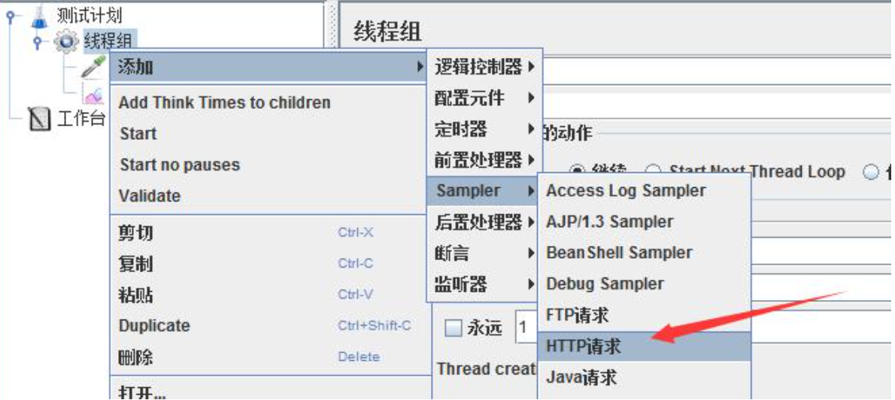
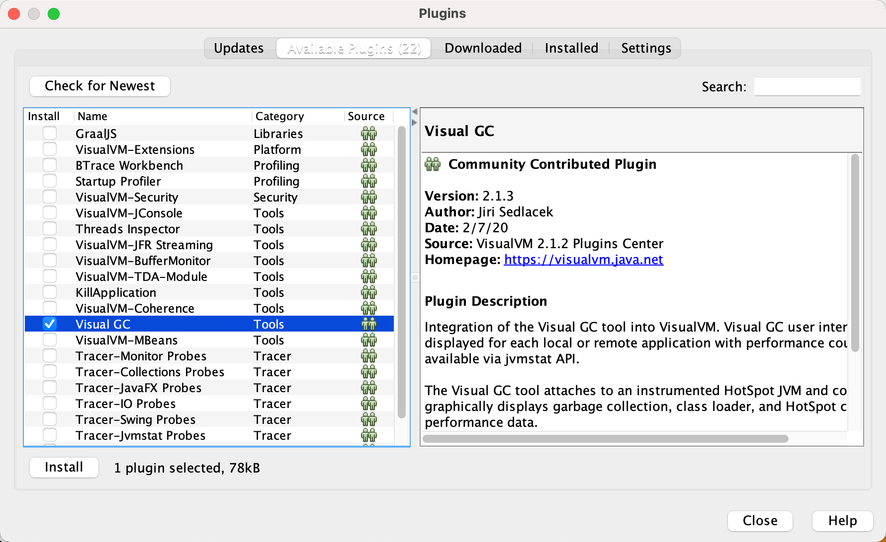
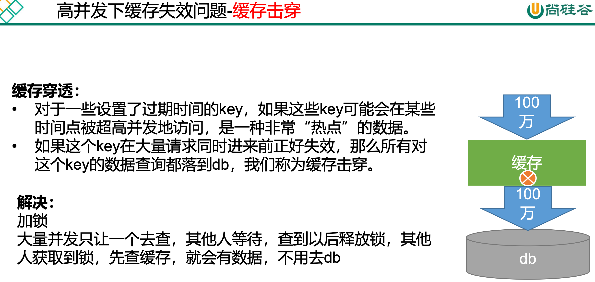
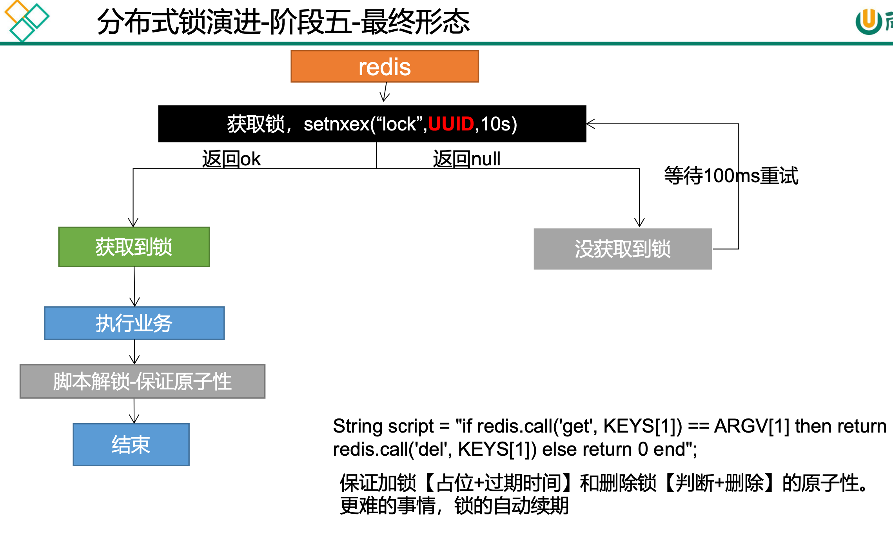

# 商城业务概览


- nginx

  反向代理、前端静态资源部署（动静分离）

  动：服务器需要处理的请求

  静：图片，js、css等静态资源(以实际文件存在的方式)

  只有动态请求会来到微服务，这样可以分担微服务的压力

- 网关

  鉴权、限流、认证

# 商城首页

商品微服务

### 导入依赖

前端使用了thymeleaf开发，因此要导入该依赖,并且为了改动页面实时生效导入devtools

```xml
<!--页面修改不重启服务器实时更新-->
<dependency>
    <groupId>org.springframework.boot</groupId>
    <artifactId>spring-boot-devtools</artifactId>
	  <optional>true</optional>
</dependency>

<dependency>
    <groupId>org.springframework.boot</groupId>
    <artifactId>spring-boot-starter-thymeleaf</artifactId>
</dependency>
```

springboot static目录下放置静态资源，templates里存放html页面文件

开发期间加上配置来禁止thymeleaf缓存

```yaml
spring:  
  thymeleaf:
    cache: false
```

### 新增【接口】首页初始请求

目标：获得三级分类，用来首页渲染三级分类菜单，鼠标移动到某一级分类则展示其子分类菜单

返回的数据模型

```json
{
  catelog1Id: {
    catelog1Id: xxx,
    catelog1Name: xxx,
    catelog2List: [
      {
        catelog2Id: xxx,
        catelog2Name: xxx,
        catelog3List: [
          {
            catelog3Id: xxx,
		        catelog3Name: xxx,
          },
          ...
        ],
      },
      ...
    ],
  },
  ...
}
```

### Nginx搭建域名访问环境

#### 目标

将有具体域名的请求转发到指定微服务

#### 反向代理

对外界屏蔽了内网服务集群的信息


#### Nginx配置


```json
user  nginx;
worker_processes  1;

error_log  /var/log/nginx/error.log warn;
pid        /var/run/nginx.pid;

#event块
events {
    worker_connections  1024;
}

#http块
http {
    include       /etc/nginx/mime.types;
    default_type  application/octet-stream;

    log_format  main  '$remote_addr - $remote_user [$time_local] "$request" '
                      '$status $body_bytes_sent "$http_referer" '
                      '"$http_user_agent" "$http_x_forwarded_for"';

    access_log  /var/log/nginx/access.log  main;

    sendfile        on;
    #tcp_nopush     on;

    keepalive_timeout  65;

    #gzip  on;
    
    upstream gulimall{
				server 192.168.43.201:88;
    }    

    include /etc/nginx/conf.d/*.conf;
    ############################################################################
    #/etc/nginx/conf.d/default.conf 的server块
    server {
        listen       80;
        server_name  localhost;

        #charset koi8-r;
        #access_log  /var/log/nginx/log/host.access.log  main;

        location / {
            root   /usr/share/nginx/html;
            index  index.html index.htm;
        }

        #error_page  404              /404.html;

        # redirect server error pages to the static page /50x.html
        #
        error_page   500 502 503 504  /50x.html;
        location = /50x.html {
            root   /usr/share/nginx/html;
        }

        # proxy the PHP scripts to Apache listening on 127.0.0.1:80
        #
        #location ~ \.php$ {
        #    proxy_pass   http://127.0.0.1;
        #}

        # pass the PHP scripts to FastCGI server listening on 127.0.0.1:9000
        #
        #location ~ \.php$ {
        #    root           html;
        #    fastcgi_pass   127.0.0.1:9000;
        #    fastcgi_index  index.php;
        #    fastcgi_param  SCRIPT_FILENAME  /scripts$fastcgi_script_name;
        #    include        fastcgi_params;
        #}

        # deny access to .htaccess files, if Apache's document root
        # concurs with nginx's one
        #
        #location ~ /\.ht {
        #    deny  all;
        #}
    }
}
```

#### 搭建域名访问环境


浏览器请求eshopblvd.com，mac映射了eshopblvd.com为服务器ip地址，请求来到服务器，nginx监听80端口，如果请求是80端口，且域名为eshopblvd.com，那就将请求代理到网关，这时候需要配置上游服务器地址为网关地址，转发的地址就配置转发到上游服务器的地址，且由于nginx转发请求时请求头的host信息会丢失，需要被重新设置为eshopblvd.com，同时需要设置网关， 网关根据匹配域名来路由转发到指定服务

1. 改变Mac本地域名映射，将`gulimall.com`映射到服务器ip

   ```shell
   sudo vim /etc/hosts
   添加一行
   xxx.xxx.xxx.xxx eshopblvd.com
   保存后退出，ping下验证下
   ping eshopblvd.com
   ```

2. 修改nginx server块的配置：/nginx/conf/conf.d/default.conf

   将以`/`开头的请求转发至我们配好的`gulimall`的`upstream`,由于nginx的转发会丢失`host`头，所以我们添加头信息

   ```json
   server {
       listen       80;
       # 监听80端口的请求，通过请求头的host来匹配域名
       server_name  eshopblvd.com;
   
       #charset koi8-r;
       #access_log  /var/log/nginx/log/host.access.log  main;
   
       location / {
           # root   /usr/share/nginx/html;
           # index  index.html index.htm;
           # 代理到上游服务器（网关）
           proxy_pass http://eshopblvd;
     			# 设置丢失的请求头host
     			proxy_set_header Host $host;
       }
   
       #error_page  404              /404.html;
   
       # redirect server error pages to the static page /50x.html
       #
       error_page   500 502 503 504  /50x.html;
       location = /50x.html {
           root   /usr/share/nginx/html;
       }
   
       # proxy the PHP scripts to Apache listening on 127.0.0.1:80
       #
       #location ~ \.php$ {
       #    proxy_pass   http://127.0.0.1;
       #}
   
       # pass the PHP scripts to FastCGI server listening on 127.0.0.1:9000
       #
       #location ~ \.php$ {
       #    root           html;
       #    fastcgi_pass   127.0.0.1:9000;
       #    fastcgi_index  index.php;
       #    fastcgi_param  SCRIPT_FILENAME  /scripts$fastcgi_script_name;
       #    include        fastcgi_params;
       #}
   
       # deny access to .htaccess files, if Apache's document root
       # concurs with nginx's one
       #
       #location ~ /\.ht {
       #    deny  all;
       #}
   }
   ```

3. 修改nginx的总配置http块：/nginx/conf/nginx.conf

   将`upstream`映射到我们的网关服务

   ```json
   user  nginx;
   worker_processes  1;
   
   error_log  /var/log/nginx/error.log warn;
   pid        /var/run/nginx.pid;
   
   
   events {
       worker_connections  1024;
   }
   
   
   http {
       include       /etc/nginx/mime.types;
       default_type  application/octet-stream;
   
       log_format  main  '$remote_addr - $remote_user [$time_local] "$request" '
                         '$status $body_bytes_sent "$http_referer" '
                         '"$http_user_agent" "$http_x_forwarded_for"';
   
       access_log  /var/log/nginx/access.log  main;
   
       sendfile        on;
       #tcp_nopush     on;
   
       keepalive_timeout  65;
   
       #gzip  on;
   
       # 设置上游服务器为网关地址（如果网关有集群，可以配置多个地址）
       upstream eshopblvd {
           server xxx.xxx.xxx.xxx:88
       }
   
       include /etc/nginx/conf.d/*.conf;
   }
   ```

4. 配置网关服务，这两个域名转发给商品服务

   ```json
   - id: eshopblvd_host_route
   		uri: lb://eshopblvd-product
   		predicates:
   			- Host=eshopblvd.com,item.gulimall.com
   ```

#### 域名映射效果

下面这个效果是页面请求和接口请求都走微服务的情况，如果是前后分离的项目，那么只有api请求走的微服务，可以忽略下面的内容

请求接口 gulimall.com

请求页面 gulimall.com

nginx直接代理给网关，网关判断
 • 如果/api/****，转交给对应的服务器
 • 如果是 满足域名，转交给对应的服务

# 压力测试

压力测试考察当前软硬件环境下系统所能承受的最大负荷并帮助找出系统瓶颈所在。压测都 是为了系统在线上的处理能力和稳定性维持在一个标准范围内，做到心中有数。

平常单元测试只能测出功能性上的问题。使用压力测试，我们有希望找到很多种用其他测试方法更难发现的错误。有两种错误类型是: 内存泄漏，并发与同步。

内存泄漏：大并发下循环中对象没有复用

并发与同步：大并发下线程不安全的问题

## 性能指标

- 响应时间(Response Time: RT) 响应时间指用户从客户端发起一个请求开始，到客户端接收到从服务器端返回的响 应结束，整个过程所耗费的时间。

- HPS(Hits Per Second) :每秒点击次数，单位是次/秒。

- TPS(Transaction per Second):系统每秒处理交易数，单位是笔/秒。

- QPS(Query per Second):系统每秒处理查询次数，单位是次/秒。

  对于互联网业务中，如果某些业务有且仅有一个请求连接，那么 TPS=QPS=HPS，一 般情况下用 TPS 来衡量整个业务流程，用 QPS 来衡量接口查询次数，用 HPS 来表 示对服务器单击请求

- 无论TPS、QPS、HPS,此指标是衡量系统处理能力非常重要的指标，越大越好，根据经 验，一般情况下:

  金融行业:1000TPS~50000TPS，不包括互联网化的活动

  保险行业:100TPS~100000TPS，不包括互联网化的活动

  制造行业:10TPS~5000TPS

  互联网电子商务:10000TPS~1000000TPS

  互联网中型网站:1000TPS~50000TPS

  互联网小型网站:500TPS~10000TPS

- 最大响应时间(Max Response Time) 指用户发出请求或者指令到系统做出反应(响应) 的最大时间。

- 最少响应时间(Mininum ResponseTime)指用户发出请求或者指令到系统做出反应(响 应)的最少时间。

- 90%响应时间(90% Response Time) 是指所有用户的响应时间进行排序，第 90%的响应时间

- 从外部看，性能测试主要关注如下三个指标

  - **吞吐量:每秒钟系统能够处理的请求数、任务数**
  - **响应时间:服务处理一个请求或一个任务的耗时**
  - **错误率:一批请求中结果出错的请求所占比例**

## JMeter

https://jmeter.apache.org/download_jmeter.cgi

### 开始上手

下载jmeter，运行/bin/jmeter.sh

### 测试计划下添加线程组


### 线程组参数配置


线程组参数详解:

- 线程数:虚拟用户数。一个虚拟用户占用一个进程或线程。设置多少虚拟用户数在这里，也就是设置多少个线程数。
- Ramp-Up Period(in seconds)准备时长:设置的虚拟用户数需要多长时间全部启动。如果线程数为 10，准备时长为 2，那么需要 2 秒钟启动 10 个线程，也就是每秒钟启动 5 个线程。
- 循环次数:每个线程发送请求的次数。如果线程数为10，循环次数为100，那么每个线程发送 100 次请求。总请求数为 10*100=1000 。如果勾选了“永远”，那么所有线程会一直发送请求，一到选择停止运行脚本。
- Delay Thread creation until needed:直到需要时延迟线程的创建。
- 调度器:设置线程组启动的开始时间和结束时间(配置调度器时，需要勾选循环次数为永远)
- 持续时间(秒):测试持续时间，会覆盖结束时间
- 启动延迟(秒):测试延迟启动时间，会覆盖启动时间
- 启动时间:测试启动时间，启动延迟会覆盖它。当启动时间已过，手动只需测试时当前时间也会覆盖它。
- 结束时间:测试结束时间，持续时间会覆盖它。

### 添加 HTTP 请求




### 添加监听器


### 启动压测&查看分析结果


### 结果分析

- 有错误率同开发确认，确定是否允许错误的发生或者错误率允许在多大的范围内;

- Throughput吞吐量每秒请求的数大于并发数，则可以慢慢的往上面增加;若在压测的机 器性能很好的情况下，出现吞吐量小于并发数，说明并发数不能再增加了，可以慢慢的往下减，找到最佳的并发数;  

- 压测结束，登陆相应的web服务器查看CPU等性能指标，进行数据的分析;

- 最大的tps，不断的增加并发数，加到tps达到一定值开始出现下降，那么那个值就是最大的 tps。

- 最大的并发数:最大的并发数和最大的tps是不同的概率，一般不断增加并发数，达到一个值后，服务器出现请求超时，则可认为该值为最大的并发数。

- 压测过程出现性能瓶颈，若压力机任务管理器查看到的cpu、网络和cpu都正常，未达到 90%以上，则可以说明服务器有问题，压力机没有问题。

- 影响性能考虑点包括:

  数据库（sql语句性能高不高）、应用程序、中间件(tomact、Nginx)、网络（带宽）和操作系统等方面

  首先考虑自己的应用属于**CPU**密集型还是**IO**密集型（网络/磁盘）

### 首页请求压测


标注偏差大：接口不稳定、吞吐量小、异常小

### 吞吐量小的提升手段

1. 增大jvm内存参数小
2. ...

# 性能监控

监控JVM的工作：内存+线程

## JVM内存模型


### 概述

Java 文件编译成class文件，然后被类装载器装载到jvm的运行时数据区里，这个区域也是优化的发生的地方，接着就由jvm执行引擎来执行，在虚拟机栈依次调用方法（入栈出栈），还可以调用本地接口的方法（操作系统暴露的）「本地方法栈」，记录程序走到哪一行了有程序计数器来完成工作

虚拟机栈、本地方法栈、程序计数器为线程隔离的

方法区、堆是线程共享的

优化更多的是在堆这里

### 概念解释

- 程序计数器 Program Counter Register
  - 记录的是正在执行的虚拟机字节码指令的地址，
  - 此内存区域是唯一一个在JAVA虚拟机规范中没有规定任何OutOfMemoryError的区域
- 虚拟机:VM Stack
  - 描述的是JAVA方法执行的内存模型，每个方法在执行的时候都会创建一个栈帧， 用于存储局部变量表，操作数栈，动态链接，方法接口等信息
  - 局部变量表存储了编译期可知的各种基本数据类型、对象引用
  - 线程请求的栈深度不够会报StackOverflowError异常
  - 栈动态扩展的容量不够会报OutOfMemoryError异常
  - 虚拟机栈是线程隔离的，即每个线程都有自己独立的虚拟机栈
- 本地方法:Native Stack
  - 本地方法栈类似于虚拟机栈，只不过本地方法栈使用的是本地方法
- 堆:Heap
  - 几乎所有的对象实例都在堆上分配内存

### 堆

JVM由c语言编写的，c语言需要手动回收内存，基于c语言封装写了一个执行引擎，来翻译java代码

java里内存的创建和释放都是由jvm来管理的，


所有的对象实例以及数组都要在堆上分配。堆是垃圾收集器管理的主要区域，也被称为“GC 堆”;也是我们优化最多考虑的地方。

永久代/元空间

- java8 以前永久代，受 jvm 管理，java8 以后元空间，直接使用物理内存。因此， 默认情况下，元空间的大小仅受本地内存限制。

CodeCache JIT编译产物

- 编译期间的代码缓存 (优化调节有，但不多)

堆可以细分为:

- 新生代

  - Eden空间

  - FromSurvivor空间

  - ToSurvivor空间

- 老年代

### 垃圾回收


1. 从 Java8 开始，HotSpot 已经完全将永久代(Permanent Generation)移除，取而代之的是一 个新的区域—元空间(MetaSpace)
2. 垃圾回收存在于新生代和老年代

流程：新创建了对象要分配内存，先去新生代里分配，先看伊甸园区，判断伊甸园区内存空间够不够，如果够就直接分配内存，如果不够就进行一次young GC/minor GC（比较快），就是清理新生代的空间，没有被引用的对象会被释放内存，伊甸园区内没被释放内存的对象会被放到幸存者区里。这时伊甸园区能放得下就放，如果放不下的话就认为这是个大对象，就把它放在老年代，老年代就是新生代没法处理的时候放在老年代的。如果放得下就直接分配内存，如果放不下就进行一次full GC（非常慢），这是老年代和新生代都清理一遍。这时候再看，老年代能放下就放，放不下就报溢出异常了

Full GC比Young GC慢得多，所以优化的时候，要监控避免应用经常fullGC，时刻关注新生代和老年代的变化

young GC时伊甸园区内没被释放内存的对象会被放到幸存者from区里，如果能放就放幸存者区，幸存者区有from和to两个区，下次young gc就是伊甸园区和from区所有存活对象复制到to区了，这两个区来回交换，目的是总要腾出大白片的空间。如果放不下的话，那么就把这些存活对象搬家到老年代里

如果幸存者区的对象存活超过阈值，也就是young gc了好几次都还存活着(每存活一次young gc，age就+1)，那就把这个对象放到老年区

所以老年代存放的都是生命力持久的对象，以及大的对象


## 指标监控

### jconsole 与 jvisualvm

Jdk 的两个小工具 jconsole、jvisualvm(升级版的 jconsole);通过命令行启动，可监控本地和 远程应用。远程应用需要配置

#### jconsole

直接命令行输入

```shell
jconsole
```

启动jconsole


选择你本地想要连接并监控的进程


#### jvisualvm

直接命令行输入

```shell
jvisualvm
```

启动jvisualvm

jvisualvm的功能：监控内存泄露，跟踪垃圾回收，执行时内存、cpu 分析，线程分析...


运行:正在运行的

休眠:sleep

等待:wait 

驻留:线程池里面的空闲线程 

监视:阻塞的线程，正在等待锁

下载插件：visual GC



安装完重启jvisualvm


full gc耗时太长，要避免频繁full gc
下面这个是健康的曲线，eden区一满就清空，没有太多释放不掉的对象


老年代内存也是慢慢往上涨


metaspace直接操作物理内存，不太关心

##### 中间件指标


##### 数据库指标


- SQL耗时越小越好，一般情况下微秒级别。

- 命中率越高越好，一般情况下不能低于95%。
- 锁等待次数越低越好，等待时间越短越好。

# JVM 分析&调优

jvm 调优，调的是稳定，并不能带给你性能的大幅提升。服务稳定的重要性就不用多说了， 保证服务的稳定，gc 永远会是 Java 程序员需要考虑的不稳定因素之一。复杂和高并发下的 服务，必须保证每次 gc 不会出现性能下降，各种性能指标不会出现波动，gc 回收规律而且 干净，找到合适的 jvm 设置。Full gc 最会影响性能，根据代码问题，避免 full gc 频率。可以 适当调大年轻代容量，让大对象可以在年轻代触发 yong gc，调整大对象在年轻代的回收频 次，尽可能保证大对象在年轻代回收，减小老年代缩短回收时间;

## 几个常用工具


## 命令示例

### jstat


### jinfo


### jmap


### jstack


### 调优项

https://docs.oracle.com/javase/8/docs/technotes/tools/unix/java.html#BGBCIEFC

# 压测实战

压测期间监听jvm性能指标：Cpu、内存、gc次数等，分析并作优化

## 压测首页初始化请求

请求是先来到nginx，再到网关，再到商品服务，响应的时候再根据这个链路原路返回，所以nginx和网关这两个中间件对性能的影响也需要关注

所以先压测这两个中间件

### 单压nginx

首先nginx，比较消耗cpu资源，属于计算型的


### 单压网关

cpu使用情况偏高


由于本身初始分配的内存就比较小，eden区只有32m，所有young gc次数较多，所以调大eden区的内存，减少young gc，提高吞吐


### 简单服务（直接访问服务）

仅返回一个字符串

不处理复杂业务逻辑 -> 高吞吐量 10000左右

### Gateway+简单服务

吞吐量3000，原本网关和简单服务单测试都是10000，过了一个中间件性能就损失了很多

### 全链路（Nginx+Gateway+简单服务）

吞吐下降到800

### 三级分类数据获取（无中间件）

吞吐量只有4

数据库优化，按照索引查（根据哪个字段查找数据，就在数据库中为那个字段加上索引）

关日志，设置日志级别为error，仅error打印日志

优化逻辑， 把数据库里所有的数据都查出来先，剩下的数据通过遍历得到并封装

这样就省去每次遍历某个层级分类时候还要遍历去数据库查询子分类，这样消耗太大，所以提前将所有分类的数据查询出来再处理封装

### 首页全量数据获取(动静分类)

动静分类可参考[Nginx动静分离](#Nginx动静分离)

压测时候查看gc发现内存大小了，eden区和老年代都是频繁gc，容易爆满


调整内存大小

```
-Xmx1024m -Xms1024m -Xmn512m
```

-Xmx1024m 为最大内存

-Xms1024m 为最小内存

-Xmn512m 为新生代的内存，包括eden区和survivor区

调整后不频繁gc了，吞吐量也上去了

### 结果汇总

Gateway、tomcat这些中间件单测的吞吐量还不错

请求链路中中间件越多，性能损失越大,  大多都损失在中间件之间IO网络交互了

比起中间件，业务逻辑才是需要优化的地方

| 压测内容                                                   | 压测线程数 | 吞吐量/s | 90%响应时间 | 99%响应时间 |
| ---------------------------------------------------------- | ---------- | -------- | ----------- | ----------- |
| Nginx                                                      | 50         | 2120     | 10          | 1204        |
| Gateway                                                    | 50         | 9200     | 9           | 21          |
| 简单服务(仅返回一个字符串，直接访问服务)                   | 50         | 9850     | 8           | 48          |
| 首页一级菜单渲染                                           | 50         | 350      | 260         | 491         |
| 首页菜单渲染(模版引擎thymleaf开缓存，有一定的提升，但不大) | 50         | 465      | 119         | 306         |
| 首页菜单渲染(开缓存、优化数据库、关日志)                   | 50         | 465      | 127         | 304         |
| 三级分类数据获取（无中间件）                               | 50         | 4        | 13275       | 13756       |
| 三级分类（无中间件）(优化业务)                             | 50         | 15       | 4092        | 5891        |
| 首页全量数据获取(包括了获取静态资源js, css)                | 50         | 2.7      | 24014       | 26556       |
| 首页全量数据获取(动静分类)                                 | 50         | 4.9      | 14913       | 16421       |
| Nginx+GateWay                                              | 50         |          |             |             |
| Gateway+简单服务                                           | 50         | 3000     | 28          | 67          |
| 全链路(Nginx+GateWay+简单服务)                             | 50         | 650      | 84          | 537         |

### 优化手段

1. 优化中间件，提高吞吐
2. 提升网络传输效率，使用高效的传输协议
3. 业务逻辑优化，减少数据库查询的次数，仅查询一次数据库，剩下的数据通过遍历得到并封装
4. Db(MySQL优化) 
   1. 按照索引查（根据哪个字段查找，就在数据库中为那个字段加上索引）
5. 静态资源(动静分离)
6. 关日志，设置日志级别为error，仅error打印日志
7. 调整jvm参数调整内存大小 `-Xmx1024m -Xms1024m -Xmn512m`
8. 引入缓存redis

# Nginx动静分离

静态资源放在nginx，如果前端用vue写的，那么nginx部署vue+动静分离可参考

https://zhuanlan.zhihu.com/p/345622879


## 静态资源搬家

nginx docker容器在外部挂载了三个文件夹，日志logs、配置conf、静态资源html

由于之后会部署vue，将vue编译打包的静态资源放到外部挂载目录下/mydata/nginx/html/static

## 设置静态资源访问根路径

/mydata/nginx/conf/nginx.conf是总配置

每个server的配置都在conf.d目录下，里面有个default.conf，可以复制用来自定义自己server的配置

修改/mydata/nginx/conf/eshopblvd.conf，加上location配置，以后/static/路径开头的请求就以/usr/share/nginx/html为访问跟路径映射了，去这个目录下找静态资源

```yaml
location /static/ {
		root /usr/share/nginx/html;
}
```

其余的请求还是转给http://eshopblvd

```yaml
location / {
	# 代理到上游服务器（网关）
	proxy_pass http://eshopblvd;
	# 设置丢失的请求头host
	proxy_set_header Host $host;
}
```

重启nginx容器

```shell
docker restart nginx
```

这样配置就生效了，静态资源nginx返回，动态请求数据由tomcat返回

# 缓存

## 缓存使用

为了系统性能的提升，我们一般都会将部分数据放入缓存中，加速访问。而 db 承担数据落盘工作

就比如商城首页的菜单查询，这是一个复杂查询，其访问量大，而且不经常修改，所以我们需要引入缓存的概念，第一次查询后放入缓存，之后就不要一直查数据库了

### 哪些数据适合放入缓存

1. 即时性、数据一致性要求不高的
2. 访问量大且更新频率不高的数据(读多，写少)

举例:电商类应用，商品分类，商品列表等适合缓存并加一个失效时间(根据数据更新频率 来定)，后台如果发布一个商品，买家需要 5 分钟才能看到新的商品一般还是可以接受的。


缓存逻辑的伪代码

```java
data = cache.load(id);//从缓存加载数据 If(data == null){
data = db.load(id);//从数据库加载数据
cache.put(id,data);//保存到 cache 中 }
return data;
```

### 本地缓存

本地缓存是指在同一进程下本地的缓存，一般用`Map<String, Object>`


本地缓存在分布式环境是有问题的

分布式有多个server，每个server的本地缓存都不同，当修改一台机器上的本地缓存时，其他机器的缓存就不一致了


### 分布式缓存

所以分布式缓存诞生了，一台机器要修改数据，那么缓存中间件的数据也会被修改，这里用到了集中式的缓存中间件redis

一台redis不够的话，redis可以搭建集群，还可以分片式存储，这样打破了本地缓存的容量限制，体现了redis的高可用、高性能


## 整合Redis

1. 导入依赖

   ```xml
          <dependency>
               <groupId>org.springframework.boot</groupId>
               <artifactId>spring-boot-starter-data-redis</artifactId>
           </dependency>
   ```

2. 配置redis主机地址

   ```yaml
   spring:
     redis:
       host: #
       port: 6379
   ```

3. 使用springboot自动配置的RedisTemplate

   

4. 使用 RedisTemplate 操作 redis，为了跨语言，跨平台兼容，缓存中存的数据是json字符串

   ```java
   @Autowired
   StringRedisTemplate stringRedisTemplate; @Test
   public void testStringRedisTemplate(){
     ValueOperations<String, String> ops = stringRedisTemplate.opsForValue();
     ops.set("hello","world_"+ UUID.randomUUID().toString());
     String hello = ops.get("hello");
     System.out.println(hello);
   }
   ```

5. redis命令行工具

   ```shell
    docker exec -it redis redis-cli
   ```

6. 优化菜单获取逻辑

   ```java
       /**
        * 从redis分布式缓存中查询菜单信息
        * @return
        */
       private Map<Long, CatalogVO> getHomepageCatalogFromRedis() {
           long beginTime = System.currentTimeMillis();
           // 先从缓存中找有没有数据，没有的话再查数据库
           String catalogJSON = redisTemplate.opsForValue().get("catalogJSON");
           if (!StringUtils.isEmpty(catalogJSON)) {
               log.info("获取三级菜单命中redis缓存!");
               Map<Long, CatalogVO> result = JSON.parseObject(catalogJSON, new TypeReference<Map<Long, CatalogVO>>() {
               });
               long time = System.currentTimeMillis() - beginTime;
               log.info("获取三级菜单耗时：{}ms", time);
               return result;
           }
           log.info("获取三级菜单未命中redis缓存，获取数据库数据并存入redis中...");
           Map<Long, CatalogVO> catalogFromDB = getHomepageCatalogFromDB();
           String toJSONString = JSON.toJSONString(catalogFromDB);
           redisTemplate.opsForValue().set("catalogJSON", toJSONString, 1, TimeUnit.DAYS);
           long time = System.currentTimeMillis() - beginTime;
           log.info("获取三级菜单耗时：{}ms", time);
           return catalogFromDB;
       }
   ```

7. 压力测试

   当进行压力测试时后期后出现堆外内存溢出OutOfDirectMemoryError

   产生原因：

   1)、springboot2.0以后默认使用lettuce操作redis的客户端，它使用通信

   2)、lettuce的bug导致netty堆外内存溢出 -Xmx300m；netty如果没有指定堆外内存，默认使用-Xmx300m

   可以通过-Dio.netty.maxDirectMemory进行设置

   解决方案：不能使用-Dio.netty.maxDirectMemory只去调大堆外内存。因为没有及时得到内存释放，所以很久之后也会出现这个问题

   解决方案：由于是lettuce的bug造成，不能直接使用-Dio.netty.maxDirectMemory去调大虚拟机堆外内存

   切换使用jedis

   ```xml
       <dependency>
           <groupId>org.springframework.boot</groupId>
           <artifactId>spring-boot-starter-data-redis</artifactId>
           <exclusions>
               <exclusion>
                   <groupId>io.lettuce</groupId>
                   <artifactId>lettuce-core</artifactId>
               </exclusion>
           </exclusions>
       </dependency>
       <dependency>
           <groupId>redis.clients</groupId>
           <artifactId>jedis</artifactId>
       </dependency>
   ```

   获取缓存后接口耗时大幅减少

   

## 高并发下缓存失效

用缓存减少接口耗时后，在高并发下依旧存在一些问题

缓存失效：缓存没有命中、没有查到数据

### 缓存穿透


未来如果这个查询在数据库里有数据了，那缓存也还是空结果，那么就需要给缓存的结果设定过期时间，那么下一次查缓存没有，那么就需要去数据库中查

### 缓存雪崩


### 缓存击穿



### 优化接口

- 空结果缓存：解决缓存穿透
- 设置过期时间（加随机值）：解决缓存雪崩
- 加锁：解决缓存击穿

#### 加锁解决缓存击穿问题

将查询db的方法加锁，这样在同一时间只有一个方法能查询数据库，就能解决缓存击穿的问题了

SpringBoot所有的组件在容器中都是单例的。

```java
public Map<String, List<Catalog2Vo>> getCategoryMap() {
        ValueOperations<String, String> ops = stringRedisTemplate.opsForValue();
        String catalogJson = ops.get("catalogJson");
        if (StringUtils.isEmpty(catalogJson)) {
            System.out.println("缓存不命中，准备查询数据库。。。");
            Map<String, List<Catalog2Vo>> categoriesDb = getCategoriesDb();
            String toJSONString = JSON.toJSONString(categoriesDb);
            ops.set("catalogJson",toJSONString);
            return categoriesDb;
        }
        System.out.println("缓存命中。。。。");
        Map<String, List<Catalog2Vo>> listMap = JSON.parseObject(catalogJson, new TypeReference<Map<String, List<Catalog2Vo>>>() {});
        return listMap;
    }

 private synchronized Map<String, List<Catalog2Vo>> getCategoriesDb() {
        String catalogJson = stringRedisTemplate.opsForValue().get("catalogJson");
        if (StringUtils.isEmpty(catalogJson)) {
            System.out.println("查询了数据库");
      		。。。。。
            return listMap;
        }else {
            Map<String, List<Catalog2Vo>> listMap = JSON.parseObject(catalogJson, new TypeReference<Map<String, List<Catalog2Vo>>>() {});
            return listMap;
        }
    }
```

#### 锁时序问题

目标是只要缓存不命中，查数据库只能查一次

我们将业务逻辑中的`确认缓存没有`和`查数据库`放到了锁里，但是最终控制台却打印了两次查询了数据库。这是因为在将结果放入缓存的这段时间里，有其他线程确认缓存没有，又再次查询了数据库，因此我们要将`结果放入缓存`也进行加锁


## 分布式锁


synchronized加锁只用this锁了本地service这个实例

本地锁锁不住分布式服务多个实例

分布式锁比本地锁慢

本地锁包括了synchronized，juc下lock接口，只锁得住当前进程，一个服务对应一个进程

在分布式情况下，想要锁住所有，必须使用分布式锁

启动一个新的服务，模拟分布式情况


### 基本原理


我们可以同时去一个地方“占坑”，如果占到，就执行逻辑。否则就必须等待，直到释放锁。“占坑”可以去redis，可以去数据库，可以去任何大家都能访问的地方。等待可以自旋的方式。


```java
	public Map<String, List<Catalog2Vo>> getCatalogJsonDbWithRedisLock() {
        //阶段一
        Boolean lock = stringRedisTemplate.opsForValue().setIfAbsent("lock", "111");
        //获取到锁，执行业务
        if (lock) {
            Map<String, List<Catalog2Vo>> categoriesDb = getCategoryMap();
            //删除锁，如果在此之前报错或宕机会造成死锁
            stringRedisTemplate.delete("lock");
            return categoriesDb;
        }else {
            //没获取到锁，等待100ms重试
            try {
                Thread.sleep(100);
            } catch (InterruptedException e) {
                e.printStackTrace();
            }
            return getCatalogJsonDbWithRedisLock();
        }
    }

public Map<String, List<Catalog2Vo>> getCategoryMap() {
        ValueOperations<String, String> ops = stringRedisTemplate.opsForValue();
        String catalogJson = ops.get("catalogJson");
        if (StringUtils.isEmpty(catalogJson)) {
            System.out.println("缓存不命中，准备查询数据库。。。");
            Map<String, List<Catalog2Vo>> categoriesDb= getCategoriesDb();
            String toJSONString = JSON.toJSONString(categoriesDb);
            ops.set("catalogJson", toJSONString);
            return categoriesDb;
        }
        System.out.println("缓存命中。。。。");
        Map<String, List<Catalog2Vo>> listMap = JSON.parseObject(catalogJson, new TypeReference<Map<String, List<Catalog2Vo>>>() {});
        return listMap;
    }
```

问题： 1、setnx占好了位，业务代码异常或者程序在页面过程中宕机。没有执行删除锁逻辑，这就造成了死锁

解决：设置锁的自动过期，即使没有删除，会自动删除


问题： 1、setnx设置好，正要去设置过期时间，宕机。又死锁了。 

解决： 设置过期时间和占位必须是原子的。redis支持使用setnx ex命令


```java
public Map<String, List<Catalog2Vo>> getCatalogJsonDbWithRedisLock() {
    //加锁的同时设置过期时间，二者是原子性操作
    Boolean lock = stringRedisTemplate.opsForValue().setIfAbsent("lock", "1111",5, TimeUnit.SECONDS);
    if (lock) {
        Map<String, List<Catalog2Vo>> categoriesDb = getCategoryMap();
        //模拟超长的业务执行时间
        try {
            Thread.sleep(6000);
        } catch (InterruptedException e) {
            e.printStackTrace();
        }
        stringRedisTemplate.delete("lock");
        return categoriesDb;
    }else {
        try {
            Thread.sleep(100);
        } catch (InterruptedException e) {
            e.printStackTrace();
        }
        return getCatalogJsonDbWithRedisLock();
    }
}
```

问题： 1、删除锁直接删除？？？ 如果由于业务时间很长，锁自己过期了，我们直接删除，有可能把别人正在持有的锁删除了。

 解决： 占锁的时候，值指定为uuid，每个人匹配是自己的锁才删除。


```java
 public Map<String, List<Catalog2Vo>> getCatalogJsonDbWithRedisLock() {
        String uuid = UUID.randomUUID().toString();
        ValueOperations<String, String> ops = stringRedisTemplate.opsForValue();
     	//为当前锁设置唯一的uuid，只有当uuid相同时才会进行删除锁的操作
        Boolean lock = ops.setIfAbsent("lock", uuid,5, TimeUnit.SECONDS);
        if (lock) {
            Map<String, List<Catalog2Vo>> categoriesDb = getCategoryMap();
            String lockValue = ops.get("lock");
            if (lockValue.equals(uuid)) {
                try {
                    Thread.sleep(6000);
                } catch (InterruptedException e) {
                    e.printStackTrace();
                }
                stringRedisTemplate.delete("lock");
            }
            return categoriesDb;
        }else {
            try {
                Thread.sleep(100);
            } catch (InterruptedException e) {
                e.printStackTrace();
            }
            return getCatalogJsonDbWithRedisLock();
        }
    }
```

问题： 1、如果正好判断是当前值，正要删除锁的时候，锁已经过期，别人已经设置到了新的值。那么我们删除的是别人的锁 

解决： 删除锁必须保证原子性。使用redis+Lua脚本完成



```java
 public Map<String, List<Catalog2Vo>> getCatalogJsonDbWithRedisLock() {
        String uuid = UUID.randomUUID().toString();
        ValueOperations<String, String> ops = stringRedisTemplate.opsForValue();
        Boolean lock = ops.setIfAbsent("lock", uuid,5, TimeUnit.SECONDS);
        if (lock) {
            Map<String, List<Catalog2Vo>> categoriesDb = getCategoryMap();
            String lockValue = ops.get("lock");
            String script = "if redis.call(\"get\",KEYS[1]) == ARGV[1] then\n" +
                    "    return redis.call(\"del\",KEYS[1])\n" +
                    "else\n" +
                    "    return 0\n" +
                    "end";
            stringRedisTemplate.execute(new DefaultRedisScript<Long>(script, Long.class), Arrays.asList("lock"), lockValue);
            return categoriesDb;
        }else {
            try {
                Thread.sleep(100);
            } catch (InterruptedException e) {
                e.printStackTrace();
            }
            return getCatalogJsonDbWithRedisLock();
        }
    }
```

保证加锁【占位+过期时间】和删除锁【判断+删除】的原子性。更难的事情，锁的自动续期：锁放长点300s

## 最终优化逻辑


```java
    /**
     * 从redis分布式缓存中查询菜单信息
     * @return
     */
    private Map<Long, CatalogVO> getHomepageCatalogFromRedis() {
        long beginTime = System.currentTimeMillis();
        // 先从缓存中找有没有数据，没有的话再查数据库
        String catalogJSON = redisTemplate.opsForValue().get("catalogJSON");
        if (StringUtils.isEmpty(catalogJSON)) {
            log.info("获取三级菜单未命中redis缓存");
            Map<Long, CatalogVO> catalogFromDB = getHomepageCatalogFromDBWithLock();
            String toJSONString = JSON.toJSONString(catalogFromDB);
            redisTemplate.opsForValue().set("catalogJSON", toJSONString, 1, TimeUnit.DAYS);
            long time = System.currentTimeMillis() - beginTime;
            log.info("获取三级菜单耗时：{}ms", time);
            return catalogFromDB;
        }
        log.info("获取三级菜单命中redis缓存!");
        Map<Long, CatalogVO> result = JSON.parseObject(catalogJSON, new TypeReference<Map<Long, CatalogVO>>() {
        });
        long time = System.currentTimeMillis() - beginTime;
        log.info("获取三级菜单耗时：{}ms", time);
        return result;

    }

    /**
     * 加个分布式锁从数据库查数据
     * @return
     */
    private Map<Long, CatalogVO> getHomepageCatalogFromDBWithLock() {
        // 锁的标识
        String uuid = UUID.randomUUID().toString();
        // 原子操作获取锁
        Boolean lock = redisTemplate.opsForValue().setIfAbsent("lock", uuid, 30, TimeUnit.SECONDS);
        if (lock) {
            log.info("获取分布式锁成功");
            Map<Long, CatalogVO> homepageCatalog = null;
            try {
                String catalogJSON = redisTemplate.opsForValue().get("catalogJSON");
                if (!StringUtils.isEmpty(catalogJSON)) {
                    log.info("缓存命中! 数据返回");
                    homepageCatalog = JSON.parseObject(catalogJSON, new TypeReference<Map<Long, CatalogVO>>() {});
                } else {
                    log.info("开始查询数据库...");
                    homepageCatalog = getHomepageCatalogFromDB();
                    // 查到的数据再放入缓存，将对象转为json放在缓存中
                    String toJSONString = JSON.toJSONString(homepageCatalog);
                    redisTemplate.opsForValue().set("catalogJSON", toJSONString, 1, TimeUnit.DAYS);
                }
            } catch (Exception e) {
                log.error(e.toString());
            } finally {
                // 释放锁
                String script = "if redis.call('get', KEYS[1]) == ARGV[1] then return redis.call('del', KEYS[1]) else return 0 end";
                redisTemplate.execute(new DefaultRedisScript<Long>(script, Long.class), Arrays.asList("lock"), uuid);
                log.info("分布式锁释放成功");
            }
            return homepageCatalog;
        } else {
            // 获取不到分布式锁就休眠200ms后自旋重试获取锁
            log.info("获取分布式锁失败，重试中...");
            try {
                Thread.sleep(200);
            } catch (Exception e) {
                log.error(e.toString());
            }
            return getHomepageCatalogFromDBWithLock();
        }
    }
```

## Redisson

Redisson是一个在Redis的基础上实现的Java驻内存数据网格（In-Memory Data Grid）。它不仅提供了一系列的分布式的Java常用对象，还提供了许多分布式服务。其中包括(`BitSet`, `Set`, `Multimap`, `SortedSet`, `Map`, `List`, `Queue`, `BlockingQueue`, `Deque`, `BlockingDeque`, `Semaphore`, `Lock`, `AtomicLong`, `CountDownLatch`, `Publish / Subscribe`, `Bloom filter`, `Remote service`, `Spring cache`, `Executor service`, `Live Object service`, `Scheduler service`) Redisson提供了使用Redis的最简单和最便捷的方法。Redisson的宗旨是促进使用者对Redis的关注分离（Separation of Concern），从而让使用者能够将精力更集中地放在处理业务逻辑上。

本文我们仅关注分布式锁的实现，更多请参考[官方文档](https://github.com/redisson/redisson/wiki/8.-分布式锁和同步器)

### 导入依赖

以后使用redisson作为所有分布式锁，分布式对象等功能框架

```xml
<dependency>
    <groupId>org.redisson</groupId>
    <artifactId>redisson</artifactId>
    <version>3.13.4</version>
</dependency>
```

### 程序化开启配置

```java
@Configuration
public class MyRedissonConfig {
    /**
     * 所有对Redisson的使用都是通过RedissonClient对象，引入到容器中
     * @return
     * @throws IOException
     */
    @Bean(destroyMethod="shutdown")
    public RedissonClient redisson(@Value("${spring.redis.host}") String url) throws IOException {
        //1、创建配置
        //Redis url should start with redis:// or rediss://
        Config config = new Config();
        config.useSingleServer().setAddress("redis://"+url+":6379");
        //2、根据Config创建出RedissonClient示例
        RedissonClient redissonClient = Redisson.create(config);
        return redissonClient;
    }
}
```

### 可重入锁（Reentrant Lock）

定义：可重入锁，也叫做递归锁，是指在一个线程中可以多次获取同一把锁，比如：一个线程在执行一个带锁的方法，该方法中又调用了另一个需要相同锁的方法，则该线程可以直接执行调用的方法【即可重入】，而无需重新获得锁

举例：有一个方法a，方法内部调用了方法b，两个方法要加同一把锁，方法b看方法a已经加了这把锁，那就直接拿来这把锁直接用了，方法b将会直接执行，执行到最后方法a会释放这把锁

所有锁都应该被设计成可重入锁，避免死锁的问题

```java
 public Map<String, List<Catalog2Vo>> getCatalogJsonDbWithRedisson() {
        Map<String, List<Catalog2Vo>> categoryMap=null;
        RLock lock = redissonClient.getLock("CatalogJson-Lock");
        lock.lock(); // 阻塞锁
        try {
            Thread.sleep(30000);
            categoryMap = getCategoryMap();
        } catch (InterruptedException e) {
            e.printStackTrace();
        }finally {
            lock.unlock();
            return categoryMap;
        }
    }
```

如果负责储存这个分布式锁的Redisson节点宕机以后，而且这个锁正好处于锁住的状态时，这个锁会出现锁死的状态。为了避免这种情况的发生，所以就设置了过期时间，但是如果业务执行时间过长，业务还未执行完锁就已经过期，那么就会出现解锁时解了其他线程的锁的情况。

所以Redisson内部提供了一个监控锁的看门狗，它的作用是在Redisson实例被关闭前，不断的延长锁的有效期。默认情况下，看门狗的检查锁的超时时间是30秒钟，也可以通过修改[Config.lockWatchdogTimeout](https://github.com/redisson/redisson/wiki/2.-配置方法#lockwatchdogtimeout监控锁的看门狗超时单位毫秒)来另行指定。

`lock.lock();`阻塞式等待。默认加的锁都是30s时间。

锁的自动续期，如果业务超长，运行期间自动给锁续上新的30s。不用担心业务时间长，锁自动过期被删掉
加锁的业务只要运行完成，就不会给当前锁续期，即使不手动解锁，锁默认在30s以后自动删除。

在本次测试中`CatalogJson-Lock`的初始过期时间TTL为30s，但是每到20s就会自动续借成30s

[](https://github.com/NiceSeason/gulimall-learning/blob/master/docs/images/Snipaste_2020-09-08_23-16-35.png)

另外Redisson还通过加锁的方法提供了`leaseTime`的参数来指定加锁的时间。超过这个时间后锁便自动解开了。不会自动续期！

问题：lock.lock(10,TimeUnit.SECONDS); 在锁时间到了以后，不会自动续期。
1、如果我们传递了锁的超时时间，就发送给redis执行脚本，进行占锁，默认超时就是我们指定的时间
2、如果我们未指定锁的超时时间，就使用30 * 1000【LockWatchdogTimeout看门狗的默认时间】;
      只要占锁成功，就会启动一个定时任务【重新给锁设置过期时间，新的过期时间就是看门狗的默认时间】,每隔10s都会自动再次续期，续成30s
internalLockLeaseTime【看门狗时间】 / 3,10s

```java
// 加锁以后10秒钟自动解锁
// 无需调用unlock方法手动解锁,如果要手动解锁一定要确保业务执行时间小于锁的失效时间
lock.lock(10, TimeUnit.SECONDS);

// 尝试加锁，最多等待100秒，上锁以后10秒自动解锁
boolean res = lock.tryLock(100, 10, TimeUnit.SECONDS);
if (res) {
   try {
     ...
   } finally {
       lock.unlock();
   }
}
```

### 读写锁（ReadWriteLock）

```java
    @GetMapping("/read")
    @ResponseBody
    public String read() {
        RReadWriteLock lock = redissonClient.getReadWriteLock("ReadWrite-Lock");
        RLock rLock = lock.readLock();
        String s = "";
        try {
            rLock.lock();
            System.out.println("读锁加锁"+Thread.currentThread().getId());
            Thread.sleep(5000);
            s= redisTemplate.opsForValue().get("lock-value");
        }finally {
            rLock.unlock();
            return "读取完成:"+s;
        }
    }

    @GetMapping("/write")
    @ResponseBody
    public String write() {
        RReadWriteLock lock = redissonClient.getReadWriteLock("ReadWrite-Lock");
        RLock wLock = lock.writeLock();
        String s = UUID.randomUUID().toString();
        try {
            wLock.lock();
            System.out.println("写锁加锁"+Thread.currentThread().getId());
            Thread.sleep(10000);
            redisTemplate.opsForValue().set("lock-value",s);
        } catch (InterruptedException e) {
            e.printStackTrace();
        }finally {
            wLock.unlock();
            return "写入完成:"+s;
        }
    }
```

写锁会阻塞读锁，但是读锁不会阻塞读锁，但读锁会阻塞写锁

总之含有写的过程都会被阻塞，只有读读不会被阻塞

```
保证一定能读到最新数据,修改期间，写锁是一个排他锁（互斥锁、独享锁）。读锁是一个共享锁
//写锁没释放读就必须等待
// 读 + 读： 相当于无锁，并发读，只会在redis中记录好，所有当前的读锁。他们都会同时加锁成功
// 写 + 读： 等待写锁释放
// 写 + 写： 阻塞方式
// 读 + 写： 有读锁。写也需要等待。
// 只要有写的存在，都必须等待
```

上锁时在redis的状态

[](https://github.com/NiceSeason/gulimall-learning/blob/master/docs/images/Snipaste_2020-09-09_12-53-21.png)

### 信号量（Semaphore）

信号量为存储在redis中的一个数字，当这个数字大于0时，即可以调用`acquire()`方法增加数量，也可以调用`release()`方法减少数量，但是当调用`release()`之后小于0的话方法就会阻塞，直到数字大于0

```java
@GetMapping("/park")
@ResponseBody
public String park() {
    RSemaphore park = redissonClient.getSemaphore("park");
    try {
        park.acquire(2);
    } catch (InterruptedException e) {
        e.printStackTrace();
    }
    return "停进2";
}

@GetMapping("/go")
@ResponseBody
public String go() {
    RSemaphore park = redissonClient.getSemaphore("park");
    park.release(2);
    return "开走2";
}
```

### 闭锁（CountDownLatch）

可以理解为门栓，使用若干个门栓将当前方法阻塞，只有当全部门栓都被放开时，当前方法才能继续执行。

以下代码只有`offLatch()`被调用5次后 `setLatch()`才能继续执行

```java
 	@GetMapping("/setLatch")
    @ResponseBody
    public String setLatch() {
        RCountDownLatch latch = redissonClient.getCountDownLatch("CountDownLatch");
        try {
            latch.trySetCount(5);
            latch.await();
        } catch (InterruptedException e) {
            e.printStackTrace();
        }
        return "门栓被放开";
    }

    @GetMapping("/offLatch")
    @ResponseBody
    public String offLatch() {
        RCountDownLatch latch = redissonClient.getCountDownLatch("CountDownLatch");
        latch.countDown();
        return "门栓被放开1";
    }
```

闭锁在redis的存储状态

[](https://github.com/NiceSeason/gulimall-learning/blob/master/docs/images/Snipaste_2020-09-09_13-11-45.png)

## 缓存数据的一致性

### 1. 双写模式


当数据更新时，更新数据库时同时更新缓存

**存在问题**

由于卡顿等原因，导致写缓存2在最前，写缓存1在后面就出现了不一致

这是暂时性的脏数据问题，但是在数据稳定，缓存过期以后，又能得到最新的正确数据

### 2. 失效模式


数据库更新时将缓存删除

**存在问题**

当两个请求同时修改数据库，一个请求已经更新成功并删除缓存时又有读数据的请求进来，这时候发现缓存中无数据就去数据库中查询并放入缓存，在放入缓存前第二个更新数据库的请求成功，这时候留在缓存中的数据依然是第一次数据更新的数据

**解决方法**

1、缓存的所有数据都有过期时间，数据过期下一次查询触发主动更新 2、读写数据的时候(并且写的不频繁)，加上分布式的读写锁。

## 缓存数据一致性-解决方案


我们系统的一致性**解决方案**: 

1、缓存的所有数据都有过期时间，数据过期下一次查询触发主动更新

2、读写数据的时候，加上分布式的**读写锁**。

3、失效模式

偶尔写，经常读

## Spring Cache

- Spring从3.1开始定义了org.springframework.cache.Cache 和 org.springframework.cache.CacheManager 接口来统一不同的缓存技术; 并支持使用 JCache(JSR-107)注解简化我们开发;

- Cache接口为缓存的组件规范定义，包含缓存的各种操作集合;
   Cache 接口下 Spring 提供了各种 xxxCache 的实现;如 RedisCache，EhCacheCache , ConcurrentMapCache 等;

- 每次调用需要缓存功能的方法时，Spring会检查检查指定参数的指定的目标方法是否已 经被调用过;如果有就直接从缓存中获取方法调用后的结果，如果没有就调用方法并缓 存结果后返回给用户。下次调用直接从缓存中获取。

- 使用Spring缓存抽象时我们需要关注以下两点; 
  - 1、确定方法需要被缓存以及他们的缓存策略
  - 2、从缓存中读取之前缓存存储的数据


### 整合springCache

简化缓存开发，对于想要缓存读写的请求，就不用写一大堆加锁、写入缓存等代码

1) 引入依赖

```xml
<dependency>
    <groupId>org.springframework.boot</groupId>
    <artifactId>spring-boot-starter-cache</artifactId>
</dependency>
```

2. 自定义配置

```
					（1）、自动配置了哪些
*              CacheAuroConfiguration会导入 RedisCacheConfiguration；
*              自动配好了缓存管理器RedisCacheManager
*          （2）、配置使用redis作为缓存
*              spring.cache.type=redis
3）、测试使用缓存
 *          @Cacheable: Triggers cache population.：触发将数据保存到缓存的操作
 *          @CacheEvict: Triggers cache eviction.：触发将数据从缓存删除的操作
 *          @CachePut: Updates the cache without interfering with the method execution.：不影响方法执行更新缓存
 *          @Caching: Regroups multiple cache operations to be applied on a method.：组合以上多个操作
 *          @CacheConfig: Shares some common cache-related settings at class-level.：在类级别共享缓存的相同配置
 *          1）、开启缓存功能 @EnableCaching
 *          2）、只需要使用注解就能完成缓存操作
 *
 *      4）、原理：
 *          CacheAutoConfiguration ->  RedisCacheConfiguration ->
 *          自动配置了RedisCacheManager->初始化所有的缓存->每个缓存决定使用什么配置
 *          ->如果redisCacheConfiguration有就用已有的，没有就用默认配置
 *          ->想改缓存的配置，只需要给容器中放一个RedisCacheConfiguration即可
 *          ->就会应用到当前RedisCacheManager管理的所有缓存分区中
```

指定缓存类型并在主配置类上加上注解`@EnableCaching`

```yaml
spring:
  cache:
  	#指定缓存类型为redis
    type: redis
    redis:
      ///指定redis中的过期时间为1h
      time-to-live: 3600000
```

默认使用jdk进行序列化，自定义序列化方式需要编写配置类

```java
@Configuration
public class MyCacheConfig {
    @Bean
    public org.springframework.data.redis.cache.RedisCacheConfiguration redisCacheConfiguration(
            CacheProperties cacheProperties) {
        CacheProperties.Redis redisProperties = cacheProperties.getRedis();
        org.springframework.data.redis.cache.RedisCacheConfiguration config = org.springframework.data.redis.cache.RedisCacheConfiguration
                .defaultCacheConfig();
        //指定缓存序列化方式为json
        config = config.serializeValuesWith(
                RedisSerializationContext.SerializationPair.fromSerializer(new GenericJackson2JsonRedisSerializer()));
        //设置配置文件中的各项配置，如过期时间
        if (redisProperties.getTimeToLive() != null) {
            config = config.entryTtl(redisProperties.getTimeToLive());
        }
        if (redisProperties.getKeyPrefix() != null) {
            config = config.prefixKeysWith(redisProperties.getKeyPrefix());
        }
        if (!redisProperties.isCacheNullValues()) {
            config = config.disableCachingNullValues();
        }
        if (!redisProperties.isUseKeyPrefix()) {
            config = config.disableKeyPrefix();
        }
        return config;
    }
}
```

自定义序列化原理

[](https://github.com/NiceSeason/gulimall-learning/blob/master/docs/images/Snipaste_2020-09-10_19-40-20.png)

缓存使用

```java
 /**
     * 1、每一个需要缓存的数据我们都来指定要放到那个名字的缓存。【缓存的分区(按照业务类型分)】
     * 2、 @Cacheable({"category"})
     *      代表当前方法的结果需要缓存，如果缓存中有，方法不用调用。
     *      如果缓存中没有，会调用方法，最后将方法的结果放入缓存
     * 3、默认行为
     *      1）、如果缓存中有，方法不用调用。
     *      2）、key默认自动生成；缓存的名字::SimpleKey [](自主生成的key值)
     *      3）、缓存的value的值。默认使用jdk序列化机制，将序列化后的数据存到redis
     *      4）、默认ttl时间 -1；
     *
     *    自定义：
     *      1）、指定生成的缓存使用的key：  key属性指定，接受一个SpEL
     *             SpEL的详细https://docs.spring.io/spring/docs/5.1.12.RELEASE/spring-framework-reference/integration.html#cache-spel-context
     *      2）、指定缓存的数据的存活时间： 配置文件中修改ttl
     *      3）、将数据保存为json格式:
     *              自定义RedisCacheConfiguration即可
     * 4、Spring-Cache的不足；
     *      1）、读模式：
     *          缓存穿透：查询一个null数据。解决：缓存空数据；ache-null-values=true
     *          缓存击穿：大量并发进来同时查询一个正好过期的数据。解决：加锁；？默认是无加锁的;sync = true（加锁，解决击穿）
     *          缓存雪崩：大量的key同时过期。解决：加随机时间。加上过期时间。：spring.cache.redis.time-to-live=3600000
     *      2）、写模式：（缓存与数据库一致）
     *          1）、读写加锁。
     *          2）、引入Canal，感知到MySQL的更新去更新数据库
     *          3）、读多写多，直接去数据库查询就行
     *    总结：
     *      常规数据（读多写少，即时性，一致性要求不高的数据）；完全可以使用Spring-Cache；写模式（只要缓存的数据有过期时间就足够了）
     *      特殊数据：特殊设计
     *
     *   原理：
     *      CacheManager(RedisCacheManager)->Cache(RedisCache)->Cache负责缓存的读写
     *
     *
     * @return
     */
    @Cacheable(value = {"category"},key = "#root.method.name",sync = true)
    @Override
    public List<CategoryEntity> getLevel1Categorys() {
        System.out.println("getLevel1Categorys.....");
        long l = System.currentTimeMillis();
        List<CategoryEntity> categoryEntities = baseMapper.selectList(new QueryWrapper<CategoryEntity>().eq("parent_cid", 0));
        return categoryEntities;
    }
```

```java
  	//调用该方法时会将结果缓存，缓存名为category，key为方法名
	//表示该方法的缓存被读取时会加锁
	@Cacheable(value = {"category"},key = "#root.methodName",sync = true)
    public Map<String, List<Catalog2Vo>> getCatalogJsonDbWithSpringCache() {
        return getCategoriesDb();
    }

	//调用该方法会删除缓存category下的所有cache
    @Override
    @CacheEvict(value = {"category"},allEntries = true)
    public void updateCascade(CategoryEntity category) {
        this.updateById(category);
        if (!StringUtils.isEmpty(category.getName())) {
            categoryBrandRelationService.updateCategory(category);
        }
    }
```

第一个方法缓存结果后

[](https://github.com/NiceSeason/gulimall-learning/blob/master/docs/images/Snipaste_2020-09-10_20-03-46.png)

第二个方法调用清除缓存后

[](https://github.com/NiceSeason/gulimall-learning/blob/master/docs/images/Snipaste_2020-09-10_20-05-15.png)

### Spring-Cache的不足之处

1）、读模式

缓存穿透：查询一个null数据。解决方案：缓存空数据，可通过`spring.cache.redis.cache-null-values=true`

缓存击穿：大量并发进来同时查询一个正好过期的数据。解决方案：加锁 ? 默认是无加锁的;

使用sync = true来解决击穿问题 

缓存雪崩：大量的key同时过期。解决：加随机时间。加上过期时间

2)、写模式：（缓存与数据库一致）

a、读写加锁。

b、引入Canal,感知到MySQL的更新去更新Redis

c 、读多写多，直接去数据库查询就行

3）、总结：

常规数据（读多写少，即时性，一致性要求不高的数据，完全可以使用Spring-Cache）：

写模式(只要缓存的数据有过期时间就足够了)

特殊数据：特殊设计

# 首页请求数据的读写策略


# 商城检索

检索微服务
