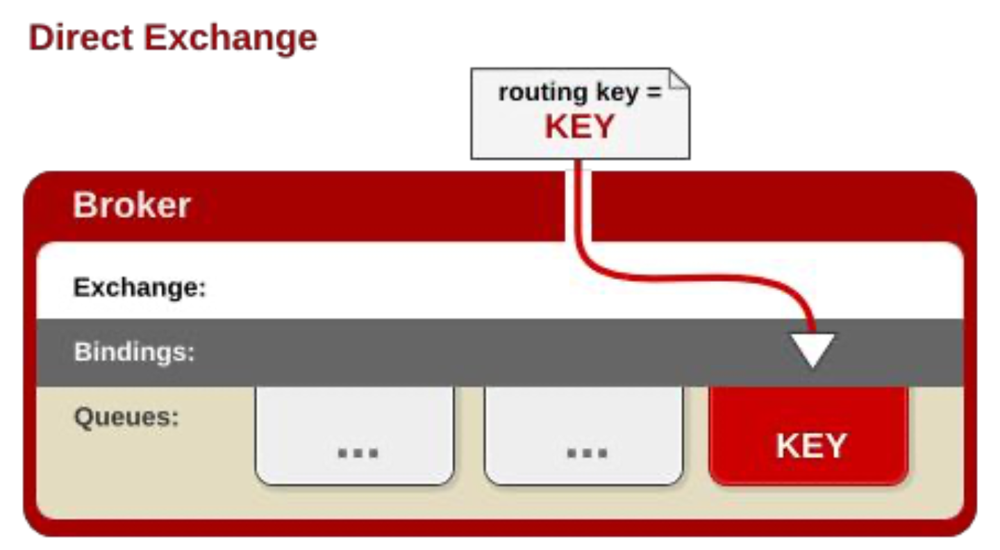

# 购物车业务

vue打包完的静态资源都放在了/mydata/nginx/html/static/cart目录下，nginx根据请求的域名来路由

购物车有两个页面，列表页和添加商品成功页

## 游客购物车**/**离线购物车**/**临时购物车

用户可以在未登录状态下将商品添加到购物车

放入 **redis**(采用) 浏览器即使关闭，下次进入，临时购物车数据都在

购物车是一个读多写多的场景，因此放入数据库并不合适，但购物车又是需要持久化，因此这里我们选用redis存储购物车数据。

## 用户购物车**/**在线购物车

放入 **redis**(采用) 登录以后，会将临时购物车的数据全部合并过来，并清空临时购物车

购物车是一个读多写多的场景，因此放入数据库并不合适，但购物车又是需要持久化，因此这里我们选用redis存储购物车数据。

## 购物车功能

- 用户可以使用购物车一起结算下单
- 给购物车添加商品
- 用户可以查询自己的购物车
- 用户可以在购物车中修改购买商品的数量。 - 用户可以在购物车中删除商品
- 选中不选中商品
- 在购物车中展示商品优惠信息
- 提示购物车商品价格变化

## 数据模型分析

### 购物车项


```java
public class CartItemVo {
    private Long skuId;
    //是否选中
    private Boolean check = true;
    //标题
    private String title;
    //图片
    private String image;
    //商品套餐属性
    private List<String> skuAttrValues;
    //价格
    private BigDecimal price;
    //数量
    private Integer count;
    //总价
    private BigDecimal totalPrice;
    /**
     * 当前购物车项总价等于单价x数量
     * @return
     */
    public BigDecimal getTotalPrice() {
        return price.multiply(new BigDecimal(count));
    }
    public void setTotalPrice(BigDecimal totalPrice) {
        this.totalPrice = totalPrice;
    }
}
```


### 购物车


```java
public class CartVo {
    /**
     * 购物车子项信息
     */
    List<CartItemVo> items;
    /**
     * 商品数量
     */
    private Integer countNum;
    /**
     * 商品类型数量
     */
    private Integer countType;
    /**
     * 商品总价
     */
    private BigDecimal totalAmount;
    /**
     * 减免价格
     */
    private BigDecimal reduce = new BigDecimal("0.00");
    public List<CartItemVo> getItems() {
        return items;
    }
    public void setItems(List<CartItemVo> items) {
        this.items = items;
    }
    //总数量=遍历每个购物项总和
    public Integer getCountNum() {
        int count=0;
        if (items != null && items.size() > 0) {
            for (CartItemVo item : items) {
                count += item.getCount();
            }
        }
        return count;
    }
    public void setCountNum(Integer countNum) {
        this.countNum = countNum;
    }
    //商品类型数量=遍历所有商品类型和
    public Integer getCountType() {
        int count=0;
        if (items != null && items.size() > 0) {
            for (CartItemVo item : items) {
                count += 1;
            }
        }
        return count;
    }
    public void setCountType(Integer countType) {
        this.countType = countType;
    }
    //总价为单个购物项总价-优惠
    public BigDecimal getTotalAmount() {
        BigDecimal total = new BigDecimal(0);
        if (items != null && items.size() > 0) {
            for (CartItemVo item : items) {
                total.add(item.getTotalPrice());
            }
        }
        total.subtract(reduce);
        return total;
    }
    public void setTotalAmount(BigDecimal totalAmount) {
        this.totalAmount = totalAmount;
    }
    public BigDecimal getReduce() {
        return reduce;
    }
    public void setReduce(BigDecimal reduce) {
        this.reduce = reduce;
    }
}
```

一个购物车是由各个购物项组成的，但是我们用`List`进行存储并不合适，因为使用`List`查找某个购物项时需要挨个遍历每个购物项，会造成大量时间损耗，为保证查找速度，我们使用`hash`进行存储

因此每一个购物项信息，都是一个对象，基本字段包括:

```json
{
	skuId: 2131241,
	check: true,
	title: "Apple iphone.....",
  defaultImage: "...",
  price: 4999,
	count: 1,
	totalPrice: 4999,
  skuSaleVO: {...} // 销售属性
}
```

Redis 有 5 种不同数据结构，这里选择哪一种比较合适呢?Map<String, List<String>>

\- 首先不同用户应该有独立的购物车，因此购物车应该以用户的作为 key 来存储，Value 是 用户的所有购物车信息。这样看来基本的`k-v`结构就可以了。
 \- 但是，我们对购物车中的商品进行增、删、改操作，基本都需要根据商品 id 进行判断， 为了方便后期处理，我们的购物车也应该是`k-v`结构，key 是商品 id，value 才是这个商品的 购物车信息。

综上所述，我们的购物车结构是一个双层 Map:  Map<String,Map<String,String>>

- 第一层 Map，Key 是用户 id

- 第二层 Map，Key 是购物车中商品 id，值是购物项数据


## ThreadLocal用户身份鉴别

### 用户身份鉴别方式

参考京东，在点击购物车时，会为临时用户生成一个`name`为`user-key`的`cookie`临时标识，过期时间为一个月，如果手动清除`user-key`，那么临时购物车的购物项也被清除，所以`user-key`是用来标识和存储临时购物车数据的

user-key 是随机生成的 id，不管有没有登录都会有这个 cookie 信息


### 使用ThreadLocal进行用户身份鉴别信息传递


- 在调用购物车的接口前，先通过session信息判断是否登录，并分别进行用户身份信息的封装，并把`user-key`放在cookie中
- 这个功能使用拦截器进行完成

```java
/**
 * 请求拦截器
 * 在执行目标方法之前，判断用户的登录状态。并封装传递(用户信息)给controller
 * @author gaoweilin
 * @date 2022/05/05 Thu 3:10 AM
 */
public class CartInterceptor implements HandlerInterceptor {
    /**
     * 整条调用链条线程的local变量存入拦截器已经封装好的用户信息
     */
    public static ThreadLocal<UserInfoTO> threadLocal = new ThreadLocal<>();

    /**
     * 业务执行前逻辑
     * @param request
     * @param response
     * @param handler
     * @return
     * @throws Exception
     */
    @Override
    public boolean preHandle(HttpServletRequest request,
                             HttpServletResponse response,
                             Object handler) throws Exception {
        // 1. 在请求前拦截，封装用户信息（无论登录与否）
        UserInfoTO userInfoTO = new UserInfoTO();
        HttpSession session = request.getSession();
        Object memberTO = session.getAttribute(AuthServerConstant.LOGIN_USER);
        if (memberTO != null) {
            // 用户登陆了
            MemberTO loginUser = JSON.parseObject(JSON.toJSONString(memberTO), MemberTO.class);
            userInfoTO.setUserId(loginUser.getId());
        }

        // 2. 检查cookies里有没有临时用户userKey
        Cookie[] cookies = request.getCookies();
        if (cookies != null && cookies.length > 0) {
            for (Cookie cookie: cookies) {
                if (cookie.getName().equals(CartConstant.TEMP_USER_COOKIE_NAME)) {
                    userInfoTO.setUserKey(cookie.getValue());
                    // 只要已经有临时用户userkey了，tempUser字段就设置为true，这是为了临时用户userKey不要一直被持续更新
                    userInfoTO.setTempUser(true);
                }
            }
        }

        // 3. 无论有没有用户登录，都分配一个临时用户userKey
        if (StringUtils.isEmpty(userInfoTO.getUserKey())) {
            String userKey = UUID.randomUUID().toString();
            userInfoTO.setUserKey(userKey);
        }

        // 4. 将封装的用户信息放入threadlocal
        threadLocal.set(userInfoTO);
        return true;
    }

    /**
     * 业务执行后逻辑
     * @param request
     * @param response
     * @param handler
     * @param modelAndView
     * @throws Exception
     */
    @Override
    public void postHandle(HttpServletRequest request, HttpServletResponse response, Object handler, ModelAndView modelAndView) throws Exception {
        UserInfoTO userInfoTO = threadLocal.get();
        // 如果这是第一次分配临时用户，将分配的userkey写入cookie，过期时间为30天
        if (!userInfoTO.isTempUser()) {
            Cookie cookie = new Cookie(CartConstant.TEMP_USER_COOKIE_NAME, userInfoTO.getUserKey());
            cookie.setDomain(DomainConstant.COOKIE_DOMAIN);
            cookie.setDomain(DomainConstant.COOKIE_DOMAIN);
            cookie.setMaxAge(CartConstant.TEMP_USER_COOKIE_TIMEOUT);
            response.addCookie(cookie);
        }
    }
}

```

```
浏览器有一个cookie；user-key；标识用户身份，一个月后过期；
* 如果第一次使用jd的购物车功能，都会给一个临时的用户身份；
* 浏览器以后保存，每次访问都会带上这个cookie；
*
* 登录：session有
* 没登录：按照cookie里面带来user-key来做。
* 第一次：如果没有临时用户，帮忙创建一个临时用户。
```

## 新增【接口】添加商品到购物车

### 接口逻辑

新增商品:判断是否登录
 \- 是:则添加商品到后台 Redis 中，把 user 的唯一标识符作为 key。
 \- 否:则添加商品到后台 redis 中，使用随机生成的 user-key 作为 key


- 若当前商品已经存在购物车，只需增添数量
- 否则需要查询商品购物项所需信息，并添加新商品至购物车

```java
/**
     * 商品sku加入购物车
     * @param skuId
     * @param num
     * @return
     */
    @Override
    public CartItemVO addToCart(Long skuId, Integer num) throws ExecutionException, InterruptedException {
        // 1. 根据userId来获取用户购物车，或者根据userKey获取离线购物车
        BoundHashOperations<String, Object, Object> cartOp = getCartOp();

        // 2. 获取到购物车后，查找购物车中有没有skuId对应的商品，购物车的数据结构为hash，key为skuId
        String jsonStr = (String) cartOp.get(skuId.toString());
        if (StringUtils.isEmpty(jsonStr)) {
            // 2.1 如果没有，异步查询sku的需要相关信息，存入redis
            CartItemVO cartItem = new CartItemVO();

            // 2.1.1 RPC调用商品服务查询skuInfo基本信息
            CompletableFuture<Void> getSkuInfoTask = CompletableFuture.runAsync(() -> {
                CommonResponse resp = CommonResponse.convertToResp(productRpcService.getSkuInfo(skuId));
                SkuInfoTO data = resp.getData(new TypeReference<SkuInfoTO>() {
                });
                cartItem.setSkuId(data.getSkuId());
                cartItem.setCheck(true);
                cartItem.setTitle(data.getSkuTitle());
                cartItem.setImage(data.getSkuDefaultImg());
                cartItem.setPrice(data.getPrice());
                cartItem.setCount(num);
            }, executor);

            // 2.1.2 RPC调用商品服务查询sku的销售属性
            CompletableFuture<Void> getSkuSaleAttrsWithValueTask = CompletableFuture.runAsync(() -> {
                CommonResponse resp = CommonResponse.convertToResp(productRpcService.getSkuSaleAttrsWithValue(skuId));
                List<String> data = resp.getData(new TypeReference<List<String>>() {
                });
                cartItem.setSkuAttr(data);
            }, executor);

            // 2.1.3 等异步操作都结束后将购物车项放入redis
            CompletableFuture.allOf(getSkuInfoTask, getSkuSaleAttrsWithValueTask).get();
            cartOp.put(skuId.toString(), JSON.toJSONString(cartItem));

            return cartItem;
        } else {
            // 2.2 如果有，将查找到的这项商品购物车项中数量累加一下，继续放入redis中
            CartItemVO cartItem = JSON.parseObject(jsonStr, CartItemVO.class);
            cartItem.setCount(cartItem.getCount() + num);
            cartOp.put(skuId.toString(), JSON.toJSONString(cartItem));
            return cartItem;
        }
    }

    /**
     * 获取当前要操作购物车的redis操作
     * 优先获取操作在线购物车，没有用户登陆了才获取操作离线购物车
     */
    private BoundHashOperations<String, Object, Object> getCartOp() {
        UserInfoTO userInfoTO = CartInterceptor.threadLocal.get();
        String cartKey = "";
        if (userInfoTO.getUserId() != null) {
            // 有用户登陆, 要获取在线购物车，key为eshopblvd:cart:{userId}
            cartKey = CartConstant.CART_PREFIX + userInfoTO.getUserId();
        } else {
            // 有用户登陆, 要获取离线购物车，key为eshopblvd:cart:{userKey}
            cartKey = CartConstant.CART_PREFIX + userInfoTO.getUserKey();
        }
        BoundHashOperations<String, Object, Object> operations = redisTemplate.boundHashOps(cartKey);
        return operations;
    }
```

## 新增【接口】获取整个购物车

查询购物车列表:判断是否登录

- 否:直接根据 user-key 查询 redis 中数据并展示
- 是:已登录，则需要先根据 user-key 查询 redis 是否有数据
  - 有:需要提交到后台添加到 redis，合并数据，而后查询
  - 否:直接去后台查询 redis，而后返回


```java
   /**
     * 获取当前购物车（在线/离线）
     * @return
     */
    @Override
    public CartVO getCart() throws ExecutionException, InterruptedException {
        CartVO cart = new CartVO();
        UserInfoTO userInfoTO = CartInterceptor.threadLocal.get();
        if (userInfoTO.getUserId() != null) {
            // 1. 有用户登录了，就将合并临时购物车（如果有），然后删除临时购物车
            // 用户购物车key
            String userCartKey = CartConstant.CART_PREFIX + userInfoTO.getUserId();
            // 临时购物车key
            String tempCartKey = CartConstant.CART_PREFIX + userInfoTO.getUserKey();
            // 获取临时购物车
            List<CartItemVO> tempCartItems = getCartItems(tempCartKey);
            if (tempCartItems != null) {
                // 临时购物车有数据，需要合并
                for (CartItemVO item: tempCartItems) {
                    // 优先加入用户购物车，目前有用户登陆，所以肯定加进用户购物车了
                    addToCart(item.getSkuId(), item.getCount());
                }
                // 删掉临时购物车
                redisTemplate.delete(tempCartKey);
            }
            // 最后获取用户购物车的所有购物项
            List<CartItemVO> cartItems = getCartItems(userCartKey);
            cart.setItems(cartItems);
        } else {
            // 2. 没有用户登陆
            // 直接获取临时购物车就好
            String tempCartKey = CartConstant.CART_PREFIX + userInfoTO.getUserKey();
            List<CartItemVO> cartItems = getCartItems(tempCartKey);
            cart.setItems(cartItems);
        }
        return cart;
    }
```

## 新增【接口】切换购物项的选中态

```java
 @Override
    public void checkCartItem(Long skuId, Boolean checked) {
        BoundHashOperations<String, Object, Object> cartOp = getCartOp();
        // 获取目标购物项
        String jsonStr = (String) cartOp.get(skuId.toString());
        CartItemVO cartItem = JSON.parseObject(jsonStr, CartItemVO.class);
        // 改变其选中状态，更新redis
        cartItem.setCheck(checked);
        cartOp.put(skuId.toString(), JSON.toJSONString(cartItem));
    }
```

## 新增【接口】选中购物车项

```java
@RequestMapping("/checkCart")
public String checkCart(@RequestParam("isChecked") Integer isChecked,@RequestParam("skuId")Long skuId) {
    cartService.checkCart(skuId, isChecked);
    return "redirect:http://cart.gulimall.com/cart.html";
}

//修改skuId对应购物车项的选中状态
@Override
public void checkCart(Long skuId, Integer isChecked) {
    BoundHashOperations<String, Object, Object> ops = getCartItemOps();
    String cartJson = (String) ops.get(skuId.toString());
    CartItemVo cartItemVo = JSON.parseObject(cartJson, CartItemVo.class);
    cartItemVo.setCheck(isChecked==1);
    ops.put(skuId.toString(),JSON.toJSONString(cartItemVo));
}
```

## 新增【接口】修改购物项数量

```java
@RequestMapping("/countItem")
public String changeItemCount(@RequestParam("skuId") Long skuId, @RequestParam("num") Integer num) {
    cartService.changeItemCount(skuId, num);
    return "redirect:http://cart.gulimall.com/cart.html";
}

@Override
public void changeItemCount(Long skuId, Integer num) {
    BoundHashOperations<String, Object, Object> ops = getCartItemOps();
    String cartJson = (String) ops.get(skuId.toString());
    CartItemVo cartItemVo = JSON.parseObject(cartJson, CartItemVo.class);
    cartItemVo.setCount(num);
    ops.put(skuId.toString(),JSON.toJSONString(cartItemVo));
}
```

## 新增【接口】删除购物车项

```java
@RequestMapping("/deleteItem")
public String deleteItem(@RequestParam("skuId") Long skuId) {
    cartService.deleteItem(skuId);
    return "redirect:http://cart.gulimall.com/cart.html";
}

@Override
public void deleteItem(Long skuId) {
    BoundHashOperations<String, Object, Object> ops = getCartItemOps();
    ops.delete(skuId.toString());
}
```

# 消息队列

## 应用场景

### 异步处理

用户注册操作和消息处理并行，提高响应速度


### 应用解耦

在下单时库存系统不能正常使用。也不影响正常下单，因为下单后，订单系统写入消息队列就不再关心其他的后续操作了。实现订单系统与库存系统的应用解耦


### 流量削峰

用户的请求，服务器接收后，首先写入消息队列。假如消息队列长度超过最大数量，则直接抛弃用户请求或跳转到错误页面

秒杀业务根据消息队列中的请求信息，再做后续处理


## 核心概念

大多应用中，可通过消息服务中间件来提升系统异步通信、扩展解耦能力

### 消息代理(message broker)

消息队列服务器实体，代理我们发送/接收消息

### 目的地(destination)

当消息发送者发送消息以后，将由消息代理接管，消息代理保证消息传递到指定目的地

消息队列主要有两种形式的目的地

- 队列(queue):点对点消息通信(point-to-point)
  - 消息发送者发送消息，消息代理将其放入一个队列中，消息接收者从队列中获取消息内容，消息读取后被移出队列
  - 消息只有唯一的发送者和接受者（最终拿到消息的），但并不是说只能有一个接收者（允许很多服务同时来监听）

- 主题(topic):发布(publish)/订阅(subscribe)消息通信
  - 发送者(发布者)发送消息到主题，多个接收者(订阅者)监听(订阅)这个主题，那么就会在消息到达时同时收到消息（多人监听，多人收到消息）

## 规范和协议

- JMS（Java Message Service）JAVA消息服务
  - 基于JVM消息代理的规范。ActiveMQ、HornetMQ是JMS实现
- AMQP（Advanced Message Queuing Protocol）
  - 高级消息队列协议，也是一个消息代理的规范，兼容JMS
  - RabbitMQ是AMQP的实现


## Spring支持

**spring-jms** 提供了对JMS的支持

**spring-rabbit**提供了对AMQP的支持

需要**ConnectionFactory**的实现来连接消息代理

提供**JmsTemplate**、**RabbitTemplate**来发送消息

**@JmsListener**(**JMS**)、**@RabbitListener**(**AMQP**)注解在方法上监听消息 代理发布的消息

**@EnableJms**、**@EnableRabbit**开启支持

## Spring Boot自动配置

Spring Boot自动配置 **JmsAutoConfiguration RabbitAutoConfiguration**

## 市面的MQ产品

**ActiveMQ**、**RabbitMQ**、**RocketMQ**、**Kafka**

# RabbitMQ

## 核心概念


- **Message**
  - 消息，消息是不具名的，它由消息头和消息体组成
  - 消息头，包括routing-key（路由键）、priority（相对于其他消息的优先权）、delivery-mode（指出该消息可能需要持久性存储）等
- Publisher
  - 消息的生产者，也是一个向交换器发布消息的客户端应用程序
- **Exchange**
  - 交换器，将生产者消息路由给服务器中的队列
  - 类型有direct(默认)，fanout, topic, 和headers，不同类型的Exchange转发消息的策略有所区别
- **Queue**
  - 消息队列，用来保存消息直到发送给消费者。它是消息的容器，也是消息的终点。一个消息可投入一个或多个队列。消息一直在队列里面，等待消费者连接到这个队列将其取走。
- **Binding**
  - 绑定，用于消息队列和交换器之间的关联
  - 一个绑定就是基于路由键将交换器和消息队列连接起来的路由规则，所以可以将交换器理解成一个由绑定构成的路由表。
  - Exchange 和Queue的绑定可以是多对多的关系
- Connection
  - 网络连接，比如一个TCP连接，一个客户端建立一条长连接
- Channel
  - 信道，多路复用连接中的一条独立的双向数据流通道。信道是建立在真实的TCP连接内的虚拟连接，AMQP 命令都是通过信道 发出去的，不管是发布消息、订阅队列还是接收消息，这些动作都是通过信道完成。因为对于操作系统来说建立和销毁 TCP 都 是非常昂贵的开销，所以引入了信道的概念，以复用一条 TCP 连接，一个客户端建立一条连接，一条连接里可以用多条信道，在信道里传输数据
- Consumer
  - 消息的消费者，表示一个从消息队列中取得消息的客户端应用程序
- Virtual Host
  - 虚拟主机，表示一批交换器、消息队列和相关对象。
  - 虚拟主机是共享相同的身份认证和加 密环境的独立服务器域。每个 vhost 本质上就是一个 mini 版的 RabbitMQ 服务器，拥 有自己的队列、交换器、绑定和权限机制
  - vhost 是 AMQP 概念的基础，必须在连接时指定
  - RabbitMQ 默认的 vhost 是 /
- Broker
  - 消息队列服务器实体


## Docker安装RabbitMQ

```shell
docker run -d --name rabbitmq -p 5671:5671 -p 5672:5672 -p 4369:4369 -p 25672:25672 -p 15671:15671 -p 15672:15672 rabbitmq:management

docker update rabbitmq --restart=always
```

在15672端口访问其管理系统

## 运行机制


### AMQP 中的消息路由

AMQP 中消息的路由过程和 Java 开 发者熟悉的 JMS 存在一些差别， AMQP 中增加了 **Exchange** 和 **Binding** 的角色。生产者把消息发布 到 Exchange 上，消息最终到达队列 并被消费者接收，而 Binding 决定交 换器的消息应该发送到那个队列

### **Exchange 类型**

**Exchange**分发消息时根据类型的不同分发策略有区别，目前共四种类型:**direct**、fanout、**topic**、**headers** 。headers 匹配 AMQP 消息的 header 而不是路由键， headers 交换器和 direct 交换器完全一致，但性能差很多，目前几乎用不到了，所以直接 看另外三种类型

#### Direct Exchange

点对点模式：消息中的路由键(routing key)如果和 Binding 中的 binding key 一致， 交换器 就将消息发到对应的队列中。路由键与队 列名完全匹配，如果一个队列绑定到交换 机要求路由键为“dog”，则只转发 routing key 标记为“dog”的消息，不会转发 “dog.puppy”，也不会转发“dog.guard” 等等。它是完全匹配、单播的模式



#### Fanout Exchange

发布-订阅广播模式：每个发到 fanout 类型交换器的消息都 会分到所有绑定的队列上去。fanout 交 换器不处理路由键，只是简单的将队列 绑定到交换器上，每个发送到交换器的 消息都会被转发到与该交换器绑定的所 有队列上。很像子网广播，每台子网内 的主机都获得了一份复制的消息。 fanout 类型转发消息是最快的


#### Topic Exchange

发布-订阅模式：topic 交换器通过模式匹配分配消息的 路由键属性，将路由键和某个模式进行 匹配，此时队列需要绑定到一个模式上。 它将路由键和绑定键的字符串切分成单 词，这些**单词之间用点隔开**。它同样也 会识别两个通配符:符号“#”和符号 “*”。*#*匹配*0个或多个单词，*匹配一 个单词


### 实例


## Springboot整合RabbitMQ

1. 订单服务**引入** spring-boot-starter-amqp

   ```xml
   <dependency>
   		<groupId>org.springframework.boot</groupId>
   		<artifactId>spring-boot-starter-amqp</artifactId>
   </dependency>
   ```

引入amqp场景；RabbitAutoConfiguration 就会自动生效

给容器中自动配置了RabbitTemplate、AmqpAdmin、CachingConnectionFactory、RabbitMessagingTemplate

2. 配置文件

   所有的属性都是 spring.rabbitmq

   @ConfigurationProperties(prefix = "spring.rabbitmq")

```properties
# 指定rebbitmq服务器主机
spring.rabbitmq.host=192.168.31.162
#spring.rabbitmq.username=guest  默认值为guest
#spring.rabbitmq.password=guest	 默认值为guest
```

3. 加入注解开启功能 

   ```java
   @EnableRabbit
   ```

## AmqpAdmin管理组件的使用

### Exchange创建

```java
		@Autowired
    AmqpAdmin amqpAdmin;
		/**
     * 1、如何创建Exchange[hello-java-exchange]、Queue、Binding
     * 1）、使用 AmqpAdmin 进行创建
     * 2、如何收发消息
     */
    @Test
    public void createExchange() {
        //amqpAdmin
        //Exchange
        /**
         * DirectExchange(String name, boolean durable, boolean autoDelete, Map<String, Object> arguments)
         */
        DirectExchange directExchange = new DirectExchange("hello-java-exchange", true, false);
        amqpAdmin.declareExchange(directExchange);
        log.info("Exchange[{}]创建成功", "hello-java-exchange");
    }
```

### 队列创建

```java
    @Test
    public void createQueue() {
        //public Queue(String name, boolean durable, boolean exclusive, boolean autoDelete, Map<String, Object> arguments)
        Queue queue = new Queue("hello-java-queue", true, false, false);
        amqpAdmin.declareQueue(queue);
        log.info("Queue[{}]创建成功", "hello-java-queue");
    }
```

### Binding创建

```java
		@Test
    public void createBinding() {
        //(String destination【目的地】,
        // DestinationType destinationType【目的地类型】,
        // String exchange【交换机】,
        // String routingKey【路由键】,
        //Map<String, Object> arguments【自定义参数】)
        //将exchange指定的交换机和destination目的地进行绑定，使用routingKey作为指定的路由键
        Binding binding = new Binding("hello-java-queue",
                Binding.DestinationType.QUEUE,
                "hello-java-exchange",
                "hello.java", null);
        amqpAdmin.declareBinding(binding);
        log.info("Binding[{}]创建成功", "hello-java-binding");
    }
```

## rabbitTemplate消息发送处理组件的使用

默认的消息转化器是SimpleMessageConverter，对于对象以jdk序列化方式存储，若要以Json方式存储对象，就要自定义消息转换器

```java
@Configuration
public class AmqpConfig {
    @Bean
    public MessageConverter messageConverter() {
        //在容器中导入Json的消息转换器
        return new Jackson2JsonMessageConverter();
    }
}
```

```java
		@Autowired
    RabbitTemplate rabbitTemplate;

    @Test
    public void sendMessageTest() {

        //1、发送消息，如果发送的消息是个对象，我们会使用序列化机制，将对象写出去。对象必须实现Serializable
        String msg = "Hello World!";

        //2、发送的对象类型的消息，可以转成一个json
        for (int i=0;i<10;i++){
            if(i%2 == 0){
                OrderReturnReasonEntity reasonEntity = new OrderReturnReasonEntity();
                reasonEntity.setId(1L);
                reasonEntity.setCreateTime(new Date());
                reasonEntity.setName("哈哈-"+i);
                rabbitTemplate.convertAndSend("hello-java-exchange", "hello.java", reasonEntity,new CorrelationData(UUID.randomUUID().toString()));
            }else {
                OrderEntity entity = new OrderEntity();
                entity.setOrderSn(UUID.randomUUID().toString());
                rabbitTemplate.convertAndSend("hello-java-exchange", "hello.java", entity,new CorrelationData(UUID.randomUUID().toString()));
            }
            log.info("消息发送完成{}");
        }


    }
```

## @RabbitListener 监听消息

监听消息的方法可以有三种参数(不分数量，顺序)

• Object content, Message message, Channel channel

监听消息：使用@RabbitListener；必须有@EnableRabbit
*    @RabbitListener: 类+方法上（监听哪些队列即可）
*    @RabbitHandler：标在方法上（重载区分不同的消息）

- 在回调方法上标注@RabbitListener注解，并设置其属性queues，注册监听队列，当该队列收到消息时，标注方法遍会调用
- 可分别使用Message和保存消息所属对象进行消息接收，若使用Object对象进行消息接收，实际上接收到的也是Message
- 如果知道接收的消息是何种类型的对象，可在方法参数中直接加上该类型参数，也可接收到

```java
@Service
public class BookService {
    @RabbitListener(queues = {"admin.test"})
    public void receive1(Book book){
        System.out.println("收到消息："+book);
    }

    @RabbitListener(queues = {"admin.test"})
    public void receive1(Object object){
        System.out.println("收到消息："+object.getClass());
        //收到消息：class org.springframework.amqp.core.Message
    }
    
    @RabbitListener(queues = {"admin.test"})
    public void receive2(Message message){
        System.out.println("收到消息"+message.getHeaders()+"---"+message.getPayload());
    }
    
    @RabbitListener(queues = {"admin.test"})
    public void receive3(Message message,Book book){
        System.out.println("3收到消息：book:"+book.getClass()+"\n" +
                "message:"+message.getClass());
        //3收到消息：book:class cn.edu.ustc.springboot.bean.Book
		//message: class org.springframework.amqp.core.Message
    }
}
```

- 若消息中含有不同的对象，可以使用`@RabbitHandler`进行分别接收

```java
@RabbitListener(queues = {"admin.test"})
@Service
public class BookService {

    @RabbitHandler
    public void receive4(Book book){
        System.out.println("4收到消息：book:" + book);
    }

    @RabbitHandler
    public void receive5(Student student){
        System.out.println("5收到消息：student:" + student);
    }
```

```java
@RabbitListener(queues = {"hello-java-queue"})
@Service("orderItemService")
public class OrderItemServiceImpl extends ServiceImpl<OrderItemDao, OrderItemEntity> implements OrderItemService {

    @Override
    public PageUtils queryPage(Map<String, Object> params) {
        IPage<OrderItemEntity> page = this.page(
                new Query<OrderItemEntity>().getPage(params),
                new QueryWrapper<OrderItemEntity>()
        );

        return new PageUtils(page);
    }

    /**
     * queues：声明需要监听的所有队列
     *
     * org.springframework.amqp.core.Message
     *
     * 参数可以写一下类型
     * 1、Message message：原生消息详细信息。头+体
     * 2、T<发送的消息的类型> OrderReturnReasonEntity content；
     * 3、Channel channel：当前传输数据的通道
     *
     * Queue：可以很多人都来监听。只要收到消息，队列删除消息，而且只能有一个收到此消息
     * 场景：
     *    1）、订单服务启动多个；同一个消息，只能有一个客户端收到
     *    2)、 只有一个消息完全处理完，方法运行结束，我们就可以接收到下一个消息
     */
//    @RabbitListener(queues = {"hello-java-queue"})
    @RabbitHandler
    public void recieveMessage(Message message,
                               OrderReturnReasonEntity content,
                               Channel channel) throws InterruptedException {
        //{"id":1,"name":"哈哈","sort":null,"status":null,"createTime":1581144531744}
        System.out.println("接收到消息..."+content);
        byte[] body = message.getBody();
        //消息头属性信息
        MessageProperties properties = message.getMessageProperties();
//        Thread.sleep(3000);
        System.out.println("消息处理完成=>"+content.getName());
        //channel内按顺序自增的。
        long deliveryTag = message.getMessageProperties().getDeliveryTag();
        System.out.println("deliveryTag==>"+deliveryTag);

        //签收货物,非批量模式
        try {
            if(deliveryTag%2 == 0){
                //收货
                channel.basicAck(deliveryTag,false);
                System.out.println("签收了货物..."+deliveryTag);
            }else {
                //退货 requeue=false 丢弃  requeue=true 发回服务器，服务器重新入队。
                //long deliveryTag, boolean multiple, boolean requeue
                //签收了货物...6
                channel.basicNack(deliveryTag,false,true);
                //long deliveryTag, boolean requeue
//                channel.basicReject();
                System.out.println("没有签收了货物..."+deliveryTag);
            }

        }catch (Exception e){
            //网络中断
        }

    }

    @RabbitHandler
    public void recieveMessage2(OrderEntity content) throws InterruptedException {
        //{"id":1,"name":"哈哈","sort":null,"status":null,"createTime":1581144531744}
        System.out.println("接收到消息..."+content);
    }

}
```

## RabbitMQ消息确认机制-可靠抵达

- 保证消息不丢失，可靠抵达，可以使用事务消息，性能下降250倍，为此引入确认机制
- **publisher** confirmCallback 确认模式
- **publisher** returnCallback 未投递到 queue 退回模式(失败时触发回调)
- **consumer** ack机制


### 可靠抵达-ConfirmCallback

```
1、服务器收到消息就回调
*      1、spring.rabbitmq.publisher-confirms=true
*      2、设置确认回调ConfirmCallback
```

spring.rabbitmq.publisher-confirms=true // 开启发送端确认 

- 在创建 connectionFactory 的时候设置 PublisherConfirms(true) 选项，开启 confirmcallback 
- CorrelationData:用来表示当前消息唯一性
- 消息只要被 broker 接收到就会执行 confirmCallback，如果是 cluster 模式，需要所有 broker 接收到才会调用 confirmCallback
- 被 broker 接收到只能表示 message 已经到达服务器，并不能保证消息一定会被投递 到目标 queue 里。所以需要用到接下来的 returnCallback 

定制RabbitTemplate的confirmcallback

`CorrelationData`为消息的唯一标识，在发送消息时进行构建

```java
@Configuration
public class AmqpConfig {

    @Autowired
    private RabbitTemplate rabbitTemplate;

    @Bean
    public MessageConverter messageConverter() {
        return new Jackson2JsonMessageConverter();
    }

    @PostConstruct  //此类创建完成后调用此方法
    public void initRabbitTemplate() {
        rabbitTemplate.setConfirmCallback(new RabbitTemplate.ConfirmCallback() {
            @Override
            public void confirm(CorrelationData correlationData, boolean ack, String cause) {
                System.out.println("confirm CorrelationData:"+correlationData+"===>ack:"+ack+"====>cause:"+cause);
            }
//confirm CorrelationData:CorrelationData [id=e3812ddd-f9c3-4f11-9510-d130a8d8f4d6]===>ack:true====>cause:null
//confirm CorrelationData:CorrelationData [id=d9560acc-f745-4a62-87cf-b6420d58706d]===>ack:true====>cause:null
//confirm CorrelationData:CorrelationData [id=4cf4a709-62ac-4966-afb9-90ec6c62a35b]===>ack:true====>cause:null

        });
    }
}
```

### 可靠抵达-ReturnCallback

```
2、消息正确抵达队列进行回调
*      1、 spring.rabbitmq.publisher-returns=true // 开启发送端抵达队列的确认
*          spring.rabbitmq.template.mandatory=true // 只要抵达队列，以异步发送优先回调
*      2、设置确认回调ReturnCallback
```

spring.rabbitmq.publisher-returns=true

spring.rabbitmq.template.mandatory=true

- confrim 模式只能保证消息到达 broker，不能保证消息准确投递到目标 queue 里。在有 些业务场景下，我们需要保证消息一定要投递到目标 queue 里，此时就需要用到 return 退回模式。

- 这样如果未能投递到目标 queue 里将调用 returnCallback ，可以记录下详细到投递数 据，定期的巡检或者自动纠错都需要这些数据

- 如果是 cluster 模式，只要有一个投递不成功也会调用 returnCallback

  // * 只要消息没有投递给指定的队列，就触发这个失败回调

```java
rabbitTemplate.setReturnCallback(new RabbitTemplate.ReturnCallback() {
    @Override
    public void returnedMessage(Message message, int replyCode, String replyText, String exchange, String routingKey) {
        System.out.println("return callback...message:"+message+"===>replycode:"+replyCode+"===>replyText:"+replyText+"===>exchange:"+exchange+"===>routingKey:"+routingKey);
    }
});
```

整个rabbitmq的配置

```java
@Configuration
public class MyRabbitConfig {
    RabbitTemplate rabbitTemplate;

    @Bean
    @Primary
    public RabbitTemplate rabbitTemplate(ConnectionFactory connectionFactory){
        RabbitTemplate rabbitTemplate = new RabbitTemplate(connectionFactory);
        this.rabbitTemplate = rabbitTemplate;
        rabbitTemplate.setMessageConverter(messageConverter());
        initRabbitTemplate();
        return rabbitTemplate;
    }

    @Bean
    public MessageConverter messageConverter() {
        //在容器中导入Json的消息转换器
        return new Jackson2JsonMessageConverter();
    }

    public void initRabbitTemplate(){
        //设置确认回调
        rabbitTemplate.setConfirmCallback(new RabbitTemplate.ConfirmCallback() {
            /**
             * 只要消息抵达Broker就ack=true
             * @param correlationData 当前消息的唯一关联数据（这个是消息的唯一id）
             * @param ack  消息是否成功收到
             * @param cause 失败的原因
             */
            @Override
            public void confirm(CorrelationData correlationData, boolean ack, String cause) {
                /**
                 * 1、做好消息确认机制（pulisher，consumer【手动ack】）
                 * 2、每一个发送的消息都在数据库做好记录。定期将失败的消息再次发送一遍
                 */
                //服务器收到了
                //修改消息的状态
                System.out.println("confirm...correlationData["+correlationData+"]==>ack["+ack+"]==>cause["+cause+"]");
            }
        });
        //设置消息抵达队列的确认回调
        rabbitTemplate.setReturnCallback(new RabbitTemplate.ReturnCallback() {
            /**
             * 只要消息没有投递给指定的队列，就触发这个失败回调
             * @param message   投递失败的消息详细信息
             * @param replyCode 回复的状态码
             * @param replyText 回复的文本内容
             * @param exchange  当时这个消息发给哪个交换机
             * @param routingKey 当时这个消息用哪个路由键
             */
            @Override
            public void returnedMessage(Message message, int replyCode, String replyText, String exchange, String routingKey) {
                //报错误了。修改数据库当前消息的状态->错误。
                System.out.println("Fail Message["+message+"]==>replyCode["+replyCode+"]==>replyText["+replyText+"]===>exchange["+exchange+"]===>routingKey["+routingKey+"]");
            }
        });
    }
}

```

### 可靠抵达-消费端确认Ack机制

消费端确认（保证每个消息被正确消费，此时才可以broker删除这个消息）

- 消费者获取到消息，成功处理，可以回复Ack给Broker
  - basic.ack用于肯定确认;broker将移除此消息
  - basic.nack用于否定确认;可以指定broker是否丢弃此消息，可以批量
  - basic.reject用于否定确认;同上，但不能批量

- 默认自动ack，消息被消费者收到，就会从broker的queue中移除
- queue无消费者，消息依然会被存储，直到消费者消费
- 消费者收到消息，默认会自动ack。但是如果无法确定此消息是否被处理完成，或者成功处理。我们可以开启手动ack模式
  - 消息处理成功，ack()，接受下一个消息，此消息broker就会移除
  - 消息处理失败，nack()/reject()，重新发送给其他人进行处理，或者容错处理后ack
  - 消息一直没有调用ack/nack方法，broker认为此消息正在被处理，不会投递给别人，此时客户 端断开，消息不会被broker移除，会投递给别人

```
1、默认是自动确认的，只要消息接收到，客户端会自动确认，服务端就会移除这个消息

问题：
我们收到很多消息，自动回复给服务器ack，只有一个消息处理成功，宕机了。就会发生消息丢失；
消费者手动确认模式。只要我们没有明确告诉MQ，货物被签收。没有Ack，
消息就一直是unacked状态。即使Consumer宕机。消息不会丢失，会重新变为Ready，下一次有新的Consumer连接进来就发给他

spring.rabbitmq.listener.simple.acknowledge-mode=manual 手动签收

2、如何签收:
channel.basicAck(deliveryTag,false);签收；业务成功完成就应该签收
channel.basicNack(deliveryTag,false,true);拒签；业务失败，拒签
```

在默认情况下，消息如果消费到一半，服务器宕机，剩下的消息就会默认全部确认，会造成消息丢失，因此需要引入手动确认模式

```properties
# 消费端手动ack消息
spring.rabbitmq.listener.simple.acknowledge-mode=manual
```

只要没有明确通知服务器ack，消息就不会确认收货，可以通过`basicAck()`进行确认收货

```java
@RabbitHandler
public void receive4(Book book, Message message,Channel channel) throws IOException {
    try {
        Thread.sleep(100);
    } catch (InterruptedException e) {
        e.printStackTrace();
    }
    System.out.println("4收到消息：book:" + book);
    //deliveryTag在通道内按顺序自增
    long deliveryTag = message.getMessageProperties().getDeliveryTag();
    System.out.println(deliveryTag);
    //通过deliveryTag进行确认，false表示不批量确认
    channel.basicAck(deliveryTag,false);
}
```

此外还可以使用`basicNack()`和`basicReject()`进行拒绝收货

# 订单服务

## Session登陆共享

订单生成 -> 支付订单 -> 卖家发货 -> 确认收货 -> 交易成功

搭建订单服务session共享环境

```xml
				<dependency>
            <groupId>org.springframework.boot</groupId>
            <artifactId>spring-boot-starter-data-redis</artifactId>
            <exclusions>
                <exclusion>
                    <groupId>io.lettuce</groupId>
                    <artifactId>lettuce-core</artifactId>
                </exclusion>
            </exclusions>
        </dependency>
        <dependency>
            <groupId>redis.clients</groupId>
            <artifactId>jedis</artifactId>
        </dependency>
				<dependency>
						<groupId>org.springframework.session</groupId>
						<artifactId>spring-session-data-redis</artifactId>
				</dependency>
```

```yaml
spring:
  redis:
    host: 47.103.8.41
    port: 6379
  session:
    store-type: redis
```

```java
@Configuration
public class SessionConfig {
    @Bean
    public CookieSerializer cookieSerializer(){
        DefaultCookieSerializer cookieSerializer = new DefaultCookieSerializer();

        cookieSerializer.setDomainName("eshopblvd.com");
        cookieSerializer.setCookieName("ESHOPBLVDSESSION");

        return cookieSerializer;
    }

    @Bean
    public RedisSerializer<Object> springSessionDefaultRedisSerializer() {
        return new GenericJackson2JsonRedisSerializer();
    }
}
```

```java
@EnableRedisHttpSession
```


## 订单的基本概念

电商系统涉及到 3 流，分别时信息流（商品信息、优惠信息），资金流（退款、付款），物流（发货、退货 ），而订单系统作为中枢将三者有机的集 合起来。 订单模块是电商系统的枢纽，在订单这个环节上需求获取多个模块的数据和信息，同时对这 些信息进行加工处理后流向下个环节，这一系列就构成了订单的信息流通

## 订单构成

#### 基本组成


#### 数据库结构


#### 用户信息

用户信息包括用户账号、用户等级、用户的收货地址、收货人、收货人电话等组成，用户账 户需要绑定手机号码，但是用户绑定的手机号码不一定是收货信息上的电话。用户可以添加 多个收货信息，用户等级信息可以用来和促销系统进行匹配，获取商品折扣，同时用户等级 还可以获取积分的奖励等

#### 订单基础信息

订单基础信息是订单流转的核心，其包括订单类型、父/子订单、订单编号、订单状态、订 单流转的时间等

1. 订单类型包括实体商品订单和虚拟订单商品等，这个根据商城商品和服务类型进行区 分。

2. 同时订单都需要做父子订单处理，之前在初创公司一直只有一个订单，没有做父子订 单处理后期需要进行拆单的时候就比较麻烦，尤其是多商户商场，和不同仓库商品的时候， 父子订单就是为后期做拆单准备的。 
3. 订单编号不多说了，需要强调的一点是父子订单都需要有订单编号，需要完善的时候 可以对订单编号的每个字段进行统一定义和诠释。
4. 订单状态记录订单每次流转过程，后面会对订单状态进行单独的说明。
5. 订单流转时间需要记录下单时间，支付时间，发货时间，结束时间/关闭时间等等

#### 商品信息

商品信息从商品库中获取商品的 SKU 信息、图片、名称、属性规格、商品单价、商户信息 等，从用户下单行为记录的用户下单数量，商品合计价格等。

#### 优惠信息 

优惠信息记录用户参与的优惠活动，包括优惠促销活动，比如满减、满赠、秒杀等，用户使 用的优惠券信息，优惠券满足条件的优惠券需要默认展示出来，具体方式已在之前的优惠券 篇章做过详细介绍，另外还虚拟币抵扣信息等进行记录。

为什么把优惠信息单独拿出来而不放在支付信息里面呢? 因为优惠信息只是记录用户使用的条目，而支付信息需要加入数据进行计算，所以做为区分。

#### 支付信息 

1. 支付流水单号，这个流水单号是在唤起网关支付后支付通道返回给电商业务平台的支 付流水号，财务通过订单号和流水单号与支付通道进行对账使用。
2. 支付方式用户使用的支付方式，比如微信支付、支付宝支付、钱包支付、快捷支付等。 支付方式有时候可能有两个——余额支付+第三方支付。
3. 商品总金额，每个商品加总后的金额;运费，物流产生的费用;优惠总金额，包括促 销活动的优惠金额，优惠券优惠金额，虚拟积分或者虚拟币抵扣的金额，会员折扣的金额等 之和;实付金额，用户实际需要付款的金额。

用户实付金额=商品总金额+运费-优惠总金额 

#### 物流信息

物流信息包括配送方式，物流公司，物流单号，物流状态，物流状态可以通过第三方接口来 获取和向用户展示物流每个状态节点。

## 订单状态

#### 待付款

用户提交订单后，订单进行预下单，目前主流电商网站都会唤起支付，便于用户快速完成支 付，需要注意的是待付款状态下可以对库存进行锁定，锁定库存需要配置支付超时时间，超 时后将自动取消订单，订单变更关闭状态。

#### 已付款**/**待发货

用户完成订单支付，订单系统需要记录支付时间，支付流水单号便于对账，订单下放到 WMS系统，仓库进行调拨，配货，分拣，出库等操作。

#### 待收货**/**已发货

仓储将商品出库后，订单进入物流环节，订单系统需要同步物流信息，便于用户实时知悉物 品物流状态

#### 已完成

用户确认收货后，订单交易完成。后续支付侧进行结算，如果订单存在问题进入售后状态

#### 已取消

付款之前取消订单。包括超时未付款或用户商户取消订单都会产生这种订单状态。

#### 售后中

用户在付款后申请退款，或商家发货后用户申请退换货

售后也同样存在各种状态，当发起售后申请后生成售后订单，售后订单状态为待审核，等待 商家审核，商家审核通过后订单状态变更为待退货，等待用户将商品寄回，商家收货后订单状态更新为待退款状态，退款到用户原账户后订单状态更新为售后成功。

## 订单流程

#### 订单流程概述

订单流程是指从订单产生到完成整个流转的过程，从而行程了一套标准流程规则。而不同的 产品类型或业务类型在系统中的流程会千差万别，比如上面提到的线上实物订单和虚拟订单 的流程，线上实物订单与 O2O 订单等，所以需要根据不同的类型进行构建订单流程。 不管类型如何订单都包括正向流程和逆向流程，对应的场景就是购买商品和退换货流程，正 向流程就是一个正常的网购步骤:订单生成–>支付订单–>卖家发货–>确认收货–>交易成功。 而每个步骤的背后，订单是如何在多系统之间交互流转 的，可概括如下图


#### 订单创建与支付

1. 订单创建前需要预览订单，选择收货信息等
2. 订单创建需要锁定库存，库存有才可创建，否则不能创建
3. 订单创建后超时未支付需要解锁库存
4. 支付成功后，需要进行拆单，根据商品打包方式，所在仓库，物流等进行拆单
5. 支付的每笔流水都需要记录，以待查账
6. 订单创建，支付成功等状态都需要给MQ发送消息，方便其他系统感知订阅

#### 逆向流程

1. 修改订单，用户没有提交订单，可以对订单一些信息进行修改，比如配送信息，优惠信息，及其他一些订单可修改范围的内容，此时只需对数据进行变更即可。
2. 订单取消，用户主动取消订单和用户超时未支付，两种情况下订单都会取消订 单，而超时情况是系统自动关闭订单，所以在订单支付的响应机制上面要做支付的限时处理，尤其是在前面说的下单减库存的情形下面，可以保证快速的释放库存。 另外需要需要处理的是促销优惠中使用的优惠券，权益等视平台规则，进行相应补 回给用户。
3. 退款，在待发货订单状态下取消订单时，分为缺货退款和用户申请退款。如果是 全部退款则订单更新为关闭状态，若只是做部分退款则订单仍需进行进行，同时生 成一条退款的售后订单，走退款流程。退款金额需原路返回用户的账户
4. 发货后的退款，发生在仓储货物配送，在配送过程中商品遗失，用户拒收，用户 收货后对商品不满意，这样情况下用户发起退款的售后诉求后，需要商户进行退款 的审核，双方达成一致后，系统更新退款状态，对订单进行退款操作，金额原路返 回用户的账户，同时关闭原订单数据。仅退款情况下暂不考虑仓库系统变化。如果 发生双方协调不一致情况下，可以申请平台客服介入。在退款订单商户不处理的情 况下，系统需要做限期判断，比如 5 天商户不处理，退款单自动变更同意退款。

## 订单登录拦截

因为订单系统必然涉及到用户信息，因此进入订单系统的请求必须是已经登录的，所以我们需要通过拦截器对未登录订单请求进行拦截

```java
@Component
public class LoginInterceptor implements HandlerInterceptor {
    public static ThreadLocal<MemberResponseVo> loginUser = new ThreadLocal<>();

    @Override
    public boolean preHandle(HttpServletRequest request, HttpServletResponse response, Object handler) throws Exception {
        HttpSession session = request.getSession();
        MemberResponseVo memberResponseVo = (MemberResponseVo) session.getAttribute(AuthServerConstant.LOGIN_USER);
        if (memberResponseVo != null) {
            loginUser.set(memberResponseVo);
            return true;
        }else {
            session.setAttribute("msg","请先登录");
            response.sendRedirect("http://auth.gulimall.com/login.html");
            return false;
        }
    }
}

@Configuration
public class GulimallWebConfig implements WebMvcConfigurer {
    @Override
    public void addInterceptors(InterceptorRegistry registry) {
        registry.addInterceptor(new LoginInterceptor()).addPathPatterns("/**");
    }
}
```

## 订单确认页（结算页）


可以发现订单结算页，包含以下信息:

1. 收货人信息:有更多地址，即有多个收货地址，其中有一个默认收货地址
2. 支付方式:货到付款、在线支付，不需要后台提供
3. 送货清单:配送方式(不做)及商品列表(根据购物车选中的 skuId 到数据库中查询)
4. 发票:不做
5. 优惠:查询用户领取的优惠券(不做)及可用积分(京豆)

### 新增【接口】获取订单确认页信息

#### 模型抽取


跳转到确认页时需要携带的数据模型

```java
public class OrderConfirmVo {

    @Getter
    @Setter
    /** 会员收获地址列表 **/
    private List<MemberAddressVo> memberAddressVos;

    @Getter @Setter
    /** 所有选中的购物项 **/
    private List<OrderItemVo> items;

    /** 发票记录 **/
    @Getter @Setter
    /** 优惠券（会员积分） **/
    private Integer integration;

    /** 防止重复提交的令牌 **/
    @Getter @Setter
    private String orderToken;

    @Getter @Setter
    Map<Long,Boolean> stocks;

    public Integer getCount() {
        Integer count = 0;
        if (items != null && items.size() > 0) {
            for (OrderItemVo item : items) {
                count += item.getCount();
            }
        }
        return count;
    }


    /** 订单总额 **/
    //BigDecimal total;
    //计算订单总额
    public BigDecimal getTotal() {
        BigDecimal totalNum = BigDecimal.ZERO;
        if (items != null && items.size() > 0) {
            for (OrderItemVo item : items) {
                //计算当前商品的总价格
                BigDecimal itemPrice = item.getPrice().multiply(new BigDecimal(item.getCount().toString()));
                //再计算全部商品的总价格
                totalNum = totalNum.add(itemPrice);
            }
        }
        return totalNum;
    }


    /** 应付价格 **/
    //BigDecimal payPrice;
    public BigDecimal getPayPrice() {
        return getTotal();
    }
}
```

#### 数据获取

- 查询购物项、库存和收货地址都要调用远程服务，串行会浪费大量时间，因此我们使用`CompletableFuture`进行异步编排
- 可能由于延迟，订单提交按钮可能被点击多次，为了防止重复提交的问题，我们在返回订单确认页时，在`redis`中生成一个随机的令牌，过期时间为30min，提交的订单会携带这个令牌，我们将会在订单提交的处理页面核验此令牌

```java
@RequestMapping("/toTrade")
public String toTrade(Model model) {
    OrderConfirmVo confirmVo = orderService.confirmOrder();
    model.addAttribute("confirmOrder", confirmVo);
    return "confirm";
}

 @Override
    public OrderConfirmVo confirmOrder() {
        MemberResponseVo memberResponseVo = LoginInterceptor.loginUser.get();
        OrderConfirmVo confirmVo = new OrderConfirmVo();
        RequestAttributes requestAttributes = RequestContextHolder.getRequestAttributes();
        CompletableFuture<Void> itemAndStockFuture = CompletableFuture.supplyAsync(() -> {
            RequestContextHolder.setRequestAttributes(requestAttributes);
            //1. 查出所有选中购物项
            List<OrderItemVo> checkedItems = cartFeignService.getCheckedItems();
            confirmVo.setItems(checkedItems);
            return checkedItems;
        }, executor).thenAcceptAsync((items) -> {
            //4. 库存
            List<Long> skuIds = items.stream().map(OrderItemVo::getSkuId).collect(Collectors.toList());
            //skuId为key,是否有库存为value
            Map<Long, Boolean> hasStockMap = wareFeignService.getSkuHasStocks(skuIds).stream().collect(Collectors.toMap(SkuHasStockVo::getSkuId, SkuHasStockVo::getHasStock));
            confirmVo.setStocks(hasStockMap);
        }, executor);

        //2. 查出所有收货地址
        CompletableFuture<Void> addressFuture = CompletableFuture.runAsync(() -> {
            List<MemberAddressVo> addressByUserId = memberFeignService.getAddressByUserId(memberResponseVo.getId());
            confirmVo.setMemberAddressVos(addressByUserId);
        }, executor);

        //3. 积分
        confirmVo.setIntegration(memberResponseVo.getIntegration());

        //5. 总价自动计算
        //6. 防重令牌
        String token = UUID.randomUUID().toString().replace("-", "");
        redisTemplate.opsForValue().set(OrderConstant.USER_ORDER_TOKEN_PREFIX + memberResponseVo.getId(), token, 30, TimeUnit.MINUTES);
        confirmVo.setOrderToken(token);
        try {
            CompletableFuture.allOf(itemAndStockFuture, addressFuture).get();
        } catch (InterruptedException e) {
            e.printStackTrace();
        } catch (ExecutionException e) {
            e.printStackTrace();
        }
        return confirmVo;
    }
```

#### 远程调用丢失请求头问题


`feign`远程调用的请求头中没有含有`JSESSIONID`的`cookie`，所以也就不能得到服务端的`session`数据，cart认为没登录，获取不了用户信息

[](https://github.com/NiceSeason/gulimall-learning/blob/master/docs/images/Snipaste_2020-10-10_21-36-18.png)

[](https://github.com/NiceSeason/gulimall-learning/blob/master/docs/images/Snipaste_2020-10-10_21-47-54.png)

```java
Request targetRequest(RequestTemplate template) {
  for (RequestInterceptor interceptor : requestInterceptors) {
    interceptor.apply(template);
  }
  return target.apply(template);
}
```

但是在`feign`的调用过程中，会使用容器中的`RequestInterceptor`对`RequestTemplate`进行处理，因此我们可以通过向容器中导入定制的`RequestInterceptor`为请求加上`cookie`。

```java
public class GuliFeignConfig {
    @Bean
    public RequestInterceptor requestInterceptor() {
        return new RequestInterceptor() {
            @Override
            public void apply(RequestTemplate template) {
                //1. 使用RequestContextHolder拿到老请求的请求数据
                ServletRequestAttributes requestAttributes = (ServletRequestAttributes) RequestContextHolder.getRequestAttributes();
                if (requestAttributes != null) {
                    HttpServletRequest request = requestAttributes.getRequest();
                    if (request != null) {
                        //2. 将老请求得到cookie信息放到feign请求上
                        String cookie = request.getHeader("Cookie");
                        template.header("Cookie", cookie);
                    }
                }
            }
        };
    }
}
```

- `RequestContextHolder`为SpingMVC中共享`request`数据的上下文，底层由`ThreadLocal`实现

经过`RequestInterceptor`处理后的请求如下，已经加上了请求头的`Cookie`信息

[](https://github.com/NiceSeason/gulimall-learning/blob/master/docs/images/Snipaste_2020-10-10_21-55-45.png)

#### Feign异步情况丢失上下文问题

[](https://github.com/NiceSeason/gulimall-learning/blob/master/docs/images/Snipaste_2020-10-10_22-08-32.png)

- 由于`RequestContextHolder`使用`ThreadLocal`共享数据，所以在开启异步时获取不到老请求的信息，自然也就无法共享`cookie`了

在这种情况下，我们需要在开启异步的时候将老请求的`RequestContextHolder`的数据设置进去

[](https://github.com/NiceSeason/gulimall-learning/blob/master/docs/images/Snipaste_2020-10-10_22-13-47.png)

#### 运费收件信息获取

数据封装

```java
@Data
public class FareVo {
    private MemberAddressVo address;
    private BigDecimal fare;
}
```

在页面将选中地址的id传给请求

```java
@RequestMapping("/fare/{addrId}")
public FareVo getFare(@PathVariable("addrId") Long addrId) {
    return wareInfoService.getFare(addrId);
}

@Override
public FareVo getFare(Long addrId) {
    FareVo fareVo = new FareVo();
    R info = memberFeignService.info(addrId);
    if (info.getCode() == 0) {
        MemberAddressVo address = info.getData("memberReceiveAddress", new TypeReference<MemberAddressVo>() {
        });
        fareVo.setAddress(address);
        String phone = address.getPhone();
        //取电话号的最后两位作为邮费
        String fare = phone.substring(phone.length() - 2, phone.length());
        fareVo.setFare(new BigDecimal(fare));
    }
    return fareVo;
}
```

RPC调用，session传递解决方案

https://blog.csdn.net/syslijian/article/details/106466933

如何根据sessionID获取session

https://blog.csdn.net/zhong12270107/article/details/80838138

#### 代码实现

```java
@Slf4j
@Service
public class OrderServiceImpl implements OrderService {
    @Autowired
    private ThreadPoolExecutor executor;

    @Reference(interfaceName = "com.hatsukoi.eshopblvd.api.member.MemberService", check = false)
    private MemberService memberService;

    @Reference(interfaceName = "com.hatsukoi.eshopblvd.api.cart.CartService", check = false)
    private CartService cartService;

    @Override
    public OrderConfirmVO getOrderConfirmData(Long addrId) throws ExecutionException, InterruptedException {
        OrderConfirmVO orderConfirm = new OrderConfirmVO();
        MemberTO memberTO = LoginUserInterceptor.loginUser.get();
        // 1. 异步RPC调用会员服务获取登陆用户的地址列表
        CompletableFuture<Void> getAddressTask = CompletableFuture.runAsync(() -> {
            CommonResponse commonResponse = CommonResponse.convertToResp(memberService.getAddress(memberTO.getId()));
            List<MemberAddressVO> data = commonResponse.getData(new TypeReference<List<MemberAddressVO>>() {
            });
            // 1.2 根据addrId设置选中的地址，否则就设置默认地址
            for (MemberAddressVO address: data) {
                if (address.getDefaultStatus() && addrId == null) {
                    orderConfirm.setSelectedAddress(address);
                    break;
                }
                if (addrId != null && address.getId() == addrId) {
                    orderConfirm.setSelectedAddress(address);
                    break;
                }
            }
            orderConfirm.setAddresses(data);
        }, executor);

        // 2. 异步RPC调用购物车服务获取当前用户选中的购物项（包括库存）
        CompletableFuture<Void> orderItemsTask = CompletableFuture.runAsync(() -> {
            // TODO: 搞个拦截器透传sessionId过去
            CommonResponse resp = CommonResponse.convertToResp(cartService.getUserCartItems(memberTO.getId()));
            if (resp.getCode() == HttpStatus.SC_OK) {
                List<OrderItemVO> data = resp.getData(new TypeReference<List<OrderItemVO>>() {
                });
                orderConfirm.setItems(data);
            } else {
                log.error("调用RPC购物车服务失败，未传userId");
            }

        }, executor);

        // 3. 积分信息
        orderConfirm.setIntegration(memberTO.getIntegration());

        // 4. 查询运费
        // TODO: 调用ware服务根据地址去计算运费，这里先不写了
        orderConfirm.setFare(new BigDecimal(5.00));

        CompletableFuture.allOf(getAddressTask, orderItemsTask).get();
        return orderConfirm;
    }
}
```

#### 返回结果

```json
{
    "msg": "success",
    "code": 200,
    "data": {
        "addresses": [
            {
                "id": 1,
                "memberId": 3,
                "name": "收货人1",
                "phone": "139xxxxxxxx",
                "postCode": "200123",
                "province": "上海",
                "city": "上海市",
                "region": "浦东新区",
                "detailAddress": "陆家嘴",
                "areacode": "10",
                "defaultStatus": true
            },
            {
                "id": 2,
                "memberId": 3,
                "name": "收货人2",
                "phone": "136xxxxxxxx",
                "postCode": "200123",
                "province": "上海",
                "city": "上海市",
                "region": "黄浦区",
                "detailAddress": "南京西路",
                "areacode": "10",
                "defaultStatus": false
            }
        ],
        "items": [
            {
                "skuId": 11,
                "title": "Apple iPhone13 绿色 512GB",
                "image": "https://eshopblvd.oss-cn-shanghai.aliyuncs.com/2022-03-26/iphone-13-green-sku.png",
                "skuAttr": [
                    "颜色: 绿色",
                    "内存: 512GB"
                ],
                "price": 9399.0000,
                "count": 30,
                "totalPrice": 281970.0000,
                "weight": null,
                "hasStock": true
            },
            {
                "skuId": 9,
                "title": "Apple iPhone13 绿色 128GB",
                "image": "https://eshopblvd.oss-cn-shanghai.aliyuncs.com/2022-03-26/iphone-13-green-sku.png",
                "skuAttr": [
                    "颜色: 绿色",
                    "内存: 128GB"
                ],
                "price": 6999.0000,
                "count": 20,
                "totalPrice": 139980.0000,
                "weight": null,
                "hasStock": true
            },
            {
                "skuId": 13,
                "title": "Apple iPhone13 蓝色 256GB",
                "image": "https://eshopblvd.oss-cn-shanghai.aliyuncs.com/2022-03-26/iphone-13-green-sku.png",
                "skuAttr": [
                    "颜色: 蓝色",
                    "内存: 256GB"
                ],
                "price": 7799.0000,
                "count": 30,
                "totalPrice": 233970.0000,
                "weight": null,
                "hasStock": true
            }
        ],
        "integration": 10000,
        "count": 80,
        "totalPrice": 655920.0000,
        "fare": 5,
        "payPrice": 655815.0000,
        "selectedAddress": {
            "id": 1,
            "memberId": 3,
            "name": "收货人1",
            "phone": "139xxxxxxxx",
            "postCode": "200123",
            "province": "上海",
            "city": "上海市",
            "region": "浦东新区",
            "detailAddress": "陆家嘴",
            "areacode": "10",
            "defaultStatus": true
        },
        "orderToken": null
    }
}
```


## 接口幂等性

### 什么是幂等性

接口幂等性就是用户对于同一操作发起的一次请求或者多次请求的结果是一致的，不会因 为多次点击而产生了副作用;比如说支付场景，用户购买了商品支付扣款成功，但是返回结 果的时候网络异常，此时钱已经扣了，用户再次点击按钮，此时会进行第二次扣款，返回结 果成功，用户查询余额返发现多扣钱了，流水记录也变成了两条...,这就没有保证接口 的幂等性。

### 哪些情况需要防止

用户多次点击按钮

用户页面回退再次提交

微服务互相调用，由于网络问题，导致请求失败，dubbo 触发重试机制

其他业务情况

### 什么情况下需要幂等

以 SQL 为例，有些操作是天然幂等的。
 SELECT * FROM table WHER id=?，无论执行多少次都不会改变状态，是天然的幂等。 

UPDATE tab1 SET col1=1 WHERE col2=2，无论执行成功多少次状态都是一致的，也是幂等操作。

delete from user where userid=1，多次操作，结果一样，具备幂等性

insert into user(userid,name) values(1,'a') 如 userid 为唯一主键，即重复操作上面的业务，只 会插入一条用户数据，具备幂等性。

UPDATE tab1 SET col1=col1+1 WHERE col2=2，每次执行的结果都会发生变化，不是幂等的。 

insert into user(userid,name) values(1,'a') 如 userid 不是主键，可以重复，那上面业务多次操 作，数据都会新增多条，不具备幂等性。

那订单举例，「oms_order」表中， 订单号order_sn添加UNIQUE类型索引，保证同一个订单只有一条记录

### 幂等解决方案

#### 1. **token** 机制（选择的这个）

1、服务端提供了发送 token 的接口。我们在分析业务的时候，哪些业务是存在幂等问题的， 就必须在执行业务前，先去获取 token，服务器会把 token 保存到 redis 中

2、然后调用业务接口请求时，把 token 携带过去，一般放在请求头部

3、服务器判断 token 是否存在 redis 中，存在表示第一次请求，然后删除 token,继续执行业 务

4、如果判断 token 不存在 redis 中，就表示是重复操作，直接返回重复标记给 client，这样 就保证了业务代码，不被重复执行。


危险性:
 1、先删除 token 还是后删除 token;

​		(1)  先删除可能导致，业务确实没有执行，重试还带上之前token，由于防重设计导致， 请求还是不能执行。

​		(2)  后删除可能导致，业务处理成功，但是服务闪断，出现超时，没有删除token，别 人继续重试，导致业务被执行两边

​		(3)  我们最好设计为先删除token，如果业务调用失败，就重新获取token再次请求。

2、Token 获取、比较和删除必须是原子性

​		(1)  redis.get(token) 、token.equals、redis.del(token)如果这两个操作不是原子，可能导 致，高并发下，都 get 到同样的数据，判断都成功，继续业务并发执行

​		(2)  可以在redis使用lua脚本完成这个操作

```
if redis.call('get', KEYS[1]) == ARGV[1] then return redis.call('del', KEYS[1]) else return 0 end
```

#### 2. 锁机制

##### 数据库悲观锁

select * from xxxx where id = 1 for update;

悲观锁使用时一般伴随事务一起使用，数据锁定时间可能会很长，需要根据实际情况选用。 另外要注意的是，id 字段一定是主键或者唯一索引，不然可能造成锁表的结果，处理起来会 非常麻烦

##### 数据库乐观锁

这种方法适合在更新的场景中，

update t_goods set count = count -1 , version = version + 1 where good_id=2 and version = 1
 根据 version 版本，也就是在操作库存前先获取当前商品的 version 版本号，然后操作的时候 带上此 version 号。我们梳理下，我们第一次操作库存时，得到 version 为 1，调用库存服务 version 变成了 2;但返回给订单服务出现了问题，订单服务又一次发起调用库存服务，当订 单服务传如的 version 还是 1，再执行上面的 sql 语句时，就不会执行;因为 version 已经变 为 2 了，where 条件就不成立。这样就保证了不管调用几次，只会真正的处理一次。 乐观锁主要使用于处理读多写少的问题

##### 业务层分布式锁

如果多个机器可能在同一时间同时处理相同的数据，比如多台机器定时任务都拿到了相同数 据处理，我们就可以加分布式锁，锁定此数据，处理完成后释放锁。获取到锁的必须先判断 这个数据是否被处理过

#### 3. 各种唯一约束

##### 数据库唯一约束

插入数据，应该按照唯一索引进行插入，比如订单号，相同的订单就不可能有两条记录插入。 我们在数据库层面防止重复。
 这个机制是利用了数据库的主键唯一约束的特性，解决了在 insert 场景时幂等问题。但主键 的要求不是自增的主键，这样就需要业务生成全局唯一的主键。 如果是分库分表场景下，路由规则要保证相同请求下，落地在同一个数据库和同一表中，要 不然数据库主键约束就不起效果了，因为是不同的数据库和表主键不相关

##### **redis set** 防重

很多数据需要处理，只能被处理一次，比如我们可以计算数据的 MD5 将其放入 redis 的 set，

每次处理数据，先看这个 MD5 是否已经存在，存在就不处理

##### 防重表

使用订单号 orderNo 做为去重表的唯一索引，把唯一索引插入去重表，再进行业务操作，且 他们在同一个事务中。这个保证了重复请求时，因为去重表有唯一约束，导致请求失败，避 免了幂等问题。这里要注意的是，去重表和业务表应该在同一库中，这样就保证了在同一个 事务，即使业务操作失败了，也会把去重表的数据回滚。这个很好的保证了数据一致性。

之前说的 redis 防重也算

##### 全局请求唯一 **id**

调用接口时，生成一个唯一 id，redis 将数据保存到集合中(去重)，存在即处理过。 可以使用 nginx 设置每一个请求的唯一 id;
 proxy_set_header X-Request-Id $request_id;

## 支付选择页（订单提交）

### 新增【接口】订单提交

「oms_order」订单表

「oms_order_item」订单项表

「wms_ware_sku」库存表

#### （1）模型抽取

页面提交数据

```java
@Data
public class OrderSubmitVo {

    /** 收获地址的id **/
    private Long addrId;

    /** 支付方式 **/
    private Integer payType;
    //无需提交要购买的商品，去购物车再获取一遍
    //优惠、发票

    /** 防重令牌 **/
    private String orderToken;

    /** 应付价格 **/
    private BigDecimal payPrice;

    /** 订单备注 **/
    private String remarks;

    //用户相关的信息，直接去session中取出即可
}
```

成功后转发至支付页面携带数据

```java
@Data
public class SubmitOrderResponseVo {

    private OrderEntity order;

    /** 错误状态码 **/
    private Integer code;
}
```

#### （2）提交订单

- 提交订单成功，则携带返回数据转发至支付页面
- 提交订单失败，则携带错误信息重定向至确认页

```java
@RequestMapping("/submitOrder")
public String submitOrder(OrderSubmitVo submitVo, Model model, RedirectAttributes attributes) {
    try{
        SubmitOrderResponseVo responseVo=orderService.submitOrder(submitVo);
        Integer code = responseVo.getCode();
        if (code==0){
            model.addAttribute("order", responseVo.getOrder());
            return "pay";
        }else {
            String msg = "下单失败;";
            switch (code) {
                case 1:
                    msg += "防重令牌校验失败";
                    break;
                case 2:
                    msg += "商品价格发生变化";
                    break;
            }
            attributes.addFlashAttribute("msg", msg);
            return "redirect:http://order.gulimall.com/toTrade";
        }
    }catch (Exception e){
        if (e instanceof NoStockException){
            String msg = "下单失败，商品无库存";
            attributes.addFlashAttribute("msg", msg);
        }
        return "redirect:http://order.gulimall.com/toTrade";
    }
}
    @Transactional
    @Override
    public SubmitOrderResponseVo submitOrder(OrderSubmitVo submitVo) {
        SubmitOrderResponseVo responseVo = new SubmitOrderResponseVo();
        responseVo.setCode(0);
        //1. 验证防重令牌
        MemberResponseVo memberResponseVo = LoginInterceptor.loginUser.get();
        String script= "if redis.call('get', KEYS[1]) == ARGV[1] then return redis.call('del', KEYS[1]) else return 0 end";
        Long execute = redisTemplate.execute(new DefaultRedisScript<>(script,Long.class), Arrays.asList(OrderConstant.USER_ORDER_TOKEN_PREFIX + memberResponseVo.getId()), submitVo.getOrderToken());
        if (execute == 0L) {
            //1.1 防重令牌验证失败
            responseVo.setCode(1);
            return responseVo;
        }else {
            //2. 创建订单、订单项
            OrderCreateTo order =createOrderTo(memberResponseVo,submitVo);

            //3. 验价
            BigDecimal payAmount = order.getOrder().getPayAmount();
            BigDecimal payPrice = submitVo.getPayPrice();
            if (Math.abs(payAmount.subtract(payPrice).doubleValue()) < 0.01) {
                //4. 保存订单
                saveOrder(order);
                //5. 锁定库存
                List<OrderItemVo> orderItemVos = order.getOrderItems().stream().map((item) -> {
                    OrderItemVo orderItemVo = new OrderItemVo();
                    orderItemVo.setSkuId(item.getSkuId());
                    orderItemVo.setCount(item.getSkuQuantity());
                    return orderItemVo;
                }).collect(Collectors.toList());
                R r = wareFeignService.orderLockStock(orderItemVos);
                //5.1 锁定库存成功
                if (r.getCode()==0){
//                    int i = 10 / 0;
                    responseVo.setOrder(order.getOrder());
                    responseVo.setCode(0);
                    return responseVo;
                }else {
                    //5.1 锁定库存失败
                    String msg = (String) r.get("msg");
                    throw new NoStockException(msg);
                }

            }else {
                //验价失败
                responseVo.setCode(2);
                return responseVo;
            }
        }
    }
```

##### 1) 验证防重令牌

为防止在获取令牌、对比值和删除令牌之间发生错误导入令牌校验出错，我们必须使用脚本保证原子性操作

```
MemberResponseVo memberResponseVo = LoginInterceptor.loginUser.get();
String script= "if redis.call('get', KEYS[1]) == ARGV[1] then return redis.call('del', KEYS[1]) else return 0 end";
Long execute = redisTemplate.execute(new DefaultRedisScript<>(script,Long.class), Arrays.asList(OrderConstant.USER_ORDER_TOKEN_PREFIX + memberResponseVo.getId()), submitVo.getOrderToken());
if (execute == 0L) {
    //1.1 防重令牌验证失败
    responseVo.setCode(1);
    return responseVo;
```

##### 2) 创建订单、订单项

抽取模型

```
@Data
public class OrderCreateTo {

    private OrderEntity order;

    private List<OrderItemEntity> orderItems;

    /** 订单计算的应付价格 **/
    private BigDecimal payPrice;

    /** 运费 **/
    private BigDecimal fare;

}
```

创建订单、订单项

```
//2. 创建订单、订单项
OrderCreateTo order =createOrderTo(memberResponseVo,submitVo);

private OrderCreateTo createOrderTo(MemberResponseVo memberResponseVo, OrderSubmitVo submitVo) {
    //2.1 用IdWorker生成订单号
    String orderSn = IdWorker.getTimeId();
    //2.2 构建订单
    OrderEntity entity = buildOrder(memberResponseVo, submitVo,orderSn);
    //2.3 构建订单项
    List<OrderItemEntity> orderItemEntities = buildOrderItems(orderSn);
    //2.4 计算价格
    compute(entity, orderItemEntities);
    OrderCreateTo createTo = new OrderCreateTo();
    createTo.setOrder(entity);
    createTo.setOrderItems(orderItemEntities);
    return createTo;
}
```

构建订单

```
private OrderEntity buildOrder(MemberResponseVo memberResponseVo, OrderSubmitVo submitVo, String orderSn) {

        OrderEntity orderEntity =new OrderEntity();

        orderEntity.setOrderSn(orderSn);

        //1) 设置用户信息
        orderEntity.setMemberId(memberResponseVo.getId());
        orderEntity.setMemberUsername(memberResponseVo.getUsername());

        //2) 获取邮费和收件人信息并设置
        FareVo fareVo = wareFeignService.getFare(submitVo.getAddrId());
        BigDecimal fare = fareVo.getFare();
        orderEntity.setFreightAmount(fare);
        MemberAddressVo address = fareVo.getAddress();
        orderEntity.setReceiverName(address.getName());
        orderEntity.setReceiverPhone(address.getPhone());
        orderEntity.setReceiverPostCode(address.getPostCode());
        orderEntity.setReceiverProvince(address.getProvince());
        orderEntity.setReceiverCity(address.getCity());
        orderEntity.setReceiverRegion(address.getRegion());
        orderEntity.setReceiverDetailAddress(address.getDetailAddress());

        //3) 设置订单相关的状态信息
        orderEntity.setStatus(OrderStatusEnum.CREATE_NEW.getCode());
        orderEntity.setConfirmStatus(0);
        orderEntity.setAutoConfirmDay(7);

        return orderEntity;
    }
```

构建订单项

```
private OrderItemEntity buildOrderItem(OrderItemVo item) {
        OrderItemEntity orderItemEntity = new OrderItemEntity();
        Long skuId = item.getSkuId();
        //1) 设置sku相关属性
        orderItemEntity.setSkuId(skuId);
        orderItemEntity.setSkuName(item.getTitle());
        orderItemEntity.setSkuAttrsVals(StringUtils.collectionToDelimitedString(item.getSkuAttrValues(), ";"));
        orderItemEntity.setSkuPic(item.getImage());
        orderItemEntity.setSkuPrice(item.getPrice());
        orderItemEntity.setSkuQuantity(item.getCount());
        //2) 通过skuId查询spu相关属性并设置
        R r = productFeignService.getSpuBySkuId(skuId);
        if (r.getCode() == 0) {
            SpuInfoTo spuInfo = r.getData(new TypeReference<SpuInfoTo>() {
            });
            orderItemEntity.setSpuId(spuInfo.getId());
            orderItemEntity.setSpuName(spuInfo.getSpuName());
            orderItemEntity.setSpuBrand(spuInfo.getBrandName());
            orderItemEntity.setCategoryId(spuInfo.getCatalogId());
        }
        //3) 商品的优惠信息(不做)

        //4) 商品的积分成长，为价格x数量
        orderItemEntity.setGiftGrowth(item.getPrice().multiply(new BigDecimal(item.getCount())).intValue());
        orderItemEntity.setGiftIntegration(item.getPrice().multiply(new BigDecimal(item.getCount())).intValue());

        //5) 订单项订单价格信息
        orderItemEntity.setPromotionAmount(BigDecimal.ZERO);
        orderItemEntity.setCouponAmount(BigDecimal.ZERO);
        orderItemEntity.setIntegrationAmount(BigDecimal.ZERO);

        //6) 实际价格
        BigDecimal origin = orderItemEntity.getSkuPrice().multiply(new BigDecimal(orderItemEntity.getSkuQuantity()));
        BigDecimal realPrice = origin.subtract(orderItemEntity.getPromotionAmount())
                .subtract(orderItemEntity.getCouponAmount())
                .subtract(orderItemEntity.getIntegrationAmount());
        orderItemEntity.setRealAmount(realPrice);

        return orderItemEntity;
    }
```

计算订单价格

```
private void compute(OrderEntity entity, List<OrderItemEntity> orderItemEntities) {
        //总价
        BigDecimal total = BigDecimal.ZERO;
        //优惠价格
        BigDecimal promotion=new BigDecimal("0.0");
        BigDecimal integration=new BigDecimal("0.0");
        BigDecimal coupon=new BigDecimal("0.0");
        //积分
        Integer integrationTotal = 0;
        Integer growthTotal = 0;

        for (OrderItemEntity orderItemEntity : orderItemEntities) {
            total=total.add(orderItemEntity.getRealAmount());
            promotion=promotion.add(orderItemEntity.getPromotionAmount());
            integration=integration.add(orderItemEntity.getIntegrationAmount());
            coupon=coupon.add(orderItemEntity.getCouponAmount());
            integrationTotal += orderItemEntity.getGiftIntegration();
            growthTotal += orderItemEntity.getGiftGrowth();
        }

        entity.setTotalAmount(total);
        entity.setPromotionAmount(promotion);
        entity.setIntegrationAmount(integration);
        entity.setCouponAmount(coupon);
        entity.setIntegration(integrationTotal);
        entity.setGrowth(growthTotal);

        //付款价格=商品价格+运费
        entity.setPayAmount(entity.getFreightAmount().add(total));

        //设置删除状态(0-未删除，1-已删除)
        entity.setDeleteStatus(0);
    }
```

##### 3) 验价

将页面提交的价格和后台计算的价格进行对比，若不同则提示用户`商品价格发生变化`

```
BigDecimal payAmount = order.getOrder().getPayAmount();
BigDecimal payPrice = submitVo.getPayPrice();
if (Math.abs(payAmount.subtract(payPrice).doubleValue()) < 0.01) {
			/****************/
}else {
    //验价失败
    responseVo.setCode(2);
    return responseVo;
}
```

##### 4) 保存订单

```
private void saveOrder(OrderCreateTo orderCreateTo) {
    OrderEntity order = orderCreateTo.getOrder();
    order.setCreateTime(new Date());
    order.setModifyTime(new Date());
    this.save(order);
    orderItemService.saveBatch(orderCreateTo.getOrderItems());
}
```

##### 5) 锁定库存

```
 List<OrderItemVo> orderItemVos = order.getOrderItems().stream().map((item) -> {
                    OrderItemVo orderItemVo = new OrderItemVo();
                    orderItemVo.setSkuId(item.getSkuId());
                    orderItemVo.setCount(item.getSkuQuantity());
                    return orderItemVo;
                }).collect(Collectors.toList());
                R r = wareFeignService.orderLockStock(orderItemVos);
                //5.1 锁定库存成功
                if (r.getCode()==0){
                    responseVo.setOrder(order.getOrder());
                    responseVo.setCode(0);
                    return responseVo;
                }else {
                    //5.2 锁定库存失败
                    String msg = (String) r.get("msg");
                    throw new NoStockException(msg);
                }
```

- 找出所有库存大于商品数的仓库
- 遍历所有满足条件的仓库，逐个尝试锁库存，若锁库存成功则退出遍历

```java
@RequestMapping("/lock/order")
public R orderLockStock(@RequestBody List<OrderItemVo> itemVos) {
    try {
        Boolean lock = wareSkuService.orderLockStock(itemVos);
        return R.ok();
    } catch (NoStockException e) {
        return R.error(BizCodeEnum.NO_STOCK_EXCEPTION.getCode(), BizCodeEnum.NO_STOCK_EXCEPTION.getMsg());
    }
}

@Transactional
@Override
public Boolean orderLockStock(List<OrderItemVo> itemVos) {
    List<SkuLockVo> lockVos = itemVos.stream().map((item) -> {
        SkuLockVo skuLockVo = new SkuLockVo();
        skuLockVo.setSkuId(item.getSkuId());
        skuLockVo.setNum(item.getCount());
        //找出所有库存大于商品数的仓库
        List<Long> wareIds = baseMapper.listWareIdsHasStock(item.getSkuId(), item.getCount());
        skuLockVo.setWareIds(wareIds);
        return skuLockVo;
    }).collect(Collectors.toList());

    for (SkuLockVo lockVo : lockVos) {
        boolean lock = true;
        Long skuId = lockVo.getSkuId();
        List<Long> wareIds = lockVo.getWareIds();
        //如果没有满足条件的仓库，抛出异常
        if (wareIds == null || wareIds.size() == 0) {
            throw new NoStockException(skuId);
        }else {
            for (Long wareId : wareIds) {
                Long count=baseMapper.lockWareSku(skuId, lockVo.getNum(), wareId);
                if (count==0){
                    lock=false;
                }else {
                    lock = true;
                    break;
                }
            }
        }
        if (!lock) throw new NoStockException(skuId);
    }
    return true;
}
```

这里通过异常机制控制事务回滚，如果在锁定库存失败则抛出`NoStockException`s,订单服务和库存服务都会回滚。

# 本地事务

分布式情况下，可能出现一些服务事务不一致的情况

- 远程服务假失败
  - 库存服务执行成功，提交食物后，一直没返回，rpc有超时机制，会抛异常。但这是超时异常，不是库存锁定失败异常，这就造成订单会回滚，但库存却减了
- 远程服务执行完成后，下面其他方法出现异常
  - 比如说扣减积分出异常会滚了，订单服务能感受到，但是库存服务作为远程服务是感受不到的，不会自动回滚


## 本地事务

### 事务的基本性质

数据库事务的几个特性:原子性(Atomicity )、一致性( Consistency )、隔离性或独立性( Isolation) 和持久性(Durabilily)，简称就是 ACID;

- 原子性:一系列的操作整体不可拆分，要么同时成功，要么同时失败
- 一致性:数据在事务的前后，业务整体一致。
  - 转账。A:1000;B:1000; 转200 事务成功; A:800 B:1200
- 隔离性:事务之间互相隔离。
- 持久性:一旦事务成功，数据一定会落盘在数据库。

在以往的单体应用中，我们多个业务操作使用同一条连接操作不同的数据表，一旦有异常， 我们可以很容易的整体回滚;


Business:我们具体的业务代码
Storage:库存业务代码;扣库存
Order:订单业务代码;保存订单
Account:账号业务代码;减账户余额

比如买东西业务，扣库存，下订单，账户扣款，是一个整体;必须同时成功或者失败

一个事务开始，代表以下的所有操作都在同一个连接里面;

直接用spring的transactional注解即可

### 事务的隔离级别

- READ UNCOMMITTED(读未提交) 该隔离级别的事务会读到其它未提交事务的数据，此现象也称之为脏读。

- READ COMMITTED(读提交) 一个事务可以读取另一个已提交的事务，多次读取会造成不一样的结果，此现象称为不可重 复读问题，Oracle 和 SQL Server 的默认隔离级别。

- REPEATABLE READ(可重复读)
   该隔离级别是 MySQL 默认的隔离级别，在同一个事务里，select 的结果是事务开始时时间 点的状态，因此，同样的 select 操作读到的结果会是一致的，但是，会有幻读现象。MySQL 的 InnoDB 引擎可以通过 next-key locks 机制(参考下文"行锁的算法"一节)来避免幻读。

  整个事务期间内，第一次在数据库读到的记录，无论读多少次都是一样的，即使外部已经将这个记录修改了

- SERIALIZABLE(序列化)
   在该隔离级别下事务都是串行顺序执行的，MySQL 数据库的 InnoDB 引擎会给读操作隐式 加一把读共享锁，从而避免了脏读、不可重读复读和幻读问题。

### 事务的传播行为

- **PROPAGATION_REQUIRED**:如果当前没有事务，就创建一个新事务，如果当前存在事务， 就加入该事务，该设置是最常用的设置。
- **PROPAGATION_SUPPORTS**:支持当前事务，如果当前存在事务，就加入该事务，如果当 前不存在事务，就以非事务执行。
- **PROPAGATION_MANDATORY**:支持当前事务，如果当前存在事务，就加入该事务，如果 当前不存在事务，就抛出异常。
- **PROPAGATION_REQUIRES_NEW**:创建新事务，无论当前存不存在事务，都创建新事务。 
- **PROPAGATION_NOT_SUPPORTED**:以非事务方式执行操作，如果当前存在事务，就把当 前事务挂起。 
- **PROPAGATION_NEVER**:以非事务方式执行，如果当前存在事务，则抛出异常。 
- **PROPAGATION_NESTED**:如果当前存在事务，则在嵌套事务内执行。如果当前没有事务， 则执行与 PROPAGATION_REQUIRED 类似的操作。

```java
 //同一个对象内事务方法互调默认失效，原因 绕过了代理对象
    //事务使用代理对象来控制的
    @Transactional(timeout = 30) //a事务的所有设置就传播到了和他公用一个事务的方法
    public void a() {
        //b，c做任何设置都没用。都是和a公用一个事务
//        this.b(); 没用
//        this.c(); 没用
        OrderServiceImpl orderService = (OrderServiceImpl) AopContext.currentProxy();
        orderService.b();
        orderService.c();
//        bService.b(); //a事务
//        cService.c(); //新事务(不回滚)
        int i = 10 / 0;
    }

    @Transactional(propagation = Propagation.REQUIRED, timeout = 2) // 这里的timeout无效了，因为用了a的事务
    public void b() {
        //7s
    }

    @Transactional(propagation = Propagation.REQUIRES_NEW, timeout = 20) // 这里的timeout有效
    public void c() {

    }
```

## **SpringBoot** 事务关键点

**1**、事务的自动配置

TransactionAutoConfiguration

**2**、事务的坑 在同一个类里面，编写两个方法，内部调用的时候，会导致事务设置失效。原因是没有用到代理对象的缘故。 解决:

- 导入 spring-boot-starter-aop

  ```
  引入aop-starter;spring-boot-starter-aop；引入了aspectj
  ```

  ```xml
  				<dependency>
              <groupId>org.springframework.boot</groupId>
              <artifactId>spring-boot-starter-aop</artifactId>
          </dependency>
  ```

- @EnableTransactionManagement(proxyTargetClass = true)

- @EnableAspectJAutoProxy(exposeProxy=true)

- AopContext.currentProxy() 调用方法

```
本地事务失效问题
 * 同一个对象内事务方法互调默认失效，原因 绕过了代理对象，事务使用代理对象来控制的
 * 解决：使用代理对象来调用事务方法
 *   1）、引入aop-starter;spring-boot-starter-aop；引入了aspectj
 *   2）、@EnableAspectJAutoProxy(exposeProxy = true)；开启 aspectj 动态代理功能。以后所有的动态代理都是aspectj创建的（即使没有接口也可以创建动态代理）。
 *          对外暴露代理对象
 *   3）、本类互调用调用对象
 *      OrderServiceImpl orderService = (OrderServiceImpl) AopContext.currentProxy();
 *          orderService.b();
 *          orderService.c();
```

# 分布式事务

## 为什么有分布式事务

分布式系统经常出现的异常

机器宕机、网络异常、消息丢失、消息乱序、数据错误、不可靠的 TCP、存储数据丢失...


分布式事务是企业集成中的一个技术难点，也是每一个分布式系统架构中都会涉及到的一个 东西，特别是在微服务架构中，几乎可以说是无法避免。

## **CAP** 定理

CAP 原则又称 CAP 定理，指的是在一个分布式系统中

- 一致性(Consistency):
  - 在分布式系统中的所有数据备份，在同一时刻是否同样的值。(等同于所有节点访 问同一份最新的数据副本)

- 可用性(Availability)
  - 在集群中一部分节点故障后，集群整体是否还能响应客户端的读写请求。(对数据更新具备高可用性)

- 分区容错性(Partition tolerance)
  - 大多数分布式系统都分布在多个子网络。每个子网络就叫做一个区(partition)。 分区容错的意思是，区间通信可能失败。比如，一台服务器放在中国，另一台服务 器放在美国，这就是两个区，它们之间可能无法通信。

CAP 原则指的是，这三个要素最多只能同时实现两点，不可能三者兼顾。


一般来说，分区容错无法避免，因此可以认为 CAP 的 P 总是成立。CAP 定理告诉我们， 剩下的 C 和 A 无法同时做到。只能保持CP和AP，CA不可能，因为不可能保证网线不断

想要保证CP，除了牺牲可用，还有实现一致性的算法

分布式系统中实现一致性的 raft 算法、paxos http://thesecretlivesofdata.com/raft/

## Raft算法（一致性算法）

https://shuwoom.com/?p=826

https://zhuanlan.zhihu.com/p/32052223

https://raft.github.io/

### 基本概念

#### Raft的三种状态

Raft集群包含多个服务器，5个服务器是比较典型的，允许系统容忍两个故障。在任何给定时间，每个服务器都处于以下三种状态之一，领导者（Leader），追随者（Follower）或候选人（Candidate）。 这几个状态见可以相互转换。

Leader：处理所有客户端交互，日志复制等，一般一次只有一个Leader

Follower：类似选民，完全被动

Candidate：类似Proposer律师，可以被选为一个新的领导人，Leader选举过程中的临时角色

Raft要求系统在任意时刻最多只有一个Leader，正常工作期间只有Leader和Followers

#### 任期（Term）概念

Raft算法角色状态转换如下：


Follower只响应其他服务器的请求。如果Follower超时没有收到Leader的消息，它会成为一个Candidate并且开始一次Leader选举。收到大多数服务器投票的Candidate会成为新的Leader。Leader在宕机之前会一直保持Leader的状态。


Raft算法将时间分为一个个的任期（term），每一个term的开始都是Leader选举。在成功选举Leader之后，Leader会在整个term内管理整个集群。如果Leader选举失败，该term就会因为没有Leader而结束。

#### 心跳（heartbeats）和超时机制（timeout）

在Raft算法中，有两个timeout机制来控制领导人选举：

一个是选举定时器（eletion timeout）：即Follower等待成为Candidate状态的等待时间，这个时间被随机设定为150ms~300ms之间

另一个是headrbeat timeout：在某个节点成为Leader以后，它会发送Append Entries消息给其他节点，这些消息就是通过heartbeat timeout来传送（每隔一个heartbeat timeout就要发送心跳包来维持连接），Follower接收到Leader的心跳包的同时也重置选举定时器。

[](https://shuwoom.com/wp-content/uploads/2018/05/raft_demo.png)

#### 复制状态机

我们知道，在一个分布式系统数据库中，如果每个节点的状态一致，每个节点都执行相同的命令序列，那么最终他们会得到一个一致的状态。也就是和说，为了保证整个分布式系统的一致性，我们需要保证每个节点执行相同的命令序列，也就是说每个节点的日志要保持一样。所以说，保证日志复制一致就是Raft等一致性算法的工作了。

[](https://shuwoom.com/wp-content/uploads/2018/05/machine_state.png)

复制状态机架构

这里就涉及Replicated State Machine（复制状态机），如上图所示。在一个节点上，一致性模块（Consensus Module，也就是分布式共识算法）接收到了来自客户端的命令。然后把接收到的命令写入到日志中，该节点和其他节点通过一致性模块进行通信确保每个日志最终包含相同的命令序列。一旦这些日志的命令被正确复制，每个节点的状态机（State Machine）都会按照相同的序列去执行他们，从而最终得到一致的状态。然后将达成共识的结果返回给客户端，如下图所示。

[](https://shuwoom.com/wp-content/uploads/2018/05/machine_state_structure.png)

### 选举Leader

（1）一开始，所有节点都是以Follower角色启动，同时启动选举定时器（时间随机，降低冲突概率）

[](https://shuwoom.com/wp-content/uploads/2018/05/image4-3.png)

（2）如果一个节点发现在超过选举定时器的时间以后一直没有收到Leader发送的心跳请求，则该节点就会成为候选人，将其当前term加一，发起一次Leader选举，它首先给自己投票并且给集群中的其他服务器发送 RequestVote RPC （RPC细节参见八、Raft算法总结）。结果有以下三种情况：

- 赢得了多数的选票，成功选举为Leader；
- 收到了Leader的消息，表示有其它服务器已经抢先当选了Leader；
- 没有服务器赢得多数的选票，Leader选举失败，等待选举时间超时后发起下一次选举。进入下一轮Term的选举，并随机设置选举定时器时间


选举出Leader后，Leader通过定期向所有Followers发送心跳信息维持其统治。若Follower一段时间未收到Leader的心跳则认为Leader可能已经挂了，再次发起Leader选举过程

### 日志复制

所以现在所有对这个分布式系统的更新修改都要请求发给这个leader

Leader选出后，就开始接收客户端的请求。Leader把请求作为日志条目（Log entries）加入到它的日志中，然后并行的向其他服务器发起 AppendEntries RPC （RPC细节参见八、Raft算法总结）复制日志条目。当这条日志被复制到大多数服务器上，Leader将这条日志应用到它的状态机并向客户端返回执行结果。

Raft日志同步过程


当系统（leader）收到一个来自客户端的写请求，到返回给客户端，整个过程从leader的视角来看会经历以下步骤：

- leader 追加log Entry

  Client向Leader提交指令（如：SET 5），Leader收到命令后，将命令追加到本地日志中。此时，这个命令处于“**uncomitted**”状态，复制状态机不会执行该命令。

  [](https://shuwoom.com/wp-content/uploads/2018/05/image15.png)

- leader 将log Entry通过RPC并行的分发给follower，leader 等待大多数节点复制成功的响应，leader 将entry应用到状态机上，leader 对客户端进行响应

  然后，Leader将命令（SET 5）并发复制给其他节点，并等待其他其他节点将命令写入到日志中。之后Leader节点就提交命令（即被状态机执行命令，这里是：SET 5），并将结果返回给Client节点。

  [](https://shuwoom.com/wp-content/uploads/2018/05/image18.png)

- leader 通知follower应用日志

  Leader节点在提交命令后，下一次的心跳包中就带有通知其他节点提交命令的消息，其他节点收到Leader的消息后，就将命令应用到状态机中（State Machine），最终每个节点的日志都保持了一致性。

  [](https://shuwoom.com/wp-content/uploads/2018/05/image19.png)

可以看到日志的提交过程有点类似两阶段提交(2PC)，不过与2PC的区别在于，leader只需要大多数（majority）节点的回复即可，这样只要超过一半节点处于工作状态则系统就是可用的。

那么日志在每个节点上是什么样子的呢


每个log entry都存储着一条用于状态机的指令，同时保存从leader收到该entry时的 ***term*** 号以及一个 ***index*** 指明自己在log中的位置。

### 网络分区下保持一致性

如下图，我们将分布式网络分割为两个子网，分别是子网络AB和子网络CDE，此时节点B是Leader节点。

[](https://shuwoom.com/wp-content/uploads/2018/05/image17.png)

然而由于网络分区导致子网1不存在Leader节点，此时，C、D和E节点由于没有收到Leader节点的心跳，导致选举定时器超时从而进入Candidate状态，开始进行领导人选举。

[](https://shuwoom.com/wp-content/uploads/2018/05/image6-3.png)

这时，我们假设C节点赢得选举，成为子网1的Leader节点。

[](https://shuwoom.com/wp-content/uploads/2018/05/network_split.png)

此时，如果两个子网有Client节点分别向各个子网的Leader节点提交数据（如：X←3），由于子网2中Leader节点B不可能复制到大部分节点，所以其X←3命令会一直处于“uncomitted”状态。而子网1由于成功复制给大部分节点，所以X←3最终在子网1达成共识，如下图所示。

[](https://shuwoom.com/wp-content/uploads/2018/05/image13.png)

我们假设，子网1经过多次选举和数据交互，最终子网1的日志状态如下图所示：

[](https://shuwoom.com/wp-content/uploads/2018/05/image20.png)

而此时，分区隔离状态消失。Leader C和Leader B分别会发送心跳请求，最终Leader B发现Leader C选票比自己更多，从而转换为Follower状态。而通过日志复制（Log Replication），最终所有节点日志达成一直，如下图。

[](https://shuwoom.com/wp-content/uploads/2018/05/image9-3.png)

## 面临的问题

对于多数大型互联网应用的场景，主机众多、部署分散，而且现在的集群规模越来越大，所 以节点故障、网络故障是常态，而且要保证服务可用性达到 99.99999%(N 个 9)，即保证 P和A，舍弃C（强一致）。

## **BASE** 理论

是对 CAP 理论的延伸，思想是即使无法做到强一致性(CAP 的一致性就是强一致性)，但可以采用适当的采取弱一致性，即最终一致性

BASE 是指

- 基本可用(Basically Available)
  - 基本可用是指分布式系统在出现故障的时候，允许损失部分可用性(例如响应时间、 功能上的可用性)，允许损失部分可用性。需要注意的是，基本可用绝不等价于系 统不可用。
    - 响应时间上的损失:正常情况下搜索引擎需要在 0.5 秒之内返回给用户相应的查询结果，但由于出现故障(比如系统部分机房发生断电或断网故障)，查询结果的响应时间增加到了 1~2 秒。
    - 功能上的损失:购物网站在购物高峰(如双十一)时，为了保护系统的稳定性，部分消费者可能会被引导到一个降级页面。

- 软状态( Soft State)
  - 软状态是指允许系统存在中间状态，而该中间状态不会影响系统整体可用性。分布 式存储中一般一份数据会有多个副本，允许不同副本同步的延时就是软状态的体 现。mysql replication 的异步复制也是一种体现。

- 最终一致性( Eventual Consistency)
  - 最终一致性是指系统中的所有数据副本经过一定时间后，最终能够达到一致的状态。弱一致性和强一致性相反，最终一致性是弱一致性的一种特殊情况

## 强一致性、弱一致性、最终一致性

从客户端角度，多进程并发访问时，更新过的数据在不同进程如何获取的不同策略，决定了 不同的一致性。对于关系型数据库，要求更新过的数据能被后续的访问都能看到，这是强一 致性。如果能容忍后续的部分或者全部访问不到，则是弱一致性。如果经过一段时间后要求 能访问到更新后的数据，则是最终一致性

## 【分布式事务方案】**2PC** 模式

数据库支持的 2PC【2 phase commit 二阶提交】，又叫做 XA Transactions。 MySQL 从 5.5 版本开始支持，SQL Server 2005 开始支持，Oracle 7 开始支持。 其中，XA 是一个两阶段提交协议，该协议分为以下两个阶段:

第一阶段:事务协调器要求每个涉及到事务的数据库预提交(precommit)此操作，并反映是 否可以提交

第二阶段:事务协调器要求每个数据库提交数据。 其中，如果有任何一个数据库否决此次提交，那么所有数据库都会被要求回滚它们在此事务 中的那部分信息。


- XA协议比较简单，而且一旦商业数据库实现了XA协议，使用分布式事务的成本也比较 低。

- **XA**性能不理想，特别是在交易下单链路，往往并发量很高，XA无法满足高并发场景

- XA目前在商业数据库支持的比较理想，在**mysql**数据库中支持的不太理想，mysql的

  XA 实现，没有记录 prepare 阶段日志，主备切换回导致主库与备库数据不一致。

- 许多nosql也没有支持XA，这让XA的应用场景变得非常狭隘。

- 也有3PC，引入了超时机制(无论协调者还是参与者，在向对方发送请求后，若长时间未收到回应则做出相应处理)

## 【分布式事务方案】柔性事务**-TCC** 事务补偿型方案

刚性事务:遵循 ACID 原则，强一致性。
柔性事务:遵循 BASE 理论，最终一致性; 

与刚性事务不同，柔性事务允许一定时间内，不同节点的数据不一致，但要求最终一致


一阶段 prepare 行为:调用 自定义 的 prepare 逻辑。
 二阶段 commit 行为:调用 自定义 的 commit 逻辑。
 二阶段 rollback 行为:调用 自定义 的 rollback 逻辑。
 所谓 TCC 模式，是指支持把 自定义 的分支事务纳入到全局事务的管理中

TCC相当于3PC的手动版。3PC自动准备数据、预提交、回滚


## 【分布式事务方案】柔性事务**-**最大努力通知型方案

按规律进行通知，不保证数据一定能通知成功，但会提供可查询操作接口进行核对。这种 方案主要用在与第三方系统通讯时，比如:调用微信或支付宝支付后的支付结果通知。这种 方案也是结合 MQ 进行实现，例如:通过 MQ 发送 http 请求，设置最大通知次数。达到通 知次数后即不再通知。

案例:银行通知、商户通知等(各大交易业务平台间的商户通知:多次通知、查询校对、对 账文件)，支付宝的支付成功异步回调

## 【分布式事务方案】柔性事务**-**可靠消息**+**最终一致性方案(异步确保型)

实现:业务处理服务在业务事务提交之前，向实时消息服务请求发送消息，实时消息服务只 记录消息数据，而不是真正的发送。业务处理服务在业务事务提交之后，向实时消息服务确 认发送。只有在得到确认发送指令后，实时消息服务才会真正发送。

## Seata

### 简介

https://seata.io/zh-cn/docs/overview/what-is-seata.html

https://seata.io/zh-cn/docs/user/quickstart.html

https://www.cnblogs.com/chengxy-nds/p/14046856.html

Seata 是一款开源的分布式事务解决方案，致力于提供高性能和简单易用的分布式事务服务。Seata 将为用户提供了 AT、TCC、SAGA 和 XA 事务模式，为用户打造一站式的分布式解决方案。 


- TC (Transaction Coordinator) - 事务协调者

  维护全局和分支事务的状态，驱动全局事务提交或回滚。

  全局事务协调者，用来协调全局事务和各个分支事务（不同服务）的状态， 驱动全局事务和各个分支事务的回滚或提交

- TM (Transaction Manager) - 事务管理器

​		定义全局事务的范围：开始全局事务、提交或回滚全局事务。

​		事务管理者，业务层中用来开启/提交/回滚一个整体事务（在调用服务的方法中用注解开启事务）。

- RM (Resource Manager) - 资源管理器

​		管理分支事务处理的资源，与TC交谈以注册分支事务和报告分支事务的状态，并驱动分支事务提交或回滚。

​		资源管理者，一般指业务数据库代表了一个分支事务（`Branch Transaction`），管理分支事务与 `TC` 进行协调注册分支事务并且汇报分支事务的状态，驱动分支事务的提交或回滚。

AT模式，不用像TCC那样自己写回滚代码

> Seata 实现分布式事务，设计了一个关键角色 `UNDO_LOG` （回滚日志记录表），我们在每个应用分布式事务的业务库中创建这张表，这个表的核心作用就是，将业务数据在更新前后的数据镜像组织成回滚日志，备份在 `UNDO_LOG` 表中，以便业务异常能随时回滚。

SEATA AT 模式需要 `UNDO_LOG` 表

```sql
-- 注意此处0.3.0+ 增加唯一索引 ux_undo_log
CREATE TABLE `undo_log` (
  `id` bigint(20) NOT NULL AUTO_INCREMENT,
  `branch_id` bigint(20) NOT NULL,
  `xid` varchar(100) NOT NULL,
  `context` varchar(128) NOT NULL,
  `rollback_info` longblob NOT NULL,
  `log_status` int(11) NOT NULL,
  `log_created` datetime NOT NULL,
  `log_modified` datetime NOT NULL,
  `ext` varchar(100) DEFAULT NULL,
  PRIMARY KEY (`id`),
  UNIQUE KEY `ux_undo_log` (`xid`,`branch_id`)
) ENGINE=InnoDB AUTO_INCREMENT=1 DEFAULT CHARSET=utf8;
```

所有业务数据库都生成一个undo_log表

### 使用seata解决分布式事务问题

```
*  Seata控制分布式事务
*  1）、每一个微服务先必须创建 undo_log；
*  2）、安装事务协调器；seata-server： https://github.com/seata/seata/releases
*  3）、整合
*      1、导入依赖 spring-cloud-starter-alibaba-seata  seata-all-1.3.0
*      2、解压并启动seata-server；
*          registry.conf: 注册中心配置； 修改registry type=nacos
*          file.conf：
*      3、所有想要用到分布式事务的微服务使用seata DataSourceProxy代理自己的数据源
*      4、每个微服务（订单服务、库存服务），都必须导入
*              registry.conf
*              file.conf  vgroup_mapping.{application.name}-fescar-service-group = "default"
*      5、启动测试分布式事务
*      6、给分布式大事务的入口标注@GlobalTransactional
*      7、每一个远程的小事务用 @Transactional
```

导入依赖

```xml
<dependency>
    <groupId>com.alibaba.cloud</groupId>
    <artifactId>spring-cloud-starter-alibaba-seata</artifactId>
</dependency>
```

环境搭建

docker部署seata-server：https://seata.io/zh-cn/docs/ops/deploy-by-docker.html

https://blog.csdn.net/github_38924695/article/details/108998782

```shell
$ docker run -d --restart always  --name  seata-server -p 8091:8091  -v /mydata/seata/config/seata-server:/seata-server -e SEATA_IP=xxx -e SEATA_PORT=8091 seataio/seata-server:1.3.0
```

下载senta-server-1.3.0并修改`register.conf`,使用nacos作为注册中心

```
registry {
  # file 、nacos 、eureka、redis、zk、consul、etcd3、sofa
  type = "nacos"

  nacos {
    serverAddr = "#:8848"
    namespace = "public"
    cluster = "default"
  }
```


将`register.conf`和`file.conf`复制到需要开启分布式事务的根目录，并修改`file.conf`

```
vgroup_mapping.${application.name}-fescar-service-group = "default"
service {
  #vgroup->rgroup
  vgroup_mapping.gulimall-ware-fescar-service-group = "default"
  #only support single node
  default.grouplist = "127.0.0.1:8091"
  #degrade current not support
  enableDegrade = false
  #disable
  disable = false
  #unit ms,s,m,h,d represents milliseconds, seconds, minutes, hours, days, default permanent
  max.commit.retry.timeout = "-1"
  max.rollback.retry.timeout = "-1"
}
```

使用seata包装数据源

```
@Configuration
public class MySeataConfig {
    @Autowired
    DataSourceProperties dataSourceProperties;

    @Bean
    public DataSource dataSource(DataSourceProperties dataSourceProperties) {

        HikariDataSource dataSource = dataSourceProperties.initializeDataSourceBuilder().type(HikariDataSource.class).build();
        if (StringUtils.hasText(dataSourceProperties.getName())) {
            dataSource.setPoolName(dataSourceProperties.getName());
        }
        return new DataSourceProxy(dataSource);
    }
}
```

在大事务的入口标记注解`@GlobalTransactional`开启全局事务，并且每个小事务标记注解`@Transactional`

```
@GlobalTransactional
@Transactional
@Override
public SubmitOrderResponseVo submitOrder(OrderSubmitVo submitVo) {
}
```

### Seata AT模式（类似2PC）

https://seata.io/zh-cn/docs/overview/what-is-seata.html

#### 前提

- 基于支持本地 ACID 事务的关系型数据库。
- Java 应用，通过 JDBC 访问数据库。

#### 整体机制

两阶段提交协议的演变：

- 一阶段：业务数据和回滚日志记录在同一个本地事务中提交，释放本地锁和连接资源。
- 二阶段：
  - 提交异步化，非常快速地完成。
  - 回滚通过一阶段的回滚日志进行反向补偿。

#### 写隔离

- 一阶段本地事务提交前，需要确保先拿到 **全局锁** 。
- 拿不到 **全局锁** ，不能提交本地事务。
- 拿 **全局锁** 的尝试被限制在一定范围内，超出范围将放弃，并回滚本地事务，释放本地锁。

以一个示例来说明：

两个全局事务 tx1 和 tx2，分别对 a 表的 m 字段进行更新操作，m 的初始值 1000。

tx1 先开始，开启本地事务，拿到本地锁，更新操作 m = 1000 - 100 = 900。本地事务提交前，先拿到该记录的 **全局锁** ，本地提交释放本地锁。 tx2 后开始，开启本地事务，拿到本地锁，更新操作 m = 900 - 100 = 800。本地事务提交前，尝试拿该记录的 **全局锁** ，tx1 全局提交前，该记录的全局锁被 tx1 持有，tx2 需要重试等待 **全局锁** 。


tx1 二阶段全局提交，释放 **全局锁** 。tx2 拿到 **全局锁** 提交本地事务。


如果 tx1 的二阶段全局回滚，则 tx1 需要重新获取该数据的本地锁，进行反向补偿的更新操作，实现分支的回滚。

此时，如果 tx2 仍在等待该数据的 **全局锁**，同时持有本地锁，则 tx1 的分支回滚会失败。分支的回滚会一直重试，直到 tx2 的 **全局锁** 等锁超时，放弃 **全局锁** 并回滚本地事务释放本地锁，tx1 的分支回滚最终成功。

因为整个过程 **全局锁** 在 tx1 结束前一直是被 tx1 持有的，所以不会发生 **脏写** 的问题。

#### 读隔离

在数据库本地事务隔离级别 **读已提交（Read Committed）** 或以上的基础上，Seata（AT 模式）的默认全局隔离级别是 **读未提交（Read Uncommitted）** 。

如果应用在特定场景下，必需要求全局的 **读已提交** ，目前 Seata 的方式是通过 SELECT FOR UPDATE 语句的代理。


SELECT FOR UPDATE 语句的执行会申请 **全局锁** ，如果 **全局锁** 被其他事务持有，则释放本地锁（回滚 SELECT FOR UPDATE 语句的本地执行）并重试。这个过程中，查询是被 block 住的，直到 **全局锁** 拿到，即读取的相关数据是 **已提交** 的，才返回。

出于总体性能上的考虑，Seata 目前的方案并没有对所有 SELECT 语句都进行代理，仅针对 FOR UPDATE 的 SELECT 语句。

#### 工作机制

以一个示例来说明整个 AT 分支的工作过程。

业务表：`product`

| Field | Type         | Key  |
| ----- | ------------ | ---- |
| id    | bigint(20)   | PRI  |
| name  | varchar(100) |      |
| since | varchar(100) |      |

AT 分支事务的业务逻辑：

```sql
update product set name = 'GTS' where name = 'TXC';
```

#### 一阶段

过程：

1. 解析 SQL：得到 SQL 的类型（UPDATE），表（product），条件（where name = 'TXC'）等相关的信息。
2. 查询前镜像：根据解析得到的条件信息，生成查询语句，定位数据。

```sql
select id, name, since from product where name = 'TXC';
```

得到前镜像：

| id   | name | since |
| ---- | ---- | ----- |
| 1    | TXC  | 2014  |

1. 执行业务 SQL：更新这条记录的 name 为 'GTS'。
2. 查询后镜像：根据前镜像的结果，通过 **主键** 定位数据。

```sql
select id, name, since from product where id = 1;
```

得到后镜像：

| id   | name | since |
| ---- | ---- | ----- |
| 1    | GTS  | 2014  |

1. 插入回滚日志：把前后镜像数据以及业务 SQL 相关的信息组成一条回滚日志记录，插入到 `UNDO_LOG` 表中。

```json
{
	"branchId": 641789253,
	"undoItems": [{
		"afterImage": {
			"rows": [{
				"fields": [{
					"name": "id",
					"type": 4,
					"value": 1
				}, {
					"name": "name",
					"type": 12,
					"value": "GTS"
				}, {
					"name": "since",
					"type": 12,
					"value": "2014"
				}]
			}],
			"tableName": "product"
		},
		"beforeImage": {
			"rows": [{
				"fields": [{
					"name": "id",
					"type": 4,
					"value": 1
				}, {
					"name": "name",
					"type": 12,
					"value": "TXC"
				}, {
					"name": "since",
					"type": 12,
					"value": "2014"
				}]
			}],
			"tableName": "product"
		},
		"sqlType": "UPDATE"
	}],
	"xid": "xid:xxx"
}
```

1. 提交前，向 TC 注册分支：申请 `product` 表中，主键值等于 1 的记录的 **全局锁** 。
2. 本地事务提交：业务数据的更新和前面步骤中生成的 UNDO LOG 一并提交。
3. 将本地事务提交的结果上报给 TC。

#### 二阶段-回滚

1. 收到 TC 的分支回滚请求，开启一个本地事务，执行如下操作。
2. 通过 XID 和 Branch ID 查找到相应的 UNDO LOG 记录。
3. 数据校验：拿 UNDO LOG 中的后镜与当前数据进行比较，如果有不同，说明数据被当前全局事务之外的动作做了修改。这种情况，需要根据配置策略来做处理，详细的说明在另外的文档中介绍。
4. 根据 UNDO LOG 中的前镜像和业务 SQL 的相关信息生成并执行回滚的语句：

```sql
update product set name = 'TXC' where id = 1;
```

1. 提交本地事务。并把本地事务的执行结果（即分支事务回滚的结果）上报给 TC。

#### 二阶段-提交

1. 收到 TC 的分支提交请求，把请求放入一个异步任务的队列中，马上返回提交成功的结果给 TC。
2. 异步任务阶段的分支提交请求将异步和批量地删除相应 UNDO LOG 记录。

#### 回滚日志表

UNDO_LOG Table：不同数据库在类型上会略有差别。

以 MySQL 为例：

| Field         | Type         |
| ------------- | ------------ |
| branch_id     | bigint PK    |
| xid           | varchar(100) |
| context       | varchar(128) |
| rollback_info | longblob     |
| log_status    | tinyint      |
| log_created   | datetime     |
| log_modified  | datetime     |

```sql
-- 注意此处0.7.0+ 增加字段 context
CREATE TABLE `undo_log` (
  `id` bigint(20) NOT NULL AUTO_INCREMENT,
  `branch_id` bigint(20) NOT NULL,
  `xid` varchar(100) NOT NULL,
  `context` varchar(128) NOT NULL,
  `rollback_info` longblob NOT NULL,
  `log_status` int(11) NOT NULL,
  `log_created` datetime NOT NULL,
  `log_modified` datetime NOT NULL,
  PRIMARY KEY (`id`),
  UNIQUE KEY `ux_undo_log` (`xid`,`branch_id`)
) ENGINE=InnoDB AUTO_INCREMENT=1 DEFAULT CHARSET=utf8;
```

###  后台管理系统涉及的Seata应用

Seata不适用高并发，有很多锁，串行化了

使用场景：后台管理系统新增spu，除了本地商品服务的事务，还有保存优惠券、积分信息，这里可以适合seata的AT模式来处理分布式事务问题

## 使用消息队列实现最终一致性

高并发下，就不考虑2pc模式、TCC了，下单这里我们考虑用可靠消息+最终一致性方案

```
库存成功了，但是网络原因超时了，订单回滚，库存不滚。
为了保证高并发。库存服务自己回滚。可以发消息给库存服务；
库存服务本身也可以使用自动解锁模式  消息队列
```


### RabbitMQ延时队列（实现定时任务）

- 延迟队列存储的对象肯定是对应的延时消息，所谓"延时消息"是指当消息被发送以后，并不想让消费者立即拿到消息，而是等待指定时间后，消费者才拿到这个消息进行消费。


#### 延时队列场景


#### 定时任务的时效性问题

**为什么不能用定时任务完成？**

如果恰好在一次扫描后完成业务逻辑，那么就会等待两个扫描周期才能扫到过期的订单，不能保证时效性


#### 消息的TTL(Time To Live)

- 消息的TTL就是消息的存活时间。
- RabbitMQ可以对队列和消息分别设置TTL。
  - 对队列设置就是队列没有消费者连着的保留时间，也可以对每一个单独的消息做单独的 设置。超过了这个时间，我们认为这个消息就死了，称之为死信。
  - 如果队列设置了，消息也设置了，那么会取小的。所以一个消息如果被路由到不同的队 列中，这个消息死亡的时间有可能不一样(不同的队列设置)。这里单讲单个消息的 TTL，因为它才是实现延迟任务的关键。可以通过设置消息的expiration字段或者x- message-ttl属性来设置时间，两者是一样的效果

#### Dead Letter Exchanges(DLX)

- 一个消息在满足如下条件下，会进死信路由，记住这里是路由而不是队列， 一个路由可以对应很多队列。(什么是死信)
  - 一个消息被Consumer拒收了，并且reject方法的参数里requeue是false。也就是说不 会被再次放在队列里，被其他消费者使用。(*basic.reject/ basic.nack*)*requeue=false*
  - 上面的消息的TTL到了，消息过期了。
  - 队列的长度限制满了。排在前面的消息会被丢弃或者扔到死信路由上
- Dead Letter Exchange其实就是一种普通的exchange，和创建其他 exchange没有两样。只是在某一个设置Dead Letter Exchange的队列中有 消息过期了，会自动触发消息的转发，发送到Dead Letter Exchange中去。
- 我们既可以控制消息在一段时间后变成死信，又可以控制变成死信的消息 被路由到某一个指定的交换机，结合二者，其实就可以实现一个延时队列
- 手动ack&异常消息统一放在一个队列处理建议的两种方式
  - catch异常后，**手动发送到指定队列**，然后使用channel给rabbitmq确认消息已消费
  - 给Queue绑定死信队列，使用nack(requque为false)确认消息消费失败


#### 延时队列实现

推荐设置队列过期时间


- rabbitmq可以通过设置队列的`TTL`和死信路由实现延迟队列

  - TTL：

  > RabbitMQ可以针对Queue设置x-expires 或者 针对Message设置 x-message-ttl，来控制消息的生存时间，如果超时(两者同时设置以最先到期的时间为准)，则消息变为dead letter(死信)

  - 死信路由DLX

  > RabbitMQ的Queue可以配置x-dead-letter-exchange 和x-dead-letter-routing-key（可选）两个参数，如果队列内出现了dead letter，则按照这两个参数重新路由转发到指定的队列。

  > - x-dead-letter-exchange：出现dead letter之后将dead letter重新发送到指定exchange
  > - x-dead-letter-routing-key：出现dead letter之后将dead letter重新按照指定的routing-key发送


针对订单模块创建以上消息队列，创建订单时消息会被发送至队列`order.delay.queue`，经过`TTL`的时间后消息会变成死信以`order.release.order`的路由键经交换机转发至队列`order.release.order.queue`，再通过监听该队列的消息来实现过期订单的处理

#### 定时关单与库存解锁主体逻辑

- 订单超时未支付触发订单过期状态修改与库存解锁

> 创建订单时消息会被发送至队列`order.delay.queue`，经过`TTL`的时间后消息会变成死信以`order.release.order`的路由键经交换机转发至队列`order.release.order.queue`，再通过监听该队列的消息来实现过期订单的处理
>
> - 如果该订单已支付，则无需处理
> - 否则说明该订单已过期，修改该订单的状态并通过路由键`order.release.other`发送消息至队列`stock.release.stock.queue`进行库存解锁

- 库存锁定后延迟检查是否需要解锁库存

> 在库存锁定后通过`路由键stock.locked`发送至`延迟队列stock.delay.queue`，延迟时间到，死信通过`路由键stock.release`转发至`stock.release.stock.queue`,通过监听该队列进行判断当前订单状态，来确定库存是否需要解锁

- 由于`关闭订单`和`库存解锁`都有可能被执行多次，因此要保证业务逻辑的幂等性，在执行业务是重新查询当前的状态进行判断
- 订单关闭和库存解锁都会进行库存解锁的操作，来确保业务异常或者订单过期时库存会被可靠解锁

[](https://github.com/NiceSeason/gulimall-learning/blob/master/docs/images/Snipaste_2020-10-11_22-49-23.png)

[](https://github.com/NiceSeason/gulimall-learning/blob/master/docs/images/Snipaste_2020-10-11_22-41-45.png)

#### 订单释放&库存解锁


#### 创建业务交换机和队列

- 订单模块

```java
@Configuration
public class MyRabbitmqConfig {
    @Bean
    public Exchange orderEventExchange() {
        /**
         *   String name,
         *   boolean durable,
         *   boolean autoDelete,
         *   Map<String, Object> arguments
         */
        return new TopicExchange("order-event-exchange", true, false);
    }

    /**
     * 延迟队列
     * @return
     */
    @Bean
    public Queue orderDelayQueue() {
       /**
            Queue(String name,  队列名字
            boolean durable,  是否持久化
            boolean exclusive,  是否排他
            boolean autoDelete, 是否自动删除
            Map<String, Object> arguments) 属性
         */
        HashMap<String, Object> arguments = new HashMap<>();
        //死信交换机
        arguments.put("x-dead-letter-exchange", "order-event-exchange");
        //死信路由键
        arguments.put("x-dead-letter-routing-key", "order.release.order");
        arguments.put("x-message-ttl", 60000); // 消息过期时间 1分钟
        return new Queue("order.delay.queue",true,false,false,arguments);
    }

    /**
     * 普通队列
     *
     * @return
     */
    @Bean
    public Queue orderReleaseQueue() {

        Queue queue = new Queue("order.release.order.queue", true, false, false);

        return queue;
    }

    /**
     * 创建订单的binding
     * @return
     */
    @Bean
    public Binding orderCreateBinding() {
        /**
         * String destination, 目的地（队列名或者交换机名字）
         * DestinationType destinationType, 目的地类型（Queue、Exhcange）
         * String exchange,
         * String routingKey,
         * Map<String, Object> arguments
         * */
        return new Binding("order.delay.queue", Binding.DestinationType.QUEUE, "order-event-exchange", "order.create.order", null);
    }

    @Bean
    public Binding orderReleaseBinding() {
        return new Binding("order.release.order.queue",
                Binding.DestinationType.QUEUE,
                "order-event-exchange",
                "order.release.order",
                null);
    }

    @Bean
    public Binding orderReleaseOrderBinding() {
        return new Binding("stock.release.stock.queue",
                Binding.DestinationType.QUEUE,
                "order-event-exchange",
                "order.release.other.#",
                null);
    }
}
```

- 库存模块

```java
@Configuration
public class MyRabbitmqConfig {

    @Bean
    public Exchange stockEventExchange() {
        return new TopicExchange("stock-event-exchange", true, false);
    }

    /**
     * 延迟队列
     * @return
     */
    @Bean
    public Queue stockDelayQueue() {
        HashMap<String, Object> arguments = new HashMap<>();
        arguments.put("x-dead-letter-exchange", "stock-event-exchange");
        arguments.put("x-dead-letter-routing-key", "stock.release");
        // 消息过期时间 2分钟
        arguments.put("x-message-ttl", 120000);
        return new Queue("stock.delay.queue", true, false, false, arguments);
    }

    /**
     * 普通队列，用于解锁库存
     * @return
     */
    @Bean
    public Queue stockReleaseStockQueue() {
        return new Queue("stock.release.stock.queue", true, false, false, null);
    }


    /**
     * 交换机和延迟队列绑定
     * @return
     */
    @Bean
    public Binding stockLockedBinding() {
        return new Binding("stock.delay.queue",
                Binding.DestinationType.QUEUE,
                "stock-event-exchange",
                "stock.locked",
                null);
    }

    /**
     * 交换机和普通队列绑定
     * @return
     */
    @Bean
    public Binding stockReleaseBinding() {
        return new Binding("stock.release.stock.queue",
                Binding.DestinationType.QUEUE,
                "stock-event-exchange",
                "stock.release.#",
                null);
    }
}
```

#### 库存自动解锁

##### 1）库存锁定

在库存锁定是添加以下逻辑

- 由于可能订单回滚的情况，所以为了能够得到库存锁定的信息，在锁定时需要记录库存工作单，其中包括订单信息和锁定库存时的信息(仓库id，商品id，锁了几件...)
- 在锁定成功后，向延迟队列发消息，带上库存锁定的相关信息

```
@Transactional
@Override
public Boolean orderLockStock(WareSkuLockVo wareSkuLockVo) {
    //因为可能出现订单回滚后，库存锁定不回滚的情况，但订单已经回滚，得不到库存锁定信息，因此要有库存工作单
    WareOrderTaskEntity taskEntity = new WareOrderTaskEntity();
    taskEntity.setOrderSn(wareSkuLockVo.getOrderSn());
    taskEntity.setCreateTime(new Date());
    wareOrderTaskService.save(taskEntity);

    List<OrderItemVo> itemVos = wareSkuLockVo.getLocks();
    List<SkuLockVo> lockVos = itemVos.stream().map((item) -> {
        SkuLockVo skuLockVo = new SkuLockVo();
        skuLockVo.setSkuId(item.getSkuId());
        skuLockVo.setNum(item.getCount());
        List<Long> wareIds = baseMapper.listWareIdsHasStock(item.getSkuId(), item.getCount());
        skuLockVo.setWareIds(wareIds);
        return skuLockVo;
    }).collect(Collectors.toList());

    for (SkuLockVo lockVo : lockVos) {
        boolean lock = true;
        Long skuId = lockVo.getSkuId();
        List<Long> wareIds = lockVo.getWareIds();
        if (wareIds == null || wareIds.size() == 0) {
            throw new NoStockException(skuId);
        }else {
            for (Long wareId : wareIds) {
                Long count=baseMapper.lockWareSku(skuId, lockVo.getNum(), wareId);
                if (count==0){
                    lock=false;
                }else {
                    //锁定成功，保存工作单详情
                    WareOrderTaskDetailEntity detailEntity = WareOrderTaskDetailEntity.builder()
                            .skuId(skuId)
                            .skuName("")
                            .skuNum(lockVo.getNum())
                            .taskId(taskEntity.getId())
                            .wareId(wareId)
                            .lockStatus(1).build();
                    wareOrderTaskDetailService.save(detailEntity);
                    //发送库存锁定消息至延迟队列
                    StockLockedTo lockedTo = new StockLockedTo();
                    lockedTo.setId(taskEntity.getId());
                    StockDetailTo detailTo = new StockDetailTo();
                    BeanUtils.copyProperties(detailEntity,detailTo);
                    lockedTo.setDetailTo(detailTo);
                    rabbitTemplate.convertAndSend("stock-event-exchange","stock.locked",lockedTo);

                    lock = true;
                    break;
                }
            }
        }
        if (!lock) throw new NoStockException(skuId);
    }
    return true;
}
```

##### 2）监听队列

- 延迟队列会将过期的消息路由至`"stock.release.stock.queue"`,通过监听该队列实现库存的解锁
- 为保证消息的可靠到达，我们使用手动确认消息的模式，在解锁成功后确认消息，若出现异常则重新归队

```
@Component
@RabbitListener(queues = {"stock.release.stock.queue"})
public class StockReleaseListener {

    @Autowired
    private WareSkuService wareSkuService;

    @RabbitHandler
    public void handleStockLockedRelease(StockLockedTo stockLockedTo, Message message, Channel channel) throws IOException {
        log.info("************************收到库存解锁的消息********************************");
        try {
            wareSkuService.unlock(stockLockedTo);
            channel.basicAck(message.getMessageProperties().getDeliveryTag(), false);
        } catch (Exception e) {
            channel.basicReject(message.getMessageProperties().getDeliveryTag(),true);
        }
    }
}
```

##### 3）库存解锁

- 如果工作单详情不为空，说明该库存锁定成功
  - 查询最新的订单状态，如果订单不存在，说明订单提交出现异常回滚，或者订单处于已取消的状态，我们都对已锁定的库存进行解锁
- 如果工作单详情为空，说明库存未锁定，自然无需解锁
- 为保证幂等性，我们分别对订单的状态和工作单的状态都进行了判断，只有当订单过期且工作单显示当前库存处于锁定的状态时，才进行库存的解锁

```
 @Override
    public void unlock(StockLockedTo stockLockedTo) {
        StockDetailTo detailTo = stockLockedTo.getDetailTo();
        WareOrderTaskDetailEntity detailEntity = wareOrderTaskDetailService.getById(detailTo.getId());
        //1.如果工作单详情不为空，说明该库存锁定成功
        if (detailEntity != null) {
            WareOrderTaskEntity taskEntity = wareOrderTaskService.getById(stockLockedTo.getId());
            R r = orderFeignService.infoByOrderSn(taskEntity.getOrderSn());
            if (r.getCode() == 0) {
                OrderTo order = r.getData("order", new TypeReference<OrderTo>() {
                });
                //没有这个订单||订单状态已经取消 解锁库存
                if (order == null||order.getStatus()== OrderStatusEnum.CANCLED.getCode()) {
                    //为保证幂等性，只有当工作单详情处于被锁定的情况下才进行解锁
                    if (detailEntity.getLockStatus()== WareTaskStatusEnum.Locked.getCode()){
                        unlockStock(detailTo.getSkuId(), detailTo.getSkuNum(), detailTo.getWareId(), detailEntity.getId());
                    }
                }
            }else {
                throw new RuntimeException("远程调用订单服务失败");
            }
        }else {
            //无需解锁
        }
    }
```

#### 定时关单

##### 1) 提交订单

```
@Transactional
@Override
public SubmitOrderResponseVo submitOrder(OrderSubmitVo submitVo) {

    //提交订单的业务处理。。。
    
    //发送消息到订单延迟队列，判断过期订单
    rabbitTemplate.convertAndSend("order-event-exchange","order.create.order",order.getOrder());

               
}
```

##### 2) 监听队列

创建订单的消息会进入延迟队列，最终发送至队列`order.release.order.queue`，因此我们对该队列进行监听，进行订单的关闭

```
@Component
@RabbitListener(queues = {"order.release.order.queue"})
public class OrderCloseListener {

    @Autowired
    private OrderService orderService;

    @RabbitHandler
    public void listener(OrderEntity orderEntity, Message message, Channel channel) throws IOException {
        System.out.println("收到过期的订单信息，准备关闭订单" + orderEntity.getOrderSn());
        long deliveryTag = message.getMessageProperties().getDeliveryTag();
        try {
            orderService.closeOrder(orderEntity);
            channel.basicAck(deliveryTag,false);
        } catch (Exception e){
            channel.basicReject(deliveryTag,true);
        }

    }
}
```

##### 3) 关闭订单

- 由于要保证幂等性，因此要查询最新的订单状态判断是否需要关单
- 关闭订单后也需要解锁库存，因此发送消息进行库存、会员服务对应的解锁

```
@Override
public void closeOrder(OrderEntity orderEntity) {
    //因为消息发送过来的订单已经是很久前的了，中间可能被改动，因此要查询最新的订单
    OrderEntity newOrderEntity = this.getById(orderEntity.getId());
    //如果订单还处于新创建的状态，说明超时未支付，进行关单
    if (newOrderEntity.getStatus() == OrderStatusEnum.CREATE_NEW.getCode()) {
        OrderEntity updateOrder = new OrderEntity();
        updateOrder.setId(newOrderEntity.getId());
        updateOrder.setStatus(OrderStatusEnum.CANCLED.getCode());
        this.updateById(updateOrder);

        //关单后发送消息通知其他服务进行关单相关的操作，如解锁库存
        OrderTo orderTo = new OrderTo();
        BeanUtils.copyProperties(newOrderEntity,orderTo);
        rabbitTemplate.convertAndSend("order-event-exchange", "order.release.other",orderTo);
    }
}
```

##### 4) 解锁库存

```
@Slf4j
@Component
@RabbitListener(queues = {"stock.release.stock.queue"})
public class StockReleaseListener {

    @Autowired
    private WareSkuService wareSkuService;

    @RabbitHandler
    public void handleStockLockedRelease(StockLockedTo stockLockedTo, Message message, Channel channel) throws IOException {
        log.info("************************收到库存解锁的消息********************************");
        try {
            wareSkuService.unlock(stockLockedTo);
            channel.basicAck(message.getMessageProperties().getDeliveryTag(), false);
        } catch (Exception e) {
            channel.basicReject(message.getMessageProperties().getDeliveryTag(),true);
        }
    }

    @RabbitHandler
    public void handleStockLockedRelease(OrderTo orderTo, Message message, Channel channel) throws IOException {
        log.info("************************从订单模块收到库存解锁的消息********************************");
        try {
            wareSkuService.unlock(orderTo);
            channel.basicAck(message.getMessageProperties().getDeliveryTag(), false);
        } catch (Exception e) {
            channel.basicReject(message.getMessageProperties().getDeliveryTag(),true);
        }
    }
}
@Override
public void unlock(OrderTo orderTo) {
    //为防止重复解锁，需要重新查询工作单
    String orderSn = orderTo.getOrderSn();
    WareOrderTaskEntity taskEntity = wareOrderTaskService.getBaseMapper().selectOne((new QueryWrapper<WareOrderTaskEntity>().eq("order_sn", orderSn)));
    //查询出当前订单相关的且处于锁定状态的工作单详情
    List<WareOrderTaskDetailEntity> lockDetails = wareOrderTaskDetailService.list(new QueryWrapper<WareOrderTaskDetailEntity>().eq("task_id", taskEntity.getId()).eq("lock_status", WareTaskStatusEnum.Locked.getCode()));
    for (WareOrderTaskDetailEntity lockDetail : lockDetails) {
        unlockStock(lockDetail.getSkuId(),lockDetail.getSkuNum(),lockDetail.getWareId(),lockDetail.getId());
    }
}
```

#### 如何保证消息可靠性-消息丢失


日志记录表，每条发出去消息都做好记录，以防止消息丢失，定期扫描数据库把失败的消息再发一次

```sql
CREATE TABLE `mq_message` (
`message_id` char(32) NOT NULL,
`content` text,
`to_exchane` varchar(255) DEFAULT NULL,
`routing_key` varchar(255) DEFAULT NULL,
`class_type` varchar(255) DEFAULT NULL,
`message_status` int(1) DEFAULT '0' COMMENT '0-新建 1-已发送 2-错误抵达 3-已抵达', `create_time` datetime DEFAULT NULL,
`update_time` datetime DEFAULT NULL,
PRIMARY KEY (`message_id`)
) ENGINE=InnoDB DEFAULT CHARSET=utf8mb4
```

新增消息微服务

#### 如何保证消息可靠性-消息重复


#### 如何保证消息可靠性-消息积压


# 订单支付

1、进入“蚂蚁金服开放平台

” https://open.alipay.com/platform/home.htm

2、下载支付宝官方 demo，进行配置和测试 

文档地址

https://open.alipay.com/platform/home.htm 支付宝&蚂蚁金服开发者平台

https://docs.open.alipay.com/catalog 开发者文档

https://docs.open.alipay.com/270/106291/ 全部文档=>电脑网站支付文档;下载 demo

3、配置使用沙箱进行测试

- 使用 RSA 工具生成签名
- 下载沙箱版钱包
- 运行官方 demo 进行测试

#### (1) 支付宝加密原理


##### 什么是公钥、私钥、加密、签名和验签?

1、公钥私钥
 公钥和私钥是一个相对概念 它们的公私性是相对于生成者来说的。 一对密钥生成后，保存在生成者手里的就是私钥， 生成者发布出去大家用的就是公钥

2、加密和数字签名

- 加密是指:
  - 我们使用一对公私钥中的一个密钥来对数据进行加密，而使用另一个密钥来进行解 密的技术。
  - 公钥和私钥都可以用来加密，也都可以用来解密。
  - 但这个加解密必须是一对密钥之间的互相加解密，否则不能成功。
  - 加密的目的是:
    - 为了确保数据传输过程中的不可读性，就是不想让别人看到。

- 签名:
  - 给我们将要发送的数据，做上一个唯一签名(类似于指纹)
  - 用来互相验证接收方和发送方的身份;
  - 在验证身份的基础上再验证一下传递的数据是否被篡改过。因此使用数字签名可以用来达到数据的明文传输。

- 验签
  - 支付宝为了验证请求的数据是否商户本人发的
  - 商户为了验证响应的数据是否支付宝发的

- 支付宝加密采用RSA非对称加密，分别在商户端和支付宝端有两对公钥和私钥
- 在发送订单数据时，直接使用明文，但会使用`商户私钥`加一个对应的签名，支付宝端会使用`商户公钥`对签名进行验签，只有数据明文和签名对应的时候才能说明传输正确
- 支付成功后，支付宝发送支付成功数据之外，还会使用`支付宝私钥`加一个对应的签名，商户端收到支付成功数据之后也会使用`支付宝公钥`延签，成功后才能确认

[](https://github.com/NiceSeason/gulimall-learning/blob/master/docs/images/Snipaste_2020-10-18_11-24-26.png)

#### (2) 配置支付宝沙箱环境

[](https://github.com/NiceSeason/gulimall-learning/blob/master/docs/images/Snipaste_2020-10-18_11-32-51.png)

#### 内网穿透


- 简介

内网穿透功能可以允许我们使用外网的网址来访问主机; 正常的外网需要访问我们项目的流程是: 1、买服务器并且有公网固定 IP 2、买域名映射到服务器的 IP 3、域名需要进行备案和审核

- 使用场景

1、开发测试(微信、支付宝) 

2、智慧互联

3、远程控制

4、私有云

- 内网穿透的几个常用软件

1、natapp:https://natapp.cn/

2、续断:www.zhexi.tech

3、花生壳:https://www.oray.com/

#### (3) 环境搭建

导入支付宝sdk

```
<dependency>
    <groupId>com.alipay.sdk</groupId>
    <artifactId>alipay-sdk-java</artifactId>
    <version>4.9.28.ALL</version>
</dependency>
```

抽取支付工具类并进行配置

成功调用该接口后，返回的数据就是支付页面的html，因此后续会使用`@ResponseBody`

```
@ConfigurationProperties(prefix = "alipay")
@Component
@Data
public class AlipayTemplate {

    //在支付宝创建的应用的id
    private   String app_id = "2016102600763190";

    // 商户私钥，您的PKCS8格式RSA2私钥
    private String merchant_private_key = "MjXN6Hnj8k2GAriRFt0BS9gjihbl9Rt38VMNbBi3Vt3Cy6TOwANLLJ/DfnYjRqwCG81fkyKlDqdsamdfCiTysCa0gQKBgQDYQ45LSRxAOTyM5NliBmtev0lbpDa7FqXL0UFgBel5VgA1Ysp0+6ex2n73NBHbaVPEXgNMnTdzU3WF9uHF4Gj0mfUzbVMbj/YkkHDOZHBggAjEHCB87IKowq/uAH/++Qes2GipHHCTJlG6yejdxhOsMZXdCRnidNx5yv9+2JI37QKBgQCw0xn7ZeRBIOXxW7xFJw1WecUV7yaL9OWqKRHat3lFtf1Qo/87cLl+KeObvQjjXuUe07UkrS05h6ijWyCFlBo2V7Cdb3qjq4atUwScKfTJONnrF+fwTX0L5QgyQeDX5a4yYp4pLmt6HKh34sI5S/RSWxDm7kpj+/MjCZgp6Xc51g==";

    // 支付宝公钥,查看地址：https://openhome.alipay.com/platform/keyManage.htm 对应APPID下的支付宝公钥。
    private String alipay_public_key = "MIIBIjA74UKxt2F8VMIRKrRAAAuIMuawIsl4Ye+G12LK8P1ZLYy7ZJpgZ+Wv5nOs3DdoEazgCERj/ON8lM1KBHZOAV+TkrIcyi7cD1gfv4a1usikrUqm8/qhFvoiUfyHJFv1ymT7C4BI6aHzQ2zcUlSQPGoPl4C11tgnSkm3DlH2JZKgaIMcCOnNH+qctjNh9yIV9zat2qUiXbxmrCTtxAmiI3I+eVsUNwvwIDAQAB";

    // 服务器[异步通知]页面路径  需http://格式的完整路径，不能加?id=123这类自定义参数，必须外网可以正常访问
    // 支付宝会悄悄的给我们发送一个请求，告诉我们支付成功的信息
    private  String notify_url="http://**.natappfree.cc/payed/notify";

    // 页面跳转同步通知页面路径 需http://格式的完整路径，不能加?id=123这类自定义参数，必须外网可以正常访问
    //同步通知，支付成功，一般跳转到成功页
    private  String return_url="http://order.gulimall.com/memberOrder.html";

    // 签名方式
    private  String sign_type = "RSA2";

    // 字符编码格式
    private  String charset = "utf-8";

    // 支付宝网关； https://openapi.alipaydev.com/gateway.do
    private  String gatewayUrl = "https://openapi.alipaydev.com/gateway.do";

    public  String pay(PayVo vo) throws AlipayApiException {

        //AlipayClient alipayClient = new DefaultAlipayClient(AlipayTemplate.gatewayUrl, AlipayTemplate.app_id, AlipayTemplate.merchant_private_key, "json", AlipayTemplate.charset, AlipayTemplate.alipay_public_key, AlipayTemplate.sign_type);
        //1、根据支付宝的配置生成一个支付客户端
        AlipayClient alipayClient = new DefaultAlipayClient(gatewayUrl,
                app_id, merchant_private_key, "json",
                charset, alipay_public_key, sign_type);

        //2、创建一个支付请求 //设置请求参数
        AlipayTradePagePayRequest alipayRequest = new AlipayTradePagePayRequest();
        alipayRequest.setReturnUrl(return_url);
        alipayRequest.setNotifyUrl(notify_url);

        //商户订单号，商户网站订单系统中唯一订单号，必填
        String out_trade_no = vo.getOut_trade_no();
        //付款金额，必填
        String total_amount = vo.getTotal_amount();
        //订单名称，必填
        String subject = vo.getSubject();
        //商品描述，可空
        String body = vo.getBody();

        alipayRequest.setBizContent("{\"out_trade_no\":\""+ out_trade_no +"\","
                + "\"total_amount\":\""+ total_amount +"\","
                + "\"subject\":\""+ subject +"\","
                + "\"body\":\""+ body +"\","
                + "\"product_code\":\"FAST_INSTANT_TRADE_PAY\"}");

        String result = alipayClient.pageExecute(alipayRequest).getBody();

        //会收到支付宝的响应，响应的是一个页面，只要浏览器显示这个页面，就会自动来到支付宝的收银台页面
        System.out.println("支付宝的响应："+result);

        return result;

    }
```

#### (4) 订单支付与同步通知

点击支付跳转到支付接口

```
@ResponseBody
@GetMapping(value = "/aliPayOrder",produces = "text/html")
public String aliPayOrder(@RequestParam("orderSn") String orderSn) throws AlipayApiException {
    System.out.println("接收到订单信息orderSn："+orderSn);
    //获取当前订单并设置支付订单相关信息
    PayVo payVo = orderService.getOrderPay(orderSn);
    String pay = alipayTemplate.pay(payVo);
    return pay;
}

@Override
public PayVo getOrderPay(String orderSn) {
    OrderEntity orderEntity = this.getOne(new QueryWrapper<OrderEntity>().eq("order_sn", orderSn));
    PayVo payVo = new PayVo();
    //交易号
    payVo.setOut_trade_no(orderSn);
    //支付金额设置为两位小数，否则会报错
    BigDecimal payAmount = orderEntity.getPayAmount().setScale(2, BigDecimal.ROUND_UP);
    payVo.setTotal_amount(payAmount.toString());

    List<OrderItemEntity> orderItemEntities = orderItemService.list(new QueryWrapper<OrderItemEntity>().eq("order_sn", orderSn));
    OrderItemEntity orderItemEntity = orderItemEntities.get(0);
    //订单名称
    payVo.setSubject(orderItemEntity.getSkuName());
    //商品描述
    payVo.setBody(orderItemEntity.getSkuAttrsVals());
    return payVo;
}
```

设置成功回调地址为订单详情页

```
  	// 页面跳转同步通知页面路径 需http://格式的完整路径，不能加?id=123这类自定义参数，必须外网可以正常访问
    //同步通知，支付成功，一般跳转到成功页
    private  String return_url="http://order.gulimall.com/memberOrder.html";

	  /**
     * 获取当前用户的所有订单
     * @return
     */
    @RequestMapping("/memberOrder.html")
    public String memberOrder(@RequestParam(value = "pageNum",required = false,defaultValue = "0") Integer pageNum,Model model){
        Map<String, Object> params = new HashMap<>();
        params.put("page", pageNum.toString());
        //分页查询当前用户的所有订单及对应订单项
        PageUtils page = orderService.getMemberOrderPage(params);
        model.addAttribute("pageUtil", page);
        //返回至订单详情页
        return "list";
    }
```

#### (5) 异步通知

- 订单支付成功后支付宝会回调商户接口，这个时候需要修改订单状态

- 由于同步跳转可能由于网络问题失败，所以使用异步通知

- 支付宝使用的是最大努力通知方案，保障数据一致性，隔一段时间会通知商户支付成功，直到返回`success`

- https://opendocs.alipay.com/open/270/105902

  

##### 1）内网穿透设置异步通知地址

- 将外网映射到本地的`order.gulimall.com:80`

- 由于回调的请求头不是`order.gulimall.com`，因此nginx转发到网关后找不到对应的服务，所以需要对nginx进行设置

  

  将`/payed/notify`异步通知转发至订单服务

  

  

设置异步通知的地址

```
// 服务器[异步通知]页面路径  需http://格式的完整路径，不能加?id=123这类自定义参数，必须外网可以正常访问
// 支付宝会悄悄的给我们发送一个请求，告诉我们支付成功的信息
private  String notify_url="http://****.natappfree.cc/payed/notify";
```

##### 2）验证签名

```
@PostMapping("/payed/notify")
public String handlerAlipay(HttpServletRequest request, PayAsyncVo payAsyncVo) throws AlipayApiException {
    System.out.println("收到支付宝异步通知******************");
    // 只要收到支付宝的异步通知，返回 success 支付宝便不再通知
    // 获取支付宝POST过来反馈信息
    //TODO 需要验签
    Map<String, String> params = new HashMap<>();
    Map<String, String[]> requestParams = request.getParameterMap();
    for (String name : requestParams.keySet()) {
        String[] values = requestParams.get(name);
        String valueStr = "";
        for (int i = 0; i < values.length; i++) {
            valueStr = (i == values.length - 1) ? valueStr + values[i]
                    : valueStr + values[i] + ",";
        }
        //乱码解决，这段代码在出现乱码时使用
        // valueStr = new String(valueStr.getBytes("ISO-8859-1"), "utf-8");
        params.put(name, valueStr);
    }

    boolean signVerified = AlipaySignature.rsaCheckV1(params, alipayTemplate.getAlipay_public_key(),
            alipayTemplate.getCharset(), alipayTemplate.getSign_type()); //调用SDK验证签名

    if (signVerified){
        System.out.println("支付宝异步通知验签成功");
        //修改订单状态
        orderService.handlerPayResult(payAsyncVo);
        return "success";
    }else {
        System.out.println("支付宝异步通知验签失败");
        return "error";
    }
}
```

##### 3）修改订单状态与保存交易流水

```
@Override
public void handlerPayResult(PayAsyncVo payAsyncVo) {
    //保存交易流水
    PaymentInfoEntity infoEntity = new PaymentInfoEntity();
    String orderSn = payAsyncVo.getOut_trade_no();
    infoEntity.setOrderSn(orderSn);
    infoEntity.setAlipayTradeNo(payAsyncVo.getTrade_no());
    infoEntity.setSubject(payAsyncVo.getSubject());
    String trade_status = payAsyncVo.getTrade_status();
    infoEntity.setPaymentStatus(trade_status);
    infoEntity.setCreateTime(new Date());
    infoEntity.setCallbackTime(payAsyncVo.getNotify_time());
    paymentInfoService.save(infoEntity);

    //判断交易状态是否成功
    if (trade_status.equals("TRADE_SUCCESS") || trade_status.equals("TRADE_FINISHED")) {
        baseMapper.updateOrderStatus(orderSn, OrderStatusEnum.PAYED.getCode(), PayConstant.ALIPAY);
    }
```

##### 4) 异步通知的参数

```
@PostMapping("/payed/notify")
public String handlerAlipay(HttpServletRequest request) {
    System.out.println("收到支付宝异步通知******************");
    Map<String, String[]> parameterMap = request.getParameterMap();
    for (String key : parameterMap.keySet()) {
        String value = request.getParameter(key);
        System.out.println("key:"+key+"===========>value:"+value);
    }
    return "success";
}
收到支付宝异步通知******************
key:gmt_create===========>value:2020-10-18 09:13:26
key:charset===========>value:utf-8
key:gmt_payment===========>value:2020-10-18 09:13:34
key:notify_time===========>value:2020-10-18 09:13:35
key:subject===========>value:华为
key:sign===========>value:aqhKWzgzTLE84Scy5d8i3f+t9f7t7IE5tK/s5iHf3SdFQXPnTt6MEVtbr15ZXmITEo015nCbSXaUFJvLiAhWpvkNEd6ysraa+2dMgotuHPIHnIUFwvdk+U4Ez+2A4DBTJgmwtc5Ay8mYLpHLNR9ASuEmkxxK2F3Ov6MO0d+1DOjw9c/CCRRBWR8NHSJePAy/UxMzULLtpMELQ1KUVHLgZC5yym5TYSuRmltYpLHOuoJhJw8vGkh2+4FngvjtS7SBhEhR1GvJCYm1iXRFTNgP9Fmflw+EjxrDafCIA+r69ZqoJJ2Sk1hb4cBsXgNrFXR2Uj4+rQ1Ec74bIjT98f1KpA==
key:buyer_id===========>value:2088622954825223
key:body===========>value:上市年份：2020；内存：64G
key:invoice_amount===========>value:6300.00
key:version===========>value:1.0
key:notify_id===========>value:2020101800222091334025220507700182
key:fund_bill_list===========>value:[{"amount":"6300.00","fundChannel":"ALIPAYACCOUNT"}]
key:notify_type===========>value:trade_status_sync
key:out_trade_no===========>value:12345523123
key:total_amount===========>value:6300.00
key:trade_status===========>value:TRADE_SUCCESS
key:trade_no===========>value:2020101822001425220501264292
key:auth_app_id===========>value:2016102600763190
key:receipt_amount===========>value:6300.00
key:point_amount===========>value:0.00
key:app_id===========>value:2016102600763190
key:buyer_pay_amount===========>value:6300.00
key:sign_type===========>value:RSA2
key:seller_id===========>value:2088102181115314
```

各参数详细意义见[支付宝开放平台异步通知](https://opendocs.alipay.com/open/194/103296)

#### (6) 收单

由于可能出现订单已经过期后，库存已经解锁，但支付成功后再修改订单状态的情况，需要设置支付有效时间，只有在有效期内才能进行支付

```
alipayRequest.setBizContent("{\"out_trade_no\":\""+ out_trade_no +"\","
        + "\"total_amount\":\""+ total_amount +"\","
        + "\"subject\":\""+ subject +"\","
        + "\"body\":\""+ body +"\","
        //设置过期时间为1m
        +"\"timeout_express\":\"1m\","
        + "\"product_code\":\"FAST_INSTANT_TRADE_PAY\"}");
```

#### 超时后订单显示


#### 支付流程


#### 收单

- 1、订单在支付页，不支付，一直刷新，订单过期了才支付，订单状态改为已支付了，但是库 存解锁了。
  - 使用支付宝自动收单功能解决。只要一段时间不支付，就不能支付了。 

- 2、由于时延等问题。订单解锁完成，正在解锁库存的时候，异步通知才到，付成功了，通知到的时候已经解锁订单
  - 订单解锁，手动调用收单

- 3、网络阻塞问题，订单支付成功的异步通知一直不到达
  - 查询订单列表时，ajax获取当前未支付的订单状态，查询订单状态时，再获取一下支付宝 此订单的状态

- 4、其他各种问题
  - 每天晚上闲时下载支付宝对账单，一一进行对账


