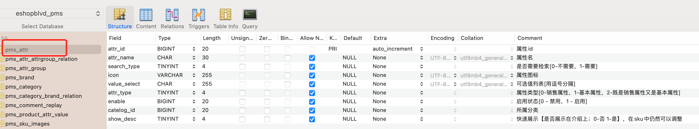

# eshopblvd

## 概述

电商项目

## 云服务器

添置一台阿里云ECS服务器(CentOS 7.9)，安全组设置中添加常用端口：80(http), 22(ssh), 3306(mysql), 6379(redis)等，重置实例密码后重启服务器

通过ssh建立会话远程连接云服务器

```shell
$ ssh root@远程服务器公网ip地址
根据prompt输入实例密码
```

localhost免密码登陆远程云服务器

```shell
本地: 生成本地公钥和私钥，并通过scp指令将公钥安全拷贝到远程服务器.ssh目录下
$ ssh-keygen -t rsa
$ scp id_rsa.pub root@远程服务器公网ip地址:~/.ssh/id_rsa.pub

远程: 将公钥内容追加到~/.ssh/authorized_keys中
$ cd ~/.ssh && cat id_rsa.pub >> authorized_keys

这样下次ssh登陆服务器时就不用输入密码
```

ssh连接长时间不操作保持不断开

```shell
配置下服务器的/etc/ssh/sshd_config文件
Host *
    # 断开时重试连接的次数
    ServerAliveCountMax 600
    # 每隔30秒自动发送一个空的请求以保持连接
    ServerAliveInterval 10

重启一下ssh服务
$ systemctl restart sshd
```

## Docker

### Docker上手

使用Docker虚拟化容器技术来隔离软件(mysql, redis, elasticsearch, rabbitmq等)的运行时环境

centos上安装docker并启动，可参考文档

[Install Docker Engine on CentOS | Docker Documentation](https://docs.docker.com/engine/install/centos/)

docker相关指令

```shell
启动docker
$ systemctl start docker

检查docker镜像
$ docker images

docker开机自动启动
$ systemctl enable docker

查看正在运行的docker容器
$ docker ps

查看所有的docker容器
$ docker ps -a

重启某一docker容器
$ docker restart xxx

停止/删除某一docker容器/镜像
$ docker stop ${CONTAINER_ID}
$ docker rm ${CONTAINER_ID}
$ docker image rm 
```

配置docker阿里云镜像加速

```bash
mkdir -p /etc/docker
tee /etc/docker/daemon.json <<-'EOF'
{
  "registry-mirrors": ["https://uizv1b1t.mirror.aliyuncs.com"]
}
EOF
systemctl daemon-reload
systemctl restart docker
```

### docker容器启动mysql

```shell
拉取镜像
$ docker pull mysql:5.7

启动mysql容器，3306:3306将容器3306端口映射到主机3306端口
-v表示容器内部目录挂载到centos的对应目录（日志、持久化数据、配置）
$ docker run -p 3306:3306 --name mysql \
-v /mount_data/mysql/log:/var/log/mysql \
-v /mount_data/mysql/data:/var/lib/mysql \
-v /mount_data/mysql/conf:/etc/mysql \
-e MYSQL_ROOT_PASSWORD=root \
-d mysql:5.7

进入mysql容器内部控制台
$ docker exec -it mysql /bin/bash
$ exit;
```

mysql配置修改

```shell
$ cd /mount_data/mysql/conf
$ vi my.cnf

插入下面的配置，设置编码方式
[client]
default-character-set=utf8
[mysql]
default-character-set=utf8
[mysqld]
init_connect='SET collation_connection = utf8_unicode_ci'
init_connect='SET NAMES utf8'
character-set-server=utf8
collation-server=utf8_unicode_ci
skip-character-set-client-handshake
skip-name-resolve

$ docker restart mysql

设置启动docker时，即运行mysql
$ docker update mysql --restart=always
```

### docker容器启动redis

拉取镜像、启动容器

```shell
$ docker pull redis
$ mkdir -p /mount_data/redis/conf
$ touch /mount_data/redis/conf/redis.conf

配置redis启用AOF持久化方式
$ echo "appendonly yes"  >> /mydata/redis/conf/redis.conf

$ docker run -p 6379:6379 --name redis -v /mount_data/redis/data:/data \
-v /mount_data/redis/conf/redis.conf:/etc/redis/redis.conf \
-d redis redis-server /etc/redis/redis.conf

设置启动docker时，即运行redis
$ docker update redis --restart=always
```

进入redis容器的client命令行，这样就可以快乐地玩耍redis命令了

```shell
$ docker exec -it redis redis-cli
```


## 项目结构初始化

商品服务、用户服务、订单服务、优惠券服务、仓储服务、后台管理系统

最外层通过module来聚合所有微服务

每个微服务对应的数据库的建立

TODO：所有数据库表结构的解析

## 后台管理系统前端项目

前端系统Vue  [GitHub - weilingao/eshopblvd-admin-vue: 电商网站后台管理系统](https://github.com/weilingao/eshopblvd-admin-vue)

https://cn.vuejs.org/

[Vue CLI](https://cli.vuejs.org/#getting-started)

依赖安装&脚手架初始化&启动

```shell
$ npm install -g @vue/cli
$ npm install vue
$ npm install webpack -g
$ npm install -g @vue/cli-init
$ vue init webpack eshopblvd-admin-vue
$ npm run dev[](https://github.com/weilingao)
```

vue脚手架初始化工程，结合vue-router,element-ui，完成基础的侧菜单和展示内容的路由

## 创建公共库eshopblvd-common

放置公共的依赖、bean、工具类，每个微服务都来依赖公共库  

lombok依赖: @Data标注的实体类在编译期间自动加上getter、setter方法

#### Response 响应封装工具类

继承hashmap，key分别有code, msg, data

用来封装请求响应，功能包括快速构造500响应、200响应，响应内容的自定义

亮点：获取响应的时候可以通过泛型、fastjson的typereference来反序列化得到特定自定义类型的对象数据，使用TypeReference可以明确的指定[反序列化](https://so.csdn.net/so/search?q=%E5%8F%8D%E5%BA%8F%E5%88%97%E5%8C%96&spm=1001.2101.3001.7020)的类型

【面试】java泛型

[Java 泛型 | 菜鸟教程](https://www.runoob.com/java/java-generics.html)

【面试】Java泛型中T和问号（通配符）的区别

[Java泛型中T和问号（通配符）的区别_ikownyou的博客-CSDN博客_泛型通配符?和泛型t区别](https://blog.csdn.net/ikownyou/article/details/65630385)

【面试】java继承、重写override、重载overload

[Java 继承 | 菜鸟教程](https://www.runoob.com/java/java-inheritance.html)

[Java 重写(Override)与重载(Overload) | 菜鸟教程](https://www.runoob.com/java/java-override-overload.html)

## mybatis开发环境配置

TODO: 整合mybatis、page-helper实现分页功能[Mybatis 数据库物理分页插件 PageHelper - digdeep - 博客园](https://www.cnblogs.com/digdeep/p/4608933.html)，分页工具类、查询，common库里所有的工具类

- 引入mybatis相关依赖：mybatis、数据库驱动  

```xml
<!-- MyBatis-->
<dependency>
    <groupId>org.mybatis</groupId>
    <artifactId>mybatis</artifactId>
    <version>3.5.7</version>
</dependency>
<!--Mysql数据库驱动-->
<dependency>
    <groupId>mysql</groupId>
    <artifactId>mysql-connector-java</artifactId>
    <version>8.0.17</version>
</dependency>
<!-- https://mvnrepository.com/artifact/junit/junit -->
<dependency>
    <groupId>junit</groupId>
    <artifactId>junit</artifactId>
    <version>4.12</version>
    <scope>test</scope>
</dependency>
```

- mybatis - springboot整合

springboot作为ioc容器管理所有的组件，解决组件的动态依赖注入，控制事务

整合的目的是service业务逻辑层利用autowired自动装配dao层的组件来增删改查

官方docs：[GitHub - mybatis/spring-boot-starter: MyBatis integration with Spring Boot](https://github.com/mybatis/spring-boot-starter)

[SpringBoot整合MyBatis实战 | 包包的Tech Pool](https://www.baobao555.tech/posts/628531b3/)

引入springboot整合mybatis适配包(场景启动器)

```xml
<dependency>
    <groupId>org.mybatis.spring.boot</groupId>
    <artifactId>mybatis-spring-boot-starter</artifactId>
    <version>2.2.2</version>
</dependency>
```

- 配置

在application.yml配置数据源

```yml
spring:
  datasource:
    username: root
    password: root
    url: jdbc:mysql://47.103.8.41:3306/eshopblvd_pms
    driver-class-name: com.mysql.cj.jdbc.Driver
```

mybatis配置

@MapperScan注解告诉mapper接口的位置`

`@MapperScan("com.hatsukoi.eshopblvd.product.dao")`

配置xml映射文件位置

```yml
mybatis:
  mapper-locations: classpath*:**/mapper/*.xml
```

- 接下俩就是实现service业务层、controller了

【面试】mybatis的优缺点？

【面试】# MyBatis 中#{}和${}区别

[MyBatis 中#{}和${}区别_w3cschool](https://www.w3cschool.cn/mybatis/mybatis-yta93bpj.html)

【面试】 @Mapper 与 @MapperScan 的区别

[@Mapper 与 @MapperScan 的区别_那年那些事儿-CSDN博客_mapper和mapperscan](https://blog.csdn.net/xiaojin21cen/article/details/103273172)

参考wiki：

[SpringBoot | 3.2 &#x6574;&#x5408;MyBatis](https://www.wcqblog.com/article/detail/212298947711074304)

[SpringBoot整合MyBatis实战 | 包包的Tech Pool](https://www.baobao555.tech/posts/628531b3/)

https://github.com/mybatis/spring-boot-starter/wiki/Quick-Start

[# Spring Boot入门系列（十一）如何整合Mybatis](https://mp.weixin.qq.com/s?__biz=MzAxMTY5NDAwOA==&mid=2651415559&idx=1&sn=8b8f6aeaaee93923fd0fd6f90fa8ac74&chksm=8040fed0b73777c62886f7d932fbac447b6f7b482cffd650fcacc93f9ae03e451a55d8a32554&scene=21#wechat_redirect)

## mybatis分页插件

官方docs：

[Mybatis-PageHelper/README_zh.md at master · pagehelper/Mybatis-PageHelper · GitHub](https://github.com/pagehelper/Mybatis-PageHelper/blob/master/README_zh.md)

[GitHub - pagehelper/pagehelper-spring-boot: pagehelper-spring-boot](https://github.com/pagehelper/pagehelper-spring-boot)

- 引入依赖

```xml
<!-- pagehelper -->
<dependency>    
    <groupId>com.github.pagehelper</groupId>    
    <artifactId>pagehelper-spring-boot-starter</artifactId>
    <version>1.3.0</version>
</dependency>
```

- 使用分页功能

```java
//在查询之前开启分页，加了这个之后pagehelper 插件就会通过其内部的拦截器，将执行的sql语句，转化为分页的sql语句
PageHelper.startPage(pageNum, pageSize);pageNum页码、pageSize每页多少条

//之后进行查询操作将自动进行分页
List<PmsBrand> brandList = brandMapper.selectByExample(new PmsBrandExample());

//通过构造PageInfo对象获取分页信息，如当前页码，总页数，总条数
//当前导航分页的个数，navigatePages，举例：3 4 「5」 6 7
PageInfo<PmsBrand> pageInfo = new PageInfo<PmsBrand>(brandList, 5);
```

common基础库添加通用分页数据封装类utils.CommonPageInfo，将pagehelper分页查询结果封装为通用分页封装结果

使用例子：

```java
public CommonPage<PmsProduct> productList(Long brandId, Integer pageNum, Integer pageSize) {
    PageHelper.startPage(pageNum,pageSize);
    PmsProductExample example = new PmsProductExample();
    example.createCriteria().andDeleteStatusEqualTo(0)
                .andBrandIdEqualTo(brandId);
    List<PmsProduct> productList = productMapper.selectByExample(example);
    return CommonPageInfo.convertToCommonPage(productList);
}
```

参考wiki：

[Spring Boot入门系列（十六）整合pagehelper，一秒实现分页功能！ - 云+社区 - 腾讯云](https://cloud.tencent.com/developer/article/1669256)

## mybatis代码生成器

MyBatis Generator可以通过配置生成基本的crud代码，包含了数据库表对应的实体类，Mapper接口类，XML映射文件和Example对象等

1. resource中创建generatorConfig.xml，用来配置数据库连接，生成的pojo、mapper.xml、dao接口存放的位置，配置数据库表
   
   - context的targetRuntime属性设置为MyBatis3，会有生成Example相关的代码和方法，反之可用MyBatis3Simple
   
   - Example类指定如何构建一个动态的where子句，属于*QBC*（Query By Criteria）风格的增删改查，和mybatis-plus的queryWrapper类似
     
     ```java
     TestTableExample example = new TestTableExample();
     example.createCriteria().andField1EqualTo(5);
     等于
     where field1 = 5
     ```
   
   - defaultModelType="flat"目的是使每个表只生成一个实体类
   
   ```xml
   <?xml version="1.0" encoding="UTF-8"?>
   <!DOCTYPE generatorConfiguration
           PUBLIC "-//mybatis.org//DTD MyBatis Generator Configuration 1.0//EN"
           "http://mybatis.org/dtd/mybatis-generator-config_1_0.dtd">
   
   <!-- 配置生成器 -->
   <generatorConfiguration>
       <properties resource="generator.properties"/>
       <!-- 配置对象环境 -->
       <context id="MySqlContext" targetRuntime="MyBatis3" defaultModelType="flat">
           <!-- 配置起始与结束标识符 -->
           <property name="beginningDemiliter" value="`"/>
           <property name="endingDemiliter" value="`"/>
           <!-- 配置注释生成器 -->
           <commentGenerator>
               <property name="suppressDate" value="true"/>
               <property name="addRemarkComments" value="true"/>
           </commentGenerator>
           <!--生成mapper.xml时覆盖原文件-->
           <plugin type="org.mybatis.generator.plugins.UnmergeableXmlMappersPlugin" />
           <!-- 为模型生成序列化方法-->
           <plugin type="org.mybatis.generator.plugins.SerializablePlugin"/>
           <!-- 为生成的Java模型创建一个toString方法 -->
           <plugin type="org.mybatis.generator.plugins.ToStringPlugin"/>
           <!--配置数据库连接-->
           <jdbcConnection driverClass="${jdbc.driverClass}"
                           connectionURL="${jdbc.connectionURL}"
                           userId="${jdbc.userId}"
                           password="${jdbc.password}">
               <!--解决mysql驱动升级到8.0后不生成指定数据库代码的问题-->
               <property name="nullCatalogMeansCurrent" value="true" />
           </jdbcConnection>
           <!--指定生成model的路径-->
           <javaModelGenerator targetPackage="com.hatsukoi.eshopblvd.${serviceName}.entity" targetProject="eshopblvd-mbg/src/main/java"/>
           <!--指定生成mapper.xml的路径-->
           <sqlMapGenerator targetPackage="dao.${serviceName}" targetProject="eshopblvd-mbg/src/main/resources"/>
           <!--指定生成mapper接口的的路径-->
           <javaClientGenerator targetPackage="com.hatsukoi.eshopblvd.${serviceName}.dao"
                                targetProject="eshopblvd-mbg/src/main/java"/>
           <!-- 配置数据库表，生成全部表tableName设为% -->
           <table tableName="%">
               <generatedKey column="id" sqlStatement="Mysql"/>
           </table>
       </context>
   </generatorConfiguration>
   ```
   
   2. 引入相关依赖
   
   ```xml
           <dependency>
               <groupId>org.mybatis</groupId>
               <artifactId>mybatis</artifactId>
               <version>3.5.5</version>
           </dependency>
           <!--MyBatis分页插件-->
           <dependency>
               <groupId>com.github.pagehelper</groupId>
               <artifactId>pagehelper-spring-boot-starter</artifactId>
               <version>1.3.0</version>
           </dependency>
           <!--集成druid连接池-->
           <dependency>
               <groupId>com.alibaba</groupId>
               <artifactId>druid-spring-boot-starter</artifactId>
               <version>1.1.23</version>
           </dependency>
           <!-- MyBatis 生成器 -->
           <dependency>
               <groupId>org.mybatis.generator</groupId>
               <artifactId>mybatis-generator-core</artifactId>
               <version>1.4.0</version>
           </dependency>
           <!--Mysql数据库驱动-->
           <dependency>
               <groupId>mysql</groupId>
               <artifactId>mysql-connector-java</artifactId>
               <version>8.0.17</version>
           </dependency>
       </dependencies>
   ```
   
   3. generator.properties里配置下接下来需要生成逆向工程的微服务信息
      
      ```json
      serviceName=product 微服务名称
      databaseName=Pms 数据库前缀
      ```
      
      并运行Mybatis Generator
   
   ```java
   /**
    * 用MyBatisGenerator生成逆向工程
    */
   public class EshopblvdMbgApplication {
       public static void main(String[] args) throws IOException, XMLParserException, SQLException, InterruptedException, InvalidConfigurationException {
           // 告警信息
           List<String> warnings = new ArrayList<>();
           // 当生成的代码重复时，覆盖原代码
           boolean overwrite = true;
           // 解析读取MybatisGenerator配置文件
           InputStream inputStream = EshopblvdMbgApplication.class.getResourceAsStream("/generatorConfig.xml");
           ConfigurationParser configurationParser = new ConfigurationParser(warnings);
           Configuration configuration = configurationParser.parseConfiguration(inputStream);
           inputStream.close();
   
           DefaultShellCallback callback = new DefaultShellCallback(overwrite);
           // 创建 MBG
           MyBatisGenerator myBatisGenerator = new MyBatisGenerator(configuration, callback, warnings);
           // 执行生成代码
           myBatisGenerator.generate(null);
           // 输出警告信息
           for (String warning : warnings) {
               System.out.println(warning);
           }
       }
   }
   ```

遇到的问题

1. The content of element type "context" must match "(property*,plugin*,commen...意思是代码生成配置文件要按照错误信息给出的顺序来写

2. com.mysql.cj.jdbc.exceptions.CommunicationsException: Communications link failure. javax.net.ssl.SSLHandshakeException: No appropriate protocol (protocol is disabled or cipher suites are inappropriate)
   
   一开始怀疑服务器端口没开放，查看mysql 3306端口是否打开`netstat -an|grep 3306`
   
   可能是mysql-connecter的驱动版本与数据库不一致的问题？这个也排除了
   
   看来是JDK8版本过高引起MySQL连接失败的，在jdbc连接url后拼接参数useSSL=false，问题解决～

3. 生成文件有数据库名字前缀，想要删除
   
   在配置文件中加上`<domainObjectRenamingRule searchString="^${databaseName}" replaceString=""/>`

参考文档：

https://segmentfault.com/a/1190000038622464

[参考文档](http://www.macrozheng.com/#/architect/mall_arch_01?id=mybatis-generator-%e9%85%8d%e7%bd%ae%e6%96%87%e4%bb%b6)

[MyBatis学习笔记（五）：代码生成器 | 程序人生](https://zjxkenshine.github.io/2018/03/29/MyBatis%E5%AD%A6%E4%B9%A0%E7%AC%94%E8%AE%B0%EF%BC%88%E4%BA%94%EF%BC%89%EF%BC%9A%E4%BB%A3%E7%A0%81%E7%94%9F%E6%88%90%E5%99%A8/)

[Example类使用说明 · Java 开源项目中文文档 · 看云](https://www.kancloud.cn/wizardforcel/java-opensource-doc/153016)

[Mybatis——Example用法 - 简书](https://www.jianshu.com/p/335960d6db6a)

#### Mybatis Generator Example 用法

[MyBatis Generator 生成的example 使用 and or 简单混合查询 - kaixinyufeng - 博客园](https://www.cnblogs.com/kaixinyufeng/p/8329954.html)

https://zhuanlan.zhihu.com/p/42411540

Example类用于构造复杂的筛选条件

- Criterion: mybatis-generator会为每个字段产生Criterion，是最基本,最底层的Where条件，用于字段级的筛选，例如：字段 in | not in | like | > | >= | < | <= | is not null | is null 等

- Criteria: 包含一个Cretiron的集合,每一个Criteria对象内包含的Cretiron之间是由AND连接的,是逻辑与的关系

- oredCriteria: Example内有一个成员叫oredCriteria,是Criteria的集合,这个集合中的Criteria是由OR连接的，是逻辑或关系

- or()方法，会产生一个新的Criteria对象,添加到oredCriteria中,并返回这个Criteria对象，从而可以链式表达，为其添加Criterion

例子1：**(a=? And b=?) or (a=? And c=?)**

**select * from demo WHERE ( a = ? and b = ? ) or ( a = ? and c = ? )**

```java
DemoExample example=new DemoExample();  

 DemoExample.Criteria criteria1=example.createCriteria();
 criteria1.andAEqualTo(?).andBEqualTo(?);  

 DemoExample.Criteria criteria2=example.createCriteria();
 criteria2.andAEqualTo(?).andCEqualTo(?);  

 example.or(criteria2);
```

例子2：**(a=? and (b=? or c=?))**

select * from demo WHERE ( a = ? and ( b = ? or c = ? ))

修改DemoExample.java文件，新增方法：

```java
public Criteria andOrDemo(String value){
    addCriterion("(b = \""+value+"\" or c = \""+value+"\")");
    return (Criteria) this;
}
```

```java
DemoExample example=new DemoExample();  
Criteria criteria = example.createCriteria();
criteria.andAEqualTo(?).andOrDemo(?);

SqlSession sqlSession = MyBatisUtil.openSession();
DemoMapper m = sqlSession.getMapper(DemoMapper.class);
m.countByExample(example);
```

## 验证环境是否搭建成功

```java
@Service
public class BrandServiceImpl implements BrandService {
    @Autowired
    private BrandMapper brandMapper;

    @Override
    public Brand selectBrandById(long brandId) {
        return brandMapper.selectByPrimaryKey(brandId);
    }

    @Override
    public CommonPageInfo<Brand> queryBrandsByShowStatus(int pageNum, int pageSize, byte showStatus) {
        PageHelper.startPage(pageNum, pageSize);
        BrandExample brandExample = new BrandExample();
        brandExample.createCriteria().andShowStatusEqualTo(showStatus);
        List<Brand> brandList = brandMapper.selectByExample(brandExample);
        return CommonPageInfo.convertToCommonPage(brandList);
    }
}
```

```java
@SpringBootTest
class EshopblvdProductApplicationTests {
    @Autowired
    BrandService brandService;

    @Test
    void contextLoads() {
        Brand brand = brandService.selectBrandById(1L);
        System.out.println("获取到的品牌是：" + brand);
        CommonPageInfo<Brand> brandCommonPageInfo = brandService.queryBrandsByShowStatus(2, 2, (byte) 1);
        System.out.println("目前能显示的第" + brandCommonPageInfo.getCurrPage() + "页的品牌是：" + brandCommonPageInfo.getListData());
    }
}
```

运行成功～！输出结果符合预期

## 分布式系统环境搭建


[Spring Cloud Alibaba](https://spring.io/projects/spring-cloud-alibaba)

[spring-cloud-alibaba/README-zh.md at 2.2.x · alibaba/spring-cloud-alibaba · GitHub](https://github.com/alibaba/spring-cloud-alibaba/blob/2.2.x/README-zh.md)

SpringCloud Alibaba - Nacos：服务发现/注册、配置中心

~~SpringCloud - Ribbon：负载均衡~~

SpringCloud - Gateway：API网关

Apache Dubbo: RPC框架

SpringAlibaba - Sentinel: 服务容错（限流、降级、熔断）

SpringCloud - Sleuth:调用链监控

SpringCloud Alibaba - Seata：分布式事务解决方案

接下来就是将各个依赖引入common基础库中

引入依赖前，先看springcloud-alibaba中组件的版本兼容关系：随便选版本很容易启动项目时候报错

[版本说明 · alibaba/spring-cloud-alibaba Wiki · GitHub](https://github.com/alibaba/spring-cloud-alibaba/wiki/%E7%89%88%E6%9C%AC%E8%AF%B4%E6%98%8E)

#### SpringCloud-alibaba依赖引入

```xml
<dependencyManagement>
    <dependencies>
        <dependency>
            <groupId>com.alibaba.cloud</groupId>
            <artifactId>spring-cloud-alibaba-dependencies</artifactId>
            <version>2.2.7.RELEASE</version>
            <type>pom</type>
            <scope>import</scope>
        </dependency>
    </dependencies>
</dependencyManagement>
```

#### SpringCloud Alibaba-Nacos

接入注册中心，引入 Nacos Discovery Starter

```xml
 <dependency>
     <groupId>com.alibaba.cloud</groupId>
     <artifactId>spring-cloud-starter-alibaba-nacos-discovery</artifactId>
 </dependency>
```

1. 本地启动nacos-server，下载2.0.2[Releases · alibaba/nacos · GitHub](https://github.com/alibaba/nacos/releases)

直接运行nacos/bin/startup.sh，完事儿～

2. 通过docker启动nacos-server，来到我们的centos，先拉取docker镜像

https://hub.docker.com/r/nacos/nacos-server

```shell
无视这条
$ docker pull nacos/nacos-server
```

快速启动docker容器

```shell
docker run --name nacos -e MODE=standalone -d -p 8848:8848 -p 9848:9848 -p 9849:9849 nacos/nacos-server:2.0.3 --restart=always
```

- 注意⚠️：Nacos2.0版本相比1.X新增了gRPC的通信方式，因此需要增加2个端口。新增端口是在配置的主端口(server.port)基础上，进行一定偏移量自动生成。
- 

最后别忘了去安全组暴露下8848端口(主端口)，9848 9849

现在可以通过`服务器地址:8848/nacos`访问注册中心啦，用户名/密码均为nacos

需要注册的微服务下yml里配置：

```yml
  cloud:
    nacos:
      discovery:
        server-addr: 服务器地址:8848
```

使用 @EnableDiscoveryClient 注解开启服务注册与发现功能

```java
@SpringBootApplication
 @EnableDiscoveryClient
 public class ProviderApplication {

     public static void main(String[] args) {
         SpringApplication.run(ProviderApplication.class, args);
     }

     @RestController
     class EchoController {
         @GetMapping(value = "/echo/{string}")
         public String echo(@PathVariable String string) {
                 return string;
         }
     }
 }
```

为微服务起名，这样才能被注册

```yml
   application:
    name: eshopblvd-product
```

服务一启动，就能在服务列表中看到我们的微服务了


#### springboot整合dubbo

[Dubbo3 简介 | Apache Dubbo](https://dubbo.apache.org/zh/docs/introduction/)

[Dubbo 融合 Nacos 成为注册中心](https://nacos.io/zh-cn/docs/use-nacos-with-dubbo.html)

[Dubbo 外部化配置 - 小马哥的技术博客](https://mercyblitz.github.io/2018/01/18/Dubbo-%E5%A4%96%E9%83%A8%E5%8C%96%E9%85%8D%E7%BD%AE/)

[版本说明 · alibaba/spring-cloud-alibaba Wiki · GitHub](https://github.com/alibaba/spring-cloud-alibaba/wiki/%E7%89%88%E6%9C%AC%E8%AF%B4%E6%98%8E)

[注解配置 | Apache Dubbo](https://dubbo.apache.org/zh/docs/references/configuration/annotation/)

1. 依赖导入dubbo-starter、其他依赖

https://github.com/apache/dubbo-spring-boot-project/blob/0.2.x/README_CN.md

版本选择要按照上面的版本说明wiki来，不然很容易报错

```xml
        <!--Nacos注册中心-->
        <dependency>
            <groupId>com.alibaba.cloud</groupId>
            <artifactId>spring-cloud-starter-alibaba-nacos-discovery</artifactId>
            <exclusions>
                <exclusion>
                    <groupId>com.alibaba.spring</groupId>
                    <artifactId>spring-context-support</artifactId>
                </exclusion>
            </exclusions>
        </dependency>

        <!-- https://mvnrepository.com/artifact/org.apache.dubbo/dubbo -->
        <dependency>
            <groupId>org.apache.dubbo</groupId>
            <artifactId>dubbo</artifactId>
            <version>2.7.13</version>
        </dependency>

        <dependency>
            <groupId>com.alibaba.spring</groupId>
            <artifactId>spring-context-support</artifactId>
            <version>1.0.11</version>
        </dependency>
```

2. 配置provider

假设 Nacos Server 同样运行在服务器 `10.20.153.10` 上，并使用默认 Nacos 服务端口 `8848`，您只需将 `dubbo.registry.address` 属性调整如下：

```yml
## Nacos registry address
dubbo.registry.address = nacos://10.20.153.10:8848
```

完成业务服务层的逻辑，暴露服务

```java
在服务上加注解
@com.alibaba.dubbo.config.annotation.Service
```

在主程序开始基于注解的dubbo功能

```java
@EnableDubbo
```

这样配置的服务就会注册到nacos了


3. 编写接口&配置consumer

common基础库里定义好provider service的接口（类似于远程服务接口的声明、签名），消费者引用远程provider服务时用，基础库service包下，后续会从注册中心自动发现provider地址

```java
@Reference
ProviderTest providerTest;
```

配置好yml

在主程序开始基于注解的dubbo功能

```java
@EnableDubbo
```

demo具体例子可参考：[GitHub - 7Savage/DubboStudy: 尚硅谷Dubbo学习](https://github.com/7Savage/DubboStudy)

[springboot-dubbo: springboot整合dubbo，yml配置dubbo，完全抛弃xml配置 - Gitee.com](https://gitee.com/chrismayday/springboot-dubbo/tree/master)

[Dubbo 融合 Nacos 成为注册中心](https://nacos.io/zh-cn/docs/use-nacos-with-dubbo.html)

[官方wiki](https://dubbo.apache.org/zh/docs/v3.0/references/configuration/references/metadata/)

最终实现：

[dubbo-consumer-demo](./dubbo-consumer-demo)

[dubbo-provider-demo](./dubbo-provider-demo)

demo的逻辑是provider提供服务，返回字符串“You get response from provider!”，consumer新增一个controller，调用cosumer的服务，其中远程调用了provider的服务，最终返回provider服务返回的字符串

踩坑记录：

1. com.alibaba.dubbo.rpc.RpcException: Fail to start server(url: dubbo://xxx.xxx.xxx.xxx:20880/, Failed to bind NettyServer on /xxx.xxx.xxx.xxx:20880, cause: Failed to bind to: /0.0.0.0:20880

解决：报错信息显示绑定到本机的20880端口失败，本地绑定的地址已经被使用，将dubbo.protocol.port的端口号其他非占用端口

2. com.alibaba.dubbo.rpc.RpcException: No provider available from registry xxx for service

解决：provider的接口我定义在基础库了，基础库的包路径和实际provider的包路径不同了，由于provider是根据service的报路径来命名的，例如providers:com.hatsukoi.eshopblvd.provider.Service.ProviderService，所以根因就是consumer在引用provider的接口时发现nacos中没有这个命名的服务，解决方案就是provider的service实现和consumer引用reference就直接用导入common库包下的接口

以后服务接口声明只放在common基础库了

最终，问题都解决了～nacos成功服务发现，返回结果符合预期


### Nacos配置中心

官方文档: [spring-cloud-alibaba/readme-zh.md at 2.2.x · alibaba/spring-cloud-alibaba · GitHub](https://github.com/alibaba/spring-cloud-alibaba/blob/2.2.x/spring-cloud-alibaba-examples/nacos-example/nacos-config-example/readme-zh.md)

先导入依赖

```xml
<dependency>
    <groupId>com.alibaba.cloud</groupId>
    <artifactId>spring-cloud-starter-alibaba-nacos-config</artifactId>
</dependency>
```

springboot 规定bootstrap.properties优先于application.properties加载

在应用的 /src/main/resources/bootstrap.properties 配置文件中配置 Nacos Config 元数据

```properties
spring.application.name=nacos-config-example
spring.cloud.nacos.config.server-addr=127.0.0.1:8848
```

```java
@Value注解可以直接获取application.properties中的配置
@Value("${spring.application.name}")
private String name;
```

目的是在配置中心动态改配置，而不是在本地改完配置文件重新打包部署

在nacos创建dataid为eshopblvd-coupon.properties的配置，默认以服务名来命名


为了nacos中修改的配置能够被动态地刷新，在控制器应用加上注解@RefreshScope

```java
@RefreshScope
@RestController
@RequestMapping("/coupon")
public class CouponController {
    // ...
}
```

再根据`@Value("${xxx}")`来获取配置的值

如果配置中心和当前应用的配置文件中都配置了相同的项，优先使用配置中心的配置

#### 命名空间

作用是为了配置隔离

- 基于环境进行隔离

默认：public(保留空间)；默认新增的所有配置都在public空间。  

用途举例：开发，测试，生产：利用命名空间来做环境隔离。  

注意：在bootstrap.properties；配置上，需要使用哪个命名空间下的配置

```properties
spring.cloud.nacos.config.namespace=9de62e44-cd2a-4a82-bf5c-95878bd5e871
```

9de62e44-cd2a-4a82-bf5c-95878bd5e871为命名空间自动生成的id


- 基于微服务之间进行隔离

当然每一个微服务之间为了互相隔离配置，每一个微服务也可以创建自己的命名空间，只加载自己命名空间下的所有配置  

#### 配置集

一组相关或者不相关的配置项的集合称为配置集，类似于一个配置yml文件

#### 配置集ID

类似配置文件名，在nacos中就是Data ID

#### 配置分组

默认所有的配置集都属于：DEFAULT_GROUP，后续可以根据业务来定制


```properties
指定配置的group
spring.cloud.nacos.config.group=CUSTOM_GROUP
```

本项目中的使用：每个微服务创建自己的命名空间，使用配置分组group区分环境，dev，test，prod，这些在bootstrap.properties都可以制定


#### 同时加载多个配置集

当微服务数量很庞大时，将所有配置都书写到一个配置文件中，显然不是太合适。对此我们可以将配置按照功能的不同，拆分为不同的配置文件。可以将数据源有关的配置写到一个配置文件中，框架有关的写到另外一个配置文件中

微服务任何配置信息，任何配置文件都可以放在配置中心中，只需要在bootstrap.properties说明加载配置中心中哪些配置文件即可

datasource.yml、mybatis.yml、other.yml为nacos的配置集

bootstrap.properties举例:

```yml
spring.application.name=gulimall-coupon

spring.cloud.nacos.config.server-addr=127.0.0.1:8848
spring.cloud.nacos.config.namespace=1986f4f3-69e0-43bb-859c-abe427b19f3a

spring.cloud.nacos.config.ext-config[0].data-id=datasource.yml
spring.cloud.nacos.config.ext-config[0].group=dev
spring.cloud.nacos.config.ext-config[0].refresh=true

spring.cloud.nacos.config.ext-config[1].data-id=mybatis.yml
spring.cloud.nacos.config.ext-config[1].group=dev
spring.cloud.nacos.config.ext-config[1].refresh=true

spring.cloud.nacos.config.ext-config[2].data-id=other.yml
spring.cloud.nacos.config.ext-config[2].group=dev
spring.cloud.nacos.config.ext-config[2].refresh=true
```

获取配置项的值使用这两个注解：`@Value，@ConfigurationProperties`

微服务只需要保留bootstrap.properties，一启动自动来配置中心获取配置，可以将所有配置都放在配置中心

## API网关

作用：

1. 动态地将请求路由到各个微服务，能从注册中心实时感知服务的上/下线

2. 鉴权、监控、限流、日志输出、统一功能的处理

### SpringCloud Gateway

官方wiki：[Spring Cloud Gateway](https://spring.io/projects/spring-cloud-gateway)

- 路由 (route)

路由是网关最基础的部分，路由信息有一个ID、一个目的URL、一组断言和一组 Filter 组成。如果断言路由为真，则说明请求的 URL 和配置匹配

- 断言 (predicate)

Java8 中的断言函数。Spring Cloud Gateway 中的断言函数输入类型是 Spring5.0 框
架中的 ServerWebExchange。Spring Cloud Gateway 中的断言函数允许开发者去定义匹配
来自于 http request 中的任何信息，比如请求头和参数等

- 过滤器 (filter)

一个标准的 Spring webFilter。过滤器 Filter 将会对请求和响应进行修改
处理

### 工作流程


客户端发送请求给网关，通过 HandlerMapping 判断是否请求满足某个路由，满足就发给网关的 WebHandler。这个 WebHandler 将请求交给一个过滤器链，然后请求再到达目标服务

新建网关模块，引入gateway依赖以及common库 

```xml
<dependency>
    <groupId>org.springframework.cloud</groupId>
    <artifactId>spring-cloud-starter-gateway</artifactId>
</dependency>
```

网关需要注册到nacos，需要发现其他服务的位置，添加服务注册发现注解

```java
@EnableDiscoveryClient
```

配置文件照常配置nacos注册中心地址、应用名称、配置中心地址

启动服务时可能会报错，请务必确认springboot, springcloud的版本映射关系正确

参考：[版本说明 · alibaba/spring-cloud-alibaba Wiki · GitHub](https://github.com/alibaba/spring-cloud-alibaba/wiki/%E7%89%88%E6%9C%AC%E8%AF%B4%E6%98%8E)

报错显示缺少负载均衡的依赖，添加相关依赖

```xml
<dependency>
    <groupId>org.springframework.cloud</groupId>
    <artifactId>spring-cloud-starter-loadbalancer</artifactId>
</dependency>
```

遇到报错：Failed to configure a DataSource: 'url' attribute is not specified and no embedded datasource，依赖中有mybatis

DataSourceAutoConfiguration会自动加载.可以排除此类的自动配置，在启动类中加入

```java
@SpringBootApplication(exclude= {DataSourceAutoConfiguration.class})
```

ok~服务启动，网关配置完成✅注册中心里已经有eshopblvd-gateway服务了

## 前端ES6 & Vue

[ES6语法&Vue基础知识总结](./docs/es6_vue.pdf)

## 业务开发

### 商品服务

#### 数据库设计


#### 三级分类查询

插入所有的商品分类数据pms_category.sql 

功能#1：树形展示三级分类：查出所有的分类以及其子分类，并且以父子树形结构组装起来，最终能够展示在后台管理系统以及电商网站

- 查出所有的一级分类，可以根据属性parent_cid、cat_level来判断分类层级，parent_cid为0或者cat_level为1表示目前分类为第一级分类

- 为分类实体添加children属性，由于Category实体类实现了Serilizable接口，Category对象就可以被序列化，其中children不需要被序列化，换句话说就是仅存于调用者的内存中而不会写到磁盘里持久化，那么我们就可以在children字段前添加关键字transient`private transient List<Category> children;`，序列化对象的时候，这个属性就不会序列化到指定的目的地中
  
  【面试】[Java transient关键字使用小记 - Alexia(minmin) - 博客园](https://www.cnblogs.com/lanxuezaipiao/p/3369962.html)

- 递归树形结构：在所有分类中查找到所有一级分类的子分类，继续遍历递归找子分类的子分类直到叶层级分类，并用setChildren组装树结构，并排序
  
  【面试】这个递归查找的时间复杂度是？有没有优化空间？

- 前端：后台管理系统来到商品管理->分类管理的时候，created()生命周期钩子函数里发起请求获取三级分类

- 跨源请求：同源策略
  
  现在前端发的请求都是走API网关了，由于API网关的端口为80，和localhost:8080不同源，浏览器就会因为同源策略拦截跨源请求（同源策略：是指协议、域名、端口都要相同，其中有一个不同都会产生跨域）

- 跨域流程：
  
  

- 解决跨域：
  
  【面试】如何解决浏览器同源策略下无法跨域请求的问题？
  
  发预检请求问能不能跨域，服务器响应能跨域即可，即在预检请求的响应里配置相关的响应头
  
  
  
  所有请求响应都需要添加这些字段，所以在网关里添加一个过滤器去完成这个工作
  
  springboot提供了corswebfilter，将其放入容器就能起作用，在网关新建一个配置类CorsConfig用来做过滤，允许所有的请求跨域。
  
  ```java
  @Configuration
  public class CorsConfig {
      /**
       * Bean注解使其加入容器中
       * @return
       */
      @Bean
      public CorsWebFilter corsWebFilter() {
          UrlBasedCorsConfigurationSource source = new UrlBasedCorsConfigurationSource();
          // 跨域配置，*表示允许全部
          CorsConfiguration corsConfiguration = new CorsConfiguration();
          corsConfiguration.addAllowedHeader("*");
          corsConfiguration.addAllowedMethod("*");
          corsConfiguration.addAllowedOrigin("*");
          // 是否允许携带cookie进行跨域
          corsConfiguration.setAllowCredentials(true);
          // /**表示任意路径都要跨域配置
          source.registerCorsConfiguration("/**", corsConfiguration);
          return new CorsWebFilter(source);
      }
  }
  ```

- API网关添加商品服务的路由
  
  断言到路径匹配的，将其路径重写，去除/api
  
  ```yml
  spring: 
    cloud:
      gateway:
        routes:
          - id: product-route
            uri: lb://eshopblvd-product
            predicates:
              - Path=/api/product/**
            filters:
              - RewritePath=/api/(?<segment>.*),/$\{segment}
  ```

- 验证
  
  刷新网页～
  
  先发送预检请求：
  
  
  
  网关能够发现商品服务的地址，所以发给88端口API网关的请求成功负载均衡路由转发给商品服务，并返回三级分类的树形数据
  
  
  
  接下来就是通过vue展示出三级分类的内容了，这里不细展开了，直接去看前端代码就好
  
  

#### 三级分类删除/添加/修改

只有当前分类没有子分类的时候，才可以delete

只有当前分类是一级或二级分类的时候，才可以append

所有层级的分类都可以edit

- 批量删除
  
  这次批量删除是post请求
  
  @RequestBody:获取请求体，必须发送POST请求
  
  SpringMVC自动将请求体的数据（json），转为对应的对象
  
  ```java
  @RequestMapping("/delete")
  public CommonResponse deleteCategories(@RequestBody List<Long> catIds) {
      // ...    
  }
  ```
  
  这里的删除不是物理删除，而是逻辑删除，字段show_status为0代表这个分类被删除了，为1反之
  
  mybatis没有mybatis-plus那样逻辑删除的注解`@TableLogic`，这次就先不搞逻辑删除了
  
  删除逻辑是先生成example后，再根据这个criteria去删除数据
  
  ```java
      @Override
      public void removeCategoriesByIds(List<Long> catIds) {
          // TODO: 先检查当前删除的分类是否已经没有子分类或者是否被其他地方引用，没有才可以删
          // 根据catIds批量删除分类
          CategoryExample example = new CategoryExample();
          example.createCriteria().andCatIdIn(catIds);
          categoryMapper.deleteByExample(example);
      }
  ```
  
  成功删除！
  
  

- 添加分类：
  
  新增【接口】：/product/category/insert
  
  将对话框里填完的category实体对象发请求给接口

- 修改分类：
  
  新增【接口】：/product/category/update，/product/category/detail/{catId}
  
  /product/category/update 根据分类id查询：
  
  用selectByPrimaryKey来查询分类
  
  /product/category/detail/{catId} 根据catId去更新指定分类内容：updateByPrimaryKeySelective和updateByPrimaryKey的区别就是，updateByPrimaryKeySelective当某一实体类的属性为null时，mybatis会使用动态sql过滤掉，不更新该字段，selective就是部分更新
  
  updateByPrimaryKey 将为空的字段在数据库中置为NULL
  
  
  
  

- 前端逻辑：
  
  页面初始化时获取所有三级分类，点击删除时弹出对话框，确定后发送/delete请求后再次请求获取所有三级分类，且被删分类的父分类保持展开
  
  点击添加，提交表单后，将修改内容发请求给'/product/category/insert'后弹出修改成功消息，关闭对话框，刷新整个分类，并展开默认的分类
  
  点击修改，发送请求获取当前节点最新的数据，用作回显，提交表单后，将修改内容发请求给'/product/category/update'后弹出修改成功消息，关闭对话框，刷新整个分类，并展开默认的分类

#### 三级分类拖拽

- 限制可拖拽范围
  
  由于我们的菜单是三级分类，所以未防止超出三级的情况，有部分情况不允许被拖入：比如被拖拽的节点本身包含两级菜单，将其拖进第二层级的节点，那么最深层级就达到了四级，为防止这种情况的出现，我们需要编写在`<el-tree>`中绑定`allow-drop`属性并编写`allowDrop()`函数
  
  `allowDrop()`的思路为将被拖拽节点的子节点通过递归遍历找出最深节点的`level`，然后将被拖拽节点的相对深度与目标节点的相对深度相加，看是否超出最大深度3

- 拖拽完成
  
  拖拽完成后我们需要更新三个状态：
  
  1. 当前节点最新的父节点id，
  
  2. 当前拖拽节点的最新顺序，遍历姊妹节点的顺序即为新顺序
  
  3. 当前拖拽节点的最新层级，当前拖拽层级变化需要更新拖拽节点及其子节点

- 设置菜单拖动开关
  
  现在存在的一个问题是每次拖拽的时候，都会发送请求，更新数据库这样频繁的与数据库交互，现在想要实现一个拖拽过程中不更新数据库，拖拽完成后，通过`批量保存`统一提交拖拽后的数据

- 批量删除
  
  添加删除按钮
  
  【面试】批量更新的mybatis映射xml文件该怎么写？

#### 总结

- 这部分前端复杂逻辑较多，后端这里注意的点就两个，分类树结构的生成是否有优化空间，mybatis批量更新该如何做？

#### 品牌管理

##### 新增【接口】：根据关键字模糊分页查询品牌

product/brand/list

```sql
select * from pms_brand where name like %key% or brandId = key
```

这是一个好的学习example用法的例子

```java
    /**
     * 分页查询品牌列表
     * 查询条件：关键字为brand_id或是模糊查询brand_name
     * @return
     */
    @Override
    public CommonPageInfo<Brand> queryPageForBrands(Map<String, Object> params) {
        // 分页参数
        int pageNum = 1;
        int pageSize = 10;
        // 模糊搜索关键词
        String key = "";
        if (params.get("page") != null) {
            pageNum = Integer.parseInt(params.get("page").toString());
        }
        if (params.get("limit") != null) {
            pageSize = Integer.parseInt(params.get("limit").toString());
        }
        if (params.get("key") != null) {
            key = params.get("key").toString();
        }
        PageHelper.startPage(pageNum, pageSize);
        // select * from pms_brand where name like %key% or brandId = key
        BrandExample brandExample = new BrandExample();
        BrandExample.Criteria criteria1 = brandExample.createCriteria();
        // 关键词模糊查询品牌名
        if (!StringUtils.isEmpty(key)) {
            // sql like 通配符
            key = "%" + key + "%";
            criteria1.andNameLike(key);
        }
        // 关键字匹配brandId
        BrandExample.Criteria criteria2 = brandExample.createCriteria();
        if (!key.equals("") && StringUtils.isNumeric(key)) {
            criteria2.andBrandIdEqualTo(Long.parseLong(key));
        }
        brandExample.or(criteria2);
        List<Brand> brandList = brandMapper.selectByExample(brandExample);
        return CommonPageInfo.convertToCommonPage(brandList);
    }
```


参考wiki：[mybatis Example Criteria like 模糊查询_我在阴山下-CSDN博客_criteria.andlike](https://blog.csdn.net/ouzhuangzhuang/article/details/82758683)

##### 新增【接口】更新品牌的显示状态

product/brand/update/status

更新其showStatus

```java
    @Override
    public int updateStatus(Brand brand) {
        return brandMapper.updateByPrimaryKeySelective(brand);
    }
```

`@RequestParam`为获取get请求query参数

`@RequestBody`为获取post请求的请求体


##### 新增【接口】：获取品牌关联的分类

/product/categorybrandrelation/catelog/list

[15、获取品牌关联的分类 - 谷粒商城](https://easydoc.net/s/78237135/ZUqEdvA4/SxysgcEF)

```java
    @Override
    public List<CategoryBrandRelation> getCatelogListById(Long brandId) {
        CategoryBrandRelationExample example = new CategoryBrandRelationExample();
        example.createCriteria().andBrandIdEqualTo(brandId);
        List<CategoryBrandRelation> categoryBrandRelations = categoryBrandRelationMapper.selectByExample(example);
        return categoryBrandRelations;
    }
```

##### 新增【接口】：新增品牌与分类关联关系

product/categorybrandrelation/insert

[16、新增品牌与分类关联关系 - 谷粒商城](https://easydoc.net/s/78237135/ZUqEdvA4/7jWJki5e)

```java
    @Override
    public void insertCategoryBrandRelation(CategoryBrandRelation categoryBrandRelation) {
        Long brandId = categoryBrandRelation.getBrandId();
        Long catelogId = categoryBrandRelation.getCatelogId();
        // 查询品牌和分类的名字
        Brand brand = brandMapper.selectByPrimaryKey(brandId);
        Category category = categoryMapper.selectByPrimaryKey(catelogId);
        // 补充查询到信息：品牌和分类的名字
        categoryBrandRelation.setBrandName(brand.getName());
        categoryBrandRelation.setCatelogName(category.getName());
        categoryBrandRelationMapper.insert(categoryBrandRelation);
    }
```


一个品牌关联多个分类，一个分类下关联多个品牌

【面试】多对多的数据库表如何设计？

多对多一般就会新增一个中间表作冗余存储，比如pms_category_brand_relation，用来保存哪个品牌关联了哪个分类，否则关联查询对数据库性能有非常大的影响，因为表大

如果brand_name和catelog_name在真正的品牌表和分类表更新的话，中间表的数据需要同步


品牌更新时更新品牌的时候更新关联表的冗余字段

根据brandId更新品牌名

```java
    @Transactional
    @Override
    public int updateBrand(Brand brand) {
        int count = brandMapper.updateByPrimaryKeySelective(brand);
        // 保证冗余字段的数据一致性
        if (!StringUtils.isEmpty(brand.getName())) {
            categoryBrandRelationService.updateBrand(brand.getBrandId(), brand.getName());
        }
        // TODO: 更新其他相关联的表，冗余存储
        return count;
    }
```

更新分类的时候更新关联表的冗余字段

根据catId更新catelogName

```java
    /**
     * 更新分类的时候更新关联表的冗余字段
     * 根据catId更新catelogName
     * @param catId
     * @param name
     */
    @Override
    public void updateCategory(Long catId, String name) {
        CategoryBrandRelation categoryBrandRelation = new CategoryBrandRelation();
        categoryBrandRelation.setCatelogId(catId);
        categoryBrandRelation.setCatelogName(name);
        CategoryBrandRelationExample example = new CategoryBrandRelationExample();
        example.createCriteria().andCatelogIdEqualTo(catId);
        categoryBrandRelationMapper.updateByExampleSelective(categoryBrandRelation, example);
    }
```

新增配置类，开始事务管理

```java
@Configuration
@EnableTransactionManagement
@MapperScan("com.hatsukoi.eshopblvd.product")
public class MybatisConfig {
}
```

在刚才那些级联更新的服务都加上事务注解

```java
    @Override
    @Transactional
    public void updateCategory(Category category) {
        // ...
    }
```

#### 文件存储阿里云OSS

- 传统的单体应用：
  
  浏览器上传文件，储存在业务服务器，下次需要文件，再请求
  
  和传统的单体应用不同，一个微服务由多个分布式服务器，那总不能每台服务器上都存上一摸一样的文件，所以这里我们选择将数据上传到统一的文件服务器上。这里我们选择将图片放置到阿里云上，使用对象存储。
  
  

- 阿里云OSS
  
  阿里云OSS API文档：[简介 - 对象存储 OSS - 阿里云](https://help.aliyun.com/document_detail/31947.html?spm=5176.8465980.help.dexternal.4e701450ADp3n3)
  
  专业术语
  
  
  
  创建一个空间bucket
  
  

- 文件上传方式选择
  
  第一种
  
  缺点：中间经过自己服务器，完全没必要，还浪费服务器性能 
  
  
  
  第二种
  
  由于上传需要的账号密码不能暴露在js，所以让服务器签名后上传oss，账号密码还是放在服务器。前端问服务器要policy上传策略，服务器利用阿里云的账号密码生成一个防伪签名，其中包含了访问阿里云的授权令牌、阿里云oss上传地址等信息。前端得到这些信息后，其中没有账号密码，前端带着防伪签名、文件传给阿里云

- 
  
  引入依赖
  
  ```xml
  <dependency>
      <groupId>com.aliyun.oss</groupId>
      <artifactId>aliyun-sdk-oss</artifactId>
      <version>3.10.2</version>
  </dependency>
  ```
  
  Java简单上传例子：[简单上传 - 对象存储 OSS - 阿里云](https://help.aliyun.com/document_detail/84781.html)
  
  1. 创建存储空间
  
  2. 获取供外网访问的endpoint（文件上传的地址）
  
  3. RAM控制台创建RAM用户，获取accesskey id和accesskey secret
  
  4. 给子用户添加权限「管理对象存储服务(OSS)权限」
  
  阿里云提供的例子（原生sdk）：

```java
import com.aliyun.oss.ClientException;
import com.aliyun.oss.OSS;
import com.aliyun.oss.OSSClientBuilder;
import com.aliyun.oss.OSSException;
import java.io.FileInputStream;
import java.io.InputStream;

public class Demo {

    public static void main(String[] args) throws Exception {
        // Endpoint以华东1（杭州）为例，其它Region请按实际情况填写。
        String endpoint = "https://oss-cn-hangzhou.aliyuncs.com";
        // 阿里云账号AccessKey拥有所有API的访问权限，风险很高。强烈建议您创建并使用RAM用户进行API访问或日常运维，请登录RAM控制台创建RAM用户。
        String accessKeyId = "yourAccessKeyId";
        String accessKeySecret = "yourAccessKeySecret";
        // 填写Bucket名称，例如examplebucket。
        String bucketName = "examplebucket";
        // 填写Object完整路径，完整路径中不能包含Bucket名称，例如exampledir/exampleobject.txt。
        String objectName = "exampledir/exampleobject.txt";
        // 填写本地文件的完整路径，例如D:\\localpath\\examplefile.txt。
        // 如果未指定本地路径，则默认从示例程序所属项目对应本地路径中上传文件流。
        String filePath= "D:\\localpath\\examplefile.txt";

        // 创建OSSClient实例。
        OSS ossClient = new OSSClientBuilder().build(endpoint, accessKeyId, accessKeySecret);

        try {
            InputStream inputStream = new FileInputStream(filePath);            
            // 创建PutObject请求。
            ossClient.putObject(bucketName, objectName, inputStream);
        } catch (OSSException oe) {
            System.out.println("Caught an OSSException, which means your request made it to OSS, "
                    + "but was rejected with an error response for some reason.");
            System.out.println("Error Message:" + oe.getErrorMessage());
            System.out.println("Error Code:" + oe.getErrorCode());
            System.out.println("Request ID:" + oe.getRequestId());
            System.out.println("Host ID:" + oe.getHostId());
        } catch (ClientException ce) {
            System.out.println("Caught an ClientException, which means the client encountered "
                    + "a serious internal problem while trying to communicate with OSS, "
                    + "such as not being able to access the network.");
            System.out.println("Error Message:" + ce.getMessage());
        } finally {
            if (ossClient != null) {
                ossClient.shutdown();
            }
        }
    }
}                  
```

[aliyun-spring-boot/aliyun-spring-boot-samples/aliyun-oss-spring-boot-sample at master · alibaba/aliyun-spring-boot · GitHub](https://github.com/alibaba/aliyun-spring-boot/tree/master/aliyun-spring-boot-samples/aliyun-oss-spring-boot-sample)

不用原生sdk了，换成springcloud alibaba oss

**业务逻辑**

创建一个微服务来整合所有第三方服务eshopblvd-thirdparty

1. 引入starter依赖

```xml
    <dependency>
        <groupId>com.alibaba.cloud</groupId>
        <artifactId>spring-cloud-starter-alicloud-oss</artifactId>
        <version>2.2.0.RELEASE</version>
    </dependency> 
```

2. 配置accessKeyId, secretAccessKey, endpoint

```yml
spring:
  cloud:
    alicloud:
      access-key: LTAI4G4W1RA4JXz2QhoDwHhi
      secret-key: R99lmDOJumF2x43ZBKT259Qpe70Oxw
      oss:
        endpoint: oss-cn-shanghai.aliyuncs.com
```

3. 配置文件，注册到注册中心
   
   ```yml
   spring:
     application:
       name: gulimall-third-party
     cloud:
       nacos:
         discovery:
           server-addr: 47.103.8.41:8848
   server:
     port: 30000
   ```

4. 在主启动类中开启服务的注册和发现`@EnableDiscoveryClient`

5. 注入ossclient来操作文件上传下载等操作

```java
@Autowired
private OSSClient ossClient;
```

最终采取方案：服务端签名后直传 [服务端签名后直传 - 对象存储 OSS - 阿里云](https://help.aliyun.com/document_detail/31926.html)

采用JavaScript客户端直接签名（参见[JavaScript客户端签名直传](https://help.aliyun.com/document_detail/31925.html#concept-frd-4gy-5db)）时，AccessKeyID和AcessKeySecret会暴露在前端页面，因此存在严重的安全隐患。因此，OSS提供了服务端签名后直传的方案。

服务端签名后直传的原理如下：

1. 用户发送上传Policy请求到应用服务器。
2. 应用服务器返回上传Policy和签名给用户。
3. 用户直接上传数据到OSS。


签名该如何获取？[Java - 对象存储 OSS - 阿里云](https://help.aliyun.com/document_detail/91868.htm?spm=a2c4g.11186623.0.0.16073967A7h3hQ#concept-ahk-rfz-2fb)

签名直传服务

签名直传服务响应客户端发送给应用服务器的GET消息，代码片段如下：

```java
protected void doGet(HttpServletRequest request, HttpServletResponse response)
            throws ServletException, IOException {

        // 阿里云账号AccessKey拥有所有API的访问权限，风险很高。强烈建议您创建并使用RAM用户进行API访问或日常运维，请登录RAM控制台创建RAM用户。
       String accessId = "yourAccessKeyId";      
       String accessKey = "yourAccessKeySecret"; 
       // Endpoint以华东1（杭州）为例，其它Region请按实际情况填写。
       String endpoint = "oss-cn-hangzhou.aliyuncs.com"; 
       // 填写Bucket名称，例如examplebucket。
       String bucket = "examplebucket"; 
       // 填写Host名称，格式为https://bucketname.endpoint。                   
       String host = "https://examplebucket.oss-cn-hangzhou.aliyuncs.com"; 
       // 设置上传回调URL，即回调服务器地址，用于处理应用服务器与OSS之间的通信。OSS会在文件上传完成后，把文件上传信息通过此回调URL发送给应用服务器。
       String callbackUrl = "https://192.168.0.0:8888";
       // 设置上传到OSS文件的前缀，可置空此项。置空后，文件将上传至Bucket的根目录下。
       String dir = "exampledir/"; 

        // 创建OSSClient实例。
        OSS ossClient = new OSSClientBuilder().build(endpoint, accessId, accessKey);
        try {
            long expireTime = 30;
            long expireEndTime = System.currentTimeMillis() + expireTime * 1000;
            Date expiration = new Date(expireEndTime);
            // PostObject请求最大可支持的文件大小为5 GB，即CONTENT_LENGTH_RANGE为5*1024*1024*1024。
            PolicyConditions policyConds = new PolicyConditions();
            policyConds.addConditionItem(PolicyConditions.COND_CONTENT_LENGTH_RANGE, 0, 1048576000);
            policyConds.addConditionItem(MatchMode.StartWith, PolicyConditions.COND_KEY, dir);

            String postPolicy = ossClient.generatePostPolicy(expiration, policyConds);
            byte[] binaryData = postPolicy.getBytes("utf-8");
            String encodedPolicy = BinaryUtil.toBase64String(binaryData);
            String postSignature = ossClient.calculatePostSignature(postPolicy);

            Map<String, String> respMap = new LinkedHashMap<String, String>();
            respMap.put("accessid", accessId);
            respMap.put("policy", encodedPolicy);
            respMap.put("signature", postSignature);
            respMap.put("dir", dir);
            respMap.put("host", host);
            respMap.put("expire", String.valueOf(expireEndTime / 1000));
            // respMap.put("expire", formatISO8601Date(expiration));

            JSONObject jasonCallback = new JSONObject();
            jasonCallback.put("callbackUrl", callbackUrl);
            jasonCallback.put("callbackBody",
                    "filename=${object}&size=${size}&mimeType=${mimeType}&height=${imageInfo.height}&width=${imageInfo.width}");
            jasonCallback.put("callbackBodyType", "application/x-www-form-urlencoded");
            String base64CallbackBody = BinaryUtil.toBase64String(jasonCallback.toString().getBytes());
            respMap.put("callback", base64CallbackBody);

            JSONObject ja1 = JSONObject.fromObject(respMap);
            // System.out.println(ja1.toString());
            response.setHeader("Access-Control-Allow-Origin", "*");
            response.setHeader("Access-Control-Allow-Methods", "GET, POST");
            response(request, response, ja1.toString());

        } catch (Exception e) {
            // Assert.fail(e.getMessage());
            System.out.println(e.getMessage());
        } finally { 
            ossClient.shutdown();
        }
    }
```

最后三方服务新增controller，endpoint，bucket, accessId等信息从配置文件中取

返回上传policy（包括文件的放置路径）和签名

```java
@RequestMapping("thirdParty")
@RestController
public class OSSController{

    @Autowired
    OSS ossClient;

    @Value("${spring.cloud.alicloud.oss.endpoint}")
    private String endpoint;
    @Value("${spring.cloud.alicloud.oss.bucket}")
    private String bucket;
    @Value("${spring.cloud.alicloud.access-key}")
    private String accessId;

    /**
     * 返回给客户端oss上传策略和签名
     * 让客户端自己去直传
     * @return
     */
    @RequestMapping("/oss/policyAndSig")
    public CommonResponse getPolicyAndSignature() {
        // 填写Host名称，格式为https://bucketname.endpoint。
        String host = "https://" + bucket + "." + endpoint;
        // 设置上传到OSS文件的前缀，可置空此项。置空后，文件将上传至Bucket的根目录下。
        String format = new SimpleDateFormat("yyyy-MM-dd").format(new Date());
        String dir = format + "/";
        Map<String, String> respMap = null;
        try {
            long expireTime = 30;
            long expireEndTime = System.currentTimeMillis() + expireTime * 1000;
            Date expiration = new Date(expireEndTime);
            // PostObject请求最大可支持的文件大小为5 GB，即CONTENT_LENGTH_RANGE为5*1024*1024*1024。
            PolicyConditions policyConds = new PolicyConditions();
            policyConds.addConditionItem(PolicyConditions.COND_CONTENT_LENGTH_RANGE, 0, 1048576000);
            policyConds.addConditionItem(MatchMode.StartWith, PolicyConditions.COND_KEY, dir);

            String postPolicy = ossClient.generatePostPolicy(expiration, policyConds);
            byte[] binaryData = postPolicy.getBytes("utf-8");
            String encodedPolicy = BinaryUtil.toBase64String(binaryData);
            String postSignature = ossClient.calculatePostSignature(postPolicy);

            respMap = new LinkedHashMap<String, String>();
            respMap.put("accessid", accessId);
            respMap.put("policy", encodedPolicy);
            respMap.put("signature", postSignature);
            respMap.put("dir", dir);
            respMap.put("host", host);
            respMap.put("expire", String.valueOf(expireEndTime / 1000));
        } catch (Exception e) {
            // Assert.fail(e.getMessage());
            System.out.println(e.getMessage());
            return CommonResponse.error("获取OSS policy和签名失败！\n 错误信息：" + e.getMessage());
        } finally {
            ossClient.shutdown();
        }
        return CommonResponse.success();
    }
}
```

通过网关来访问接口，添加路由规则转发到三方微服务

```yml
        - id: thirdparty-route
          uri: lb://eshopblvd-thirdparty
          predicates:
            - Path=/api/thirdparty/**
          filters:
            - RewritePath=/api/thirdparty/(?<segment>.*),/$\{segment}
```

- 新增【接口】：[http://127.0.0.1:88/api/thirdparty/oss/policyAndSig](http://127.0.0.1:88/api/thirdparty/oss/policyAndSig)

接口返回正确！

accessid, 加密后的策略，签名，上传文件存储的位置，上传的主机域名，签名过期时间


浏览器想要上传文件，先要来这些信息，然后带着这些信息和文件上传给阿里云

新增/修改品牌时，点击上传logo，在上传前会发请求给thirdparty/oss/policyAndSig返回policy和签名，开始执行上传，但是在上传过程中，出现了CORS问题

解决方法就是在阿里云上开启跨域访问


ok~成功上传


【面试】对象存储的方案？详细说说？有哪些亮点

#### 品牌新增

【接口】新增：product/brand/info/{brandId} 根据brandId获取指定品牌的信息

#### JSR303校验

给需要校验的bean加上注解

在Java中提供了一系列的校验方式，它这些校验方式在“javax.validation.constraints”包中，提供了如@Email，@NotNull等注解。

1. 引入依赖

```xml
 <!-- https://mvnrepository.com/artifact/javax.validation/validation-api -->
    <dependency>
      <groupId>javax.validation</groupId>
      <artifactId>validation-api</artifactId>
      <version>1.1.0.Final</version>
    </dependency>
     <dependency>
        <groupId>org.hibernate</groupId>
        <artifactId>hibernate-validator</artifactId>
        <version>6.1.0.Final</version>
    </dependency>    
```

2. 在实体类校验字段上添加校验注解

```java
@NotBlank
private String name;
```

3. 在请求方法中，使用校验注解@Valid，开启校验，如果只是实体类字段加了校验规则没有开启校验那么默认是不生效的

```java
    @RequestMapping("/save")
    public R save(@Valid @RequestBody BrandEntity brand){
        brandService.save(brand);
        return R.ok();
    }
```

【接口】新增：product/brand/insert，品牌新增

测试：发送请求，brand为空，返回结果，会有默认的校验响应

```json
{
    "timestamp": "2020-04-29T09:20:46.383+0000",
    "status": 400,
    "error": "Bad Request",
    "errors": [
        {
            "codes": [
                "NotBlank.brandEntity.name",
                "NotBlank.name",
                "NotBlank.java.lang.String",
                "NotBlank"
            ],
            "arguments": [
                {
                    "codes": [
                        "brandEntity.name",
                        "name"
                    ],
                    "arguments": null,
                    "defaultMessage": "name",
                    "code": "name"
                }
            ],
            "defaultMessage": "不能为空",
            "objectName": "brandEntity",
            "field": "name",
            "rejectedValue": "",
            "bindingFailure": false,
            "code": "NotBlank"
        }
    ],
    "message": "Validation failed for object='brandEntity'. Error count: 1",
    "path": "/product/brand/save"
}
```

我们想要自定义错误消息，返回的字段保持只有code, msg, data

在添加注解的时候，修改message：

```java
    @NotBlank(message = "品牌名必须非空")
    private String name;

    @NotEmpty
    @URL(message = "logo必须是一个合法地址")
    private String logo;

    @NotEmpty
    @Pattern(regexp = "^[a-zA-Z]$", message = "检索首字母必须是一个字母")
    private String firstLetter;

    @NotNull
    @Min(value = 0,message = "排序必须大于等于0")
    private Integer sort;
```

给校验的Bean后，紧跟一个BindResult，就可以获取到校验的结果。拿到校验的结果，就可以自定义的封装

```java
     @RequestMapping("/save")
    public R save(@Valid @RequestBody BrandEntity brand, BindingResult result){
        if( result.hasErrors()){
            Map<String,String> map=new HashMap<>();
            //1.获取错误的校验结果
            result.getFieldErrors().forEach((item)->{
                //获取发生错误时的message
                String message = item.getDefaultMessage();
                //获取发生错误的字段
                String field = item.getField();
                map.put(field,message);
            });
            return R.error(400,"提交的数据不合法").put("data",map);
        }else {

        }
        brandService.save(brand);

        return R.ok();
    }
```

这是针对于该请求设置了一个内容校验，如果针对于每个请求都单独进行配置，显然不是太合适，实际上可以统一的对于异常进行处理

#### 统一异常处理@ControllerAdvice+@ExceptionHandler

可以使用SpringMvc所提供的@ControllerAdvice，通过“basePackages”能够说明处理哪些路径下的异常，这个路径的下的controller为了将数据校验的异常抛出去，需要去除bindingresult（原本用作接收异常）

抽取一个异常处理类（业务代码中尽可能抛异常出来，统一用controllerAdvice来感知）

BindingResult接收到的异常信息全部放到返回结果的data中

```java
@Slf4j
@RestControllerAdvice(basePackages = "com.hatsukoi.eshopblvd.product.controller")
public class ExceptionControllerAdvice {

    /**
     * 数据校验异常处理
     * 遇到该类型的异常抛出，会走这个处理方法
     * @param exception
     * @return
     */
    @ExceptionHandler(value = MethodArgumentNotValidException.class)
    public CommonResponse handleValidException(MethodArgumentNotValidException exception) {
        log.error("数据校验出现问题{}, 异常类型: {}", exception.getMessage(), exception.getClass());
        // 接收异常
        BindingResult bindingResult = exception.getBindingResult();
        Map<String, String> errMap = new HashMap<>();
        bindingResult.getFieldErrors().forEach(fieldError -> {
            errMap.put(fieldError.getField(), fieldError.getDefaultMessage());
        });
        return CommonResponse.error(BizCodeEnum.VALID_EXCEPTION.getCode(), BizCodeEnum.VALID_EXCEPTION.getMsg()).setData(errMap);
    }

    /**
     * 通用错误异常处理
     * @param throwable
     * @return
     */
    @ExceptionHandler(value = Throwable.class)
    public CommonResponse handleException(Throwable throwable) {
        log.error("错误：", throwable);
        return CommonResponse.error(BizCodeEnum.UNKOWN_EXCEPTION.getCode(), BizCodeEnum.UNKOWN_EXCEPTION.getMsg());
    }
}
```

#### 系统错误码

上面代码中，针对于错误状态码，是我们进行随意定义的，然而正规开发过程中，错误状态码有着严格的定义规则，如该在项目中我们的错误状态码定义


为了定义这些错误状态码，可以单独定义一个常量类，用来存储这些错误状态码

```java
public enum BizCodeEnum {
    UNKOWN_EXCEPTION(10000, "系统未知异常"),
    VALID_EXCEPTION(10001, "参数格式校验失败");

    private int code;
    private String msg;
    BizCodeEnum(int code, String msg) {
        this.code = code;
        this.msg = msg;
    }

    public int getCode() {
        return code;
    }

    public String getMsg() {
        return msg;
    }
}
```

验证下，返回符合预期~


#### JSR303分组校验

目的：完成多场景的复杂校验，给校验注解，标注上groups，指定什么情况下才需要进行校验

例子：新增row的情况下和修改的情况下字段校验的规则可能会不同，新增品牌不需要带上品牌id，修改品牌的时候就必须带上品牌id

给校验注解标注什么情况需要进行校验，common库valid包下添加UpdateGroup和AddGroup接口作标识用

```java
@NotNull(message = "修改品牌必须指定品牌id", groups = {UpdateGroup.class})
@Null(message = "新增品牌不需要指定品牌id", groups = {AddGroup.class})
private Long brandId;
```

业务方法参数上使用@Validated注解，并在value中给出group接口

@Validated的value方法：指定一个或多个验证组以应用于此注释启动的验证步骤。

```java
    @RequestMapping("/insert")
    public CommonResponse insert(@Validated({AddGroup.class}) @RequestBody Brand brand) {
        brandService.insertBrand(brand);
        return CommonResponse.success();
    }
    @RequestMapping("/update")
    public CommonResponse update(@Validated(UpdateGroup.class) @RequestBody Brand brand) {
        int count = brandService.updateBrand(brand);
        if (count > 0) {
            return CommonResponse.success();
        } else {
            return CommonResponse.error();
        }
    }
```

默认情况下，在分组校验情况下(请求的controller有validated()分组注解)，没有指定分组的校验字段，将不会生效，它只会在不分组的情况下生效，所以只能给这些字段加上分组校验注解

默认没有指定分组的校验注解@NotBlank，在分组校验情况@Validated({AddGroup.class})下不生效，只会在@Validated生效

```java
    /**
     * 品牌logo地址
     */
    @NotBlank(message = "logo地址不能为空", groups = {AddGroup.class, UpdateGroup.class})
    @URL(message = "logo必须是一个合法地址")
    private String logo;
```

#### JSR303自定义校验

品牌的showStatus字段的值只限于0和1

1. 编写一个自定义的校验注解
   
   ```java
   /**
    * 自定义校验注解
    */
   @Documented
   @Constraint(validatedBy = { ListValueConstraintValidator.class })
   @Target({ METHOD, FIELD, ANNOTATION_TYPE, CONSTRUCTOR, PARAMETER, TYPE_USE })
   @Retention(RUNTIME)
   public @interface ListValue {
       String message() default "{com.hatsukoi.eshopblvd.valid.ListValue.message}";
       Class<?>[] groups() default {};
       Class<? extends Payload>[] payload() default {};
       byte[] vals() default {};
   }
   ```

2. 编写一个自定义的校验器 ConstraintValidator来校验@ListValue注解标注的字段     
   
   ```java
   public class ListValueConstraintValidator implements ConstraintValidator<ListValue, Byte> {
   
       private Set<Byte> set;
   
       @Override
       public void initialize(ListValue listValue) {
           set = new HashSet<>();
           byte[] vals = listValue.vals();
           for (byte val: vals) {
               set.add(val);
           }
       }
   
       @Override
       public boolean isValid(Byte aByte, ConstraintValidatorContext constraintValidatorContext) {
           return set.contains(aByte);
       }
   }
   ```

3. 关联自定义的校验器和自定义的校验注解
   
    使用自定义的校验器来校验自定义的校验注解，这里校验注解也可以指定多个校验器
   
   ```java
   @Constraint(validatedBy = { ListValueConstraintValidator.class })
   ```
   
   ```java
       @NotNull(groups = {AddGroup.class, UpdateStatusGroup.class})
       @ListValue(vals = {0, 1}, groups = {AddGroup.class})
       private Byte showStatus;
   ```

这时候如果数据校验抛出异常，异常处理类controllerAdvice可感知

返回结果样例：

```json
{
    "msg": "参数格式校验失败",
    "code": 10001,
    "data": {
        "name": "品牌名必须提交",
        "logo": "logo地址不能为空",
        "showStatus": "\"showStatus submitted must be those specific values\""
    }
}
```

#### 商品SPU和SKU管理 & 规格参数和销售属性

- SPU:Standard Product Unit(标准化产品单元)

商品信息聚合的最小单位，是一组可复用、易检索的标准化信息的集合，该集合描述了一
个产品的特性

- SKU:Stock Keeping Unit(库存量单位)

即库存进出计量的基本单元，可以是以件，盒，托盘等为单位。SKU 这是对于大型连锁超市 DC(配送中心)物流管理的一个必要的方法。现在已经被引申为产品统一编号的简称，每
种产品均对应有唯一的 SKU 号。

例子：

iphoneX 是 SPU、MI 8 是 SPU
iphoneX 64G 黑曜石 是 SKU

##### 基本属性【规格参数】与销售属性

- 同一个spu下不同的sku共享商品介绍和规格与包装，只是有些商品不一定要用这个分类下全部的属性

- 属性是以三级分类组织起来的

- 规格参数中有些是可以提供检索的

- 规格参数也是基本属性，他们具有自己的分组

- 属性的分组也是以三级分类组织起来的

- 属性名确定的，但是值是每一个商品不同来决定的

##### 数据库设计

pms_attr：属性表(包括了规格参数和销售属性)

pms_attr_group：属性分组表，分组的名字、属于哪个三级分类，比如手机分类下的所有属性分组

pms_attr_attrgroup_relation：属性(包括了规格参数和销售属性)和属性分组的关联关系，一个属性分组关联了哪些属性


pms_product_attr_value：商品属性值表：spuid对应的attr_id和属性值

pms_spu_info：spu真正的信息

pms_sku_info: sku的详细信息

pms_sku_images：sku相关的图片

pms_sku_sale_attr_value：sku销售属性值表，存sku的销售属性


##### 层级结构

分类：

        分组：

                规格参数（基本属性）

分类：

        规格参数（基本属性）

分类：

        商品属性

spu：

        规格参数（基本属性）

sku：

        商品属性

属性：包含了规格参数（基本属性）和商品属性，都放在pms_attr表

##### 新增【接口】：获取分类的属性分组

/product/attrgroup/list/{catelogId}

在某一分类(categoryId)下，通过关键词匹配属性分组的id或是模糊匹配属性分组的名称来分页查询属性分组的数据

目标sql：

```sql
select * from pms_attr_group where catelog_id=category and (attr_group_id=keyword or att_group_name like %keyword%)
```

原本想后半段`(attr_group_id=keyword or att_group_name like %keyword%)`新建一个criteria后在和前面`catelog_id=category`AND操作，但example里不支持多个criteria之间and，所以我们需要在example文件里自行创建andKeywordFilter()，自定义sql语句，这就相当于在原本criteria加入了新的Criterion，至于example中criterion, criteria, oredCriteria的用法参考前文

```java
        public Criteria andKeywordFilter(String keyword) {
            addCriterion("(attr_group_id='" + keyword + "' or attr_group_name like '%" + keyword + "%')");
            return (Criteria) this;
        }
```

```java
    @Override
    public CommonPageInfo<AttrGroup> queryAttrGroupPage(Map<String, Object> params, Long categoryId) {
        // 分页参数
        int pageNum = 1;
        int pageSize = 10;
        // 模糊搜索关键词
        String keyword = "";
        if (params.get("page") != null) {
            pageNum = Integer.parseInt(params.get("page").toString());
        }
        if (params.get("limit") != null) {
            pageSize = Integer.parseInt(params.get("limit").toString());
        }
        if (params.get("key") != null) {
            keyword = params.get("key").toString();
        }
        PageHelper.startPage(pageNum, pageSize);
        // select * from pms_attr_group where catelog_id=category and (attr_group_id=keyword or att_group_name like %keyword%)
        AttrGroupExample example = new AttrGroupExample();
        AttrGroupExample.Criteria criteria = example.createCriteria();
        if (categoryId != 0) {
            criteria.andCatelogIdEqualTo(categoryId);
        }
        if (!StringUtils.isEmpty(keyword)) {
            criteria.andKeywordFilter(keyword);
        }
        List<AttrGroup> attrGroups = attrGroupMapper.selectByExample(example);
        return CommonPageInfo.convertToCommonPage(attrGroups);
    }
```

控制台打印的sql符合预期


【面试】[sql like 通配符 模糊查询技巧及特殊字符](https://www.cnblogs.com/rrttp/p/9028577.html)、[SQL 通配符 | 菜鸟教程](https://www.runoob.com/sql/sql-wildcards.html)

由于三级分类的`children`属性为`[]`,因此显示效果如上，为了避免这种效果，我们可以为该字段添加注解 `@JsonInclude(JsonInclude.Include.NON_EMPTY)`,表示当只有该字段不为空时才会返回该属性。

```java
    /**
     * 子分类
     */
    @JsonInclude(JsonInclude.Include.NON_EMPTY)
    private transient List<Category> children;
```

##### 新增【接口】：获取属性分组详情

/product/attrgroup/info/{attrGroupId}

由于修改时所属分类不能正常回显，因为缺少完整的三级路径，因此我们在`AttrGroupEntity`中添加字段`catelogPath`,并使用递归查找

```java
private transient Long[] catelogPath;
```

```java
    /**
     * 根据id获取属性分组的详细信息，且返回新增字段catelogPath，含义为该属性分组所属分类的三级分类路径
     * @param attrGroupId
     * @return
     */
    @RequestMapping("/info/{attrGroupId}")
    public CommonResponse getAttrGroupInfo(@PathVariable("attrGroupId") Long attrGroupId) {
        AttrGroup attrGroup = attrGroupService.getAttrGroupById(attrGroupId);
        Long catelogId = attrGroup.getCatelogId();
        Long[] catelogPath = categoryService.getCatelogPath(catelogId);
        attrGroup.setCatelogPath(catelogPath);
        return CommonResponse.success().setData(attrGroup);
    }

    /**
     * 递归查询分类路径
     * @param catelogId
     * @return [2, 34, 225]
     */
    @Override
    public Long[] getCatelogPath(Long catelogId) {
        List<Long> path = new ArrayList<>();
        findPath(catelogId, path);
        Collections.reverse(path);
        return path.toArray(new Long[path.size()]);
    }

    /**
     * 递归辅助函数
     * 查找父分类，记录在path里
     * @param catelogId
     * @param path
     */
    private void findPath(Long catelogId, List<Long> path) {
        if (catelogId == 0) return;
        path.add(catelogId);
        Category category = categoryMapper.selectByPrimaryKey(catelogId);
        findPath(category.getParentCid(), path);
    }
```

#### 规格参数与销售属性的增删改查

##### 新增【接口】：获取分类规格参数、获取分类销售属性

`/product/attr/base/list/{catelogId}`

`/product/attr/sale/list/{catelogId}`

catelogId传0的话就是获取全部的规格参数

属性表的schema



* 根据 分类id 匹配属性id或者模糊查询所属的属性，(销售属性、或者基本属性) * @param params  
* {  
*  "page": 1（当前页数） *     "limit": 10 （每页展示的记录数） *     "key": "xxx"（查询用关键词） * } * @param attrType 属性类型[0-销售属性，1-基本属性]  
* @param catelogId 所属分类id：分类id若为0，则查询全部分类下的属性  
* @return 返回VO字段还包括了所属分类名，所有分组名（如果是规格参数）

```java

```


##### 新增【接口】：新增属性

`product/attr/insert`

###### Object类型划分DTO, VO, DAO, PO

当有新增字段时，我们往往会在entity实体类中新建一个字段，并标注数据库中不存在该字段，然而这种方式并不规范

比较规范的做法是，新建一个vo的包，将每种不同的对象，按照它的功能进行了划分。在java中，涉及到了这几种类型

- PO(persistant object) 持久对象
  
  PO 就是对应数据库中某个表中的一条记录，就是entity实体类

- TO(Transfer Object) ，数据传输对象
  
  不同的应用程序之间传输的对象

- VO(view object) 视图对象
  
  通常用于业务层之间的数据传递。接受页面传递来的数据，封装对象，将业务处理完成的对象，封装成页面要用的数据

- DAO(data access object) 数据访问对象
  
  是一个 sun 的一个标准 j2ee 设计模式， 这个模式中有个接口就是 DAO ，它负持久
  层的操作。为业务层提供接口。此对象用于访问数据库。通常和 PO 结合使用， DAO 中包含了各种数据库的操作方法。通过它的方法 , 结合 PO 对数据库进行相关的操作。夹在业务逻辑与数据库资源中间。配合 VO, 提供数据库的 CRUD 操作

现在的情况是，它在保存的时候，只是保存了attr，并没有保存attrgroup，为了解决这个问题，我们新建了一个vo/AttrVo，在原AttrEntity基础上增加了attrGroupId字段，使得保存新增数据的时候，也保存了它们之间的关系

新增属性的时候不仅要保存属性的基本信息，也要保存属性相关的相关表信息

```java
    @Override
    @Transactional
    public void insertAttr(AttrVO attrVO) {
        // attr表保存基本信息
        Attr attr = new Attr();
        BeanUtils.copyProperties(attrVO, attr);
        attrMapper.insertSelective(attr);
        // attr_attrgroup_relation保存关联信息
        if (attrVO.getAttrGroupId() != null) {
            AttrAttrgroupRelation attrAttrgroupRelation = new AttrAttrgroupRelation();
            attrAttrgroupRelation.setAttrId(attr.getAttrId());
            attrAttrgroupRelation.setAttrGroupId(attrVO.getAttrGroupId());
            attrAttrgroupRelationMapper.insert(attrAttrgroupRelation);
        }
    }
```

##### 新增【接口】：修改属性

##### 新增【接口】：修改回显时查询属性详情

`/product/attr/info/{attrId}`

[07、查询属性详情 - 谷粒商城](https://easydoc.net/s/78237135/ZUqEdvA4/7C3tMIuF)

 


**TODO: 品牌剩余的接口补齐实现 & 后台系统的属性分组功能**