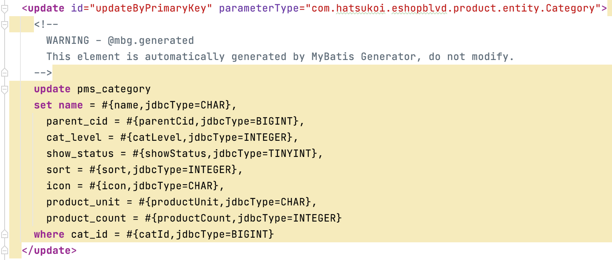
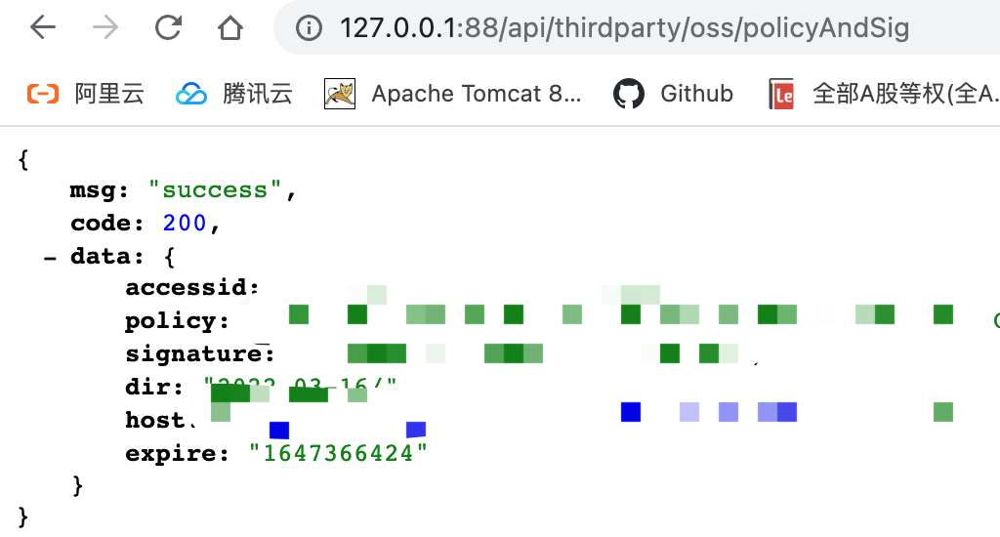
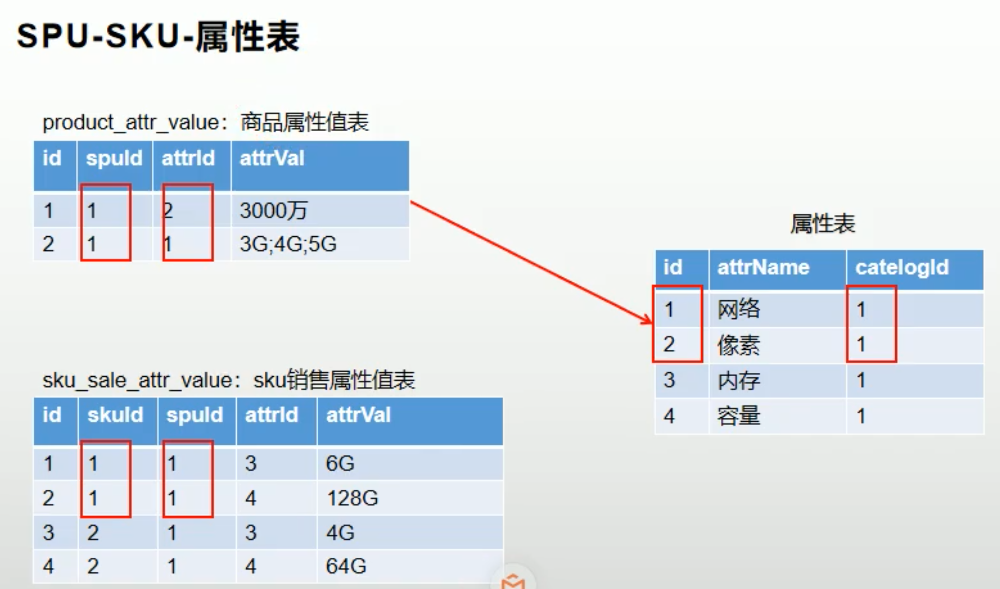
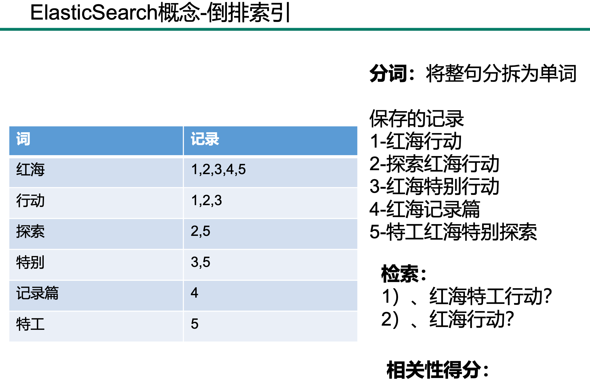

# eshopblvd

## 概述

电商项目


## 云服务器

添置一台阿里云ECS服务器(CentOS 7.9)，安全组设置中添加常用端口：80(http), 22(ssh), 3306(mysql), 6379(redis)等，重置实例密码后重启服务器

通过ssh建立会话远程连接云服务器

```shell
$ ssh root@远程服务器公网ip地址
根据prompt输入实例密码
```

localhost免密码登陆远程云服务器

```shell
本地: 生成本地公钥和私钥，并通过scp指令将公钥安全拷贝到远程服务器.ssh目录下
$ ssh-keygen -t rsa
$ scp id_rsa.pub root@远程服务器公网ip地址:~/.ssh/id_rsa.pub

远程: 将公钥内容追加到~/.ssh/authorized_keys中
$ cd ~/.ssh && cat id_rsa.pub >> authorized_keys

这样下次ssh登陆服务器时就不用输入密码
```

ssh连接长时间不操作保持不断开

```shell
配置下服务器的/etc/ssh/sshd_config文件
Host *
    # 断开时重试连接的次数
    ServerAliveCountMax 600
    # 每隔30秒自动发送一个空的请求以保持连接
    ServerAliveInterval 10

重启一下ssh服务
$ systemctl restart sshd
```

```shell
查看可用内存
free -m
切换到root用户
su root
```

## Docker

### Docker上手

使用Docker虚拟化容器技术来隔离软件(mysql, redis, elasticsearch, rabbitmq等)的运行时环境

centos上安装docker并启动，可参考文档

[Install Docker Engine on CentOS | Docker Documentation](https://docs.docker.com/engine/install/centos/)

```shell
$ sudo yum install -y yum-utils

$ sudo yum-config-manager \
    --add-repo \
    https://download.docker.com/linux/centos/docker-ce.repo

$ sudo yum install docker-ce docker-ce-cli containerd.io

$ systemctl enable docker

$ systemctl start docker
```

docker相关指令

```shell
启动docker
$ systemctl start docker

检查docker镜像
$ docker images

docker开机自动启动
$ systemctl enable docker

查看正在运行的docker容器
$ docker ps

查看所有的docker容器
$ docker ps -a

重启某一docker容器
$ docker restart xxx

停止/删除某一docker容器/镜像
$ docker stop ${CONTAINER_ID}
$ docker rm ${CONTAINER_ID}
$ docker image rm 

查看某一容器的日志，排查错误
docker logs ${容器名}

查看容器的cpu占用率、内存使用
docker stats
```

配置docker阿里云镜像加速

```bash
mkdir -p /etc/docker
tee /etc/docker/daemon.json <<-'EOF'
{
  "registry-mirrors": ["https://uizv1b1t.mirror.aliyuncs.com"]
}
EOF
systemctl daemon-reload
systemctl restart docker
```

### docker容器启动mysql

```shell
拉取镜像
$ docker pull mysql:5.7

启动mysql容器，3306:3306将容器3306端口映射到主机3306端口
-v表示容器内部目录挂载到centos的对应目录（日志、持久化数据、配置）
$ docker run -p 3306:3306 --name mysql \
-v /mount_data/mysql/log:/var/log/mysql \
-v /mount_data/mysql/data:/var/lib/mysql \
-v /mount_data/mysql/conf:/etc/mysql \
-e MYSQL_ROOT_PASSWORD=root \
-d mysql:5.7

进入mysql容器内部控制台
$ docker exec -it mysql /bin/bash
$ exit;
```

mysql配置修改

```shell
$ cd /mount_data/mysql/conf
$ vi my.cnf

插入下面的配置，设置编码方式
[client]
default-character-set=utf8
[mysql]
default-character-set=utf8
[mysqld]
init_connect='SET collation_connection = utf8_unicode_ci'
init_connect='SET NAMES utf8'
character-set-server=utf8
collation-server=utf8_unicode_ci
skip-character-set-client-handshake
skip-name-resolve

$ docker restart mysql

设置启动docker时，即运行mysql
$ docker update mysql --restart=always
```

### docker容器启动redis

拉取镜像、启动容器

```shell
$ docker pull redis
$ mkdir -p /mount_data/redis/conf
$ touch /mount_data/redis/conf/redis.conf

配置redis启用AOF持久化方式
$ echo "appendonly yes"  >> /mydata/redis/conf/redis.conf

$ docker run -p 6379:6379 --name redis -v /mount_data/redis/data:/data \
-v /mount_data/redis/conf/redis.conf:/etc/redis/redis.conf \
-d redis redis-server /etc/redis/redis.conf

设置启动docker时，即运行redis
$ docker update redis --restart=always
```

进入redis容器的client命令行，这样就可以快乐地玩耍redis命令了

```shell
$ docker exec -it redis redis-cli
```


## 项目结构初始化

商品服务、用户服务、订单服务、优惠券服务、仓储服务、后台管理系统

最外层通过module来聚合所有微服务

每个微服务对应的数据库的建立

TODO：所有数据库表结构的解析

## 后台管理系统前端项目

前端系统Vue  [GitHub - weilingao/eshopblvd-admin-vue: 电商网站后台管理系统](https://github.com/weilingao/eshopblvd-admin-vue)

https://cn.vuejs.org/

[Vue CLI](https://cli.vuejs.org/#getting-started)

依赖安装&脚手架初始化&启动

```shell
$ npm install -g @vue/cli
$ npm install vue
$ npm install webpack -g
$ npm install -g @vue/cli-init
$ vue init webpack eshopblvd-admin-vue
$ npm run dev[](https://github.com/weilingao)
```

vue脚手架初始化工程，结合vue-router,element-ui，完成基础的侧菜单和展示内容的路由

## 创建公共库eshopblvd-common

放置公共的依赖、bean、工具类，每个微服务都来依赖公共库  

lombok依赖: @Data标注的实体类在编译期间自动加上getter、setter方法

#### Response 响应封装工具类

继承hashmap，key分别有code, msg, data

用来封装请求响应，功能包括快速构造500响应、200响应，响应内容的自定义

亮点：获取响应的时候可以通过泛型、fastjson的typereference来反序列化得到特定自定义类型的对象数据，使用TypeReference可以明确的指定[反序列化](https://so.csdn.net/so/search?q=%E5%8F%8D%E5%BA%8F%E5%88%97%E5%8C%96&spm=1001.2101.3001.7020)的类型

【面试】java泛型

[Java 泛型 | 菜鸟教程](https://www.runoob.com/java/java-generics.html)

【面试】Java泛型中T和问号（通配符）的区别

[Java泛型中T和问号（通配符）的区别_ikownyou的博客-CSDN博客_泛型通配符?和泛型t区别](https://blog.csdn.net/ikownyou/article/details/65630385)

【面试】java继承、重写override、重载overload

[Java 继承 | 菜鸟教程](https://www.runoob.com/java/java-inheritance.html)

[Java 重写(Override)与重载(Overload) | 菜鸟教程](https://www.runoob.com/java/java-override-overload.html)

## mybatis开发环境配置

TODO: 整合mybatis、page-helper实现分页功能[Mybatis 数据库物理分页插件 PageHelper - digdeep - 博客园](https://www.cnblogs.com/digdeep/p/4608933.html)，分页工具类、查询，common库里所有的工具类

- 引入mybatis相关依赖：mybatis、数据库驱动  

```xml
<!-- MyBatis-->
<dependency>
    <groupId>org.mybatis</groupId>
    <artifactId>mybatis</artifactId>
    <version>3.5.7</version>
</dependency>
<!--Mysql数据库驱动-->
<dependency>
    <groupId>mysql</groupId>
    <artifactId>mysql-connector-java</artifactId>
    <version>8.0.17</version>
</dependency>
<!-- https://mvnrepository.com/artifact/junit/junit -->
<dependency>
    <groupId>junit</groupId>
    <artifactId>junit</artifactId>
    <version>4.12</version>
    <scope>test</scope>
</dependency>
```

- mybatis - springboot整合

springboot作为ioc容器管理所有的组件，解决组件的动态依赖注入，控制事务

整合的目的是service业务逻辑层利用autowired自动装配dao层的组件来增删改查

官方docs：[GitHub - mybatis/spring-boot-starter: MyBatis integration with Spring Boot](https://github.com/mybatis/spring-boot-starter)

[SpringBoot整合MyBatis实战 | 包包的Tech Pool](https://www.baobao555.tech/posts/628531b3/)

引入springboot整合mybatis适配包(场景启动器)

```xml
<dependency>
    <groupId>org.mybatis.spring.boot</groupId>
    <artifactId>mybatis-spring-boot-starter</artifactId>
    <version>2.2.2</version>
</dependency>
```

- 配置

在application.yml配置数据源

```yml
spring:
  datasource:
    username: root
    password: root
    url: jdbc:mysql://47.103.8.41:3306/eshopblvd_pms
    driver-class-name: com.mysql.cj.jdbc.Driver
```

mybatis配置

@MapperScan注解告诉mapper接口的位置`

`@MapperScan("com.hatsukoi.eshopblvd.product.dao")`

配置xml映射文件位置

```yml
mybatis:
  mapper-locations: classpath*:**/mapper/*.xml
```

- 接下俩就是实现service业务层、controller了

【面试】mybatis的优缺点？

【面试】# MyBatis 中#{}和${}区别

[MyBatis 中#{}和${}区别_w3cschool](https://www.w3cschool.cn/mybatis/mybatis-yta93bpj.html)

【面试】 @Mapper 与 @MapperScan 的区别

[@Mapper 与 @MapperScan 的区别_那年那些事儿-CSDN博客_mapper和mapperscan](https://blog.csdn.net/xiaojin21cen/article/details/103273172)

参考wiki：

[SpringBoot | 3.2 &#x6574;&#x5408;MyBatis](https://www.wcqblog.com/article/detail/212298947711074304)

[SpringBoot整合MyBatis实战 | 包包的Tech Pool](https://www.baobao555.tech/posts/628531b3/)

https://github.com/mybatis/spring-boot-starter/wiki/Quick-Start

[# Spring Boot入门系列（十一）如何整合Mybatis](https://mp.weixin.qq.com/s?__biz=MzAxMTY5NDAwOA==&mid=2651415559&idx=1&sn=8b8f6aeaaee93923fd0fd6f90fa8ac74&chksm=8040fed0b73777c62886f7d932fbac447b6f7b482cffd650fcacc93f9ae03e451a55d8a32554&scene=21#wechat_redirect)

[最详细的MyBatis批量添加、更新、删除实战篇（日常开发必看） - 掘金](https://juejin.cn/post/6974035016632238093)

## mybatis分页插件

官方docs：

[Mybatis-PageHelper/README_zh.md at master · pagehelper/Mybatis-PageHelper · GitHub](https://github.com/pagehelper/Mybatis-PageHelper/blob/master/README_zh.md)

[GitHub - pagehelper/pagehelper-spring-boot: pagehelper-spring-boot](https://github.com/pagehelper/pagehelper-spring-boot)

- 引入依赖

```xml
<!-- pagehelper -->
<dependency>    
    <groupId>com.github.pagehelper</groupId>    
    <artifactId>pagehelper-spring-boot-starter</artifactId>
    <version>1.3.0</version>
</dependency>
```

- 使用分页功能

```java
//在查询之前开启分页，加了这个之后pagehelper 插件就会通过其内部的拦截器，将执行的sql语句，转化为分页的sql语句
PageHelper.startPage(pageNum, pageSize);pageNum页码、pageSize每页多少条

//之后进行查询操作将自动进行分页
List<PmsBrand> brandList = brandMapper.selectByExample(new PmsBrandExample());

//通过构造PageInfo对象获取分页信息，如当前页码，总页数，总条数
//当前导航分页的个数，navigatePages，举例：3 4 「5」 6 7
PageInfo<PmsBrand> pageInfo = new PageInfo<PmsBrand>(brandList, 5);
```

common基础库添加通用分页数据封装类utils.CommonPageInfo，将pagehelper分页查询结果封装为通用分页封装结果

使用例子：

```java
public CommonPage<PmsProduct> productList(Long brandId, Integer pageNum, Integer pageSize) {
    PageHelper.startPage(pageNum,pageSize);
    PmsProductExample example = new PmsProductExample();
    example.createCriteria().andDeleteStatusEqualTo(0)
                .andBrandIdEqualTo(brandId);
    List<PmsProduct> productList = productMapper.selectByExample(example);
    return CommonPageInfo.convertToCommonPage(productList);
}
```

参考wiki：

[Spring Boot入门系列（十六）整合pagehelper，一秒实现分页功能！ - 云+社区 - 腾讯云](https://cloud.tencent.com/developer/article/1669256)

## mybatis代码生成器

MyBatis Generator可以通过配置生成基本的crud代码，包含了数据库表对应的实体类，Mapper接口类，XML映射文件和Example对象等

1. resource中创建generatorConfig.xml，用来配置数据库连接，生成的pojo、mapper.xml、dao接口存放的位置，配置数据库表
   
   - context的targetRuntime属性设置为MyBatis3，会有生成Example相关的代码和方法，反之可用MyBatis3Simple
   
   - Example类指定如何构建一个动态的where子句，属于*QBC*（Query By Criteria）风格的增删改查，和mybatis-plus的queryWrapper类似
     
     ```java
     TestTableExample example = new TestTableExample();
     example.createCriteria().andField1EqualTo(5);
     等于
     where field1 = 5
     ```
   
   - defaultModelType="flat"目的是使每个表只生成一个实体类
   
   ```xml
   <?xml version="1.0" encoding="UTF-8"?>
   <!DOCTYPE generatorConfiguration
           PUBLIC "-//mybatis.org//DTD MyBatis Generator Configuration 1.0//EN"
           "http://mybatis.org/dtd/mybatis-generator-config_1_0.dtd">
   
   <!-- 配置生成器 -->
   <generatorConfiguration>
       <properties resource="generator.properties"/>
       <!-- 配置对象环境 -->
       <context id="MySqlContext" targetRuntime="MyBatis3" defaultModelType="flat">
           <!-- 配置起始与结束标识符 -->
           <property name="beginningDemiliter" value="`"/>
           <property name="endingDemiliter" value="`"/>
           <!-- 配置注释生成器 -->
           <commentGenerator>
               <property name="suppressDate" value="true"/>
               <property name="addRemarkComments" value="true"/>
           </commentGenerator>
           <!--生成mapper.xml时覆盖原文件-->
           <plugin type="org.mybatis.generator.plugins.UnmergeableXmlMappersPlugin" />
           <!-- 为模型生成序列化方法-->
           <plugin type="org.mybatis.generator.plugins.SerializablePlugin"/>
           <!-- 为生成的Java模型创建一个toString方法 -->
           <plugin type="org.mybatis.generator.plugins.ToStringPlugin"/>
           <!--配置数据库连接-->
           <jdbcConnection driverClass="${jdbc.driverClass}"
                           connectionURL="${jdbc.connectionURL}"
                           userId="${jdbc.userId}"
                           password="${jdbc.password}">
               <!--解决mysql驱动升级到8.0后不生成指定数据库代码的问题-->
               <property name="nullCatalogMeansCurrent" value="true" />
           </jdbcConnection>
           <!--指定生成model的路径-->
           <javaModelGenerator targetPackage="com.hatsukoi.eshopblvd.${serviceName}.entity" targetProject="eshopblvd-mbg/src/main/java"/>
           <!--指定生成mapper.xml的路径-->
           <sqlMapGenerator targetPackage="dao.${serviceName}" targetProject="eshopblvd-mbg/src/main/resources"/>
           <!--指定生成mapper接口的的路径-->
           <javaClientGenerator targetPackage="com.hatsukoi.eshopblvd.${serviceName}.dao"
                                targetProject="eshopblvd-mbg/src/main/java"/>
           <!-- 配置数据库表，生成全部表tableName设为% -->
           <table tableName="%">
               <generatedKey column="id" sqlStatement="Mysql"/>
           </table>
       </context>
   </generatorConfiguration>
   ```
   
   2. 引入相关依赖
   
   ```xml
           <dependency>
               <groupId>org.mybatis</groupId>
               <artifactId>mybatis</artifactId>
               <version>3.5.5</version>
           </dependency>
           <!--MyBatis分页插件-->
           <dependency>
               <groupId>com.github.pagehelper</groupId>
               <artifactId>pagehelper-spring-boot-starter</artifactId>
               <version>1.3.0</version>
           </dependency>
           <!--集成druid连接池-->
           <dependency>
               <groupId>com.alibaba</groupId>
               <artifactId>druid-spring-boot-starter</artifactId>
               <version>1.1.23</version>
           </dependency>
           <!-- MyBatis 生成器 -->
           <dependency>
               <groupId>org.mybatis.generator</groupId>
               <artifactId>mybatis-generator-core</artifactId>
               <version>1.4.0</version>
           </dependency>
           <!--Mysql数据库驱动-->
           <dependency>
               <groupId>mysql</groupId>
               <artifactId>mysql-connector-java</artifactId>
               <version>8.0.17</version>
           </dependency>
       </dependencies>
   ```
   
   3. generator.properties里配置下接下来需要生成逆向工程的微服务信息
      
      ```json
      serviceName=product 微服务名称
      databaseName=Pms 数据库前缀
      ```
      
      并运行Mybatis Generator
   
   ```java
   /**
    * 用MyBatisGenerator生成逆向工程
    */
   public class EshopblvdMbgApplication {
       public static void main(String[] args) throws IOException, XMLParserException, SQLException, InterruptedException, InvalidConfigurationException {
           // 告警信息
           List<String> warnings = new ArrayList<>();
           // 当生成的代码重复时，覆盖原代码
           boolean overwrite = true;
           // 解析读取MybatisGenerator配置文件
           InputStream inputStream = EshopblvdMbgApplication.class.getResourceAsStream("/generatorConfig.xml");
           ConfigurationParser configurationParser = new ConfigurationParser(warnings);
           Configuration configuration = configurationParser.parseConfiguration(inputStream);
           inputStream.close();
   
           DefaultShellCallback callback = new DefaultShellCallback(overwrite);
           // 创建 MBG
           MyBatisGenerator myBatisGenerator = new MyBatisGenerator(configuration, callback, warnings);
           // 执行生成代码
           myBatisGenerator.generate(null);
           // 输出警告信息
           for (String warning : warnings) {
               System.out.println(warning);
           }
       }
   }
   ```

遇到的问题

1. The content of element type "context" must match "(property*,plugin*,commen...意思是代码生成配置文件要按照错误信息给出的顺序来写

2. com.mysql.cj.jdbc.exceptions.CommunicationsException: Communications link failure. javax.net.ssl.SSLHandshakeException: No appropriate protocol (protocol is disabled or cipher suites are inappropriate)
   
   一开始怀疑服务器端口没开放，查看mysql 3306端口是否打开`netstat -an|grep 3306`
   
   可能是mysql-connecter的驱动版本与数据库不一致的问题？这个也排除了
   
   看来是JDK8版本过高引起MySQL连接失败的，在jdbc连接url后拼接参数useSSL=false，问题解决～

3. 生成文件有数据库名字前缀，想要删除
   
   在配置文件中加上`<domainObjectRenamingRule searchString="^${databaseName}" replaceString=""/>`

参考文档：

https://segmentfault.com/a/1190000038622464

[参考文档](http://www.macrozheng.com/#/architect/mall_arch_01?id=mybatis-generator-%e9%85%8d%e7%bd%ae%e6%96%87%e4%bb%b6)

[MyBatis学习笔记（五）：代码生成器 | 程序人生](https://zjxkenshine.github.io/2018/03/29/MyBatis%E5%AD%A6%E4%B9%A0%E7%AC%94%E8%AE%B0%EF%BC%88%E4%BA%94%EF%BC%89%EF%BC%9A%E4%BB%A3%E7%A0%81%E7%94%9F%E6%88%90%E5%99%A8/)

[Example类使用说明 · Java 开源项目中文文档 · 看云](https://www.kancloud.cn/wizardforcel/java-opensource-doc/153016)

[Mybatis——Example用法 - 简书](https://www.jianshu.com/p/335960d6db6a)

#### Mybatis Generator Example 用法

[MyBatis Generator 生成的example 使用 and or 简单混合查询 - kaixinyufeng - 博客园](https://www.cnblogs.com/kaixinyufeng/p/8329954.html)

https://zhuanlan.zhihu.com/p/42411540

Example类用于构造复杂的筛选条件

- Criterion: mybatis-generator会为每个字段产生Criterion，是最基本,最底层的Where条件，用于字段级的筛选，例如：字段 in | not in | like | > | >= | < | <= | is not null | is null 等

- Criteria: 包含一个Cretiron的集合,每一个Criteria对象内包含的Cretiron之间是由AND连接的,是逻辑与的关系

- oredCriteria: Example内有一个成员叫oredCriteria,是Criteria的集合,这个集合中的Criteria是由OR连接的，是逻辑或关系

- or()方法，会产生一个新的Criteria对象,添加到oredCriteria中,并返回这个Criteria对象，从而可以链式表达，为其添加Criterion

例子1：**(a=? And b=?) or (a=? And c=?)**

**select * from demo WHERE ( a = ? and b = ? ) or ( a = ? and c = ? )**

```java
DemoExample example=new DemoExample();  

 DemoExample.Criteria criteria1=example.createCriteria();
 criteria1.andAEqualTo(?).andBEqualTo(?);  

 DemoExample.Criteria criteria2=example.createCriteria();
 criteria2.andAEqualTo(?).andCEqualTo(?);  

 example.or(criteria2);
```

例子2：**(a=? and (b=? or c=?))**

select * from demo WHERE ( a = ? and ( b = ? or c = ? ))

修改DemoExample.java文件，新增方法：

```java
public Criteria andOrDemo(String value){
    addCriterion("(b = \""+value+"\" or c = \""+value+"\")");
    return (Criteria) this;
}
```

```java
DemoExample example=new DemoExample();  
Criteria criteria = example.createCriteria();
criteria.andAEqualTo(?).andOrDemo(?);

SqlSession sqlSession = MyBatisUtil.openSession();
DemoMapper m = sqlSession.getMapper(DemoMapper.class);
m.countByExample(example);
```

## 验证环境是否搭建成功

```java
@Service
public class BrandServiceImpl implements BrandService {
    @Autowired
    private BrandMapper brandMapper;

    @Override
    public Brand selectBrandById(long brandId) {
        return brandMapper.selectByPrimaryKey(brandId);
    }

    @Override
    public CommonPageInfo<Brand> queryBrandsByShowStatus(int pageNum, int pageSize, byte showStatus) {
        PageHelper.startPage(pageNum, pageSize);
        BrandExample brandExample = new BrandExample();
        brandExample.createCriteria().andShowStatusEqualTo(showStatus);
        List<Brand> brandList = brandMapper.selectByExample(brandExample);
        return CommonPageInfo.convertToCommonPage(brandList);
    }
}
```

```java
@SpringBootTest
class EshopblvdProductApplicationTests {
    @Autowired
    BrandService brandService;

    @Test
    void contextLoads() {
        Brand brand = brandService.selectBrandById(1L);
        System.out.println("获取到的品牌是：" + brand);
        CommonPageInfo<Brand> brandCommonPageInfo = brandService.queryBrandsByShowStatus(2, 2, (byte) 1);
        System.out.println("目前能显示的第" + brandCommonPageInfo.getCurrPage() + "页的品牌是：" + brandCommonPageInfo.getListData());
    }
}
```

运行成功～！输出结果符合预期

## 分布式系统环境搭建


[Spring Cloud Alibaba](https://spring.io/projects/spring-cloud-alibaba)

[spring-cloud-alibaba/README-zh.md at 2.2.x · alibaba/spring-cloud-alibaba · GitHub](https://github.com/alibaba/spring-cloud-alibaba/blob/2.2.x/README-zh.md)

SpringCloud Alibaba - Nacos：服务发现/注册、配置中心

~~SpringCloud - Ribbon：负载均衡~~

SpringCloud - Gateway：API网关

Apache Dubbo: RPC框架

SpringAlibaba - Sentinel: 服务容错（限流、降级、熔断）

SpringCloud - Sleuth:调用链监控

SpringCloud Alibaba - Seata：分布式事务解决方案

接下来就是将各个依赖引入common基础库中

引入依赖前，先看springcloud-alibaba中组件的版本兼容关系：随便选版本很容易启动项目时候报错

[版本说明 · alibaba/spring-cloud-alibaba Wiki · GitHub](https://github.com/alibaba/spring-cloud-alibaba/wiki/%E7%89%88%E6%9C%AC%E8%AF%B4%E6%98%8E)

#### SpringCloud-alibaba依赖引入

```xml
<dependencyManagement>
    <dependencies>
        <dependency>
            <groupId>com.alibaba.cloud</groupId>
            <artifactId>spring-cloud-alibaba-dependencies</artifactId>
            <version>2.2.7.RELEASE</version>
            <type>pom</type>
            <scope>import</scope>
        </dependency>
    </dependencies>
</dependencyManagement>
```

#### SpringCloud Alibaba-Nacos

接入注册中心，引入 Nacos Discovery Starter

```xml
 <dependency>
     <groupId>com.alibaba.cloud</groupId>
     <artifactId>spring-cloud-starter-alibaba-nacos-discovery</artifactId>
 </dependency>
```

1. 本地启动nacos-server，下载2.0.2[Releases · alibaba/nacos · GitHub](https://github.com/alibaba/nacos/releases)

直接运行nacos/bin/startup.sh，完事儿～

2. 通过docker启动nacos-server，来到我们的centos，先拉取docker镜像

https://hub.docker.com/r/nacos/nacos-server

```shell
无视这条
$ docker pull nacos/nacos-server
```

快速启动docker容器

```shell
docker run --name nacos -e ES_JAVA_OPTS="-Xms64m -Xmx128m" -e MODE=standalone -d -p 8848:8848 -p 9848:9848 -p 9849:9849 nacos/nacos-server:2.0.3 --restart=always
```

- 注意⚠️：Nacos2.0版本相比1.X新增了gRPC的通信方式，因此需要增加2个端口。新增端口是在配置的主端口(server.port)基础上，进行一定偏移量自动生成。
- 

最后别忘了去安全组暴露下8848端口(主端口)，9848 9849

现在可以通过`服务器地址:8848/nacos`访问注册中心啦，用户名/密码均为nacos

需要注册的微服务下yml里配置：

```yml
  cloud:
    nacos:
      discovery:
        server-addr: 服务器地址:8848
```

使用 @EnableDiscoveryClient 注解开启服务注册与发现功能

```java
@SpringBootApplication
 @EnableDiscoveryClient
 public class ProviderApplication {

     public static void main(String[] args) {
         SpringApplication.run(ProviderApplication.class, args);
     }

     @RestController
     class EchoController {
         @GetMapping(value = "/echo/{string}")
         public String echo(@PathVariable String string) {
                 return string;
         }
     }
 }
```

为微服务起名，这样才能被注册

```yml
   application:
    name: eshopblvd-product
```

服务一启动，就能在服务列表中看到我们的微服务了


#### springboot整合dubbo

[Dubbo3 简介 | Apache Dubbo](https://dubbo.apache.org/zh/docs/introduction/)

[Dubbo 融合 Nacos 成为注册中心](https://nacos.io/zh-cn/docs/use-nacos-with-dubbo.html)

[Dubbo 外部化配置 - 小马哥的技术博客](https://mercyblitz.github.io/2018/01/18/Dubbo-%E5%A4%96%E9%83%A8%E5%8C%96%E9%85%8D%E7%BD%AE/)

[版本说明 · alibaba/spring-cloud-alibaba Wiki · GitHub](https://github.com/alibaba/spring-cloud-alibaba/wiki/%E7%89%88%E6%9C%AC%E8%AF%B4%E6%98%8E)

[注解配置 | Apache Dubbo](https://dubbo.apache.org/zh/docs/references/configuration/annotation/)

1. 依赖导入dubbo-starter、其他依赖

https://github.com/apache/dubbo-spring-boot-project/blob/0.2.x/README_CN.md

版本选择要按照上面的版本说明wiki来，不然很容易报错

```xml
        <!--Nacos注册中心-->
        <dependency>
            <groupId>com.alibaba.cloud</groupId>
            <artifactId>spring-cloud-starter-alibaba-nacos-discovery</artifactId>
            <exclusions>
                <exclusion>
                    <groupId>com.alibaba.spring</groupId>
                    <artifactId>spring-context-support</artifactId>
                </exclusion>
            </exclusions>
        </dependency>

        <!-- https://mvnrepository.com/artifact/org.apache.dubbo/dubbo -->
        <dependency>
            <groupId>org.apache.dubbo</groupId>
            <artifactId>dubbo</artifactId>
            <version>2.7.13</version>
        </dependency>

        <dependency>
            <groupId>com.alibaba.spring</groupId>
            <artifactId>spring-context-support</artifactId>
            <version>1.0.11</version>
        </dependency>
```

2. 配置provider

假设 Nacos Server 同样运行在服务器 `10.20.153.10` 上，并使用默认 Nacos 服务端口 `8848`，您只需将 `dubbo.registry.address` 属性调整如下：

```yml
## Nacos registry address
dubbo.registry.address = nacos://10.20.153.10:8848
```

完成业务服务层的逻辑，暴露服务

```java
在服务上加注解
@com.alibaba.dubbo.config.annotation.Service
```

在主程序开始基于注解的dubbo功能

```java
@EnableDubbo
```

这样配置的服务就会注册到nacos了


3. 编写接口&配置consumer

common基础库里定义好provider service的接口（类似于远程服务接口的声明、签名），消费者引用远程provider服务时用，基础库service包下，后续会从注册中心自动发现provider地址

```java
@Reference
ProviderTest providerTest;
```

配置好yml

在主程序开始基于注解的dubbo功能

```java
@EnableDubbo
```

demo具体例子可参考：[GitHub - 7Savage/DubboStudy: 尚硅谷Dubbo学习](https://github.com/7Savage/DubboStudy)

[springboot-dubbo: springboot整合dubbo，yml配置dubbo，完全抛弃xml配置 - Gitee.com](https://gitee.com/chrismayday/springboot-dubbo/tree/master)

[Dubbo 融合 Nacos 成为注册中心](https://nacos.io/zh-cn/docs/use-nacos-with-dubbo.html)

[官方wiki](https://dubbo.apache.org/zh/docs/v3.0/references/configuration/references/metadata/)

最终实现：

[dubbo-consumer-demo](./dubbo-consumer-demo)

[dubbo-provider-demo](./dubbo-provider-demo)

demo的逻辑是provider提供服务，返回字符串“You get response from provider!”，consumer新增一个controller，调用cosumer的服务，其中远程调用了provider的服务，最终返回provider服务返回的字符串

踩坑记录：

1. com.alibaba.dubbo.rpc.RpcException: Fail to start server(url: dubbo://xxx.xxx.xxx.xxx:20880/, Failed to bind NettyServer on /xxx.xxx.xxx.xxx:20880, cause: Failed to bind to: /0.0.0.0:20880

解决：报错信息显示绑定到本机的20880端口失败，本地绑定的地址已经被使用，将dubbo.protocol.port的端口号其他非占用端口

2. com.alibaba.dubbo.rpc.RpcException: No provider available from registry xxx for service

解决：provider的接口我定义在基础库了，基础库的包路径和实际provider的包路径不同了，由于provider是根据service的报路径来命名的，例如providers:com.hatsukoi.eshopblvd.provider.Service.ProviderService，所以根因就是consumer在引用provider的接口时发现nacos中没有这个命名的服务，解决方案就是provider的service实现和consumer引用reference就直接用导入common库包下的接口

以后服务接口声明只放在common基础库了

3. @DubboReference dependencies is failed解决办法

```java
@Reference(check = false, interfaceName = "com.hatsukoi.eshopblvd.coupon.service.SkuFullReductionService")
SkuFullReductionService skuFullReductionService;
```

4. com.alibaba.dubbo.rpc.RpcException: Failed to invoke the method findGoodsById in the service com.qingcheng.service.goods.SpuService. Tried 3 times
   
   序列化的问题，实体类都实现了序列化就好了

最终，问题都解决了～nacos成功服务发现，返回结果符合预期


### Nacos配置中心

官方文档: [spring-cloud-alibaba/readme-zh.md at 2.2.x · alibaba/spring-cloud-alibaba · GitHub](https://github.com/alibaba/spring-cloud-alibaba/blob/2.2.x/spring-cloud-alibaba-examples/nacos-example/nacos-config-example/readme-zh.md)

先导入依赖

```xml
<dependency>
    <groupId>com.alibaba.cloud</groupId>
    <artifactId>spring-cloud-starter-alibaba-nacos-config</artifactId>
</dependency>
```

springboot 规定bootstrap.properties优先于application.properties加载

在应用的 /src/main/resources/bootstrap.properties 配置文件中配置 Nacos Config 元数据

```properties
spring.application.name=nacos-config-example
spring.cloud.nacos.config.server-addr=127.0.0.1:8848
```

```java
@Value注解可以直接获取application.properties中的配置
@Value("${spring.application.name}")
private String name;
```

目的是在配置中心动态改配置，而不是在本地改完配置文件重新打包部署

在nacos创建dataid为eshopblvd-coupon.properties的配置，默认以服务名来命名


为了nacos中修改的配置能够被动态地刷新，在控制器应用加上注解@RefreshScope

```java
@RefreshScope
@RestController
@RequestMapping("/coupon")
public class CouponController {
    // ...
}
```

再根据`@Value("${xxx}")`来获取配置的值

如果配置中心和当前应用的配置文件中都配置了相同的项，优先使用配置中心的配置

#### 命名空间

作用是为了配置隔离

- 基于环境进行隔离

默认：public(保留空间)；默认新增的所有配置都在public空间。  

用途举例：开发，测试，生产：利用命名空间来做环境隔离。  

注意：在bootstrap.properties；配置上，需要使用哪个命名空间下的配置

```properties
spring.cloud.nacos.config.namespace=9de62e44-cd2a-4a82-bf5c-95878bd5e871
```

9de62e44-cd2a-4a82-bf5c-95878bd5e871为命名空间自动生成的id


- 基于微服务之间进行隔离

当然每一个微服务之间为了互相隔离配置，每一个微服务也可以创建自己的命名空间，只加载自己命名空间下的所有配置  

#### 配置集

一组相关或者不相关的配置项的集合称为配置集，类似于一个配置yml文件

#### 配置集ID

类似配置文件名，在nacos中就是Data ID

#### 配置分组

默认所有的配置集都属于：DEFAULT_GROUP，后续可以根据业务来定制


```properties
指定配置的group
spring.cloud.nacos.config.group=CUSTOM_GROUP
```

本项目中的使用：每个微服务创建自己的命名空间，使用配置分组group区分环境，dev，test，prod，这些在bootstrap.properties都可以制定


#### 同时加载多个配置集

当微服务数量很庞大时，将所有配置都书写到一个配置文件中，显然不是太合适。对此我们可以将配置按照功能的不同，拆分为不同的配置文件。可以将数据源有关的配置写到一个配置文件中，框架有关的写到另外一个配置文件中

微服务任何配置信息，任何配置文件都可以放在配置中心中，只需要在bootstrap.properties说明加载配置中心中哪些配置文件即可

datasource.yml、mybatis.yml、other.yml为nacos的配置集

bootstrap.properties举例:

```yml
spring.application.name=gulimall-coupon

spring.cloud.nacos.config.server-addr=127.0.0.1:8848
spring.cloud.nacos.config.namespace=1986f4f3-69e0-43bb-859c-abe427b19f3a

spring.cloud.nacos.config.ext-config[0].data-id=datasource.yml
spring.cloud.nacos.config.ext-config[0].group=dev
spring.cloud.nacos.config.ext-config[0].refresh=true

spring.cloud.nacos.config.ext-config[1].data-id=mybatis.yml
spring.cloud.nacos.config.ext-config[1].group=dev
spring.cloud.nacos.config.ext-config[1].refresh=true

spring.cloud.nacos.config.ext-config[2].data-id=other.yml
spring.cloud.nacos.config.ext-config[2].group=dev
spring.cloud.nacos.config.ext-config[2].refresh=true
```

获取配置项的值使用这两个注解：`@Value，@ConfigurationProperties`

微服务只需要保留bootstrap.properties，一启动自动来配置中心获取配置，可以将所有配置都放在配置中心

## API网关

作用：

1. 动态地将请求路由到各个微服务，能从注册中心实时感知服务的上/下线

2. 鉴权、监控、限流、日志输出、统一功能的处理

### SpringCloud Gateway

官方wiki：[Spring Cloud Gateway](https://spring.io/projects/spring-cloud-gateway)

- 路由 (route)

路由是网关最基础的部分，路由信息有一个ID、一个目的URL、一组断言和一组 Filter 组成。如果断言路由为真，则说明请求的 URL 和配置匹配

- 断言 (predicate)

Java8 中的断言函数。Spring Cloud Gateway 中的断言函数输入类型是 Spring5.0 框
架中的 ServerWebExchange。Spring Cloud Gateway 中的断言函数允许开发者去定义匹配
来自于 http request 中的任何信息，比如请求头和参数等

- 过滤器 (filter)

一个标准的 Spring webFilter。过滤器 Filter 将会对请求和响应进行修改
处理

### 工作流程


客户端发送请求给网关，通过 HandlerMapping 判断是否请求满足某个路由，满足就发给网关的 WebHandler。这个 WebHandler 将请求交给一个过滤器链，然后请求再到达目标服务

新建网关模块，引入gateway依赖以及common库 

```xml
<dependency>
    <groupId>org.springframework.cloud</groupId>
    <artifactId>spring-cloud-starter-gateway</artifactId>
</dependency>
```

网关需要注册到nacos，需要发现其他服务的位置，添加服务注册发现注解

```java
@EnableDiscoveryClient
```

配置文件照常配置nacos注册中心地址、应用名称、配置中心地址

启动服务时可能会报错，请务必确认springboot, springcloud的版本映射关系正确

参考：[版本说明 · alibaba/spring-cloud-alibaba Wiki · GitHub](https://github.com/alibaba/spring-cloud-alibaba/wiki/%E7%89%88%E6%9C%AC%E8%AF%B4%E6%98%8E)

报错显示缺少负载均衡的依赖，添加相关依赖

```xml
<dependency>
    <groupId>org.springframework.cloud</groupId>
    <artifactId>spring-cloud-starter-loadbalancer</artifactId>
</dependency>
```

遇到报错：Failed to configure a DataSource: 'url' attribute is not specified and no embedded datasource，依赖中有mybatis

DataSourceAutoConfiguration会自动加载.可以排除此类的自动配置，在启动类中加入

```java
@SpringBootApplication(exclude= {DataSourceAutoConfiguration.class})
```

ok~服务启动，网关配置完成✅注册中心里已经有eshopblvd-gateway服务了

## 前端ES6 & Vue

[ES6语法&Vue基础知识总结](./docs/es6_vue.pdf)

## 后台系统业务开发

### 商品服务

#### 数据库设计


#### 三级分类查询

插入所有的商品分类数据pms_category.sql

功能#1：树形展示三级分类：查出所有的分类以及其子分类，并且以父子树形结构组装起来，最终能够展示在后台管理系统以及电商网站

- 查出所有的一级分类，可以根据属性parent_cid、cat_level来判断分类层级，parent_cid为0或者cat_level为1表示目前分类为第一级分类

- 为分类实体添加children属性，由于Category实体类实现了Serilizable接口，Category对象就可以被序列化，其中children不需要被序列化，换句话说就是仅存于调用者的内存中而不会写到磁盘里持久化，那么我们就可以在children字段前添加关键字transient`private transient List<Category> children;`，序列化对象的时候，这个属性就不会序列化到指定的目的地中
  
  【面试】[Java transient关键字使用小记 - Alexia(minmin) - 博客园](https://www.cnblogs.com/lanxuezaipiao/p/3369962.html)

- 递归树形结构：在所有分类中查找到所有一级分类的子分类，继续遍历递归找子分类的子分类直到叶层级分类，并用setChildren组装树结构，并排序
  
  【面试】这个递归查找的时间复杂度是？有没有优化空间？

- 前端：后台管理系统来到商品管理->分类管理的时候，created()生命周期钩子函数里发起请求获取三级分类

##### 跨源请求：同源策略

现在前端发的请求都是走API网关了，由于API网关的端口为80，和localhost:8080不同源，浏览器就会因为同源策略拦截跨源请求（同源策略：是指协议、域名、端口都要相同，其中有一个不同都会产生跨域）

- 跨域流程：
  
  

- 解决跨域：
  
  【面试】如何解决浏览器同源策略下无法跨域请求的问题？
  
  发预检请求问能不能跨域，服务器响应能跨域即可，即在预检请求的响应里配置相关的响应头
  
  
  
  所有请求响应都需要添加这些字段，所以在网关里添加一个过滤器去完成这个工作
  
  springboot提供了corswebfilter，将其放入容器就能起作用，在网关新建一个配置类CorsConfig用来做过滤，允许所有的请求跨域。
  
  ```java
  @Configuration
  public class CorsConfig {
      /**
       * Bean注解使其加入容器中
       * @return
       */
      @Bean
      public CorsWebFilter corsWebFilter() {
          UrlBasedCorsConfigurationSource source = new UrlBasedCorsConfigurationSource();
          // 跨域配置，*表示允许全部
          CorsConfiguration corsConfiguration = new CorsConfiguration();
          corsConfiguration.addAllowedHeader("*");
          corsConfiguration.addAllowedMethod("*");
          corsConfiguration.addAllowedOrigin("*");
          // 是否允许携带cookie进行跨域
          corsConfiguration.setAllowCredentials(true);
          // /**表示任意路径都要跨域配置
          source.registerCorsConfiguration("/**", corsConfiguration);
          return new CorsWebFilter(source);
      }
  }
  ```

- API网关添加商品服务的路由
  
  断言到路径匹配的，将其路径重写，去除/api
  
  ```yml
  spring: 
    cloud:
      gateway:
        routes:
          - id: product-route
            uri: lb://eshopblvd-product
            predicates:
              - Path=/api/product/**
            filters:
              - RewritePath=/api/(?<segment>.*),/$\{segment}
  ```

- 验证
  
  刷新网页～
  
  先发送预检请求：
  
  
  
  网关能够发现商品服务的地址，所以发给88端口API网关的请求成功负载均衡路由转发给商品服务，并返回三级分类的树形数据
  
  
  
  接下来就是通过vue展示出三级分类的内容了，这里不细展开了，直接去看前端代码就好
  
  

#### 三级分类删除/添加/修改

只有当前分类没有子分类的时候，才可以delete

只有当前分类是一级或二级分类的时候，才可以append

所有层级的分类都可以edit

- 批量删除
  
  这次批量删除是post请求
  
  @RequestBody:获取请求体，必须发送POST请求
  
  SpringMVC自动将请求体的数据（json），转为对应的对象
  
  ```java
  @RequestMapping("/delete")
  public CommonResponse deleteCategories(@RequestBody List<Long> catIds) {
      // ...    
  }
  ```
  
  这里的删除不是物理删除，而是逻辑删除，字段show_status为0代表这个分类被删除了，为1反之
  
  mybatis没有mybatis-plus那样逻辑删除的注解`@TableLogic`，这次就先不搞逻辑删除了
  
  删除逻辑是先生成example后，再根据这个criteria去删除数据
  
  ```java
      @Override
      public void removeCategoriesByIds(List<Long> catIds) {
          // TODO: 先检查当前删除的分类是否已经没有子分类或者是否被其他地方引用，没有才可以删
          // 根据catIds批量删除分类
          CategoryExample example = new CategoryExample();
          example.createCriteria().andCatIdIn(catIds);
          categoryMapper.deleteByExample(example);
      }
  ```
  
  成功删除！
  
  

- 添加分类：
  
  新增【接口】：/product/category/insert
  
  将对话框里填完的category实体对象发请求给接口

- 修改分类：
  
  新增【接口】：/product/category/update，/product/category/detail/{catId}
  
  /product/category/update 根据分类id查询：
  
  用selectByPrimaryKey来查询分类
  
  /product/category/detail/{catId} 根据catId去更新指定分类内容：updateByPrimaryKeySelective和updateByPrimaryKey的区别就是，updateByPrimaryKeySelective当某一实体类的属性为null时，mybatis会使用动态sql过滤掉，不更新该字段，selective就是部分更新
  
  updateByPrimaryKey 将为空的字段在数据库中置为NULL
  
  
  
  

- 前端逻辑：
  
  页面初始化时获取所有三级分类，点击删除时弹出对话框，确定后发送/delete请求后再次请求获取所有三级分类，且被删分类的父分类保持展开
  
  点击添加，提交表单后，将修改内容发请求给'/product/category/insert'后弹出修改成功消息，关闭对话框，刷新整个分类，并展开默认的分类
  
  点击修改，发送请求获取当前节点最新的数据，用作回显，提交表单后，将修改内容发请求给'/product/category/update'后弹出修改成功消息，关闭对话框，刷新整个分类，并展开默认的分类

#### 三级分类拖拽

- 限制可拖拽范围
  
  由于我们的菜单是三级分类，所以未防止超出三级的情况，有部分情况不允许被拖入：比如被拖拽的节点本身包含两级菜单，将其拖进第二层级的节点，那么最深层级就达到了四级，为防止这种情况的出现，我们需要编写在`<el-tree>`中绑定`allow-drop`属性并编写`allowDrop()`函数
  
  `allowDrop()`的思路为将被拖拽节点的子节点通过递归遍历找出最深节点的`level`，然后将被拖拽节点的相对深度与目标节点的相对深度相加，看是否超出最大深度3

- 拖拽完成
  
  拖拽完成后我们需要更新三个状态：
  
  1. 当前节点最新的父节点id，
  
  2. 当前拖拽节点的最新顺序，遍历姊妹节点的顺序即为新顺序
  
  3. 当前拖拽节点的最新层级，当前拖拽层级变化需要更新拖拽节点及其子节点

- 设置菜单拖动开关
  
  现在存在的一个问题是每次拖拽的时候，都会发送请求，更新数据库这样频繁的与数据库交互，现在想要实现一个拖拽过程中不更新数据库，拖拽完成后，通过`批量保存`统一提交拖拽后的数据

- 批量删除
  
  添加删除按钮
  
  【面试】批量更新的mybatis映射xml文件该怎么写？

#### 总结

- 这部分前端复杂逻辑较多，后端这里注意的点就两个，分类树结构的生成是否有优化空间，mybatis批量更新该如何做？

#### 品牌管理

**TODO: 品牌剩余的接口补齐实现 & 后台系统的属性分组功能**

##### 新增【接口】：根据关键字模糊分页查询品牌

product/brand/list

```sql
select * from pms_brand where name like %key% or brandId = key
```

这是一个好的学习example用法的例子

```java
    /**
     * 分页查询品牌列表
     * 查询条件：关键字为brand_id或是模糊查询brand_name
     * @return
     */
    @Override
    public CommonPageInfo<Brand> queryPageForBrands(Map<String, Object> params) {
        // 分页参数
        int pageNum = 1;
        int pageSize = 10;
        // 模糊搜索关键词
        String key = "";
        if (params.get("page") != null) {
            pageNum = Integer.parseInt(params.get("page").toString());
        }
        if (params.get("limit") != null) {
            pageSize = Integer.parseInt(params.get("limit").toString());
        }
        if (params.get("key") != null) {
            key = params.get("key").toString();
        }
        PageHelper.startPage(pageNum, pageSize);
        // select * from pms_brand where name like %key% or brandId = key
        BrandExample brandExample = new BrandExample();
        BrandExample.Criteria criteria1 = brandExample.createCriteria();
        // 关键词模糊查询品牌名
        if (!StringUtils.isEmpty(key)) {
            // sql like 通配符
            key = "%" + key + "%";
            criteria1.andNameLike(key);
        }
        // 关键字匹配brandId
        BrandExample.Criteria criteria2 = brandExample.createCriteria();
        if (!key.equals("") && StringUtils.isNumeric(key)) {
            criteria2.andBrandIdEqualTo(Long.parseLong(key));
        }
        brandExample.or(criteria2);
        List<Brand> brandList = brandMapper.selectByExample(brandExample);
        return CommonPageInfo.convertToCommonPage(brandList);
    }
```


参考wiki：[mybatis Example Criteria like 模糊查询_我在阴山下-CSDN博客_criteria.andlike](https://blog.csdn.net/ouzhuangzhuang/article/details/82758683)

##### 新增【接口】更新品牌的显示状态

product/brand/update/status

更新其showStatus

```java
    @Override
    public int updateStatus(Brand brand) {
        return brandMapper.updateByPrimaryKeySelective(brand);
    }
```

`@RequestParam`为获取get请求query参数

`@RequestBody`为获取post请求的请求体


##### 新增【接口】：获取品牌关联的分类

/product/categorybrandrelation/catelog/list

[15、获取品牌关联的分类 - 谷粒商城](https://easydoc.net/s/78237135/ZUqEdvA4/SxysgcEF)

```java
    @Override
    public List<CategoryBrandRelation> getCatelogListById(Long brandId) {
        CategoryBrandRelationExample example = new CategoryBrandRelationExample();
        example.createCriteria().andBrandIdEqualTo(brandId);
        List<CategoryBrandRelation> categoryBrandRelations = categoryBrandRelationMapper.selectByExample(example);
        return categoryBrandRelations;
    }
```

##### 新增【接口】：新增品牌与分类关联关系

product/categorybrandrelation/insert

[16、新增品牌与分类关联关系 - 谷粒商城](https://easydoc.net/s/78237135/ZUqEdvA4/7jWJki5e)

```java
    @Override
    public void insertCategoryBrandRelation(CategoryBrandRelation categoryBrandRelation) {
        Long brandId = categoryBrandRelation.getBrandId();
        Long catelogId = categoryBrandRelation.getCatelogId();
        // 查询品牌和分类的名字
        Brand brand = brandMapper.selectByPrimaryKey(brandId);
        Category category = categoryMapper.selectByPrimaryKey(catelogId);
        // 补充查询到信息：品牌和分类的名字
        categoryBrandRelation.setBrandName(brand.getName());
        categoryBrandRelation.setCatelogName(category.getName());
        categoryBrandRelationMapper.insert(categoryBrandRelation);
    }
```


一个品牌关联多个分类，一个分类下关联多个品牌

【面试】多对多的数据库表如何设计？

多对多一般就会新增一个中间表作冗余存储，比如pms_category_brand_relation，用来保存哪个品牌关联了哪个分类，否则关联查询对数据库性能有非常大的影响，因为表大

如果brand_name和catelog_name在真正的品牌表和分类表更新的话，中间表的数据需要同步


品牌更新时更新品牌的时候更新关联表的冗余字段

根据brandId更新品牌名

```java
    @Transactional
    @Override
    public int updateBrand(Brand brand) {
        int count = brandMapper.updateByPrimaryKeySelective(brand);
        // 保证冗余字段的数据一致性
        if (!StringUtils.isEmpty(brand.getName())) {
            categoryBrandRelationService.updateBrand(brand.getBrandId(), brand.getName());
        }
        // TODO: 更新其他相关联的表，冗余存储
        return count;
    }
```

更新分类的时候更新关联表的冗余字段

根据catId更新catelogName

```java
    /**
     * 更新分类的时候更新关联表的冗余字段
     * 根据catId更新catelogName
     * @param catId
     * @param name
     */
    @Override
    public void updateCategory(Long catId, String name) {
        CategoryBrandRelation categoryBrandRelation = new CategoryBrandRelation();
        categoryBrandRelation.setCatelogId(catId);
        categoryBrandRelation.setCatelogName(name);
        CategoryBrandRelationExample example = new CategoryBrandRelationExample();
        example.createCriteria().andCatelogIdEqualTo(catId);
        categoryBrandRelationMapper.updateByExampleSelective(categoryBrandRelation, example);
    }
```

新增配置类，开始事务管理

```java
@Configuration
@EnableTransactionManagement
@MapperScan("com.hatsukoi.eshopblvd.product")
public class MybatisConfig {
}
```

在刚才那些级联更新的服务都加上事务注解

```java
    @Override
    @Transactional
    public void updateCategory(Category category) {
        // ...
    }
```

#### 文件存储阿里云OSS

- 传统的单体应用：
  
  浏览器上传文件，储存在业务服务器，下次需要文件，再请求
  
  和传统的单体应用不同，一个微服务由多个分布式服务器，那总不能每台服务器上都存上一摸一样的文件，所以这里我们选择将数据上传到统一的文件服务器上。这里我们选择将图片放置到阿里云上，使用对象存储。
  
  

- 阿里云OSS
  
  阿里云OSS API文档：[简介 - 对象存储 OSS - 阿里云](https://help.aliyun.com/document_detail/31947.html?spm=5176.8465980.help.dexternal.4e701450ADp3n3)
  
  专业术语
  
  
  
  创建一个空间bucket
  
  

- 文件上传方式选择
  
  第一种
  
  缺点：中间经过自己服务器，完全没必要，还浪费服务器性能 
  
  
  
  第二种
  
  由于上传需要的账号密码不能暴露在js，所以让服务器签名后上传oss，账号密码还是放在服务器。前端问服务器要policy上传策略，服务器利用阿里云的账号密码生成一个防伪签名，其中包含了访问阿里云的授权令牌、阿里云oss上传地址等信息。前端得到这些信息后，其中没有账号密码，前端带着防伪签名、文件传给阿里云

- 
  
  引入依赖
  
  ```xml
  <dependency>
      <groupId>com.aliyun.oss</groupId>
      <artifactId>aliyun-sdk-oss</artifactId>
      <version>3.10.2</version>
  </dependency>
  ```
  
  Java简单上传例子：[简单上传 - 对象存储 OSS - 阿里云](https://help.aliyun.com/document_detail/84781.html)
  
  1. 创建存储空间
  
  2. 获取供外网访问的endpoint（文件上传的地址）
  
  3. RAM控制台创建RAM用户，获取accesskey id和accesskey secret
  
  4. 给子用户添加权限「管理对象存储服务(OSS)权限」
  
  阿里云提供的例子（原生sdk）：

```java
import com.aliyun.oss.ClientException;
import com.aliyun.oss.OSS;
import com.aliyun.oss.OSSClientBuilder;
import com.aliyun.oss.OSSException;
import java.io.FileInputStream;
import java.io.InputStream;

public class Demo {

    public static void main(String[] args) throws Exception {
        // Endpoint以华东1（杭州）为例，其它Region请按实际情况填写。
        String endpoint = "https://oss-cn-hangzhou.aliyuncs.com";
        // 阿里云账号AccessKey拥有所有API的访问权限，风险很高。强烈建议您创建并使用RAM用户进行API访问或日常运维，请登录RAM控制台创建RAM用户。
        String accessKeyId = "yourAccessKeyId";
        String accessKeySecret = "yourAccessKeySecret";
        // 填写Bucket名称，例如examplebucket。
        String bucketName = "examplebucket";
        // 填写Object完整路径，完整路径中不能包含Bucket名称，例如exampledir/exampleobject.txt。
        String objectName = "exampledir/exampleobject.txt";
        // 填写本地文件的完整路径，例如D:\\localpath\\examplefile.txt。
        // 如果未指定本地路径，则默认从示例程序所属项目对应本地路径中上传文件流。
        String filePath= "D:\\localpath\\examplefile.txt";

        // 创建OSSClient实例。
        OSS ossClient = new OSSClientBuilder().build(endpoint, accessKeyId, accessKeySecret);

        try {
            InputStream inputStream = new FileInputStream(filePath);            
            // 创建PutObject请求。
            ossClient.putObject(bucketName, objectName, inputStream);
        } catch (OSSException oe) {
            System.out.println("Caught an OSSException, which means your request made it to OSS, "
                    + "but was rejected with an error response for some reason.");
            System.out.println("Error Message:" + oe.getErrorMessage());
            System.out.println("Error Code:" + oe.getErrorCode());
            System.out.println("Request ID:" + oe.getRequestId());
            System.out.println("Host ID:" + oe.getHostId());
        } catch (ClientException ce) {
            System.out.println("Caught an ClientException, which means the client encountered "
                    + "a serious internal problem while trying to communicate with OSS, "
                    + "such as not being able to access the network.");
            System.out.println("Error Message:" + ce.getMessage());
        } finally {
            if (ossClient != null) {
                ossClient.shutdown();
            }
        }
    }
}                  
```

[aliyun-spring-boot/aliyun-spring-boot-samples/aliyun-oss-spring-boot-sample at master · alibaba/aliyun-spring-boot · GitHub](https://github.com/alibaba/aliyun-spring-boot/tree/master/aliyun-spring-boot-samples/aliyun-oss-spring-boot-sample)

不用原生sdk了，换成springcloud alibaba oss

**业务逻辑**

创建一个微服务来整合所有第三方服务eshopblvd-thirdparty

1. 引入starter依赖

```xml
    <dependency>
        <groupId>com.alibaba.cloud</groupId>
        <artifactId>spring-cloud-starter-alicloud-oss</artifactId>
        <version>2.2.0.RELEASE</version>
    </dependency> 
```

2. 配置accessKeyId, secretAccessKey, endpoint

```yml
spring:
  cloud:
    alicloud:
      access-key: LTAI4G4W1RA4JXz2QhoDwHhi
      secret-key: R99lmDOJumF2x43ZBKT259Qpe70Oxw
      oss:
        endpoint: oss-cn-shanghai.aliyuncs.com
```

3. 配置文件，注册到注册中心
   
   ```yml
   spring:
     application:
       name: gulimall-third-party
     cloud:
       nacos:
         discovery:
           server-addr: 47.103.8.41:8848
   server:
     port: 30000
   ```

4. 在主启动类中开启服务的注册和发现`@EnableDiscoveryClient`

5. 注入ossclient来操作文件上传下载等操作

```java
@Autowired
private OSSClient ossClient;
```

最终采取方案：服务端签名后直传 [服务端签名后直传 - 对象存储 OSS - 阿里云](https://help.aliyun.com/document_detail/31926.html)

采用JavaScript客户端直接签名（参见[JavaScript客户端签名直传](https://help.aliyun.com/document_detail/31925.html#concept-frd-4gy-5db)）时，AccessKeyID和AcessKeySecret会暴露在前端页面，因此存在严重的安全隐患。因此，OSS提供了服务端签名后直传的方案。

服务端签名后直传的原理如下：

1. 用户发送上传Policy请求到应用服务器。
2. 应用服务器返回上传Policy和签名给用户。
3. 用户直接上传数据到OSS。


签名该如何获取？[Java - 对象存储 OSS - 阿里云](https://help.aliyun.com/document_detail/91868.htm?spm=a2c4g.11186623.0.0.16073967A7h3hQ#concept-ahk-rfz-2fb)

签名直传服务

签名直传服务响应客户端发送给应用服务器的GET消息，代码片段如下：

```java
protected void doGet(HttpServletRequest request, HttpServletResponse response)
            throws ServletException, IOException {

        // 阿里云账号AccessKey拥有所有API的访问权限，风险很高。强烈建议您创建并使用RAM用户进行API访问或日常运维，请登录RAM控制台创建RAM用户。
       String accessId = "yourAccessKeyId";      
       String accessKey = "yourAccessKeySecret"; 
       // Endpoint以华东1（杭州）为例，其它Region请按实际情况填写。
       String endpoint = "oss-cn-hangzhou.aliyuncs.com"; 
       // 填写Bucket名称，例如examplebucket。
       String bucket = "examplebucket"; 
       // 填写Host名称，格式为https://bucketname.endpoint。                   
       String host = "https://examplebucket.oss-cn-hangzhou.aliyuncs.com"; 
       // 设置上传回调URL，即回调服务器地址，用于处理应用服务器与OSS之间的通信。OSS会在文件上传完成后，把文件上传信息通过此回调URL发送给应用服务器。
       String callbackUrl = "https://192.168.0.0:8888";
       // 设置上传到OSS文件的前缀，可置空此项。置空后，文件将上传至Bucket的根目录下。
       String dir = "exampledir/"; 

        // 创建OSSClient实例。
        OSS ossClient = new OSSClientBuilder().build(endpoint, accessId, accessKey);
        try {
            long expireTime = 30;
            long expireEndTime = System.currentTimeMillis() + expireTime * 1000;
            Date expiration = new Date(expireEndTime);
            // PostObject请求最大可支持的文件大小为5 GB，即CONTENT_LENGTH_RANGE为5*1024*1024*1024。
            PolicyConditions policyConds = new PolicyConditions();
            policyConds.addConditionItem(PolicyConditions.COND_CONTENT_LENGTH_RANGE, 0, 1048576000);
            policyConds.addConditionItem(MatchMode.StartWith, PolicyConditions.COND_KEY, dir);

            String postPolicy = ossClient.generatePostPolicy(expiration, policyConds);
            byte[] binaryData = postPolicy.getBytes("utf-8");
            String encodedPolicy = BinaryUtil.toBase64String(binaryData);
            String postSignature = ossClient.calculatePostSignature(postPolicy);

            Map<String, String> respMap = new LinkedHashMap<String, String>();
            respMap.put("accessid", accessId);
            respMap.put("policy", encodedPolicy);
            respMap.put("signature", postSignature);
            respMap.put("dir", dir);
            respMap.put("host", host);
            respMap.put("expire", String.valueOf(expireEndTime / 1000));
            // respMap.put("expire", formatISO8601Date(expiration));

            JSONObject jasonCallback = new JSONObject();
            jasonCallback.put("callbackUrl", callbackUrl);
            jasonCallback.put("callbackBody",
                    "filename=${object}&size=${size}&mimeType=${mimeType}&height=${imageInfo.height}&width=${imageInfo.width}");
            jasonCallback.put("callbackBodyType", "application/x-www-form-urlencoded");
            String base64CallbackBody = BinaryUtil.toBase64String(jasonCallback.toString().getBytes());
            respMap.put("callback", base64CallbackBody);

            JSONObject ja1 = JSONObject.fromObject(respMap);
            // System.out.println(ja1.toString());
            response.setHeader("Access-Control-Allow-Origin", "*");
            response.setHeader("Access-Control-Allow-Methods", "GET, POST");
            response(request, response, ja1.toString());

        } catch (Exception e) {
            // Assert.fail(e.getMessage());
            System.out.println(e.getMessage());
        } finally { 
            ossClient.shutdown();
        }
    }
```

最后三方服务新增controller，endpoint，bucket, accessId等信息从配置文件中取

返回上传policy（包括文件的放置路径）和签名

```java
@RequestMapping("thirdParty")
@RestController
public class OSSController{

    @Autowired
    OSS ossClient;

    @Value("${spring.cloud.alicloud.oss.endpoint}")
    private String endpoint;
    @Value("${spring.cloud.alicloud.oss.bucket}")
    private String bucket;
    @Value("${spring.cloud.alicloud.access-key}")
    private String accessId;

    /**
     * 返回给客户端oss上传策略和签名
     * 让客户端自己去直传
     * @return
     */
    @RequestMapping("/oss/policyAndSig")
    public CommonResponse getPolicyAndSignature() {
        // 填写Host名称，格式为https://bucketname.endpoint。
        String host = "https://" + bucket + "." + endpoint;
        // 设置上传到OSS文件的前缀，可置空此项。置空后，文件将上传至Bucket的根目录下。
        String format = new SimpleDateFormat("yyyy-MM-dd").format(new Date());
        String dir = format + "/";
        Map<String, String> respMap = null;
        try {
            long expireTime = 30;
            long expireEndTime = System.currentTimeMillis() + expireTime * 1000;
            Date expiration = new Date(expireEndTime);
            // PostObject请求最大可支持的文件大小为5 GB，即CONTENT_LENGTH_RANGE为5*1024*1024*1024。
            PolicyConditions policyConds = new PolicyConditions();
            policyConds.addConditionItem(PolicyConditions.COND_CONTENT_LENGTH_RANGE, 0, 1048576000);
            policyConds.addConditionItem(MatchMode.StartWith, PolicyConditions.COND_KEY, dir);

            String postPolicy = ossClient.generatePostPolicy(expiration, policyConds);
            byte[] binaryData = postPolicy.getBytes("utf-8");
            String encodedPolicy = BinaryUtil.toBase64String(binaryData);
            String postSignature = ossClient.calculatePostSignature(postPolicy);

            respMap = new LinkedHashMap<String, String>();
            respMap.put("accessid", accessId);
            respMap.put("policy", encodedPolicy);
            respMap.put("signature", postSignature);
            respMap.put("dir", dir);
            respMap.put("host", host);
            respMap.put("expire", String.valueOf(expireEndTime / 1000));
        } catch (Exception e) {
            // Assert.fail(e.getMessage());
            System.out.println(e.getMessage());
            return CommonResponse.error("获取OSS policy和签名失败！\n 错误信息：" + e.getMessage());
        } finally {
            ossClient.shutdown();
        }
        return CommonResponse.success();
    }
}
```

通过网关来访问接口，添加路由规则转发到三方微服务

```yml
        - id: thirdparty-route
          uri: lb://eshopblvd-thirdparty
          predicates:
            - Path=/api/thirdparty/**
          filters:
            - RewritePath=/api/thirdparty/(?<segment>.*),/$\{segment}
```

- 新增【接口】：[http://127.0.0.1:88/api/thirdparty/oss/policyAndSig](http://127.0.0.1:88/api/thirdparty/oss/policyAndSig)

接口返回正确！

accessid, 加密后的策略，签名，上传文件存储的位置，上传的主机域名，签名过期时间



浏览器想要上传文件，先要来这些信息，然后带着这些信息和文件上传给阿里云

新增/修改品牌时，点击上传logo，在上传前会发请求给thirdparty/oss/policyAndSig返回policy和签名，开始执行上传，但是在上传过程中，出现了CORS问题

解决方法就是在阿里云上开启跨域访问


ok~成功上传


【面试】对象存储的方案？详细说说？有哪些亮点

#### 品牌新增

【接口】新增：product/brand/info/{brandId} 根据brandId获取指定品牌的信息

#### JSR303校验

给需要校验的bean加上注解

在Java中提供了一系列的校验方式，它这些校验方式在“javax.validation.constraints”包中，提供了如@Email，@NotNull等注解。

1. 引入依赖

```xml
 <!-- https://mvnrepository.com/artifact/javax.validation/validation-api -->
    <dependency>
      <groupId>javax.validation</groupId>
      <artifactId>validation-api</artifactId>
      <version>1.1.0.Final</version>
    </dependency>
     <dependency>
        <groupId>org.hibernate</groupId>
        <artifactId>hibernate-validator</artifactId>
        <version>6.1.0.Final</version>
    </dependency>    
```

2. 在实体类校验字段上添加校验注解

```java
@NotBlank
private String name;
```

3. 在请求方法中，使用校验注解@Valid，开启校验，如果只是实体类字段加了校验规则没有开启校验那么默认是不生效的

```java
    @RequestMapping("/save")
    public R save(@Valid @RequestBody BrandEntity brand){
        brandService.save(brand);
        return R.ok();
    }
```

【接口】新增：product/brand/insert，品牌新增

测试：发送请求，brand为空，返回结果，会有默认的校验响应

```json
{
    "timestamp": "2020-04-29T09:20:46.383+0000",
    "status": 400,
    "error": "Bad Request",
    "errors": [
        {
            "codes": [
                "NotBlank.brandEntity.name",
                "NotBlank.name",
                "NotBlank.java.lang.String",
                "NotBlank"
            ],
            "arguments": [
                {
                    "codes": [
                        "brandEntity.name",
                        "name"
                    ],
                    "arguments": null,
                    "defaultMessage": "name",
                    "code": "name"
                }
            ],
            "defaultMessage": "不能为空",
            "objectName": "brandEntity",
            "field": "name",
            "rejectedValue": "",
            "bindingFailure": false,
            "code": "NotBlank"
        }
    ],
    "message": "Validation failed for object='brandEntity'. Error count: 1",
    "path": "/product/brand/save"
}
```

我们想要自定义错误消息，返回的字段保持只有code, msg, data

在添加注解的时候，修改message：

```java
    @NotBlank(message = "品牌名必须非空")
    private String name;

    @NotEmpty
    @URL(message = "logo必须是一个合法地址")
    private String logo;

    @NotEmpty
    @Pattern(regexp = "^[a-zA-Z]$", message = "检索首字母必须是一个字母")
    private String firstLetter;

    @NotNull
    @Min(value = 0,message = "排序必须大于等于0")
    private Integer sort;
```

给校验的Bean后，紧跟一个BindResult，就可以获取到校验的结果。拿到校验的结果，就可以自定义的封装

```java
     @RequestMapping("/save")
    public R save(@Valid @RequestBody BrandEntity brand, BindingResult result){
        if( result.hasErrors()){
            Map<String,String> map=new HashMap<>();
            //1.获取错误的校验结果
            result.getFieldErrors().forEach((item)->{
                //获取发生错误时的message
                String message = item.getDefaultMessage();
                //获取发生错误的字段
                String field = item.getField();
                map.put(field,message);
            });
            return R.error(400,"提交的数据不合法").put("data",map);
        }else {

        }
        brandService.save(brand);

        return R.ok();
    }
```

这是针对于该请求设置了一个内容校验，如果针对于每个请求都单独进行配置，显然不是太合适，实际上可以统一的对于异常进行处理

#### 统一异常处理@ControllerAdvice+@ExceptionHandler

可以使用SpringMvc所提供的@ControllerAdvice，通过“basePackages”能够说明处理哪些路径下的异常，这个路径的下的controller为了将数据校验的异常抛出去，需要去除bindingresult（原本用作接收异常）

抽取一个异常处理类（业务代码中尽可能抛异常出来，统一用controllerAdvice来感知）

BindingResult接收到的异常信息全部放到返回结果的data中

```java
@Slf4j
@RestControllerAdvice(basePackages = "com.hatsukoi.eshopblvd.product.controller")
public class ExceptionControllerAdvice {

    /**
     * 数据校验异常处理
     * 遇到该类型的异常抛出，会走这个处理方法
     * @param exception
     * @return
     */
    @ExceptionHandler(value = MethodArgumentNotValidException.class)
    public CommonResponse handleValidException(MethodArgumentNotValidException exception) {
        log.error("数据校验出现问题{}, 异常类型: {}", exception.getMessage(), exception.getClass());
        // 接收异常
        BindingResult bindingResult = exception.getBindingResult();
        Map<String, String> errMap = new HashMap<>();
        bindingResult.getFieldErrors().forEach(fieldError -> {
            errMap.put(fieldError.getField(), fieldError.getDefaultMessage());
        });
        return CommonResponse.error(BizCodeEnum.VALID_EXCEPTION.getCode(), BizCodeEnum.VALID_EXCEPTION.getMsg()).setData(errMap);
    }

    /**
     * 通用错误异常处理
     * @param throwable
     * @return
     */
    @ExceptionHandler(value = Throwable.class)
    public CommonResponse handleException(Throwable throwable) {
        log.error("错误：", throwable);
        return CommonResponse.error(BizCodeEnum.UNKOWN_EXCEPTION.getCode(), BizCodeEnum.UNKOWN_EXCEPTION.getMsg());
    }
}
```

#### 系统错误码

上面代码中，针对于错误状态码，是我们进行随意定义的，然而正规开发过程中，错误状态码有着严格的定义规则，如该在项目中我们的错误状态码定义


为了定义这些错误状态码，可以单独定义一个常量类，用来存储这些错误状态码

```java
public enum BizCodeEnum {
    UNKOWN_EXCEPTION(10000, "系统未知异常"),
    VALID_EXCEPTION(10001, "参数格式校验失败");

    private int code;
    private String msg;
    BizCodeEnum(int code, String msg) {
        this.code = code;
        this.msg = msg;
    }

    public int getCode() {
        return code;
    }

    public String getMsg() {
        return msg;
    }
}
```

验证下，返回符合预期~


#### JSR303分组校验

目的：完成多场景的复杂校验，给校验注解，标注上groups，指定什么情况下才需要进行校验

例子：新增row的情况下和修改的情况下字段校验的规则可能会不同，新增品牌不需要带上品牌id，修改品牌的时候就必须带上品牌id

给校验注解标注什么情况需要进行校验，common库valid包下添加UpdateGroup和AddGroup接口作标识用

```java
@NotNull(message = "修改品牌必须指定品牌id", groups = {UpdateGroup.class})
@Null(message = "新增品牌不需要指定品牌id", groups = {AddGroup.class})
private Long brandId;
```

业务方法参数上使用@Validated注解，并在value中给出group接口

@Validated的value方法：指定一个或多个验证组以应用于此注释启动的验证步骤。

```java
    @RequestMapping("/insert")
    public CommonResponse insert(@Validated({AddGroup.class}) @RequestBody Brand brand) {
        brandService.insertBrand(brand);
        return CommonResponse.success();
    }
    @RequestMapping("/update")
    public CommonResponse update(@Validated(UpdateGroup.class) @RequestBody Brand brand) {
        int count = brandService.updateBrand(brand);
        if (count > 0) {
            return CommonResponse.success();
        } else {
            return CommonResponse.error();
        }
    }
```

默认情况下，在分组校验情况下(请求的controller有validated()分组注解)，没有指定分组的校验字段，将不会生效，它只会在不分组的情况下生效，所以只能给这些字段加上分组校验注解

默认没有指定分组的校验注解@NotBlank，在分组校验情况@Validated({AddGroup.class})下不生效，只会在@Validated生效

```java
    /**
     * 品牌logo地址
     */
    @NotBlank(message = "logo地址不能为空", groups = {AddGroup.class, UpdateGroup.class})
    @URL(message = "logo必须是一个合法地址")
    private String logo;
```

#### JSR303自定义校验

品牌的showStatus字段的值只限于0和1

1. 编写一个自定义的校验注解
   
   ```java
   /**
    * 自定义校验注解
    */
   @Documented
   @Constraint(validatedBy = { ListValueConstraintValidator.class })
   @Target({ METHOD, FIELD, ANNOTATION_TYPE, CONSTRUCTOR, PARAMETER, TYPE_USE })
   @Retention(RUNTIME)
   public @interface ListValue {
       String message() default "{com.hatsukoi.eshopblvd.valid.ListValue.message}";
       Class<?>[] groups() default {};
       Class<? extends Payload>[] payload() default {};
       byte[] vals() default {};
   }
   ```

2. 编写一个自定义的校验器 ConstraintValidator来校验@ListValue注解标注的字段     
   
   ```java
   public class ListValueConstraintValidator implements ConstraintValidator<ListValue, Byte> {
   
       private Set<Byte> set;
   
       @Override
       public void initialize(ListValue listValue) {
           set = new HashSet<>();
           byte[] vals = listValue.vals();
           for (byte val: vals) {
               set.add(val);
           }
       }
   
       @Override
       public boolean isValid(Byte aByte, ConstraintValidatorContext constraintValidatorContext) {
           return set.contains(aByte);
       }
   }
   ```

3. 关联自定义的校验器和自定义的校验注解
   
    使用自定义的校验器来校验自定义的校验注解，这里校验注解也可以指定多个校验器
   
   ```java
   @Constraint(validatedBy = { ListValueConstraintValidator.class })
   ```
   
   ```java
       @NotNull(groups = {AddGroup.class, UpdateStatusGroup.class})
       @ListValue(vals = {0, 1}, groups = {AddGroup.class})
       private Byte showStatus;
   ```

这时候如果数据校验抛出异常，异常处理类controllerAdvice可感知

返回结果样例：

```json
{
    "msg": "参数格式校验失败",
    "code": 10001,
    "data": {
        "name": "品牌名必须提交",
        "logo": "logo地址不能为空",
        "showStatus": "\"showStatus submitted must be those specific values\""
    }
}
```

#### 商品SPU和SKU管理 & 规格参数和销售属性

- SPU:Standard Product Unit(标准化产品单元)

商品信息聚合的最小单位，是一组可复用、易检索的标准化信息的集合，该集合描述了一
个产品的特性

- SKU:Stock Keeping Unit(库存量单位)

即库存进出计量的基本单元，可以是以件，盒，托盘等为单位。SKU 这是对于大型连锁超市 DC(配送中心)物流管理的一个必要的方法。现在已经被引申为产品统一编号的简称，每
种产品均对应有唯一的 SKU 号。

例子：

iphoneX 是 SPU、MI 8 是 SPU
iphoneX 64G 黑曜石 是 SKU

##### 基本属性【规格参数】与销售属性

- 同一个spu下不同的sku共享商品介绍和规格与包装，只是有些商品不一定要用这个分类下全部的属性

- 属性是以三级分类组织起来的

- 规格参数中有些是可以提供检索的

- 规格参数也是基本属性，他们具有自己的分组

- 属性的分组也是以三级分类组织起来的

- 属性名确定的，但是值是每一个商品不同来决定的

##### 数据库设计

pms_attr：属性表(包括了规格参数和销售属性)

pms_attr_group：属性分组表，分组的名字、属于哪个三级分类，比如手机分类下的所有属性分组

pms_attr_attrgroup_relation：属性(包括了规格参数和销售属性)和属性分组的关联关系，一个属性分组关联了哪些属性


pms_product_attr_value：商品属性值表：spuid对应的attr_id和属性值

pms_spu_info：spu真正的信息

pms_sku_info: sku的详细信息

pms_sku_images：sku相关的图片

pms_sku_sale_attr_value：sku销售属性值表，存sku的销售属性



##### 层级结构

分类：

        分组：

                规格参数（基本属性）

分类：

        规格参数（基本属性）

分类：

        商品属性

spu：

        规格参数（基本属性）

sku：

        商品属性

属性：包含了规格参数（基本属性）和商品属性，都放在pms_attr表

##### 新增【接口】：获取分类的属性分组

/product/attrgroup/list/{catelogId}

在某一分类(categoryId)下，通过关键词匹配属性分组的id或是模糊匹配属性分组的名称来分页查询属性分组的数据

目标sql：

```sql
select * from pms_attr_group where catelog_id=category and (attr_group_id=keyword or att_group_name like %keyword%)
```

原本想后半段`(attr_group_id=keyword or att_group_name like %keyword%)`新建一个criteria后在和前面`catelog_id=category`AND操作，但example里不支持多个criteria之间and，所以我们需要在example文件里自行创建andKeywordFilter()，自定义sql语句，这就相当于在原本criteria加入了新的Criterion，至于example中criterion, criteria, oredCriteria的用法参考前文

```java
        public Criteria andKeywordFilter(String keyword) {
            addCriterion("(attr_group_id='" + keyword + "' or attr_group_name like '%" + keyword + "%')");
            return (Criteria) this;
        }
```

```java
    @Override
    public CommonPageInfo<AttrGroup> queryAttrGroupPage(Map<String, Object> params, Long categoryId) {
        // 分页参数
        int pageNum = 1;
        int pageSize = 10;
        // 模糊搜索关键词
        String keyword = "";
        if (params.get("page") != null) {
            pageNum = Integer.parseInt(params.get("page").toString());
        }
        if (params.get("limit") != null) {
            pageSize = Integer.parseInt(params.get("limit").toString());
        }
        if (params.get("key") != null) {
            keyword = params.get("key").toString();
        }
        PageHelper.startPage(pageNum, pageSize);
        // select * from pms_attr_group where catelog_id=category and (attr_group_id=keyword or att_group_name like %keyword%)
        AttrGroupExample example = new AttrGroupExample();
        AttrGroupExample.Criteria criteria = example.createCriteria();
        if (categoryId != 0) {
            criteria.andCatelogIdEqualTo(categoryId);
        }
        if (!StringUtils.isEmpty(keyword)) {
            criteria.andKeywordFilter(keyword);
        }
        List<AttrGroup> attrGroups = attrGroupMapper.selectByExample(example);
        return CommonPageInfo.convertToCommonPage(attrGroups);
    }
```

控制台打印的sql符合预期


【面试】[sql like 通配符 模糊查询技巧及特殊字符](https://www.cnblogs.com/rrttp/p/9028577.html)、[SQL 通配符 | 菜鸟教程](https://www.runoob.com/sql/sql-wildcards.html)

由于三级分类的`children`属性为`[]`,因此显示效果如上，为了避免这种效果，我们可以为该字段添加注解 `@JsonInclude(JsonInclude.Include.NON_EMPTY)`,表示当只有该字段不为空时才会返回该属性。

```java
    /**
     * 子分类
     */
    @JsonInclude(JsonInclude.Include.NON_EMPTY)
    private transient List<Category> children;
```

##### 新增【接口】：获取属性分组详情

/product/attrgroup/info/{attrGroupId}

由于修改时所属分类不能正常回显，因为缺少完整的三级路径，因此我们在`AttrGroupEntity`中添加字段`catelogPath`,并使用递归查找

```java
private transient Long[] catelogPath;
```

```java
    /**
     * 根据id获取属性分组的详细信息，且返回新增字段catelogPath，含义为该属性分组所属分类的三级分类路径
     * @param attrGroupId
     * @return
     */
    @RequestMapping("/info/{attrGroupId}")
    public CommonResponse getAttrGroupInfo(@PathVariable("attrGroupId") Long attrGroupId) {
        AttrGroup attrGroup = attrGroupService.getAttrGroupById(attrGroupId);
        Long catelogId = attrGroup.getCatelogId();
        Long[] catelogPath = categoryService.getCatelogPath(catelogId);
        attrGroup.setCatelogPath(catelogPath);
        return CommonResponse.success().setData(attrGroup);
    }

    /**
     * 递归查询分类路径
     * @param catelogId
     * @return [2, 34, 225]
     */
    @Override
    public Long[] getCatelogPath(Long catelogId) {
        List<Long> path = new ArrayList<>();
        findPath(catelogId, path);
        Collections.reverse(path);
        return path.toArray(new Long[path.size()]);
    }

    /**
     * 递归辅助函数
     * 查找父分类，记录在path里
     * @param catelogId
     * @param path
     */
    private void findPath(Long catelogId, List<Long> path) {
        if (catelogId == 0) return;
        path.add(catelogId);
        Category category = categoryMapper.selectByPrimaryKey(catelogId);
        findPath(category.getParentCid(), path);
    }
```

#### 规格参数与销售属性的增删改查

##### 新增【接口】：获取分类规格参数、获取分类销售属性

`/product/attr/base/list/{catelogId}`

`/product/attr/sale/list/{catelogId}`

catelogId传0的话就是获取全部的规格参数

属性表的schema


* 根据 分类id 匹配属性id或者模糊查询所属的属性，(销售属性、或者基本属性) * @param params  
* {  
* "page": 1（当前页数） *     "limit": 10 （每页展示的记录数） *     "key": "xxx"（查询用关键词） * } * @param attrType 属性类型[0-销售属性，1-基本属性]  
* @param catelogId 所属分类id：分类id若为0，则查询全部分类下的属性  
* @return 返回VO字段还包括了所属分类名，所有分组名（如果是规格参数）

```java
    @Override
    public CommonPageInfo<AttrRespVO> queryAttrPage(Map<String, Object> params, String attrType, Long catelogId) {
        // 分页参数
        int pageNum = 1;
        int pageSize = 10;
        // 搜索关键词
        String key = "";
        if (params.get("page") != null) {
            pageNum = Integer.parseInt(params.get("page").toString());
        }
        if (params.get("limit") != null) {
            pageSize = Integer.parseInt(params.get("limit").toString());
        }
        if (params.get("key") != null) {
            key = params.get("key").toString();
        }
        PageHelper.startPage(pageNum, pageSize);
        // select * from pms_attr where (attr_type=attrType and catelog_id=catelogId and (attr_name like %key% or attr_id=key))
        AttrExample attrExample = new AttrExample();
        AttrExample.Criteria criteria = attrExample.createCriteria();
        // 根据attrType进行查询：0销售属性, 1规格参数
        if (!StringUtils.isEmpty(attrType)) {
            byte attrTypeCode = (byte) (ProductConstant.AttrEnum.ATTR_TYPE_BASE.getMsg().equalsIgnoreCase(attrType)
                                ? ProductConstant.AttrEnum.ATTR_TYPE_BASE.getCode()
                                : ProductConstant.AttrEnum.ATTR_TYPE_SALE.getCode());
            criteria.andAttrTypeEqualTo(attrTypeCode);
        }
        // 根据所选分类来查询，如果分类id为0，那么就查询全部分类下的属性
        if (catelogId != 0) {
            criteria.andCatelogIdEqualTo(catelogId);
        }
        // 搜索查询：匹配属性id或者模糊匹配属性名
        if (!StringUtils.isEmpty(key)) {
            criteria.andKeyQuery(key);
        }
        // 根据种种条件查询获取属性列表
        List<Attr> attrs = attrMapper.selectByExample(attrExample);
        List<AttrRespVO> attrRespVOs = attrs.stream().map(attr -> {
            AttrRespVO attrRespVO = new AttrRespVO();
            BeanUtils.copyProperties(attr, attrRespVO);
            // 从分类表中查询分类名并设置
            Category category = categoryMapper.selectByPrimaryKey(attr.getCatelogId());
            attrRespVO.setCatelogName(category.getName());
            // 只有是规格参数才查询并设置属性分组名，因为商品属性没有属性分组
            if (ProductConstant.AttrEnum.ATTR_TYPE_BASE.getMsg().equalsIgnoreCase(attrType)) {
                AttrAttrgroupRelationExample attrAttrgroupRelationExample = new AttrAttrgroupRelationExample();
                attrAttrgroupRelationExample.createCriteria().andAttrIdEqualTo(attr.getAttrId());
                // 从属性-属性分组关联表中查出属性id对应的属性分组id
                List<AttrAttrgroupRelation> attrAttrgroupRelations = attrAttrgroupRelationMapper.selectByExample(attrAttrgroupRelationExample);
                // 如果这个规格参数有对应的分组的话
                if (attrAttrgroupRelations != null &&
                        attrAttrgroupRelations.size() == 1 &&
                        attrAttrgroupRelations.get(0).getAttrGroupId() != null) {
                    // 再从属性分组关联表中根据属性分组id查出属性分组名
                    Long attrGroupId = attrAttrgroupRelations.get(0).getAttrGroupId();
                    AttrGroup attrGroup = attrGroupMapper.selectByPrimaryKey(attrGroupId);
                    // 设置分组名
                    attrRespVO.setGroupName(attrGroup.getAttrGroupName());
                }
            }
            return attrRespVO;
        }).collect(Collectors.toList());
        return CommonPageInfo.convertToCommonPage(attrRespVOs);
    }
}
```

##### 新增【接口】：新增属性

`product/attr/insert`

###### Object类型划分DTO, VO, DAO, PO

当有新增字段时，我们往往会在entity实体类中新建一个字段，并标注数据库中不存在该字段，然而这种方式并不规范

比较规范的做法是，新建一个vo的包，将每种不同的对象，按照它的功能进行了划分。在java中，涉及到了这几种类型

- PO(persistant object) 持久对象
  
  PO 就是对应数据库中某个表中的一条记录，就是entity实体类

- TO(Transfer Object) ，数据传输对象
  
  不同的应用程序之间传输的对象

- VO(view object) 视图对象
  
  通常用于业务层之间的数据传递。接受页面传递来的数据，封装对象，将业务处理完成的对象，封装成页面要用的数据

- DAO(data access object) 数据访问对象
  
  是一个 sun 的一个标准 j2ee 设计模式， 这个模式中有个接口就是 DAO ，它负持久
  层的操作。为业务层提供接口。此对象用于访问数据库。通常和 PO 结合使用， DAO 中包含了各种数据库的操作方法。通过它的方法 , 结合 PO 对数据库进行相关的操作。夹在业务逻辑与数据库资源中间。配合 VO, 提供数据库的 CRUD 操作

现在的情况是，它在保存的时候，只是保存了attr，并没有保存attrgroup，为了解决这个问题，我们新建了一个vo/AttrVo，在原AttrEntity基础上增加了attrGroupId字段，使得保存新增数据的时候，也保存了它们之间的关系

新增属性的时候不仅要保存属性的基本信息，也要保存属性相关的相关表信息

```java
    @Override
    @Transactional
    public void insertAttr(AttrVO attrVO) {
        // attr表保存基本信息
        Attr attr = new Attr();
        BeanUtils.copyProperties(attrVO, attr);
        attrMapper.insertSelective(attr);
        // attr_attrgroup_relation保存关联信息
        if (attrVO.getAttrGroupId() != null) {
            AttrAttrgroupRelation attrAttrgroupRelation = new AttrAttrgroupRelation();
            attrAttrgroupRelation.setAttrId(attr.getAttrId());
            attrAttrgroupRelation.setAttrGroupId(attrVO.getAttrGroupId());
            attrAttrgroupRelationMapper.insert(attrAttrgroupRelation);
        }
    }
```

##### 新增【接口】：修改属性

`/product/attr/update`

[08、修改属性 - 谷粒商城](https://easydoc.net/s/78237135/ZUqEdvA4/10r1cuqn)

```java
    @Override
    public void updateAttr(AttrVO attrVO) {
        // 修改更新属性的基本信息
        Attr attr = new Attr();
        BeanUtils.copyProperties(attrVO, attr);
        attrMapper.updateByPrimaryKeySelective(attr);

        // 当属性分组不为空时，说明更新的是规则参数，则需要更新属性-分组关联表
        if (attrVO.getAttrGroupId() != null) {
            AttrAttrgroupRelation attrAttrgroupRelation = new AttrAttrgroupRelation();
            attrAttrgroupRelation.setAttrId(attrVO.getAttrId());
            attrAttrgroupRelation.setAttrGroupId(attrVO.getAttrGroupId());
            // 查询关联表中是否属性已经有了关联的分组
            AttrAttrgroupRelationExample attrAttrgroupRelationExample = new AttrAttrgroupRelationExample();
            attrAttrgroupRelationExample.createCriteria().andAttrIdEqualTo(attrVO.getAttrId());
            List<AttrAttrgroupRelation> attrAttrgroupRelations = attrAttrgroupRelationMapper.selectByExample(attrAttrgroupRelationExample);
            // 在关联表中已有该属性分组数据时进行更新，否则插入新数据
            if (attrAttrgroupRelations.size() > 0) {
                attrAttrgroupRelationMapper.updateByExampleSelective(attrAttrgroupRelation, attrAttrgroupRelationExample);
            } else {
                attrAttrgroupRelationMapper.insertSelective(attrAttrgroupRelation);
            }
        }
    }
```

##### 新增【接口】：修改回显时查询属性详情

`/product/attr/info/{attrId}`

[07、查询属性详情 - 谷粒商城](https://easydoc.net/s/78237135/ZUqEdvA4/7C3tMIuF)

获取某个属性的详情信息（作为修改属性详情时回显用）

```java
    @Override
    public AttrRespVO getAttrDetail(Long attrId) {
        // 查询这个属性的基本信息
        Attr attr = attrMapper.selectByPrimaryKey(attrId);
        AttrRespVO attrRespVO = new AttrRespVO();
        BeanUtils.copyProperties(attr, attrRespVO);
        // 返回的数据除了基本信息还需要分类三级路径、分类名和分组名（如果是规格参数）
        AttrAttrgroupRelationExample attrAttrgroupRelationExample = new AttrAttrgroupRelationExample();
        attrAttrgroupRelationExample.createCriteria().andAttrIdEqualTo(attrId);
        List<AttrAttrgroupRelation> attrAttrgroupRelations = attrAttrgroupRelationMapper.selectByExample(attrAttrgroupRelationExample);
        // 如果分组id不为空，通过分组表查出分组名
        if (attrAttrgroupRelations != null &&
                attrAttrgroupRelations.get(0) != null &&
                attrAttrgroupRelations.get(0).getAttrGroupId() != null) {
            Long attrGroupId = attrAttrgroupRelations.get(0).getAttrGroupId();
            AttrGroup attrGroup = attrGroupMapper.selectByPrimaryKey(attrGroupId);
            attrRespVO.setGroupName(attrGroup.getAttrGroupName());
            attrRespVO.setAttrGroupId(attrGroupId);
        }

        // 查询并设置分类名
        Category category = categoryMapper.selectByPrimaryKey(attr.getCatelogId());
        attrRespVO.setCatelogName(category.getName());

        // 查询并设置分类名
        Long[] catelogPath = categoryService.getCatelogPath(attr.getCatelogId());
        attrRespVO.setCatelogPath(catelogPath);
        return attrRespVO;
    }
```

#### 分组与规格参数关联

##### 新增【接口】：获取属性分组的关联的所有属性

`/product/attrgroup/{attrgroupId}/attr/relation`

[10、获取属性分组的关联的所有属性 - 谷粒商城](https://easydoc.net/s/78237135/ZUqEdvA4/LnjzZHPj)

```java
    /**
     * 根据分组id来查找与之相关的规格参数
     * @param attrgroupId
     * @return
     */
    @Override
    public List<Attr> getRelatedAttrsByAttrGroup(Long attrgroupId) {
        // 首先根据关联表查找所有跟这个分组有关的基本属性
        AttrAttrgroupRelationExample attrAttrgroupRelationExample = new AttrAttrgroupRelationExample();
        attrAttrgroupRelationExample.createCriteria().andAttrGroupIdEqualTo(attrgroupId);
        List<AttrAttrgroupRelation> attrAttrgroupRelations = attrAttrgroupRelationMapper.selectByExample(attrAttrgroupRelationExample);

        // 如果没有关联的属性，就返回null
        if (attrAttrgroupRelations == null || attrAttrgroupRelations.size() == 0) {
            return null;
        }

        // 如果有的话，则根据这些相关的属性的id去查询所有的基本属性列表，并返回
        List<Long> attrIds = attrAttrgroupRelations.stream().map((relation) -> {
            return relation.getAttrId();
        }).collect(Collectors.toList());
        AttrExample attrExample = new AttrExample();
        attrExample.createCriteria().andAttrIdIn(attrIds);
        List<Attr> attrs = attrMapper.selectByExample(attrExample);

        return attrs;
    }
```

##### 新增【接口】：删除属性与分组的关联关系

`/product/attrgroup/attr/relation/delete`

[12、删除属性与分组的关联关系 - 谷粒商城](https://easydoc.net/s/78237135/ZUqEdvA4/qn7A2Fht)

批量删除

```sql
delete from pms_attr_attrgroup_relation where (attr_id=1 AND attr_group_id=1) or
(attr_id=1 AND attr_group_id=1) or ...
```

```java
    @Override
    public void deleteRelations(AttrAttrGroupRelationVO[] relationVOs) {
        // 根据VO来构造属性-分组的PO
        List<AttrAttrgroupRelation> relations = Arrays.asList(relationVOs).stream().map((relation) -> {
            AttrAttrgroupRelation attrAttrgroupRelation = new AttrAttrgroupRelation();
            BeanUtils.copyProperties(relation, attrAttrgroupRelation);
            return attrAttrgroupRelation;
        }).collect(Collectors.toList());
        // xml自定义dao批量删除操作
        // delete from pms_attr_attrgroup_relation where (attr_id=1 AND attr_group_id=1) or (attr_id=1 AND attr_group_id=1) or ...
        attrAttrgroupRelationMapper.batchDeleteRelations(relations);
    }
```

```xml
  <delete id="batchDeleteRelations">
    DELETE FROM `pms_attr_attrgroup_relation` WHERE
    <foreach collection="relations" item="relation" separator=" OR ">
        (attr_id=#{relation.attrId} AND attr_group_id=#{relation.attrGroupId})
    </foreach>
  </delete>
```

##### 新增【接口】：获取属性分组没有关联的其他属性

获取属性分组里面还没有关联的本分类里面的其他基本属性，方便添加新的关联

`/product/attrgroup/{attrgroupId}/noattr/relation`

[13、获取属性分组没有关联的其他属性 - 谷粒商城](https://easydoc.net/s/78237135/ZUqEdvA4/d3EezLdO)

```java
    /**
     * 获取当前分组在所属分类下还没有关联的所有基本属性
     * @param attrgroupId
     * @param params
     * @return
     */
    @Override
    public CommonPageInfo<Attr> getNonRelatedAttrsByAttrGroup(Long attrgroupId, Map<String, Object> params) {
        // 分页参数
        int pageNum = 1;
        int pageSize = 10;
        // 模糊搜索关键词
        String key = "";
        if (params.get("page") != null) {
            pageNum = Integer.parseInt(params.get("page").toString());
        }
        if (params.get("limit") != null) {
            pageSize = Integer.parseInt(params.get("limit").toString());
        }
        if (params.get("key") != null) {
            key = params.get("key").toString();
        }
        PageHelper.startPage(pageNum, pageSize);

        // 获取分组所属当前分类id（分组表）
        AttrGroup attrGroup = attrGroupMapper.selectByPrimaryKey(attrgroupId);
        Long catelogId = attrGroup.getCatelogId();

        // 获取当前分类下所有的分组的id（分组表）
        AttrGroupExample example = new AttrGroupExample();
        example.createCriteria().andCatelogIdEqualTo(catelogId);
        List<AttrGroup> attrGroups = attrGroupMapper.selectByExample(example);
        List<Long> attrGroupIds = attrGroups.stream().map((item) -> {
            return item.getAttrGroupId();
        }).collect(Collectors.toList());

        // 获取这些分组的已经关联的所有基本属性（属性-分组表）
        AttrAttrgroupRelationExample attrAttrgroupRelationExample = new AttrAttrgroupRelationExample();
        attrAttrgroupRelationExample.createCriteria().andAttrGroupIdIn(attrGroupIds);
        List<AttrAttrgroupRelation> relations = attrAttrgroupRelationMapper.selectByExample(attrAttrgroupRelationExample);
        List<Long> attrIds = relations.stream().map((relation) -> {
            return relation.getAttrId();
        }).collect(Collectors.toList());

        // 从当前分类的下所有基本属性中移除上述查到属性，且根据关键词来匹配属性id和模糊匹配属性名（属性表）
        // select * from pms_attr
        // where
        // (catelog_id=catelogId) and
        // (attr_id not in attrIds) and
        // (attr_type=1) and
        // (attr_id=#{key} or attr_name like %#{key}%)
        AttrExample attrExample = new AttrExample();
        AttrExample.Criteria criteria = attrExample.createCriteria();
        criteria.andCatelogIdEqualTo(catelogId)
                .andAttrTypeEqualTo((byte) ProductConstant.AttrEnum.ATTR_TYPE_BASE.getCode());
        if (attrIds != null && attrIds.size() > 0) {
            criteria.andAttrIdNotIn(attrIds);
        }
        if (!StringUtils.isEmpty(key)) {
            criteria.andKeyQuery(key);
        }
        List<Attr> attrs = attrMapper.selectByExample(attrExample);
        // 封装成分页数据并返回
        return CommonPageInfo.convertToCommonPage(attrs);
    }
```

##### 新增【接口】：# 添加属性与分组关联关系

`/product/attrgroup/attr/relation`

[11、添加属性与分组关联关系 - 谷粒商城](https://easydoc.net/s/78237135/ZUqEdvA4/VhgnaedC)

请求参数，我们需要批量保存这些数据

```json
[{
  "attrGroupId": 0, //分组id
  "attrId": 0, //属性id
}]
```

```java
    /**
     * 批量插入属性-分组关系
     * @param relationVOs
     * @return
     */
    @PostMapping("/attr/relation")
    public CommonResponse insertRelations(@RequestBody List<AttrAttrGroupRelationVO> relationVOs) {
        attrAttrgroupRelationService.batchInsertRelations(relationVOs);
        return CommonResponse.success();
    }
```

```xml
  <insert id="batchInsert">
    INSERT INTO `pms_attr_attrgroup_relation` (id, attr_id, attr_group_id, attr_sort)
    values
    <foreach collection="relations" item="relation" separator=",">
      (#{relation.id}, #{relation.attrId}, #{relation.attr_group_id}, #{relation.attr_sort})
    </foreach>
  </insert>
```

#### 商品发布

##### 新增【接口】：# 获取所有会员等级

`/member/memberlevel/list`

[01、获取所有会员等级 - 谷粒商城](https://easydoc.net/s/78237135/ZUqEdvA4/jCFganpf)

配置会员系统的路由关系先

```yml
        - id: member_route
          uri: lb://eshopblvd-member
          predicates:
            - Path=/api/member/**
          filters:
            - RewritePath=/api/(?<segment>.*),/$\{segment}
```

```java
    @Override
    public CommonPageInfo<MemberLevel> queryMemberLevelPage(Map<String, Object> params) {
        // 分页参数
        int pageNum = 1;
        int pageSize = 10;
        if (params.get("page") != null) {
            pageNum = Integer.parseInt(params.get("page").toString());
        }
        if (params.get("limit") != null) {
            pageSize = Integer.parseInt(params.get("limit").toString());
        }
        PageHelper.startPage(pageNum, pageSize);
        List<MemberLevel> memberLevels = memberLevelMapper.selectByExample(new MemberLevelExample());
        return CommonPageInfo.convertToCommonPage(memberLevels);
    }
```

##### 新增【接口】：# 获取分类关联的品牌

`/product/categorybrandrelation/brands/list`

[14、获取分类关联的品牌 - 谷粒商城](https://easydoc.net/s/78237135/ZUqEdvA4/HgVjlzWV)

Controller：处理清楚、接收、校验数据

Service：接收controller的数据，进行业务处理

Controller接收Service处理完的数据，封装页面指定的VO

```java
    @Override
    public List<Brand> getBrandListByCatId(Long catId) {
        CategoryBrandRelationExample example = new CategoryBrandRelationExample();
        example.createCriteria().andCatelogIdEqualTo(catId);
        List<CategoryBrandRelation> categoryBrandRelations = categoryBrandRelationMapper.selectByExample(example);
        List<Brand> brands = categoryBrandRelations.stream().map((relation) -> {
            Long brandId = relation.getBrandId();
            Brand brand = brandMapper.selectByPrimaryKey(brandId);
            return brand;
        }).collect(Collectors.toList());
        return brands;
    }
```

##### 新增【接口】：# 获取分类下所有分组&关联属性

`/product/attrgroup/{catelogId}/withattr`

[17、获取分类下所有分组&amp;关联属性 - 谷粒商城](https://easydoc.net/s/78237135/ZUqEdvA4/6JM6txHf)

```java
    /**
     * 根据分类id查出所有的分组以及这些分组里面的基础属性
     * @param catelogId
     * @return
     */
    @Override
    public List<AttrGroupWithAttrsVO> getAttrGroupWithAttrsByCatelogId(Long catelogId) {
        // 查询分组信息（分组表）
        AttrGroupExample example = new AttrGroupExample();
        example.createCriteria().andCatelogIdEqualTo(catelogId);
        List<AttrGroup> attrGroups = attrGroupMapper.selectByExample(example);
        // 查询这些分组的属性（属性-分组关联表）
        List<AttrGroupWithAttrsVO> collect = attrGroups.stream().map((attrGroup) -> {
            AttrGroupWithAttrsVO attrGroupWithAttrsVO = new AttrGroupWithAttrsVO();
            BeanUtils.copyProperties(attrGroup, attrGroupWithAttrsVO);
            List<Attr> relatedAttrsByAttrGroup = attrService.getRelatedAttrsByAttrGroup(attrGroup.getAttrGroupId());
            attrGroupWithAttrsVO.setAttrs(relatedAttrsByAttrGroup);
            return attrGroupWithAttrsVO;
        }).collect(Collectors.toList());
        return collect;
    }
```

##### 新增【接口】：# 新增商品

`/product/spuinfo/insert`

[19、新增商品 - 谷粒商城](https://easydoc.net/s/78237135/ZUqEdvA4/5ULdV3dd)

保存信息需要分这几个步骤，调用优惠系统的接口需要用远程调用rpc

【1】保存spu基本信息「pms_spu_info」

【2】保存spu的描述图片「pms_spu_info_desc」

【3】保存spu的商品图集（sku用）「pms_spu_images」

【4】保存spu的积分信息「sms_spu_bounds」

【5】保存spu的规格参数「pms_product_attr_value」

【6】保存当前spu对应的所有sku的信息

        6.1 插入sku的基本信息「pms_sku_info」

        6.2 插入sku的图片信息「pms_sku_image」

        6.3 插入sku的销售属性信息「pms_sku_sale_attr_value」

        6.4 插入sku的满减、满折、会员价信息「sms_sku_full_reduction」「sms_sku_ladder」「sms_member_price」

需要存的商品信息

```java
public class SpuInsertVO {
    /**
     * 商品名称
     */
    private String spuName;
    /**
     * 商品描述
     */
    private String spuDescription;
    /**
     * 所属分类id
     */
    private Long catalogId;
    /**
     * 品牌id
     */
    private Long brandId;
    /**
     * 商品重量
     */
    private BigDecimal weight;
    /**
     * 上架状态[0 - 下架，1 - 上架]
     */
    private Byte publishStatus;
    /**
     * 商品描述图片地址
     */
    private List<String> decript;
    /**
     * 商品图集（sku用）
     */
    private List<String> images;
    /**
     * 积分信息
     */
    private Bounds bounds;
    /**
     * 规格参数
     */
    private List<BaseAttr> baseAttrs;
    /**
     * 所属sku的信息
     */
    private List<Sku> skus;
}
```

问题记录：

1. [Field 'Id' doesn't have a default value解决方法_刘信坚的博客的博客-CSDN博客](https://blog.csdn.net/qq_38974634/article/details/81039660)
   
   在Mysql中没有将主键设置为自增，所以在使用Mybatis时获取生成主键时出现异常

2. Beanutils造成dubbo反序列化失败？# dubbo调用时发送 java.lang.ClassCastException: java.util.HashMap cannot be cast to com.xxx
   
   https://zhuanlan.zhihu.com/p/248122719
   
   主要是由于BeanUtils浅拷贝造成。并且引发连锁反应，造成`Dubbo`反序列化异常以及`EmployeeConvert`的转换异常，最后抛出了`java.util.HashMap cannot be cast to com.aixiao.inv.common.dto.tax.AddEmployeeDTO$Employee` 错误信息
   
   既然知道了问题出现的原因，那么解决起来就很简单了。对于单一的属性，那么不涉及到深拷贝的问题，适合用BeanUtils继续进行拷贝。但是涉及到集合我们可以这样处理：
   
   1. 简单粗暴使用foreach进行拷贝。
   2. 使用labmda实现进行转换。
   
   ```java
   AddEmployeeDTO dto = new AddEmployeeDTO();
   dto.setEmployees(form.getEmployees().stream().map(tmp -> {
     AddEmployeeDTO.Employee employee = new AddEmployeeDTO.Employee();
     BeanUtils.copyProperties(tmp,employee);
     return employee;
   }).collect(Collectors.toList()));
   ```

3. 【SQLIntegrityConstraintViolationException】：Duplicate entry
   
   [【SQLIntegrityConstraintViolationException】：Duplicate entry_layman .的博客-CSDN博客](https://blog.csdn.net/single_0910/article/details/120879415)
   
   [springboot利用实体执行批量新增报sql异常主键冲突的错误（如：Duplicate entry '29' for key 'PRIMARY'）的解决方法_恋上寂寞的博客-CSDN博客](https://blog.csdn.net/weixin_42342164/article/details/103604165)
   
   MySQL数据库中的这张表，设置的主键策略是自增长，但是当我批量插入数据时，它并没有实现自增。
   
   准确来说，是只有第一条数据的ID实现了自增，后面的ID不再自增。
   
   因此，我的批量插入操作，永远只能成功一条。
   
   真是奇了怪了，试了各种方法，仍然没有解决。
   
   索性不用数据库自增的策略，改为手动设置主键ID
   
   !!!!!!!!!以后不要去循环里调用远程服务去插入数据了
   
   ```java
       @Options(useGeneratedKeys = true, keyProperty = "id", keyColumn = "id")
       int insert(SkuLadder record);
   ```

4. [MyBatis + MySQL返回插入成功后的主键id](https://www.cnblogs.com/han-1034683568/p/8305122.html)
   
   ```xml
   <insert id="insertArticle" useGeneratedKeys="true" keyProperty="id" parameterType="Article">
       insert into ssm_article(article_title,article_create_date,article_content,add_name)
       values(#{articleTitle},#{articleCreateDate},#{articleContent},#{addName})
   </insert>
   ```


```java
articleDao.insertArticle(article);
Assert.assertTrue(article.getId()!=null);
```

```xml
    <selectKey keyProperty="id" order="BEFORE" resultType="java.lang.Long">
      SELECT LAST_INSERT_ID()
    </selectKey>
```

TODO: p91 - 05:20（不重要，可后续搞）spu的描述

##### 事务问题

rpc调用的服务如果事务失败了的话，就不回滚事务，这样的话会有下次插入时主键重复的问题，远程服务的数据库里，新的主键你没回滚删除，那么下次插入时候还是这样主键，那么就重复了

##### 设置服务的内存占用

configuration设置compound，加入所有需要设置的服务


设置最大占用内存`-Xmx100m`


mysql的默认隔离模式是可重复读，读到的最起码是提交了的数据

为了能够在调试过程中，获取到数据库中的数据信息，可以调整隔离级别为读未提交：

```sql
SET SESSION TRANSACTION ISOLATION LEVEL READ UNCOMMITTED;
```

但是它对于当前的事务窗口生效，如果想要设置全局的，需要加上global字段

#### spu管理

##### 新增【接口】：# spu检索

/product/spuinfo/list

[18、spu检索 - 谷粒商城](https://easydoc.net/s/78237135/ZUqEdvA4/9LISLvy7)

```java
/**
     *
     * @param params
     * @return
     */
    @Override
    public CommonPageInfo<SpuInfo> querySpuPage(Map<String, Object> params) {
        // 分页参数
        int pageNum = 1;
        int pageSize = 10;
        // 模糊搜索关键词
        String keyword = "";
        if (params.get("page") != null) {
            pageNum = Integer.parseInt(params.get("page").toString());
        }
        if (params.get("limit") != null) {
            pageSize = Integer.parseInt(params.get("limit").toString());
        }
        PageHelper.startPage(pageNum, pageSize);

        // select * from pms_spu_info
        // where (id = ? or spu_name like %?%) and
        // publish_status = ? and
        // brandId = ? and
        // catelogId = ?
        SpuInfoExample spuInfoExample = new SpuInfoExample();
        SpuInfoExample.Criteria criteria = spuInfoExample.createCriteria();

        // 检索条件：关键词
        if (params.get("key") != null) {
            keyword = params.get("key").toString();
            if (!StringUtils.isEmpty(keyword)) {
                criteria.andKeyFilter(keyword);
            }
        }

        // 检索条件：商品状态
        if (params.get("status") != null) {
            int status = Integer.parseInt(params.get("status").toString());
            criteria.andPublishStatusEqualTo((byte) status);
        }

        // 检索条件：品牌id
        if (params.get("brandId") != null) {
            Long brandId = Long.parseLong(params.get("brandId").toString());
            criteria.andBrandIdEqualTo(brandId);
        }

        // 检索条件：分类id
        if (params.get("catelogId") != null) {
            Long catelogId = Long.parseLong(params.get("catelogId").toString());
            criteria.andCatalogIdEqualTo(catelogId);
        }
        List<SpuInfo> spuInfos = spuInfoMapper.selectByExample(spuInfoExample);
        return CommonPageInfo.convertToCommonPage(spuInfos);
    }
```

在SPU中，写出的日期数据都不符合规则

```json
"createTime": "2022-03-30T20:18:46.000+00:00",
"updateTime": "2022-03-30T20:18:46.000+00:00"
```

想要符合规则，可以设置写出数据的规则：

```yml
  jackson:
    date-format: yyyy-MM-dd HH:mm:ss
```

##### 新增【接口】：获取spu规格

[22、获取spu规格 - 谷粒商城](https://easydoc.net/s/78237135/ZUqEdvA4/GhhJhkg7)

`/product/attr/base/listforspu/{spuId}`

```json
{
    "msg": "success",
    "code": 0,
    "data": [{
        "id": 43,
        "spuId": 11,
        "attrId": 7,
        "attrName": "入网型号",
        "attrValue": "LIO-AL00",
        "attrSort": null,
        "quickShow": 1
    }]
}
```

##### 新增【接口】：修改spu规格

[23、修改商品规格 - 谷粒商城](https://easydoc.net/s/78237135/ZUqEdvA4/GhnJ0L85)

`/product/attr/update/{spuId}`

// 删除这个spuId之前对应的所有属性  
// 批量插入属性

```json
[{
    "attrId": 7,
    "attrName": "入网型号",
    "attrValue": "LIO-AL00",
    "quickShow": 1
}, {
    "attrId": 14,
    "attrName": "机身材质工艺",
    "attrValue": "玻璃",
    "quickShow": 0
}, {
    "attrId": 16,
    "attrName": "CPU型号",
    "attrValue": "HUAWEI Kirin 980",
    "quickShow": 1
}]
```

#### sku管理

##### 新增【接口】：sku检索

`/product/skuinfo/list`

[21、sku检索 - 谷粒商城](https://easydoc.net/s/78237135/ZUqEdvA4/ucirLq1D)

```json
{
page: 1,//当前页码
limit: 10,//每页记录数
sidx: 'id',//排序字段
order: 'asc/desc',//排序方式
key: '华为',//检索关键字
catelogId: 0,
brandId: 0,
min: 0,
max: 0
}
```

```java
@Override
    public CommonPageInfo<SkuInfo> querySkuPageByFilters(Map<String, Object> params) {
        // 分页参数
        int pageNum = 1;
        int pageSize = 10;
        // 模糊搜索关键词
        String keyword = "";
        if (params.get("page") != null) {
            pageNum = Integer.parseInt(params.get("page").toString());
        }
        if (params.get("limit") != null) {
            pageSize = Integer.parseInt(params.get("limit").toString());
        }
        if (params.get("key") != null) {
            keyword = params.get("key").toString();
        }
        PageHelper.startPage(pageNum, pageSize);
        SkuInfoExample skuInfoExample = new SkuInfoExample();
        SkuInfoExample.Criteria criteria = skuInfoExample.createCriteria();

        // 关键词检索
        if (!StringUtils.isEmpty(keyword)) {
            criteria.andKeywordFilter(keyword);
        }

        // 分类id检索
        String catelogId = params.get("catelogId").toString();
        if (!StringUtils.isEmpty(catelogId) && !catelogId.equalsIgnoreCase("0")) {
            criteria.andCatalogIdEqualTo(Long.parseLong(catelogId));
        }

        // 品牌id检索
        String brandId = params.get("brandId").toString();
        if (!StringUtils.isEmpty(brandId) && !brandId.equalsIgnoreCase("0")) {
            criteria.andBrandIdEqualTo(Long.parseLong(brandId));
        }

        // 价格区间检索
        String min = params.get("min").toString();
        if (!StringUtils.isEmpty(min)) {
            criteria.andPriceGreaterThanOrEqualTo(new BigDecimal(min));
        }
        String max = params.get("max").toString();
        if (!StringUtils.isEmpty(max)) {
            BigDecimal maxValue = new BigDecimal(max);
            // max值只有大于0时候才生效加入筛选条件，不设置的话默认为0
            if (maxValue.compareTo(new BigDecimal("0")) == 1) {
                criteria.andPriceLessThanOrEqualTo(new BigDecimal(max));
            }
        }
        List<SkuInfo> skuInfos = skuInfoMapper.selectByExample(skuInfoExample);
        return CommonPageInfo.convertToCommonPage(skuInfos);
    }
```

### 库存系统

#### 仓库维护

##### 新增【接口】：查询仓库列表

`/ware/wareinfo/list`

表：wms_ware_info

[01、仓库列表 - 谷粒商城](https://easydoc.net/s/78237135/ZUqEdvA4/mZgdqOWe)

根据关键词来模糊查询

```sql
select * from wms_ware_info
where
(name like %#{keyword}%) or
(address like %#{keyword}% or
(areacode like %#{keyword}%) or
(id=#{keyword})
```

问题处理

```textile
Description:

Field wareInfoMapper in com.hatsukoi.eshopblvd.ware.service.impl.WareInfoServiceImpl required a bean of type 'com.hatsukoi.eshopblvd.ware.dao.WareInfoMapper' that could not be found.

The injection point has the following annotations:
    - @org.springframework.beans.factory.annotation.Autowired(required=true)


Action:

Consider defining a bean of type 'com.hatsukoi.eshopblvd.ware.dao.WareInfoMapper' in your configuration.
```

Autowired 根据类型去spring容器找，找不到那个类，就会报错

启动类加上注解

```java
@MapperScan("com.hatsukoi.eshopblvd.ware.dao")
```


第一个criteria建立的时候会加入oredCriteria

后续criteria建立的时候不会加入oredCriteria，所以要or(criteria)手动加入

#### 商品维护

##### 新增【接口】：# 查询商品库存

[02、查询商品库存 - 谷粒商城](https://easydoc.net/s/78237135/ZUqEdvA4/hwXrEXBZ)

#### 采购单维护


##### 新增【接口】：#  查询采购需求

[03、查询采购需求 - 谷粒商城](https://easydoc.net/s/78237135/ZUqEdvA4/Ss4zsV7R)

采购需求表: `wms_purchase_detail`

采购需求status：新建、已分配、正在采购、已完成、采购失败

* 检索采购需求  
* 检索条件：  
* 1. 关键词匹配采购单id或采购商品id  
* 2. 匹配采购需求状态和仓库id

```json
{
    page: 1,//当前页码
    limit: 10,//每页记录数
    key: '华为',//检索关键字
    status: 0,//状态
    wareId: 1,//仓库id
}
```

```sql
select * from wms_purchase_detail
where
(purchase_id=key or sku_id=key) and
(status=status) and
(ware_id=wareId)
```

##### 新增【接口】：# 合并采购需求

[04、合并采购需求 - 谷粒商城](https://easydoc.net/s/78237135/ZUqEdvA4/cUlv9QvK)

[最详细的MyBatis批量添加、更新、删除实战篇（日常开发必看） - 掘金](https://juejin.cn/post/6974035016632238093)

采购单里包含了采购需求，就好比一个订单里需要定哪些货

* 合并采购需求  
* 将采购需求合并到指定的采购单，如果没有指定采购单，则新建一个并合并其中  
* 1. 新建或用原来的采购单，并更新采购单的更新时间  
* 2. 批量更新采购需求的状态和采购单id，表明已经被合并到某采购单  
* @param mergeVO  
* {  
* purchaseId: 1, // 目标合并的采购单id  
* items:[1,2,3,4] // 需要合并的采购需求  
* }

xml映射文件批量更新

```xml
  <update id="batchUpdate">
    <foreach collection="collect" item="item" index="index" separator=";">
      UPDATE `wms_purchase_detail`
      <set>
        <if test="item.purchaseId != null" >
          purchaseId = #{item.purchaseId},
        </if>
        <if test="item.skuId != null" >
          skuId = #{item.skuId},
        </if>
        <if test="item.skuNum != null" >
          skuNum = #{item.skuNum},
        </if>
        <if test="item.skuPrice != null" >
          skuPrice = #{item.skuPrice},
        </if>
        <if test="item.wareId != null" >
          wareId = #{item.wareId},
        </if>
        <if test="item.status != null" >
          status = #{item.status},
        </if>
      </set>
      where id = #{item.id}
    </foreach>
  </update>
```

问题1: [mybatis The error occurred while setting parameters 报错 - 编程知识](https://cdmana.com/2021/03/20210311175619451Z.html)

动态sql 拼接语句里多写了个逗号

[check the manual that corresponds to your MySQL server version for the right syntax to use near_嘿;-)翔�的博客-CSDN博客](https://blog.csdn.net/cdliker/article/details/106815722)

配置文件里的datasource.url没有开启一次执行多条语句功能，但是在MyBatis映射文件里的元素里却执行了多条语句，MySQL报错的位置总是恰好在第二条语句开始的地方也证明了这一点。要解决这个问题，只要在配置文件的datasource.url的后面添加&allowMultiQueries=true就可以了

```xml
  <update id="batchUpdateSelective">
    <foreach collection="collect" item="item" index="index" separator=";">
      UPDATE `wms_purchase_detail`
      <trim prefix="set" suffixOverrides=",">
        <if test="item.purchaseId != null" >
          purchase_id = #{item.purchaseId,jdbcType=BIGINT},
        </if>
        <if test="item.skuId != null" >
          sku_id = #{item.skuId,jdbcType=BIGINT},
        </if>
        <if test="item.skuNum != null" >
          sku_num = #{item.skuNum,jdbcType=INTEGER},
        </if>
        <if test="item.skuPrice != null" >
          sku_price = #{item.skuPrice,jdbcType=DECIMAL},
        </if>
        <if test="item.wareId != null" >
          ware_id = #{item.wareId,jdbcType=BIGINT},
        </if>
        <if test="item.status != null" >
          status = #{item.status,jdbcType=INTEGER},
        </if>
      </trim>
      where id = #{item.id,jdbcType=BIGINT}
    </foreach>
  </update>
```

##### 新增【接口】：查询未领取的采购单

`/ware/purchase/unreceive/list`

采购单表: wms_purchase

合并采购单前先查询未接收的采购单（新建的、指派了采购人员但没接收去采购的）

采购单status：新建0、已分配1、已领取(采购人员已出发，该采购单不能添加新内容了)、已完成、有异常

* 查询所有还尚在新建、已分配状态的采购单  
* 就是说分配人员还没开始处理

```sql
select * from wms_purchase
where
status = 0 or
status = 1
```

##### 新增【接口】：# 领取采购单

`/ware/purchase/received`

[06、领取采购单 - 谷粒商城](https://easydoc.net/s/78237135/ZUqEdvA4/vXMBBgw1)

某个人领取了采购单后，先看采购单是否处于未分配状态，只有采购单是新建或以领取状态时，才更新采购单的状态

- 改变新建or已分配的采购单为已领取

- 批量更新采购单

- 改变这些采购单内相关采购需求的状态

- 批量更新采购需求

##### 新增【接口】：# 完成采购

`/ware/purchase/done`

[07、完成采购 - 谷粒商城](https://easydoc.net/s/78237135/ZUqEdvA4/cTQHGXbK)

完成采购，在完成采购过程中，需要涉及到设置SKU的name信息到仓库中，这是通过远程调用“gulimall-product”来实现根据sku_id查询得到sku_name的，如果这个过程发生了异常，事务不想要回滚，目前采用的方式是通过捕获异常的方式，防止事务回滚

1. 变更订购需求的状态：如果是已完成，那就入库且变更状态，如果有一个采购失败，那就保持采购失败状态且标记这个采购单的状态为有异常
   
   1.1 `wms_ware_sku`加库存，如果已经有记录就加库存数量，没有的话插入记录

2. 根据标记位来变更订购单的状态

## 总结1

完成后台系统的接口开发 P101

API网关 -> 跨域解决


# Elasticsearch

电商检索功能

开源的 Elasticsearch 是目前全文搜索引擎的首选，快速地储存、搜索和分析海量数据，提供了 REST API 的操作接口，开箱即用

[Elasticsearch Guide [8.1] | Elastic](https://www.elastic.co/guide/en/elasticsearch/reference/current/index.html)

## Index(索引)

动词，相当于 MySQL 中的 insert;

名词，相当于 MySQL 中的 Database

## Type(类型)

在 Index(索引)中，可以定义一个或多个类型。
类似于 MySQL 中的 Table;每一种类型的数据放在一起;

## Document(文档)

保存在某个索引(Index)下，某种类型(Type)的一个数据(Document)，文档是 JSON 格

式的，Document 就像是 MySQL 中的某个 Table 里面的内容


## 倒排索引：根据相关性得分来排序查询结果

例子：「红海特工行动」拆分为红海、特工、行为，其中文档2，3，5出现的次数都为2

其中3号记录「红海特别行动」三个单词命中2个，5号记录「特工红海特别探索」4个单词命中2个，所以3号记录「红海特别行动」相关性得分更高



## 安装elastic search

docker中安装elastic search

```shell
存储和检索数据 
docker pull elasticsearch:7.4.2
可视化检索数据
docker pull kibana:7.4.2 
```

创建实例

```shell
mkdir -p /mydata/elasticsearch/config
mkdir -p /mydata/elasticsearch/data
http.host: 0.0.0.0代表es可以被远程任何机器访问
echo "http.host: 0.0.0.0" >> /mydata/elasticsearch/config/elasticsearch.yml
```

```shell
chmod -R 777 /mydata/elasticsearch/ 保证权限
-R表示递归，该目录下所有文件任何用户所在的任何组都可读写可执行
```

```shell
docker run --name elasticsearch -p 9200:9200 -p 9300:9300 \
-e "discovery.type=single-node" \
-e ES_JAVA_OPTS="-Xms64m -Xmx256m" \
-v /mydata/elasticsearch/config/elasticsearch.yml:/usr/share/elasticsearch/config/elasticsearch.yml \ 
-v /mydata/elasticsearch/data:/usr/share/elasticsearch/data \
-v /mydata/elasticsearch/plugins:/usr/share/elasticsearch/plugins \
-d elasticsearch:7.4.2
```

```shell
docker update elasticsearch --restart=always
```

最后启动容器，9200为rest请求端口，9300为es集群通信端口，初始64m，最大占用128m

## 安装kibana

```shell
docker run --name kibana -e ELASTICSEARCH_HOSTS=http://你的服务器id地址:9200 -p 5601:5601 \
-d kibana:7.4.2
```

```shell
docker update kibana  --restart=always
```

## 初步检索

显示elasticsearch 节点信息http://#:9200/_cat/nodes ，

```textile
127.0.0.1 76 95 1 0.26 1.40 1.22 dilm * 0adeb7852e00
```

### _cat

查询es的一些信息

- GET /_cat/nodes:查看所有节点
  
  http://#:9200/_cat/nodes

```textile
127.0.0.1 61 91 11 0.08 0.49 0.87 dilm * 0adeb7852e00
```

注：*表示集群中的主节点

- GET /_cat/health:查看 es 健康状况 
  
  http://#:9200/_cat/health

```textile
1588332616 11:30:16 elasticsearch green 1 1 3 3 0 0 0 0 - 100.0%
```

注：green表示健康值正常

- GET /_cat/master:查看主节点  
  
   http://#:9200/_cat/master

```textile
vfpgxbusTC6-W3C2Np31EQ 127.0.0.1 127.0.0.1 0adeb7852e00
```

- GET /_cat/indices:查看所有索引  等价于mysql数据库的show databases;show databases
  
   http://#:9200/_cat/indices

```textile
green open .kibana_task_manager_1   KWLtjcKRRuaV9so_v15WYg 1 0 2 0 39.8kb 39.8kb
green open .apm-agent-configuration cuwCpJ5ER0OYsSgAJ7bVYA 1 0 0 0   283b   283b
green open .kibana_1                PqK_LdUYRpWMy4fK0tMSPw 1 0 7 0 31.2kb 31.2kb
```

### 索引一个文档

PUT和POST都可以新增文档。

POST新增。如果不指定id，会自动生成id。指定id就会修改这个数据，并新增版本号； 

PUT可以新增也可以修改。PUT必须指定id；由于PUT需要指定id，我们一般用来做修改操作，不指定id会报错

#### PUT

保存一个数据，保存在哪个索引的哪个类型下，指定用那个唯一标识 PUT customer/external/1;在customer索引下的external类型下保存1号数据为

```shell
PUT customer/external/1
```

```json
{
 "name":"John Doe"
}
```


创建数据成功后，显示201 created表示插入记录成功。

```json
{
    "_index": "customer",
    "_type": "external",
    "_id": "1",
    "_version": 1,
    "result": "created",
    "_shards": {
        "total": 2,
        "successful": 1,
        "failed": 0
    },
    "_seq_no": 0,
    "_primary_term": 1
}
```

这些返回的JSON串的含义；这些带有下划线开头的，称为元数据，反映了当前的基本信息。

"_index": "customer" 表明该数据在哪个数据库下；

"_type": "external" 表明该数据在哪个类型下；

"_id": "1" 表明被保存数据的id；

"_version": 1, 被保存数据的版本

"result": "created" 这里是创建了一条数据，如果重新put一条数据，则该状态会变为updated，并且版本号也会发生变化

#### POST

1. 添加数据的时候，不指定ID，会自动的生成id，并且类型是新增：
   
   
   
   再次使用POST插入数据，仍然是新增的
   
   

2. 添加数据的时候，指定ID，会使用该id，并且类型是新增：


再次使用POST插入数据，类型为updated


### 查看一个文档 & es乐观锁修改

GET /customer/external/1

http://#:9200/customer/external/1

```json
{
    "_index": "customer",//在哪个索引
    "_type": "external",//在哪个类型
    "_id": "1",//记录id
    "_version": 3,//版本号
    "_seq_no": 6,//并发控制字段，每次更新都会+1，用来做乐观锁
    "_primary_term": 1,//同上，主分片重新分配，如重启，就会变化
    "found": true,
    "_source": {
        "name": "John Doe"
    }
}
```

通过“if_seq_no=1&if_primary_term=1 ”，当序列号匹配的时候，才进行修改，否则不修改。

具体做法：更新时在put请求后携带 ?if_seq_no=1&if_primary_term=1

实例：将id=1的数据更新为name=1，然后再次更新为name=2，起始_seq_no=6，_primary_term=1

（1）将name更新为1

http://#:9200/customer/external/1?if_seq_no=6&if_primary_term=1


（2）将name更新为2，更新过程中使用seq_no=6

http://#:9200/customer/external/1?if_seq_no=6&if_primary_term=1


出现更新错误。

（3）查询新的数据

http://#:9200/customer/external/1


能够看到_seq_no变为7。

（4）再次更新，更新成功

http://#:9200/customer/external/1?if_seq_no=7&if_primary_term=1


### 更新文档


（1）POST更新文档，带有_update

http://#:9200/customer/external/1/_update


如果再次执行更新，则不执行任何操作，序列号也不发生变化


POST更新方式，会对比原来的数据，和原来的相同，则不执行任何操作（version和_seq_no）都不变。

（2）POST更新文档，不带_update


在更新过程中，重复执行更新操作，数据也能够更新成功，不会和原来的数据进行对比。

### 删除文档或索引

```
DELETE customer/external/1
DELETE customer
```

注：elasticsearch并没有提供删除类型的操作，只提供了删除索引和文档的操作。

实例：删除id=1的数据，删除后继续查询


实例：删除整个costomer索引数据

删除前，所有的索引

```
green  open .kibana_task_manager_1   KWLtjcKRRuaV9so_v15WYg 1 0 2 0 39.8kb 39.8kb
green  open .apm-agent-configuration cuwCpJ5ER0OYsSgAJ7bVYA 1 0 0 0   283b   283b
green  open .kibana_1                PqK_LdUYRpWMy4fK0tMSPw 1 0 7 0 31.2kb 31.2kb
yellow open customer                 nzDYCdnvQjSsapJrAIT8Zw 1 1 4 0  4.4kb  4.4kb
```

删除“ customer ”索引


删除后，所有的索引

```
green  open .kibana_task_manager_1   KWLtjcKRRuaV9so_v15WYg 1 0 2 0 39.8kb 39.8kb
green  open .apm-agent-configuration cuwCpJ5ER0OYsSgAJ7bVYA 1 0 0 0   283b   283b
green  open .kibana_1                PqK_LdUYRpWMy4fK0tMSPw 1 0 7 0 31.2kb 31.2kb
```

### elasticsearch的批量操作——bulk

语法格式：

```json
{action:{metadata}}\n
{request body  }\n

{action:{metadata}}\n
{request body  }\n
```

这里的批量操作，当发生某一条执行发生失败时，其他的数据仍然能够接着执行，也就是说彼此之间是独立的。

bulk api以此按顺序执行所有的action（动作）。如果一个单个的动作因任何原因失败，它将继续处理它后面剩余的动作。当bulk api返回时，它将提供每个动作的状态（与发送的顺序相同），所以您可以检查是否一个指定的动作是否失败了。

实例1: 执行多条数据

```json
POST customer/external/_bulk
{"index":{"_id":"1"}}
{"name":"John Doe"}
{"index":{"_id":"2"}}
{"name":"John Doe"}
```

执行结果

```json
#! Deprecation: [types removal] Specifying types in bulk requests is deprecated.
{
  "took" : 491,
  "errors" : false,
  "items" : [
    {
      "index" : {
        "_index" : "customer",
        "_type" : "external",
        "_id" : "1",
        "_version" : 1,
        "result" : "created",
        "_shards" : {
          "total" : 2,
          "successful" : 1,
          "failed" : 0
        },
        "_seq_no" : 0,
        "_primary_term" : 1,
        "status" : 201
      }
    },
    {
      "index" : {
        "_index" : "customer",
        "_type" : "external",
        "_id" : "2",
        "_version" : 1,
        "result" : "created",
        "_shards" : {
          "total" : 2,
          "successful" : 1,
          "failed" : 0
        },
        "_seq_no" : 1,
        "_primary_term" : 1,
        "status" : 201
      }
    }
  ]
}
```

实例2：对于整个索引执行批量操作

```json
POST /_bulk
{"delete":{"_index":"website","_type":"blog","_id":"123"}}
{"create":{"_index":"website","_type":"blog","_id":"123"}}
{"title":"my first blog post"}
{"index":{"_index":"website","_type":"blog"}}
{"title":"my second blog post"}
{"update":{"_index":"website","_type":"blog","_id":"123"}}
{"doc":{"title":"my updated blog post"}}
```

运行结果：

```json
#! Deprecation: [types removal] Specifying types in bulk requests is deprecated.
{
  "took" : 608,
  "errors" : false,
  "items" : [
    {
      "delete" : {
        "_index" : "website",
        "_type" : "blog",
        "_id" : "123",
        "_version" : 1,
        "result" : "not_found",
        "_shards" : {
          "total" : 2,
          "successful" : 1,
          "failed" : 0
        },
        "_seq_no" : 0,
        "_primary_term" : 1,
        "status" : 404
      }
    },
    {
      "create" : {
        "_index" : "website",
        "_type" : "blog",
        "_id" : "123",
        "_version" : 2,
        "result" : "created",
        "_shards" : {
          "total" : 2,
          "successful" : 1,
          "failed" : 0
        },
        "_seq_no" : 1,
        "_primary_term" : 1,
        "status" : 201
      }
    },
    {
      "index" : {
        "_index" : "website",
        "_type" : "blog",
        "_id" : "MCOs0HEBHYK_MJXUyYIz",
        "_version" : 1,
        "result" : "created",
        "_shards" : {
          "total" : 2,
          "successful" : 1,
          "failed" : 0
        },
        "_seq_no" : 2,
        "_primary_term" : 1,
        "status" : 201
      }
    },
    {
      "update" : {
        "_index" : "website",
        "_type" : "blog",
        "_id" : "123",
        "_version" : 3,
        "result" : "updated",
        "_shards" : {
          "total" : 2,
          "successful" : 1,
          "failed" : 0
        },
        "_seq_no" : 3,
        "_primary_term" : 1,
        "status" : 200
      }
    }
  ]
}
```

## 进阶检索

### SearchAPI

ES支持两种基本方式检索；

- 通过REST request uri 发送搜索参数 （uri +检索参数）；
- 通过REST request body 来发送它们（uri+请求体）；

信息检索


uri+请求体进行检索

```json
GET /bank/_search
{
  "query": { "match_all": {} },
  "sort": [
    { "account_number": "asc" },
    {"balance":"desc"}
  ]
}
```

HTTP客户端工具（），get请求不能够携带请求体，

```
GET bank/_search?q=*&sort=account_number:asc
```

返回结果：

```json
{
  "took" : 235,
  "timed_out" : false,
  "_shards" : {
    "total" : 1,
    "successful" : 1,
    "skipped" : 0,
    "failed" : 0
  },
  "hits" : {
    "total" : {
      "value" : 1000,
      "relation" : "eq"
    },
    "max_score" : null,
    "hits" : [
      {
        "_index" : "bank",
        "_type" : "account",
        "_id" : "0",
        "_score" : null,
        "_source" : {
          "account_number" : 0,
          "balance" : 16623,
          "firstname" : "Bradshaw",
          "lastname" : "Mckenzie",
          "age" : 29,
          "gender" : "F",
          "address" : "244 Columbus Place",
          "employer" : "Euron",
          "email" : "bradshawmckenzie@euron.com",
          "city" : "Hobucken",
          "state" : "CO"
        },
        "sort" : [
          0
        ]
      },
      {
        "_index" : "bank",
        "_type" : "account",
        "_id" : "1",
        "_score" : null,
        "_source" : {
          "account_number" : 1,
          "balance" : 39225,
          "firstname" : "Amber",
          "lastname" : "Duke",
          "age" : 32,
          "gender" : "M",
          "address" : "880 Holmes Lane",
          "employer" : "Pyrami",
          "email" : "amberduke@pyrami.com",
          "city" : "Brogan",
          "state" : "IL"
        },
        "sort" : [
          1
        ]
      },
      {
        "_index" : "bank",
        "_type" : "account",
        "_id" : "2",
        "_score" : null,
        "_source" : {
          "account_number" : 2,
          "balance" : 28838,
          "firstname" : "Roberta",
          "lastname" : "Bender",
          "age" : 22,
          "gender" : "F",
          "address" : "560 Kingsway Place",
          "employer" : "Chillium",
          "email" : "robertabender@chillium.com",
          "city" : "Bennett",
          "state" : "LA"
        },
        "sort" : [
          2
        ]
      },
      {
        "_index" : "bank",
        "_type" : "account",
        "_id" : "3",
        "_score" : null,
        "_source" : {
          "account_number" : 3,
          "balance" : 44947,
          "firstname" : "Levine",
          "lastname" : "Burks",
          "age" : 26,
          "gender" : "F",
          "address" : "328 Wilson Avenue",
          "employer" : "Amtap",
          "email" : "levineburks@amtap.com",
          "city" : "Cochranville",
          "state" : "HI"
        },
        "sort" : [
          3
        ]
      },
      {
        "_index" : "bank",
        "_type" : "account",
        "_id" : "4",
        "_score" : null,
        "_source" : {
          "account_number" : 4,
          "balance" : 27658,
          "firstname" : "Rodriquez",
          "lastname" : "Flores",
          "age" : 31,
          "gender" : "F",
          "address" : "986 Wyckoff Avenue",
          "employer" : "Tourmania",
          "email" : "rodriquezflores@tourmania.com",
          "city" : "Eastvale",
          "state" : "HI"
        },
        "sort" : [
          4
        ]
      },
      {
        "_index" : "bank",
        "_type" : "account",
        "_id" : "5",
        "_score" : null,
        "_source" : {
          "account_number" : 5,
          "balance" : 29342,
          "firstname" : "Leola",
          "lastname" : "Stewart",
          "age" : 30,
          "gender" : "F",
          "address" : "311 Elm Place",
          "employer" : "Diginetic",
          "email" : "leolastewart@diginetic.com",
          "city" : "Fairview",
          "state" : "NJ"
        },
        "sort" : [
          5
        ]
      },
      {
        "_index" : "bank",
        "_type" : "account",
        "_id" : "6",
        "_score" : null,
        "_source" : {
          "account_number" : 6,
          "balance" : 5686,
          "firstname" : "Hattie",
          "lastname" : "Bond",
          "age" : 36,
          "gender" : "M",
          "address" : "671 Bristol Street",
          "employer" : "Netagy",
          "email" : "hattiebond@netagy.com",
          "city" : "Dante",
          "state" : "TN"
        },
        "sort" : [
          6
        ]
      },
      {
        "_index" : "bank",
        "_type" : "account",
        "_id" : "7",
        "_score" : null,
        "_source" : {
          "account_number" : 7,
          "balance" : 39121,
          "firstname" : "Levy",
          "lastname" : "Richard",
          "age" : 22,
          "gender" : "M",
          "address" : "820 Logan Street",
          "employer" : "Teraprene",
          "email" : "levyrichard@teraprene.com",
          "city" : "Shrewsbury",
          "state" : "MO"
        },
        "sort" : [
          7
        ]
      },
      {
        "_index" : "bank",
        "_type" : "account",
        "_id" : "8",
        "_score" : null,
        "_source" : {
          "account_number" : 8,
          "balance" : 48868,
          "firstname" : "Jan",
          "lastname" : "Burns",
          "age" : 35,
          "gender" : "M",
          "address" : "699 Visitation Place",
          "employer" : "Glasstep",
          "email" : "janburns@glasstep.com",
          "city" : "Wakulla",
          "state" : "AZ"
        },
        "sort" : [
          8
        ]
      },
      {
        "_index" : "bank",
        "_type" : "account",
        "_id" : "9",
        "_score" : null,
        "_source" : {
          "account_number" : 9,
          "balance" : 24776,
          "firstname" : "Opal",
          "lastname" : "Meadows",
          "age" : 39,
          "gender" : "M",
          "address" : "963 Neptune Avenue",
          "employer" : "Cedward",
          "email" : "opalmeadows@cedward.com",
          "city" : "Olney",
          "state" : "OH"
        },
        "sort" : [
          9
        ]
      }
    ]
  }
}
```

（1）只有6条数据，这是因为存在分页查询；

使用`from`和`size`可以指定查询

```json
GET /bank/_search
{
  "query": { "match_all": {} },
  "sort": [
    { "account_number": "asc" },
    {"balance":"desc"}
  ],
  "from": 20,
  "size": 10
}
```

（2）详细的字段信息，参照： [Start searching | Elasticsearch Guide [8.1] | Elastic](https://www.elastic.co/guide/en/elasticsearch/reference/current/getting-started-search.html)

> The response also provides the following information about the search request:
> 
> - `took` – how long it took Elasticsearch to run the query, in milliseconds
> - `timed_out` – whether or not the search request timed out
> - `_shards` – how many shards were searched and a breakdown of how many shards succeeded, failed, or were skipped.
> - `max_score` – the score of the most relevant document found
> - `hits.total.value` - how many matching documents were found
> - `hits.sort` - the document’s sort position (when not sorting by relevance score)
> - `hits._score` - the document’s relevance score (not applicable when using `match_all`)

### Query DSL

##### （1）基本语法格式

Elasticsearch提供了一个可以执行查询的Json风格的DSL。这个被称为Query DSL，该查询语言非常全面。

一个查询语句的典型结构

```json
QUERY_NAME:{
   ARGUMENT:VALUE,
   ARGUMENT:VALUE,...
}
```

如果针对于某个字段，那么它的结构如下：

```json
{
  QUERY_NAME:{
     FIELD_NAME:{
       ARGUMENT:VALUE,
       ARGUMENT:VALUE,...
      }   
   }
}
```

```json
GET bank/_search
{
  "query": {
    "match_all": {}
  },
  "from": 0,
  "size": 5,
  "sort": [
    {
      "account_number": {
        "order": "desc"
      }
    }
  ]
}
```

query定义如何查询；

- match_all查询类型【代表查询所有的所有】，es中可以在query中组合非常多的查询类型完成复杂查询；
- 除了query参数之外，我们可也传递其他的参数以改变查询结果，如sort，size；
- from+size限定，完成分页功能；
- sort排序，多字段排序，会在前序字段相等时后续字段内部排序，否则以前序为准；

##### （2）返回部分字段

```json
GET bank/_search
{
  "query": {
    "match_all": {}
  },
  "from": 0,
  "size": 5,
  "sort": [
    {
      "account_number": {
        "order": "desc"
      }
    }
  ],
  "_source": ["balance","firstname"]

}
```

查询结果：

```json
{
  "took" : 18,
  "timed_out" : false,
  "_shards" : {
    "total" : 1,
    "successful" : 1,
    "skipped" : 0,
    "failed" : 0
  },
  "hits" : {
    "total" : {
      "value" : 1000,
      "relation" : "eq"
    },
    "max_score" : null,
    "hits" : [
      {
        "_index" : "bank",
        "_type" : "account",
        "_id" : "999",
        "_score" : null,
        "_source" : {
          "firstname" : "Dorothy",
          "balance" : 6087
        },
        "sort" : [
          999
        ]
      },
      {
        "_index" : "bank",
        "_type" : "account",
        "_id" : "998",
        "_score" : null,
        "_source" : {
          "firstname" : "Letha",
          "balance" : 16869
        },
        "sort" : [
          998
        ]
      },
      {
        "_index" : "bank",
        "_type" : "account",
        "_id" : "997",
        "_score" : null,
        "_source" : {
          "firstname" : "Combs",
          "balance" : 25311
        },
        "sort" : [
          997
        ]
      },
      {
        "_index" : "bank",
        "_type" : "account",
        "_id" : "996",
        "_score" : null,
        "_source" : {
          "firstname" : "Andrews",
          "balance" : 17541
        },
        "sort" : [
          996
        ]
      },
      {
        "_index" : "bank",
        "_type" : "account",
        "_id" : "995",
        "_score" : null,
        "_source" : {
          "firstname" : "Phelps",
          "balance" : 21153
        },
        "sort" : [
          995
        ]
      }
    ]
  }
}
```

##### （3）match匹配查询

- 基本类型（非字符串），精确控制

```json
GET bank/_search
{
  "query": {
    "match": {
      "account_number": "20"
    }
  }
}
```

match返回account_number=20的数据。

查询结果：

```json
{
  "took" : 1,
  "timed_out" : false,
  "_shards" : {
    "total" : 1,
    "successful" : 1,
    "skipped" : 0,
    "failed" : 0
  },
  "hits" : {
    "total" : {
      "value" : 1,
      "relation" : "eq"
    },
    "max_score" : 1.0,
    "hits" : [
      {
        "_index" : "bank",
        "_type" : "account",
        "_id" : "20",
        "_score" : 1.0,
        "_source" : {
          "account_number" : 20,
          "balance" : 16418,
          "firstname" : "Elinor",
          "lastname" : "Ratliff",
          "age" : 36,
          "gender" : "M",
          "address" : "282 Kings Place",
          "employer" : "Scentric",
          "email" : "elinorratliff@scentric.com",
          "city" : "Ribera",
          "state" : "WA"
        }
      }
    ]
  }
}
```

- 字符串，全文检索

```json
GET bank/_search
{
  "query": {
    "match": {
      "address": "kings"
    }
  }
}
```

根据倒排索引进行全文检索，最终会按照评分进行排序，会对检索条件进行分词匹配。

查询结果：

```json
{
  "took" : 30,
  "timed_out" : false,
  "_shards" : {
    "total" : 1,
    "successful" : 1,
    "skipped" : 0,
    "failed" : 0
  },
  "hits" : {
    "total" : {
      "value" : 2,
      "relation" : "eq"
    },
    "max_score" : 5.990829,
    "hits" : [
      {
        "_index" : "bank",
        "_type" : "account",
        "_id" : "20",
        "_score" : 5.990829,
        "_source" : {
          "account_number" : 20,
          "balance" : 16418,
          "firstname" : "Elinor",
          "lastname" : "Ratliff",
          "age" : 36,
          "gender" : "M",
          "address" : "282 Kings Place",
          "employer" : "Scentric",
          "email" : "elinorratliff@scentric.com",
          "city" : "Ribera",
          "state" : "WA"
        }
      },
      {
        "_index" : "bank",
        "_type" : "account",
        "_id" : "722",
        "_score" : 5.990829,
        "_source" : {
          "account_number" : 722,
          "balance" : 27256,
          "firstname" : "Roberts",
          "lastname" : "Beasley",
          "age" : 34,
          "gender" : "F",
          "address" : "305 Kings Hwy",
          "employer" : "Quintity",
          "email" : "robertsbeasley@quintity.com",
          "city" : "Hayden",
          "state" : "PA"
        }
      }
    ]
  }
}
```

##### （4） match_phrase [短句匹配]

将需要匹配的值当成一整个单词（不分词）进行检索

```json
GET bank/_search
{
  "query": {
    "match_phrase": {
      "address": "mill road"
    }
  }
}
```

查处address中包含mill_road的所有记录，并给出相关性得分

查看结果：

```json
{
  "took" : 32,
  "timed_out" : false,
  "_shards" : {
    "total" : 1,
    "successful" : 1,
    "skipped" : 0,
    "failed" : 0
  },
  "hits" : {
    "total" : {
      "value" : 1,
      "relation" : "eq"
    },
    "max_score" : 8.926605,
    "hits" : [
      {
        "_index" : "bank",
        "_type" : "account",
        "_id" : "970",
        "_score" : 8.926605,
        "_source" : {
          "account_number" : 970,
          "balance" : 19648,
          "firstname" : "Forbes",
          "lastname" : "Wallace",
          "age" : 28,
          "gender" : "M",
          "address" : "990 Mill Road",
          "employer" : "Pheast",
          "email" : "forbeswallace@pheast.com",
          "city" : "Lopezo",
          "state" : "AK"
        }
      }
    ]
  }
}
```

match_phrase和Match的区别，观察如下实例：

```json
GET bank/_search
{
  "query": {
    "match_phrase": {
      "address": "990 Mill"
    }
  }
}
```

查询结果：

```json
{
  "took" : 0,
  "timed_out" : false,
  "_shards" : {
    "total" : 1,
    "successful" : 1,
    "skipped" : 0,
    "failed" : 0
  },
  "hits" : {
    "total" : {
      "value" : 1,
      "relation" : "eq"
    },
    "max_score" : 10.806405,
    "hits" : [
      {
        "_index" : "bank",
        "_type" : "account",
        "_id" : "970",
        "_score" : 10.806405,
        "_source" : {
          "account_number" : 970,
          "balance" : 19648,
          "firstname" : "Forbes",
          "lastname" : "Wallace",
          "age" : 28,
          "gender" : "M",
          "address" : "990 Mill Road",
          "employer" : "Pheast",
          "email" : "forbeswallace@pheast.com",
          "city" : "Lopezo",
          "state" : "AK"
        }
      }
    ]
  }
}
```

使用match的keyword

```json
GET bank/_search
{
  "query": {
    "match": {
      "address.keyword": "990 Mill"
    }
  }
}
```

查询结果，一条也未匹配到

```json
{
  "took" : 0,
  "timed_out" : false,
  "_shards" : {
    "total" : 1,
    "successful" : 1,
    "skipped" : 0,
    "failed" : 0
  },
  "hits" : {
    "total" : {
      "value" : 0,
      "relation" : "eq"
    },
    "max_score" : null,
    "hits" : [ ]
  }
}
```

修改匹配条件为“990 Mill Road”

```json
GET bank/_search
{
  "query": {
    "match": {
      "address.keyword": "990 Mill Road"
    }
  }
}
```

查询出一条数据

```json
{
  "took" : 1,
  "timed_out" : false,
  "_shards" : {
    "total" : 1,
    "successful" : 1,
    "skipped" : 0,
    "failed" : 0
  },
  "hits" : {
    "total" : {
      "value" : 1,
      "relation" : "eq"
    },
    "max_score" : 6.5032897,
    "hits" : [
      {
        "_index" : "bank",
        "_type" : "account",
        "_id" : "970",
        "_score" : 6.5032897,
        "_source" : {
          "account_number" : 970,
          "balance" : 19648,
          "firstname" : "Forbes",
          "lastname" : "Wallace",
          "age" : 28,
          "gender" : "M",
          "address" : "990 Mill Road",
          "employer" : "Pheast",
          "email" : "forbeswallace@pheast.com",
          "city" : "Lopezo",
          "state" : "AK"
        }
      }
    ]
  }
}
```

文本字段的匹配，使用keyword，匹配的条件就是要显示字段的全部值，要进行精确匹配的。

match_phrase是做短语匹配，只要文本中包含匹配条件，就能匹配到。

##### （5）multi_match【多字段匹配】

```json
GET bank/_search
{
  "query": {
    "multi_match": {
      "query": "mill",
      "fields": [
        "state",
        "address"
      ]
    }
  }
}
```

state或者address中包含mill，并且在查询过程中，会对于查询条件进行分词。

查询结果：

```json
{
  "took" : 28,
  "timed_out" : false,
  "_shards" : {
    "total" : 1,
    "successful" : 1,
    "skipped" : 0,
    "failed" : 0
  },
  "hits" : {
    "total" : {
      "value" : 4,
      "relation" : "eq"
    },
    "max_score" : 5.4032025,
    "hits" : [
      {
        "_index" : "bank",
        "_type" : "account",
        "_id" : "970",
        "_score" : 5.4032025,
        "_source" : {
          "account_number" : 970,
          "balance" : 19648,
          "firstname" : "Forbes",
          "lastname" : "Wallace",
          "age" : 28,
          "gender" : "M",
          "address" : "990 Mill Road",
          "employer" : "Pheast",
          "email" : "forbeswallace@pheast.com",
          "city" : "Lopezo",
          "state" : "AK"
        }
      },
      {
        "_index" : "bank",
        "_type" : "account",
        "_id" : "136",
        "_score" : 5.4032025,
        "_source" : {
          "account_number" : 136,
          "balance" : 45801,
          "firstname" : "Winnie",
          "lastname" : "Holland",
          "age" : 38,
          "gender" : "M",
          "address" : "198 Mill Lane",
          "employer" : "Neteria",
          "email" : "winnieholland@neteria.com",
          "city" : "Urie",
          "state" : "IL"
        }
      },
      {
        "_index" : "bank",
        "_type" : "account",
        "_id" : "345",
        "_score" : 5.4032025,
        "_source" : {
          "account_number" : 345,
          "balance" : 9812,
          "firstname" : "Parker",
          "lastname" : "Hines",
          "age" : 38,
          "gender" : "M",
          "address" : "715 Mill Avenue",
          "employer" : "Baluba",
          "email" : "parkerhines@baluba.com",
          "city" : "Blackgum",
          "state" : "KY"
        }
      },
      {
        "_index" : "bank",
        "_type" : "account",
        "_id" : "472",
        "_score" : 5.4032025,
        "_source" : {
          "account_number" : 472,
          "balance" : 25571,
          "firstname" : "Lee",
          "lastname" : "Long",
          "age" : 32,
          "gender" : "F",
          "address" : "288 Mill Street",
          "employer" : "Comverges",
          "email" : "leelong@comverges.com",
          "city" : "Movico",
          "state" : "MT"
        }
      }
    ]
  }
}
```

##### （6）bool用来做复合查询

复合语句可以合并，任何其他查询语句，包括符合语句。这也就意味着，复合语句之间 可以互相嵌套，可以表达非常复杂的逻辑。

must：必须达到must所列举的所有条件

```json
GET bank/_search
{
   "query":{
        "bool":{
             "must":[
              {"match":{"address":"mill"}},
              {"match":{"gender":"M"}}
             ]
         }
    }
}
```

must_not，必须不匹配must_not所列举的所有条件。

should，应该满足should所列举的条件。

实例：查询gender=m，并且address=mill的数据

```json
GET bank/_search
{
  "query": {
    "bool": {
      "must": [
        {
          "match": {
            "gender": "M"
          }
        },
        {
          "match": {
            "address": "mill"
          }
        }
      ]
    }
  }
}
```

查询结果：

```json
{
  "took" : 1,
  "timed_out" : false,
  "_shards" : {
    "total" : 1,
    "successful" : 1,
    "skipped" : 0,
    "failed" : 0
  },
  "hits" : {
    "total" : {
      "value" : 3,
      "relation" : "eq"
    },
    "max_score" : 6.0824604,
    "hits" : [
      {
        "_index" : "bank",
        "_type" : "account",
        "_id" : "970",
        "_score" : 6.0824604,
        "_source" : {
          "account_number" : 970,
          "balance" : 19648,
          "firstname" : "Forbes",
          "lastname" : "Wallace",
          "age" : 28,
          "gender" : "M",
          "address" : "990 Mill Road",
          "employer" : "Pheast",
          "email" : "forbeswallace@pheast.com",
          "city" : "Lopezo",
          "state" : "AK"
        }
      },
      {
        "_index" : "bank",
        "_type" : "account",
        "_id" : "136",
        "_score" : 6.0824604,
        "_source" : {
          "account_number" : 136,
          "balance" : 45801,
          "firstname" : "Winnie",
          "lastname" : "Holland",
          "age" : 38,
          "gender" : "M",
          "address" : "198 Mill Lane",
          "employer" : "Neteria",
          "email" : "winnieholland@neteria.com",
          "city" : "Urie",
          "state" : "IL"
        }
      },
      {
        "_index" : "bank",
        "_type" : "account",
        "_id" : "345",
        "_score" : 6.0824604,
        "_source" : {
          "account_number" : 345,
          "balance" : 9812,
          "firstname" : "Parker",
          "lastname" : "Hines",
          "age" : 38,
          "gender" : "M",
          "address" : "715 Mill Avenue",
          "employer" : "Baluba",
          "email" : "parkerhines@baluba.com",
          "city" : "Blackgum",
          "state" : "KY"
        }
      }
    ]
  }
}
```

**must_not：必须不是指定的情况**

实例：查询gender=m，并且address=mill的数据，但是age不等于38的

```json
GET bank/_search
{
  "query": {
    "bool": {
      "must": [
        {
          "match": {
            "gender": "M"
          }
        },
        {
          "match": {
            "address": "mill"
          }
        }
      ],
      "must_not": [
        {
          "match": {
            "age": "38"
          }
        }
      ]
    }
  }
```

查询结果：

```json
{
  "took" : 4,
  "timed_out" : false,
  "_shards" : {
    "total" : 1,
    "successful" : 1,
    "skipped" : 0,
    "failed" : 0
  },
  "hits" : {
    "total" : {
      "value" : 1,
      "relation" : "eq"
    },
    "max_score" : 6.0824604,
    "hits" : [
      {
        "_index" : "bank",
        "_type" : "account",
        "_id" : "970",
        "_score" : 6.0824604,
        "_source" : {
          "account_number" : 970,
          "balance" : 19648,
          "firstname" : "Forbes",
          "lastname" : "Wallace",
          "age" : 28,
          "gender" : "M",
          "address" : "990 Mill Road",
          "employer" : "Pheast",
          "email" : "forbeswallace@pheast.com",
          "city" : "Lopezo",
          "state" : "AK"
        }
      }
    ]
  }
}
```

**should：应该达到should列举的条件，如果到达会增加相关文档的评分，并不会改变查询的结果。如果query中只有should且只有一种匹配规则，那么should的条件就会被作为默认匹配条件二区改变查询结果。**

实例：匹配lastName应该等于Wallace的数据，能匹配上最好，匹配不上也可以

```json
GET bank/_search
{
  "query": {
    "bool": {
      "must": [
        {
          "match": {
            "gender": "M"
          }
        },
        {
          "match": {
            "address": "mill"
          }
        }
      ],
      "must_not": [
        {
          "match": {
            "age": "18"
          }
        }
      ],
      "should": [
        {
          "match": {
            "lastname": "Wallace"
          }
        }
      ]
    }
  }
}
```

查询结果：

```json
{
  "took" : 5,
  "timed_out" : false,
  "_shards" : {
    "total" : 1,
    "successful" : 1,
    "skipped" : 0,
    "failed" : 0
  },
  "hits" : {
    "total" : {
      "value" : 3,
      "relation" : "eq"
    },
    "max_score" : 12.585751,
    "hits" : [
      {
        "_index" : "bank",
        "_type" : "account",
        "_id" : "970",
        "_score" : 12.585751,
        "_source" : {
          "account_number" : 970,
          "balance" : 19648,
          "firstname" : "Forbes",
          "lastname" : "Wallace",
          "age" : 28,
          "gender" : "M",
          "address" : "990 Mill Road",
          "employer" : "Pheast",
          "email" : "forbeswallace@pheast.com",
          "city" : "Lopezo",
          "state" : "AK"
        }
      },
      {
        "_index" : "bank",
        "_type" : "account",
        "_id" : "136",
        "_score" : 6.0824604,
        "_source" : {
          "account_number" : 136,
          "balance" : 45801,
          "firstname" : "Winnie",
          "lastname" : "Holland",
          "age" : 38,
          "gender" : "M",
          "address" : "198 Mill Lane",
          "employer" : "Neteria",
          "email" : "winnieholland@neteria.com",
          "city" : "Urie",
          "state" : "IL"
        }
      },
      {
        "_index" : "bank",
        "_type" : "account",
        "_id" : "345",
        "_score" : 6.0824604,
        "_source" : {
          "account_number" : 345,
          "balance" : 9812,
          "firstname" : "Parker",
          "lastname" : "Hines",
          "age" : 38,
          "gender" : "M",
          "address" : "715 Mill Avenue",
          "employer" : "Baluba",
          "email" : "parkerhines@baluba.com",
          "city" : "Blackgum",
          "state" : "KY"
        }
      }
    ]
  }
}
```

能够看到相关度越高，得分也越高。

##### （7）Filter【结果过滤】

并不是所有的查询都需要产生分数，特别是哪些仅用于filtering过滤的文档。为了不计算分数，elasticsearch会自动检查场景并且优化查询的执行。

```json
GET bank/_search
{
  "query": {
    "bool": {
      "must": [
        {
          "match": {
            "address": "mill"
          }
        }
      ],
      "filter": {
        "range": {
          "balance": {
            "gte": "10000",
            "lte": "20000"
          }
        }
      }
    }
  }
}
```

这里先是查询所有匹配address=mill的文档，然后再根据10000<=balance<=20000进行过滤查询结果

查询结果：

```json
{
  "took" : 2,
  "timed_out" : false,
  "_shards" : {
    "total" : 1,
    "successful" : 1,
    "skipped" : 0,
    "failed" : 0
  },
  "hits" : {
    "total" : {
      "value" : 1,
      "relation" : "eq"
    },
    "max_score" : 5.4032025,
    "hits" : [
      {
        "_index" : "bank",
        "_type" : "account",
        "_id" : "970",
        "_score" : 5.4032025,
        "_source" : {
          "account_number" : 970,
          "balance" : 19648,
          "firstname" : "Forbes",
          "lastname" : "Wallace",
          "age" : 28,
          "gender" : "M",
          "address" : "990 Mill Road",
          "employer" : "Pheast",
          "email" : "forbeswallace@pheast.com",
          "city" : "Lopezo",
          "state" : "AK"
        }
      }
    ]
  }
}
```

Each `must`, `should`, and `must_not` element in a Boolean query is referred to as a query clause. How well a document meets the criteria in each `must` or `should` clause contributes to the document’s *relevance score*. The higher the score, the better the document matches your search criteria. By default, Elasticsearch returns documents ranked by these relevance scores.

在boolean查询中，`must`, `should` 和`must_not` 元素都被称为查询子句 。 文档是否符合每个“must”或“should”子句中的标准，决定了文档的“相关性得分”。 得分越高，文档越符合您的搜索条件。 默认情况下，Elasticsearch返回根据这些相关性得分排序的文档。

The criteria in a `must_not` clause is treated as a *filter*. It affects whether or not the document is included in the results, but does not contribute to how documents are scored. You can also explicitly specify arbitrary filters to include or exclude documents based on structured data.

`“must_not”子句中的条件被视为“过滤器”。` 它影响文档是否包含在结果中， 但不影响文档的评分方式。 还可以显式地指定任意过滤器来包含或排除基于结构化数据的文档。

filter在使用过程中，并不会计算相关性得分：

```json
GET bank/_search
{
  "query": {
    "bool": {
      "must": [
        {
          "match": {
            "address": "mill"
          }
        }
      ],
      "filter": {
        "range": {
          "balance": {
            "gte": "10000",
            "lte": "20000"
          }
        }
      }
    }
  }
}
```

查询结果：

```json
{
  "took" : 1,
  "timed_out" : false,
  "_shards" : {
    "total" : 1,
    "successful" : 1,
    "skipped" : 0,
    "failed" : 0
  },
  "hits" : {
    "total" : {
      "value" : 213,
      "relation" : "eq"
    },
    "max_score" : 0.0,
    "hits" : [
      {
        "_index" : "bank",
        "_type" : "account",
        "_id" : "20",
        "_score" : 0.0,
        "_source" : {
          "account_number" : 20,
          "balance" : 16418,
          "firstname" : "Elinor",
          "lastname" : "Ratliff",
          "age" : 36,
          "gender" : "M",
          "address" : "282 Kings Place",
          "employer" : "Scentric",
          "email" : "elinorratliff@scentric.com",
          "city" : "Ribera",
          "state" : "WA"
        }
      },
      {
        "_index" : "bank",
        "_type" : "account",
        "_id" : "37",
        "_score" : 0.0,
        "_source" : {
          "account_number" : 37,
          "balance" : 18612,
          "firstname" : "Mcgee",
          "lastname" : "Mooney",
          "age" : 39,
          "gender" : "M",
          "address" : "826 Fillmore Place",
          "employer" : "Reversus",
          "email" : "mcgeemooney@reversus.com",
          "city" : "Tooleville",
          "state" : "OK"
        }
      },
      {
        "_index" : "bank",
        "_type" : "account",
        "_id" : "51",
        "_score" : 0.0,
        "_source" : {
          "account_number" : 51,
          "balance" : 14097,
          "firstname" : "Burton",
          "lastname" : "Meyers",
          "age" : 31,
          "gender" : "F",
          "address" : "334 River Street",
          "employer" : "Bezal",
          "email" : "burtonmeyers@bezal.com",
          "city" : "Jacksonburg",
          "state" : "MO"
        }
      },
      {
        "_index" : "bank",
        "_type" : "account",
        "_id" : "56",
        "_score" : 0.0,
        "_source" : {
          "account_number" : 56,
          "balance" : 14992,
          "firstname" : "Josie",
          "lastname" : "Nelson",
          "age" : 32,
          "gender" : "M",
          "address" : "857 Tabor Court",
          "employer" : "Emtrac",
          "email" : "josienelson@emtrac.com",
          "city" : "Sunnyside",
          "state" : "UT"
        }
      },
      {
        "_index" : "bank",
        "_type" : "account",
        "_id" : "121",
        "_score" : 0.0,
        "_source" : {
          "account_number" : 121,
          "balance" : 19594,
          "firstname" : "Acevedo",
          "lastname" : "Dorsey",
          "age" : 32,
          "gender" : "M",
          "address" : "479 Nova Court",
          "employer" : "Netropic",
          "email" : "acevedodorsey@netropic.com",
          "city" : "Islandia",
          "state" : "CT"
        }
      },
      {
        "_index" : "bank",
        "_type" : "account",
        "_id" : "176",
        "_score" : 0.0,
        "_source" : {
          "account_number" : 176,
          "balance" : 18607,
          "firstname" : "Kemp",
          "lastname" : "Walters",
          "age" : 28,
          "gender" : "F",
          "address" : "906 Howard Avenue",
          "employer" : "Eyewax",
          "email" : "kempwalters@eyewax.com",
          "city" : "Why",
          "state" : "KY"
        }
      },
      {
        "_index" : "bank",
        "_type" : "account",
        "_id" : "183",
        "_score" : 0.0,
        "_source" : {
          "account_number" : 183,
          "balance" : 14223,
          "firstname" : "Hudson",
          "lastname" : "English",
          "age" : 26,
          "gender" : "F",
          "address" : "823 Herkimer Place",
          "employer" : "Xinware",
          "email" : "hudsonenglish@xinware.com",
          "city" : "Robbins",
          "state" : "ND"
        }
      },
      {
        "_index" : "bank",
        "_type" : "account",
        "_id" : "222",
        "_score" : 0.0,
        "_source" : {
          "account_number" : 222,
          "balance" : 14764,
          "firstname" : "Rachelle",
          "lastname" : "Rice",
          "age" : 36,
          "gender" : "M",
          "address" : "333 Narrows Avenue",
          "employer" : "Enaut",
          "email" : "rachellerice@enaut.com",
          "city" : "Wright",
          "state" : "AZ"
        }
      },
      {
        "_index" : "bank",
        "_type" : "account",
        "_id" : "227",
        "_score" : 0.0,
        "_source" : {
          "account_number" : 227,
          "balance" : 19780,
          "firstname" : "Coleman",
          "lastname" : "Berg",
          "age" : 22,
          "gender" : "M",
          "address" : "776 Little Street",
          "employer" : "Exoteric",
          "email" : "colemanberg@exoteric.com",
          "city" : "Eagleville",
          "state" : "WV"
        }
      },
      {
        "_index" : "bank",
        "_type" : "account",
        "_id" : "272",
        "_score" : 0.0,
        "_source" : {
          "account_number" : 272,
          "balance" : 19253,
          "firstname" : "Lilly",
          "lastname" : "Morgan",
          "age" : 25,
          "gender" : "F",
          "address" : "689 Fleet Street",
          "employer" : "Biolive",
          "email" : "lillymorgan@biolive.com",
          "city" : "Sunbury",
          "state" : "OH"
        }
      }
    ]
  }
}
```

**能看到所有文档的 "_score" : 0.0。**

##### （8）term查询

和match一样。匹配某个属性的值。全文检索字段用match，其他非text字段匹配用term。

> Avoid using the `term` query for [`text`](https://www.elastic.co/guide/en/elasticsearch/reference/7.6/text.html) fields.
> 
> 避免对文本字段使用“term”查询
> 
> By default, Elasticsearch changes the values of `text` fields as part of [analysis](https://github.com/NiceSeason/gulimall-learning/blob/master/docs). This can make finding exact matches for `text` field values difficult.
> 
> 默认情况下，Elasticsearch作为[analysis](https://github.com/NiceSeason/gulimall-learning/blob/master/docs)的一部分更改' text '字段的值。这使得为“text”字段值寻找精确匹配变得困难。
> 
> To search `text` field values, use the match.
> 
> 要搜索“text”字段值，请使用匹配。
> 
> [Term query | Elasticsearch Guide [7.6] | Elastic](https://www.elastic.co/guide/en/elasticsearch/reference/7.6/query-dsl-term-query.html)

使用term匹配查询

```json
GET bank/_search
{
  "query": {
    "term": {
      "address": "mill Road"
    }
  }
}
```

查询结果：

```json
{
  "took" : 0,
  "timed_out" : false,
  "_shards" : {
    "total" : 1,
    "successful" : 1,
    "skipped" : 0,
    "failed" : 0
  },
  "hits" : {
    "total" : {
      "value" : 0,
      "relation" : "eq"
    },
    "max_score" : null,
    "hits" : [ ]
  }
}
```

一条也没有匹配到

而更换为match匹配时，能够匹配到32个文档


也就是说，**全文检索字段用match，其他非text字段匹配用term**。

和match_phrase类似效果的短句匹配，文本字段的精确值匹配

两者不同是keyword是匹配文本的精确全部值，match_phrase是短句匹配，只有文本里这个短语就可以匹配上

```json
GET bank/_search
{
  "query": {
    "match": {
      "address.keyword": "mill Road"
    }
  }
}
```

##### （9）Aggregation（执行聚合）

聚合提供了从数据中分组和提取数据的能力。最简单的聚合方法大致等于SQL Group by和SQL聚合函数。在elasticsearch中，执行搜索返回this（命中结果），并且同时返回聚合结果，把以响应中的所有hits（命中结果）分隔开的能力。这是非常强大且有效的，你可以执行查询和多个聚合，并且在一次使用中得到各自的（任何一个的）返回结果，使用一次简洁和简化的API啦避免网络往返。

"size":0

size:0不显示搜索数据 aggs：执行聚合。聚合语法如下：

```json
"aggs":{
    "aggs_name这次聚合的名字，方便展示在结果集中":{
        "AGG_TYPE聚合的类型(avg,term,terms)":{}
     }
}，
```

**搜索address中包含mill的所有人的年龄分布以及平均年龄，但不显示这些人的详情**

```json
GET bank/_search
{
  "query": {
    "match": {
      "address": "Mill"
    }
  },
  "aggs": {
    "ageAgg": {
      "terms": {
        "field": "age",
        "size": 10
      }
    },
    "ageAvg": {
      "avg": {
        "field": "age"
      }
    },
    "balanceAvg": {
      "avg": {
        "field": "balance"
      }
    }
  },
  "size": 0
}
```

查询结果：

```json
{
  "took" : 2,
  "timed_out" : false,
  "_shards" : {
    "total" : 1,
    "successful" : 1,
    "skipped" : 0,
    "failed" : 0
  },
  "hits" : {
    "total" : {
      "value" : 4,
      "relation" : "eq"
    },
    "max_score" : null,
    "hits" : [ ]
  },
  "aggregations" : {
    "ageAgg" : {
      "doc_count_error_upper_bound" : 0,
      "sum_other_doc_count" : 0,
      "buckets" : [
        {
          "key" : 38,
          "doc_count" : 2
        },
        {
          "key" : 28,
          "doc_count" : 1
        },
        {
          "key" : 32,
          "doc_count" : 1
        }
      ]
    },
    "ageAvg" : {
      "value" : 34.0
    },
    "balanceAvg" : {
      "value" : 25208.0
    }
  }
}
```

复杂： 按照年龄聚合，并且求这些年龄段的这些人的平均薪资，

```json
GET bank/_search
{
  "query": {
    "match_all": {}
  },
  "aggs": {
    "ageAgg": {
      "terms": {
        "field": "age",
        "size": 100
      },
      "aggs": {
        "ageAvg": {
          "avg": {
            "field": "balance"
          }
        }
      }
    }
  },
  "size": 0
}
```

输出结果：

```json
{
  "took" : 49,
  "timed_out" : false,
  "_shards" : {
    "total" : 1,
    "successful" : 1,
    "skipped" : 0,
    "failed" : 0
  },
  "hits" : {
    "total" : {
      "value" : 1000,
      "relation" : "eq"
    },
    "max_score" : null,
    "hits" : [ ]
  },
  "aggregations" : {
    "ageAgg" : {
      "doc_count_error_upper_bound" : 0,
      "sum_other_doc_count" : 0,
      "buckets" : [
        {
          "key" : 31,
          "doc_count" : 61,
          "ageAvg" : {
            "value" : 28312.918032786885
          }
        },
        {
          "key" : 39,
          "doc_count" : 60,
          "ageAvg" : {
            "value" : 25269.583333333332
          }
        },
        {
          "key" : 26,
          "doc_count" : 59,
          "ageAvg" : {
            "value" : 23194.813559322032
          }
        },
        {
          "key" : 32,
          "doc_count" : 52,
          "ageAvg" : {
            "value" : 23951.346153846152
          }
        },
        {
          "key" : 35,
          "doc_count" : 52,
          "ageAvg" : {
            "value" : 22136.69230769231
          }
        },
        {
          "key" : 36,
          "doc_count" : 52,
          "ageAvg" : {
            "value" : 22174.71153846154
          }
        },
        {
          "key" : 22,
          "doc_count" : 51,
          "ageAvg" : {
            "value" : 24731.07843137255
          }
        },
        {
          "key" : 28,
          "doc_count" : 51,
          "ageAvg" : {
            "value" : 28273.882352941175
          }
        },
        {
          "key" : 33,
          "doc_count" : 50,
          "ageAvg" : {
            "value" : 25093.94
          }
        },
        {
          "key" : 34,
          "doc_count" : 49,
          "ageAvg" : {
            "value" : 26809.95918367347
          }
        },
        {
          "key" : 30,
          "doc_count" : 47,
          "ageAvg" : {
            "value" : 22841.106382978724
          }
        },
        {
          "key" : 21,
          "doc_count" : 46,
          "ageAvg" : {
            "value" : 26981.434782608696
          }
        },
        {
          "key" : 40,
          "doc_count" : 45,
          "ageAvg" : {
            "value" : 27183.17777777778
          }
        },
        {
          "key" : 20,
          "doc_count" : 44,
          "ageAvg" : {
            "value" : 27741.227272727272
          }
        },
        {
          "key" : 23,
          "doc_count" : 42,
          "ageAvg" : {
            "value" : 27314.214285714286
          }
        },
        {
          "key" : 24,
          "doc_count" : 42,
          "ageAvg" : {
            "value" : 28519.04761904762
          }
        },
        {
          "key" : 25,
          "doc_count" : 42,
          "ageAvg" : {
            "value" : 27445.214285714286
          }
        },
        {
          "key" : 37,
          "doc_count" : 42,
          "ageAvg" : {
            "value" : 27022.261904761905
          }
        },
        {
          "key" : 27,
          "doc_count" : 39,
          "ageAvg" : {
            "value" : 21471.871794871793
          }
        },
        {
          "key" : 38,
          "doc_count" : 39,
          "ageAvg" : {
            "value" : 26187.17948717949
          }
        },
        {
          "key" : 29,
          "doc_count" : 35,
          "ageAvg" : {
            "value" : 29483.14285714286
          }
        }
      ]
    }
  }
}
```

查出所有年龄分布，并且这些年龄段中M的平均薪资和F的平均薪资以及这个年龄段的总体平均薪资

```json
GET bank/_search
{
  "query": {
    "match_all": {}
  },
  "aggs": {
    "ageAgg": {
      "terms": {
        "field": "age",
        "size": 100
      },
      "aggs": {
        "genderAgg": {
          "terms": {
            "field": "gender.keyword"
          },
          "aggs": {
            "balanceAvg": {
              "avg": {
                "field": "balance"
              }
            }
          }
        },
        "ageBalanceAvg": {
          "avg": {
            "field": "balance"
          }
        }
      }
    }
  },
  "size": 0
}
```

输出结果：

```json
{
  "took" : 119,
  "timed_out" : false,
  "_shards" : {
    "total" : 1,
    "successful" : 1,
    "skipped" : 0,
    "failed" : 0
  },
  "hits" : {
    "total" : {
      "value" : 1000,
      "relation" : "eq"
    },
    "max_score" : null,
    "hits" : [ ]
  },
  "aggregations" : {
    "ageAgg" : {
      "doc_count_error_upper_bound" : 0,
      "sum_other_doc_count" : 0,
      "buckets" : [
        {
          "key" : 31,
          "doc_count" : 61,
          "genderAgg" : {
            "doc_count_error_upper_bound" : 0,
            "sum_other_doc_count" : 0,
            "buckets" : [
              {
                "key" : "M",
                "doc_count" : 35,
                "balanceAvg" : {
                  "value" : 29565.628571428573
                }
              },
              {
                "key" : "F",
                "doc_count" : 26,
                "balanceAvg" : {
                  "value" : 26626.576923076922
                }
              }
            ]
          },
          "ageBalanceAvg" : {
            "value" : 28312.918032786885
          }
        }
      ]
        .......//省略其他
    }
  }
}
```

### Mapping

第一次建立文档的时候es就会来猜测字段类型

##### （1）字段类型


##### （2）映射

Mapping(映射) Maping是用来定义一个文档（document），以及它所包含的属性（field）是如何存储和索引的。比如：使用maping来定义：

- 哪些字符串属性应该被看做全文本属性（full text fields）；

- 哪些属性包含数字，日期或地理位置；

- 文档中的所有属性是否都嫩被索引（all 配置）；

- 日期的格式；

- 自定义映射规则来执行动态添加属性；

- 查看mapping信息 GET bank/_mapping
  
  ```json
  {
    "bank" : {
      "mappings" : {
        "properties" : {
          "account_number" : {
            "type" : "long"
          },
          "address" : {
            "type" : "text",
            "fields" : {
              "keyword" : {
                "type" : "keyword",
                "ignore_above" : 256
              }
            }
          },
          "age" : {
            "type" : "long"
          },
          "balance" : {
            "type" : "long"
          },
          "city" : {
            "type" : "text",
            "fields" : {
              "keyword" : {
                "type" : "keyword",
                "ignore_above" : 256
              }
            }
          },
          "email" : {
            "type" : "text",
            "fields" : {
              "keyword" : {
                "type" : "keyword",
                "ignore_above" : 256
              }
            }
          },
          "employer" : {
            "type" : "text",
            "fields" : {
              "keyword" : {
                "type" : "keyword",
                "ignore_above" : 256
              }
            }
          },
          "firstname" : {
            "type" : "text",
            "fields" : {
              "keyword" : {
                "type" : "keyword",
                "ignore_above" : 256
              }
            }
          },
          "gender" : {
            "type" : "text",
            "fields" : {
              "keyword" : {
                "type" : "keyword",
                "ignore_above" : 256
              }
            }
          },
          "lastname" : {
            "type" : "text",
            "fields" : {
              "keyword" : {
                "type" : "keyword",
                "ignore_above" : 256
              }
            }
          },
          "state" : {
            "type" : "text",
            "fields" : {
              "keyword" : {
                "type" : "keyword",
                "ignore_above" : 256
              }
            }
          }
        }
      }
    }
  }
  ```

- 修改mapping信息


##### （3）新版本改变

ElasticSearch7-去掉type概念

1. 关系型数据库中两个数据表示是独立的，即使他们里面有相同名称的列也不影响使用，但ES中不是这样的。elasticsearch是基于Lucene开发的搜索引擎，而ES中不同type下名称相同的filed最终在Lucene中的处理方式是一样的。
   
   - 两个不同type下的两个user_name，在ES同一个索引下其实被认为是同一个filed，你必须在两个不同的type中定义相同的filed映射。否则，不同type中的相同字段名称就会在处理中出现冲突的情况，导致Lucene处理效率下降。
   - 去掉type就是为了提高ES处理数据的效率。

2. Elasticsearch 7.x URL中的type参数为可选。比如，索引一个文档不再要求提供文档类型。

3. Elasticsearch 8.x 不再支持URL中的type参数。

4. 解决： 将索引从多类型迁移到单类型，每种类型文档一个独立索引
   
   将已存在的索引下的类型数据，全部迁移到指定位置即可。详见数据迁移

> **Elasticsearch 7.x**
> 
> - Specifying types in requests is deprecated. For instance, indexing a document no longer requires a document `type`. The new index APIs are `PUT {index}/_doc/{id}` in case of explicit ids and `POST {index}/_doc` for auto-generated ids. Note that in 7.0, `_doc` is a permanent part of the path, and represents the endpoint name rather than the document type.
> - The `include_type_name` parameter in the index creation, index template, and mapping APIs will default to `false`. Setting the parameter at all will result in a deprecation warning.
> - The `_default_` mapping type is removed.
> 
> **Elasticsearch 8.x**
> 
> - Specifying types in requests is no longer supported.
> - The `include_type_name` parameter is removed.

###### 创建映射

创建索引并指定映射

```json
PUT /my_index
{
  "mappings": {
    "properties": {
      "age": {
        "type": "integer"
      },
      "email": {
        "type": "keyword"
      },
      "name": {
        "type": "text"
      }
    }
  }
}
```

输出：

```json
{
  "acknowledged" : true,
  "shards_acknowledged" : true,
  "index" : "my_index"
}
```

###### 查看映射

```json
GET /my_index
```

输出结果：

```json
{
  "my_index" : {
    "aliases" : { },
    "mappings" : {
      "properties" : {
        "age" : {
          "type" : "integer"
        },
        "email" : {
          "type" : "keyword"
        },
        "employee-id" : {
          "type" : "keyword",
          "index" : false
        },
        "name" : {
          "type" : "text"
        }
      }
    },
    "settings" : {
      "index" : {
        "creation_date" : "1588410780774",
        "number_of_shards" : "1",
        "number_of_replicas" : "1",
        "uuid" : "ua0lXhtkQCOmn7Kh3iUu0w",
        "version" : {
          "created" : "7060299"
        },
        "provided_name" : "my_index"
      }
    }
  }
}
```

###### 添加新的字段映射

```json
PUT /my_index/_mapping
{
  "properties": {
    "employee-id": {
      "type": "keyword",
      "index": false
    }
  }
}
```

这里的 "index": false，表明新增的字段不能被检索，只是一个冗余字段。

###### 更新映射

对于已经存在的字段映射，我们不能更新。更新必须创建新的索引，进行数据迁移。

###### 数据迁移

先创建new_twitter的正确映射。然后使用如下方式进行数据迁移。

es6.0后不用type保存的迁移

```json
POST _reindex
{
  "source":{
      "index":"twitter"
   },
  "dest":{
      "index":"new_twitters"
   }
}
```

将旧索引的type下的数据进行迁移

```json
POST _reindex
{
  "source":{
      "index":"twitter",
      "type":"twitter"
   },
  "dest":{
      "index":"new_twitters"
   }
}
```

更多详情见： [Reindex API | Elasticsearch Guide [7.6] | Elastic](https://www.elastic.co/guide/en/elasticsearch/reference/7.6/docs-reindex.html)

GET /bank/_search

```json
{
  "took" : 0,
  "timed_out" : false,
  "_shards" : {
    "total" : 1,
    "successful" : 1,
    "skipped" : 0,
    "failed" : 0
  },
  "hits" : {
    "total" : {
      "value" : 1000,
      "relation" : "eq"
    },
    "max_score" : 1.0,
    "hits" : [
      {
        "_index" : "bank",
        "_type" : "account",//类型为account
        "_id" : "1",
        "_score" : 1.0,
        "_source" : {
          "account_number" : 1,
          "balance" : 39225,
          "firstname" : "Amber",
          "lastname" : "Duke",
          "age" : 32,
          "gender" : "M",
          "address" : "880 Holmes Lane",
          "employer" : "Pyrami",
          "email" : "amberduke@pyrami.com",
          "city" : "Brogan",
          "state" : "IL"
        }
      },
      ...
```

```
GET /bank/_search
```


想要将年龄修改为integer

```json
PUT /newbank
{
  "mappings": {
    "properties": {
      "account_number": {
        "type": "long"
      },
      "address": {
        "type": "text"
      },
      "age": {
        "type": "integer"
      },
      "balance": {
        "type": "long"
      },
      "city": {
        "type": "keyword"
      },
      "email": {
        "type": "keyword"
      },
      "employer": {
        "type": "keyword"
      },
      "firstname": {
        "type": "text"
      },
      "gender": {
        "type": "keyword"
      },
      "lastname": {
        "type": "text",
        "fields": {
          "keyword": {
            "type": "keyword",
            "ignore_above": 256
          }
        }
      },
      "state": {
        "type": "keyword"
      }
    }
  }
}
```

查看“newbank”的映射：

GET /newbank/_mapping


能够看到age的映射类型被修改为了integer.

将bank中的数据迁移到newbank中

```json
POST _reindex
{
  "source": {
    "index": "bank",
    "type": "account"
  },
  "dest": {
    "index": "newbank"
  }
}
```

运行输出：

```json
#! Deprecation: [types removal] Specifying types in reindex requests is deprecated.
{
  "took" : 768,
  "timed_out" : false,
  "total" : 1000,
  "updated" : 0,
  "created" : 1000,
  "deleted" : 0,
  "batches" : 1,
  "version_conflicts" : 0,
  "noops" : 0,
  "retries" : {
    "bulk" : 0,
    "search" : 0
  },
  "throttled_millis" : 0,
  "requests_per_second" : -1.0,
  "throttled_until_millis" : 0,
  "failures" : [ ]
}
```

查看newbank中的数据


### 分词

一个tokenizer（分词器）接收一个字符流，将之分割为独立的tokens（词元，通常是独立的单词），然后输出tokens流。

例如：whitespace tokenizer遇到空白字符时分割文本。它会将文本“Quick brown fox!”分割为[Quick,brown,fox!]。

该tokenizer（分词器）还负责记录各个terms(词条)的顺序或position位置（用于phrase短语和word proximity词近邻查询），以及term（词条）所代表的原始word（单词）的start（起始）和end（结束）的character offsets（字符串偏移量）（用于高亮显示搜索的内容）。

elasticsearch提供了很多内置的分词器，可以用来构建custom analyzers（自定义分词器）。

关于分词器： [Text analysis | Elasticsearch Guide [7.6] | Elastic](https://www.elastic.co/guide/en/elasticsearch/reference/7.6/analysis.html)

```json
POST _analyze
{
  "analyzer": "standard",
  "text": "The 2 QUICK Brown-Foxes jumped over the lazy dog's bone."
}
```

执行结果：

```json
{
  "tokens" : [
    {
      "token" : "the",
      "start_offset" : 0,
      "end_offset" : 3,
      "type" : "<ALPHANUM>",
      "position" : 0
    },
    {
      "token" : "2",
      "start_offset" : 4,
      "end_offset" : 5,
      "type" : "<NUM>",
      "position" : 1
    },
    {
      "token" : "quick",
      "start_offset" : 6,
      "end_offset" : 11,
      "type" : "<ALPHANUM>",
      "position" : 2
    },
    {
      "token" : "brown",
      "start_offset" : 12,
      "end_offset" : 17,
      "type" : "<ALPHANUM>",
      "position" : 3
    },
    {
      "token" : "foxes",
      "start_offset" : 18,
      "end_offset" : 23,
      "type" : "<ALPHANUM>",
      "position" : 4
    },
    {
      "token" : "jumped",
      "start_offset" : 24,
      "end_offset" : 30,
      "type" : "<ALPHANUM>",
      "position" : 5
    },
    {
      "token" : "over",
      "start_offset" : 31,
      "end_offset" : 35,
      "type" : "<ALPHANUM>",
      "position" : 6
    },
    {
      "token" : "the",
      "start_offset" : 36,
      "end_offset" : 39,
      "type" : "<ALPHANUM>",
      "position" : 7
    },
    {
      "token" : "lazy",
      "start_offset" : 40,
      "end_offset" : 44,
      "type" : "<ALPHANUM>",
      "position" : 8
    },
    {
      "token" : "dog's",
      "start_offset" : 45,
      "end_offset" : 50,
      "type" : "<ALPHANUM>",
      "position" : 9
    },
    {
      "token" : "bone",
      "start_offset" : 51,
      "end_offset" : 55,
      "type" : "<ALPHANUM>",
      "position" : 10
    }
  ]
}
```

##### （1）安装ik分词器


所有的语言分词，默认使用的都是“Standard Analyzer”，但是这些分词器针对于中文的分词，并不友好。为此需要安装中文的分词器。

注意：不能用默认elasticsearch-plugin install xxx.zip 进行自动安装 https://github.com/medcl/elasticsearch-analysis-ik/releases/download 对应es版本安装

在前面安装的elasticsearch时，我们已经将elasticsearch容器的“/usr/share/elasticsearch/plugins”目录，映射到宿主机的“ /mydata/elasticsearch/plugins”目录下，所以比较方便的做法就是下载“/elasticsearch-analysis-ik-7.6.2.zip”文件，然后解压到该文件夹下即可。安装完毕后，需要重启elasticsearch容器。

如果不嫌麻烦，还可以采用如下的方式。

###### （1）查看elasticsearch版本号：

```shell
[root@hadoop-104 ~]# curl http://localhost:9200
{
  "name" : "0adeb7852e00",
  "cluster_name" : "elasticsearch",
  "cluster_uuid" : "9gglpP0HTfyOTRAaSe2rIg",
  "version" : {
    "number" : "7.6.2",      #版本号为7.6.2
    "build_flavor" : "default",
    "build_type" : "docker",
    "build_hash" : "ef48eb35cf30adf4db14086e8aabd07ef6fb113f",
    "build_date" : "2020-03-26T06:34:37.794943Z",
    "build_snapshot" : false,
    "lucene_version" : "8.4.0",
    "minimum_wire_compatibility_version" : "6.8.0",
    "minimum_index_compatibility_version" : "6.0.0-beta1"
  },
  "tagline" : "You Know, for Search"
}
[root@hadoop-104 ~]# 
```

###### （2）进入es容器内部plugin目录

- docker exec -it 容器id /bin/bash

```shell
[root@hadoop-104 ~]# docker exec -it elasticsearch /bin/bash
[root@0adeb7852e00 elasticsearch]# 
```

- wget https://github.com/medcl/elasticsearch-analysis-ik/releases/download/v7.4.2/elasticsearch-analysis-ik-7.4.2.zip
  
  **下载的分词器版本要匹配es的版本7.4.2**

```shell
[root@0adeb7852e00 elasticsearch]# pwd
/usr/share/elasticsearch
yum install wget
#下载ik7.4.2
[root@0adeb7852e00 elasticsearch]# wget https://github.com/medcl/elasticsearch-analysis-ik/releases/download/v7.6.2/elasticsearch-analysis-ik-7.6.2.zip
```

- unzip 下载的文件

```shell
[root@0adeb7852e00 elasticsearch]# unzip elasticsearch-analysis-ik-7.4.2.zip -d ik
Archive:  elasticsearch-analysis-ik-7.4.2.zip
   creating: ik/config/
  inflating: ik/config/main.dic      
  inflating: ik/config/quantifier.dic  
  inflating: ik/config/extra_single_word_full.dic  
  inflating: ik/config/IKAnalyzer.cfg.xml  
  inflating: ik/config/surname.dic   
  inflating: ik/config/suffix.dic    
  inflating: ik/config/stopword.dic  
  inflating: ik/config/extra_main.dic  
  inflating: ik/config/extra_stopword.dic  
  inflating: ik/config/preposition.dic  
  inflating: ik/config/extra_single_word_low_freq.dic  
  inflating: ik/config/extra_single_word.dic  
  inflating: ik/elasticsearch-analysis-ik-7.6.2.jar  
  inflating: ik/httpclient-4.5.2.jar  
  inflating: ik/httpcore-4.4.4.jar   
  inflating: ik/commons-logging-1.2.jar  
  inflating: ik/commons-codec-1.9.jar  
  inflating: ik/plugin-descriptor.properties  
  inflating: ik/plugin-security.policy  
[root@0adeb7852e00 elasticsearch]#
chmod -R 777 ik/
#移动到plugins目录下
[root@0adeb7852e00 elasticsearch]# mv ik plugins/
```

- rm -rf *.zip

```
[root@0adeb7852e00 elasticsearch]# rm -rf elasticsearch-analysis-ik-7.4.2.zip 
```

确认是否安装好了分词器

```shell
docker exec -it 423f269001ee /bin/bash
cd bin/ && ls -la  # 有elasticsearch-plugin
elasticsearch-plugin list  # 查询所有安装好的es插件
```

##### （2）测试分词器

使用默认

```json
GET my_index/_analyze
{
   "text":"我是中国人"
}
```

请观察执行结果：

```json
{
  "tokens" : [
    {
      "token" : "我",
      "start_offset" : 0,
      "end_offset" : 1,
      "type" : "<IDEOGRAPHIC>",
      "position" : 0
    },
    {
      "token" : "是",
      "start_offset" : 1,
      "end_offset" : 2,
      "type" : "<IDEOGRAPHIC>",
      "position" : 1
    },
    {
      "token" : "中",
      "start_offset" : 2,
      "end_offset" : 3,
      "type" : "<IDEOGRAPHIC>",
      "position" : 2
    },
    {
      "token" : "国",
      "start_offset" : 3,
      "end_offset" : 4,
      "type" : "<IDEOGRAPHIC>",
      "position" : 3
    },
    {
      "token" : "人",
      "start_offset" : 4,
      "end_offset" : 5,
      "type" : "<IDEOGRAPHIC>",
      "position" : 4
    }
  ]
}
```

```json
GET my_index/_analyze
{
   "analyzer": "ik_smart", 
   "text":"我是中国人"
}
```

输出结果：

```json
{
  "tokens" : [
    {
      "token" : "我",
      "start_offset" : 0,
      "end_offset" : 1,
      "type" : "CN_CHAR",
      "position" : 0
    },
    {
      "token" : "是",
      "start_offset" : 1,
      "end_offset" : 2,
      "type" : "CN_CHAR",
      "position" : 1
    },
    {
      "token" : "中国人",
      "start_offset" : 2,
      "end_offset" : 5,
      "type" : "CN_WORD",
      "position" : 2
    }
  ]
}
```

```json
GET my_index/_analyze
{
   "analyzer": "ik_max_word", 
   "text":"我是中国人"
}
```

输出结果：

```json
{
  "tokens" : [
    {
      "token" : "我",
      "start_offset" : 0,
      "end_offset" : 1,
      "type" : "CN_CHAR",
      "position" : 0
    },
    {
      "token" : "是",
      "start_offset" : 1,
      "end_offset" : 2,
      "type" : "CN_CHAR",
      "position" : 1
    },
    {
      "token" : "中国人",
      "start_offset" : 2,
      "end_offset" : 5,
      "type" : "CN_WORD",
      "position" : 2
    },
    {
      "token" : "中国",
      "start_offset" : 2,
      "end_offset" : 4,
      "type" : "CN_WORD",
      "position" : 3
    },
    {
      "token" : "国人",
      "start_offset" : 3,
      "end_offset" : 5,
      "type" : "CN_WORD",
      "position" : 4
    }
  ]
}
```

##### （3）在nginx中自定义词库

**安装Nginx**


- 修改/usr/share/elasticsearch/plugins/ik/config中的IKAnalyzer.cfg.xml /usr/share/elasticsearch/plugins/ik/config
- 将词库放入nginx

```xml
<?xml version="1.0" encoding="UTF-8"?>
<!DOCTYPE properties SYSTEM "http://java.sun.com/dtd/properties.dtd">
<properties>
    <comment>IK Analyzer 扩展配置</comment>
    <!--用户可以在这里配置自己的扩展字典 -->
    <entry key="ext_dict"></entry>
     <!--用户可以在这里配置自己的扩展停止词字典-->
    <entry key="ext_stopwords"></entry>
    <!--用户可以在这里配置远程扩展字典 -->
    <entry key="remote_ext_dict">http://#/es/fenci.txt</entry> 
    <!--用户可以在这里配置远程扩展停止词字典-->
    <!-- <entry key="remote_ext_stopwords">words_location</entry> -->
</properties>
```

原来的xml

```xml
<?xml version="1.0" encoding="UTF-8"?>
<!DOCTYPE properties SYSTEM "http://java.sun.com/dtd/properties.dtd">
<properties>
    <comment>IK Analyzer 扩展配置</comment>
    <!--用户可以在这里配置自己的扩展字典 -->
    <entry key="ext_dict"></entry>
     <!--用户可以在这里配置自己的扩展停止词字典-->
    <entry key="ext_stopwords"></entry>
    <!--用户可以在这里配置远程扩展字典 -->
    <!-- <entry key="remote_ext_dict">words_location</entry> -->
    <!--用户可以在这里配置远程扩展停止词字典-->
    <!-- <entry key="remote_ext_stopwords">words_location</entry> -->
</properties>
```

修改完成后，需要重启elasticsearch容器，否则修改不生效。

更新完成后，es只会对于新增的数据用更新分词。历史数据是不会重新分词的。如果想要历史数据重新分词，需要执行：

```shell
POST my_index/_update_by_query?conflicts=proceed
```

http://#/es/fenci.txt，这个是nginx上资源的访问路径

在运行下面实例之前，需要安装nginx（安装方法见安装nginx），然后创建“fenci.txt”文件，内容如下：

```shell
echo "樱桃萨其马，带你甜蜜入夏" > /mydata/nginx/html/fenci.txt 
```

测试效果：

```json
GET my_index/_analyze
{
   "analyzer": "ik_max_word", 
   "text":"樱桃萨其马，带你甜蜜入夏"
}
```

输出结果：

```json
{
  "tokens" : [
    {
      "token" : "樱桃",
      "start_offset" : 0,
      "end_offset" : 2,
      "type" : "CN_WORD",
      "position" : 0
    },
    {
      "token" : "萨其马",
      "start_offset" : 2,
      "end_offset" : 5,
      "type" : "CN_WORD",
      "position" : 1
    },
    {
      "token" : "带你",
      "start_offset" : 6,
      "end_offset" : 8,
      "type" : "CN_WORD",
      "position" : 2
    },
    {
      "token" : "甜蜜",
      "start_offset" : 8,
      "end_offset" : 10,
      "type" : "CN_WORD",
      "position" : 3
    },
    {
      "token" : "入夏",
      "start_offset" : 10,
      "end_offset" : 12,
      "type" : "CN_WORD",
      "position" : 4
    }
  ]
}
```

## 附录：安装nginx

- 随便启动一个nginx实例，只是为了复制出配置
  
  ```shell
  docker run -p80:80 --name nginx -d nginx:1.10   
  ```

- 将容器内的配置文件拷贝到/mydata/nginx/conf/ 下
  
  ```shell
  mkdir -p /mydata/nginx/html
  mkdir -p /mydata/nginx/logs
  mkdir -p /mydata/nginx/conf
  docker container cp nginx:/etc/nginx/*  /mydata/nginx/conf/ 
  #由于拷贝完成后会在config中存在一个nginx文件夹，所以需要将它的内容移动到conf中
  mv /mydata/nginx/conf/nginx/* /mydata/nginx/conf/
  rm -rf /mydata/nginx/conf/nginx
  ```

- 终止原容器：
  
  ```shell
  docker stop nginx
  ```

- 执行命令删除原容器：
  
  ```shell
  docker rm nginx
  ```

- 创建新的Nginx，执行以下命令
  
  ```shell
  docker run -p 80:80 --name nginx \
   -v /mydata/nginx/html:/usr/share/nginx/html \
   -v /mydata/nginx/logs:/var/log/nginx \
   -v /mydata/nginx/conf/:/etc/nginx \
   -d nginx:1.10
  ```

- 设置开机启动nginx
  
  ```
  docker update nginx --restart=always
  ```

- 创建“/mydata/nginx/html/index.html”文件，测试是否能够正常访问
  
  ```
  echo '<h2>hello nginx!</h2>' >index.html
  ```
  
  访问：[http://ngix所在主机的IP:80/index.html](http://xn--ngixip-6y7ij32djrxcmle44b/index.html)

## Java操作es (elasticsearch-Rest-Client)

### 1）9300: TCP

- spring-data-elasticsearch:transport-api.jar;
  - springboot版本不同，ransport-api.jar不同，不能适配es版本
  - 7.x已经不建议使用，8以后就要废弃

### 2）9200: HTTP

- jestClient: 非官方，更新慢；

- RestTemplate：模拟HTTP请求，ES很多操作需要自己封装，麻烦；

- HttpClient：同上；

- Elasticsearch-Rest-Client：官方RestClient，封装了ES操作，API层次分明，上手简单； 最终选择Elasticsearch-Rest-Client（elasticsearch-rest-high-level-client）； [Java High Level REST Client | Java REST Client [7.17] | Elastic](https://www.elastic.co/guide/en/elasticsearch/client/java-rest/current/java-rest-high.html)

### SpringBoot整合ElasticSearch

新建eshopblvd-search模块

#### 导入依赖

这里的版本要和所按照的ELK版本匹配。

```xml
<dependency>
    <groupId>org.elasticsearch.client</groupId>
    <artifactId>elasticsearch-rest-high-level-client</artifactId>
    <version>7.4.2</version>
</dependency>
```

在spring-boot-dependencies中所依赖的ELK版本位6.8.7

```
    <elasticsearch.version>6.8.7</elasticsearch.version>
```


需要在项目中将它改为7.4.2

```xml
    <properties>
        ...
        <elasticsearch.version>7.4.2</elasticsearch.version>
    </properties>
```

问题：springboot启动报错 Failed to configure a DataSource: 'url' attribute is not specified and no embedded datasource could be configured

[springboot启动报错 Failed to configure a DataSource: &#39;url&#39; attribute is not specified and no embedded datasource could be configured. - 傻不拉几猫 - 博客园](https://www.cnblogs.com/kingsonfu/p/10342222.html)

#### 新增配置

新增一个配置类EshopblvdElasticSearchConfig，为容器中注入一个RestHighLevelClient的实例

```java
@Configuration
public class EshopblvdElasticSearchConfig {

    /**
     * 为容器中注入一个RestHighLevelClient的实例
     * @return
     */
    @Bean
    public RestHighLevelClient esRestClient() {
        RestClientBuilder builder = RestClient.builder(new HttpHost("124.222.187.180", 9200, "http"));
        RestHighLevelClient restHighLevelClient = new RestHighLevelClient(builder);
        return restHighLevelClient;
    }
}
```

#### RequestOptions

所有访问es的请求都需要带上安全相关的请求头


```java
    public static final RequestOptions COMMON_OPTIONS;
    static {
        RequestOptions.Builder builder = RequestOptions.DEFAULT.toBuilder();
//        builder.addHeader("Authorization", "Bearer " + TOKEN);
//        builder.setHttpAsyncResponseConsumerFactory(
//                new HttpAsyncResponseConsumerFactory
//                        .HeapBufferedResponseConsumerFactory(30 * 1024 * 1024 * 1024));
        COMMON_OPTIONS = builder.build();
    }
```

#### 验证测试

##### 测试保存数据

[Index API | Java REST Client [7.17] | Elastic](https://www.elastic.co/guide/en/elasticsearch/client/java-rest/current/java-rest-high-document-index.html)

```java
    @Test
    public void indexData() throws IOException {
        IndexRequest indexRequest = new IndexRequest ("users");

        User user = new User();
        user.setUserName("张三");
        user.setAge(20);
        user.setGender("男");
        String jsonString = JSON.toJSONString(user);
        //设置要保存的内容
        indexRequest.source(jsonString, XContentType.JSON);
        //执行创建索引和保存数据
        IndexResponse index = client.index(indexRequest, GulimallElasticSearchConfig.COMMON_OPTIONS);

        System.out.println(index);

    }
```

测试前：


测试后：


##### 测试复杂检索

[Search API | Java REST Client [7.17] | Elastic](https://www.elastic.co/guide/en/elasticsearch/client/java-rest/current/java-rest-high-search.html)

**搜索address中包含mill的所有人的年龄分布以及平均年龄，平均薪资**

```json
GET bank/_search
{
  "query": {
    "match": {
      "address": "Mill"
    }
  },
  "aggs": {
    "ageAgg": {
      "terms": {
        "field": "age",
        "size": 10
      }
    },
    "ageAvg": {
      "avg": {
        "field": "age"
      }
    },
    "balanceAvg": {
      "avg": {
        "field": "balance"
      }
    }
  }
}
```

java实现

```java
    /**
     * 复杂检索:在bank中搜索address中包含mill的所有人的年龄分布以及平均年龄，平均薪资
     * @throws IOException
     */
    @Test
    public void searchData() throws IOException {
        //1. 创建检索请求
        SearchRequest searchRequest = new SearchRequest();

        //1.1）指定索引
        searchRequest.indices("bank");
        //1.2）构造检索条件
        SearchSourceBuilder sourceBuilder = new SearchSourceBuilder();
        sourceBuilder.query(QueryBuilders.matchQuery("address","Mill"));

        //1.2.1)按照年龄分布进行聚合
        TermsAggregationBuilder ageAgg=AggregationBuilders.terms("ageAgg").field("age").size(10);
        sourceBuilder.aggregation(ageAgg);

        //1.2.2)计算平均年龄
        AvgAggregationBuilder ageAvg = AggregationBuilders.avg("ageAvg").field("age");
        sourceBuilder.aggregation(ageAvg);
        //1.2.3)计算平均薪资
        AvgAggregationBuilder balanceAvg = AggregationBuilders.avg("balanceAvg").field("balance");
        sourceBuilder.aggregation(balanceAvg);

        System.out.println("检索条件："+sourceBuilder);
        searchRequest.source(sourceBuilder);
        //2. 执行检索
        SearchResponse searchResponse = client.search(searchRequest, RequestOptions.DEFAULT);
        System.out.println("检索结果："+searchResponse);

        //3. 将检索结果封装为Bean
        SearchHits hits = searchResponse.getHits();
        SearchHit[] searchHits = hits.getHits();
        for (SearchHit searchHit : searchHits) {
            String sourceAsString = searchHit.getSourceAsString();
            Account account = JSON.parseObject(sourceAsString, Account.class);
            System.out.println(account);

        }

        //4. 获取聚合信息
        Aggregations aggregations = searchResponse.getAggregations();

        Terms ageAgg1 = aggregations.get("ageAgg");

        for (Terms.Bucket bucket : ageAgg1.getBuckets()) {
            String keyAsString = bucket.getKeyAsString();
            System.out.println("年龄："+keyAsString+" ==> "+bucket.getDocCount());
        }
        Avg ageAvg1 = aggregations.get("ageAvg");
        System.out.println("平均年龄："+ageAvg1.getValue());

        Avg balanceAvg1 = aggregations.get("balanceAvg");
        System.out.println("平均薪资："+balanceAvg1.getValue());


    }  
```

后续文档请看 -> [README-2nd.md](./README-2nd.md)

## 商品上架（ElasticSearch）

上架的商品才可以在网站展示。
上架的商品需要可以被检索。

### spu在es中的存储模型分析

分析:商品上架在 es 中是存 sku 还是 spu?  Answer: sku
1)、检索的时候输入名字，是需要按照 sku 的 title 进行全文检索的

2)、检索使用商品规格，规格是 spu 的公共属性，每个 spu 是一样的

3)、按照分类 id 进去的都是直接列出 spu 的，还可以切换。  

4)、我们如果将 sku 的全量信息保存到 es 中(包括 spu 属性)就太多量字段了。 

5)、我们如果将 spu 以及他包含的 sku 信息保存到 es 中，也可以方便检索。但是 sku 属于 spu 的级联对象，在 es 中需要 nested 模型，这种性能差点。 

6)、但是存储与检索我们必须性能折中。  

7)、如果我们分拆存储，spu 和 attr 一个索引，sku 单独一个索引可能涉及的问题。
检索商品的名字，如“手机”，对应的 spu 有很多，我们要分析出这些 spu 的所有关联属性，
再做一次查询，就必须将所有 spu_id 都发出去。假设有 1 万个数据，数据传输一次就 10000*4=4MB;并发情况下假设 1000 检索请求，那就是 4GB 的数据，，传输阻塞时间会很
长，业务更加无法继续。将规格参数单独建立索引会出现检索时出现大量数据传输的问题，会阻塞网络

如果每个sku都存储规格参数，会有冗余存储，因为每个spu对应的sku的规格参数都一样，100万条sku记录冗余数据才2g，所以还好。因此我们选用第一种存储模型，以空间换时间


### es中商品属性映射

所以最终es内存储的数据模型是这样的

```json
PUT product
{
    "mappings":{
        "properties": {
            "skuId":{
                "type": "long"
            },
            "spuId":{
                "type": "keyword"
            },
            "skuTitle": {
                "type": "text",
                "analyzer": "ik_smart"
            },
            "skuPrice": {
                "type": "keyword"
            },
            商品头图
            "skuImg":{
                "type": "keyword",
                "index": false, 不可以作为检索条件
                "doc_values": false 无需聚合
            },
            "saleCount":{
                "type":"long"
            },
            "hasStock": {
                "type": "boolean"
            },
            热度评分（访问量）
            "hotScore": {
                "type": "long"
            },
            "brandId": {
                "type": "long"
            },
            "catalogId": {
                "type": "long"
            },
            "brandName": {
                "type": "keyword",
                "index": false,
                "doc_values": false
            },
            "brandImg":{
                "type": "keyword",
                 "index": false,
                "doc_values": false
            },
            "catalogName": {
                "type": "keyword",
                "index": false,
                "doc_values": false
            },
            "attrs": {
                数组里的元素如果是对象的话，需要加上nested类型
                不加nested的话，数组会以数组元素的属性为纬度来扁平化处理
                "type": "nested",
                "properties": {
                    "attrId": {
                        "type": "long"
                    },
                    "attrName": {
                        "type": "keyword",
                        "index": false,
                        "doc_values": false
                    },
                    "attrValue": {
                        "type": "keyword"
                    }
                }
            }
        }
    }
}
```

es中数组会被扁平化处理，需要加上nested类型


### 新增【接口】：商品上架

`/product/spuinfo/{spuId}/up`

https://easydoc.net/s/78237135/ZUqEdvA4/DhOtFr4A

#### ElasticSearch中存储的上架商品sku数据模型

```java
@Data
public class SkuEsModel {
    private Long skuId;
    private Long spuId;
    private String skuTitle;
    private BigDecimal skuPrice;
    private String skuImg;
    private Long saleCount;
    private boolean hasStock;
    private Long hotScore;
    private Long brandId;
    private Long catalogId;
    private String brandName;
    private String brandImg;
    private String catalogName;
    private List<Attr> attrs;

    @Data
    public static class Attr{
        private Long attrId;
        private String attrName;
        private String attrValue;
    }
}
```

#### 编写商品上架的接口

容器中引入es客户端，查出spu的规格参数、以及每个sku的相关信息，封装成上面这个数据模型，rpc给检索服务，存到es中

##### 远程返回结果序列化的问题

原本返回的是javaBean对象CommonResponse，dubbo默认返回了hashmap，所以定义的rpc服务提供者接口的返回类型是`HashMap<String, Object>`，数据返回后再进行类型转换

```java
/**
     * 商品上架
     * @param spuId
     */
    @Override
    public void spuUp(Long spuId) {
        // 1 构建SkuEsModel数据
        // 1.1 查出当前spu对应所有sku的基本信息(skuId, skuTitle, skuPrice, skuImg, saleCount)「pms_sku_info」
        List<SkuInfo> skus = skuInfoService.getSkusBySpuId(spuId);

        // 1.1.1 查询品牌名/logo、分类名
        SpuInfo spuInfo = spuInfoService.getSpuInfoBySpuId(spuId);
        Long brandId = spuInfo.getBrandId();
        Brand brand = brandService.getBrandById(brandId);
        Long catalogId = spuInfo.getCatalogId();
        Category category = categoryService.getCategoryById(catalogId);

        // 1.2 查出当前spu可以被用来检索（支持筛选）的规格参数
        // 1.2.1 查出spu的规格参数「pms_product_attr_value」
        List<ProductAttrValue> baseAttrList = productAttrValueService.selectBaseAttrListForSpu(spuId);

        // 1.2.2 根据attrId过滤出来可以被检索的(searchType为1)「pms_attr」
        List<Long> attrIds = baseAttrList.stream().map(productAttrValue -> {
            return productAttrValue.getAttrId();
        }).collect(Collectors.toList());
        // 在指定的所有属性集合里面，挑出检索属性
        // select attr_id from pms_attr where attr_id in ? and search_type = 1
        List<Long> finalAttrIds = attrService.filterAttrIds(attrIds);

        // 1.2.3 构造List<SkuEsModel.Attrs>
        Set<Long> attrIdSet = new HashSet<>(finalAttrIds);
        List<SkuEsModel.Attrs> attrsList = baseAttrList.stream().filter(baseAttr -> {
            return attrIdSet.contains(baseAttr.getAttrId());
        }).map(baseAttr -> {
            SkuEsModel.Attrs attrs = new SkuEsModel.Attrs();
            attrs.setAttrId(baseAttr.getAttrId());
            attrs.setAttrName(baseAttr.getAttrName());
            attrs.setAttrValue(baseAttr.getAttrValue());
            return attrs;
        }).collect(Collectors.toList());

        // 1.3 【远程调用】库存系统查询是否有库存「eshopblvd-search/wms_ware_sku」
        // 「sku -> 是否有库存」映射
        Map<Long, Boolean> stockMap = null;
        List<Long> skuIds = skus.stream().map(sku -> {
            return sku.getSkuId();
        }).collect(Collectors.toList());
        try {
            CommonResponse resp = CommonResponse.convertToResp(wareSkuRPCService.getSkusHasStock(skuIds));
            List<SkuHasStockVO> skuHasStockList = resp.getData(new TypeReference<List<SkuHasStockVO>>(){});
            stockMap = skuHasStockList.stream().collect(Collectors.toMap(SkuHasStockVO::getSkuId, SkuHasStockVO::getHasStock));
        } catch (Exception e) {
            log.error("【RPC调用】获取sku库存信息错误：{}", e);
        }


        // 1.4 封装SkuEsModel信息
        Map<Long, Boolean> finalStockMap = stockMap;
        List<SkuEsModel> skuList = skus.stream().map(skuInfo -> {
            SkuEsModel skuEsModel = new SkuEsModel();
            skuEsModel.setSkuId(skuInfo.getSkuId());
            skuEsModel.setSpuId(spuId);
            skuEsModel.setSkuTitle(skuInfo.getSkuTitle());
            skuEsModel.setSkuPrice(skuInfo.getPrice());
            skuEsModel.setSkuImg(skuInfo.getSkuDefaultImg());
            skuEsModel.setSaleCount(skuInfo.getSaleCount());
            skuEsModel.setHasStock(finalStockMap.get(skuInfo.getSkuId()));
            // TODO: 暂时为0
            skuEsModel.setHotScore(0L);
            skuEsModel.setBrandId(brandId);
            skuEsModel.setCatalogId(catalogId);
            skuEsModel.setBrandName(brand.getName());
            skuEsModel.setBrandImg(brand.getLogo());
            skuEsModel.setCatalogName(category.getName());
            skuEsModel.setAttrs(attrsList);
            return skuEsModel;
        }).collect(Collectors.toList());

        // 2 【远程调用】将构造的SkuEsModel数据发送给「eshopblvd-search」去存入es
        System.out.println(skuList.toString());
        try {
            CommonResponse resp = CommonResponse.convertToResp(searchRPCService.productUp(skuList));
            if (resp.getCode() == HttpStatus.SC_OK) {
                SpuInfo spu = new SpuInfo();
                spu.setPublishStatus((byte) ProductConstant.StatusEnum.SPU_UP.getCode());
                spuInfoMapper.updateByPrimaryKeySelective(spu);
            }
        } catch (Exception e) {
            log.error("【RPC调用】商品上架错误：{}", e);
        }
    }
```

结果验证正确，成功上架


